## small_snap_dblp

workload | runtime
--- | ---
 | 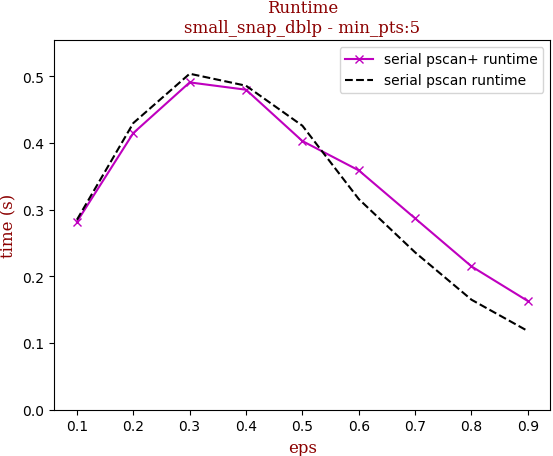

tag | eps-0.1 | eps-0.2 | eps-0.3 | eps-0.4 | eps-0.5 | eps-0.6 | eps-0.7 | eps-0.8 | eps-0.9
--- | --- | --- | --- | --- | --- | --- | --- | --- | ---
prune0 definitely not reachable | 0.000 | 0.012 | 0.069 | 0.162 | 0.266 | 0.390 | 0.509 | 0.648 | 0.784
prune1 definitely reachable | 0.717 | 0.396 | 0.194 | 0.103 | 0.051 | 0.017 | 0.004 | 0.002 | 0.000
max eval number | 0.283 | 0.592 | 0.737 | 0.735 | 0.683 | 0.593 | 0.487 | 0.350 | 0.216
pscan eval number | 0.037 | 0.369 | 0.618 | 0.610 | 0.496 | 0.352 | 0.230 | 0.123 | 0.051
pscan+ eval number | 0.030 | 0.318 | 0.569 | 0.627 | 0.598 | 0.510 | 0.401 | 0.266 | 0.156
serial pscan runtime | 0.285 | 0.430 | 0.504 | 0.486 | 0.426 | 0.316 | 0.236 | 0.165 | 0.118
serial pscan+ runtime | 0.282 | 0.415 | 0.491 | 0.480 | 0.403 | 0.359 | 0.287 | 0.215 | 0.163

## snap_pokec

workload | runtime
--- | ---
 | 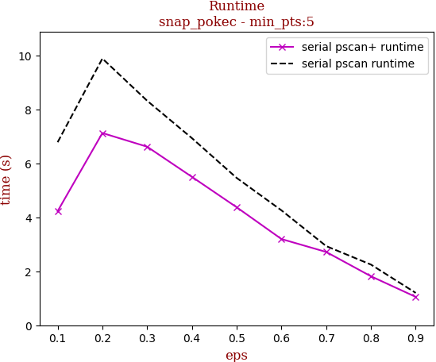

tag | eps-0.1 | eps-0.2 | eps-0.3 | eps-0.4 | eps-0.5 | eps-0.6 | eps-0.7 | eps-0.8 | eps-0.9
--- | --- | --- | --- | --- | --- | --- | --- | --- | ---
prune0 definitely not reachable | 0.004 | 0.021 | 0.061 | 0.131 | 0.233 | 0.370 | 0.525 | 0.689 | 0.850
prune1 definitely reachable | 0.172 | 0.048 | 0.018 | 0.008 | 0.004 | 0.002 | 0.001 | 0.001 | 0.000
max eval number | 0.824 | 0.931 | 0.921 | 0.861 | 0.763 | 0.628 | 0.473 | 0.310 | 0.150
pscan eval number | 0.380 | 0.855 | 0.852 | 0.778 | 0.678 | 0.544 | 0.391 | 0.232 | 0.085
pscan+ eval number | 0.356 | 0.856 | 0.904 | 0.843 | 0.743 | 0.608 | 0.455 | 0.295 | 0.139
serial pscan runtime | 7.277 | 10.556 | 9.155 | 7.484 | 5.891 | 4.456 | 3.091 | 1.970 | 1.157
serial pscan+ runtime | 4.842 | 7.984 | 7.310 | 5.970 | 4.858 | 3.621 | 2.675 | 2.140 | 1.400

## snap_livejournal

workload | runtime
--- | ---
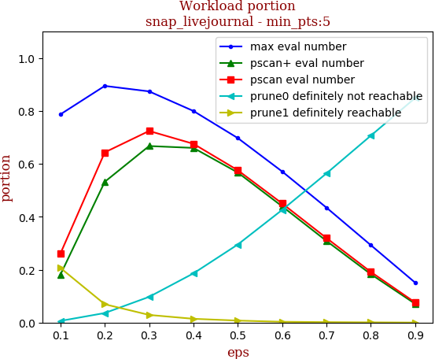 | 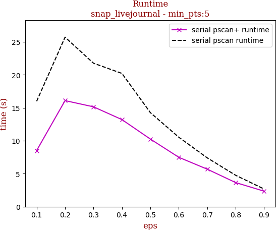

tag | eps-0.1 | eps-0.2 | eps-0.3 | eps-0.4 | eps-0.5 | eps-0.6 | eps-0.7 | eps-0.8 | eps-0.9
--- | --- | --- | --- | --- | --- | --- | --- | --- | ---
prune0 definitely not reachable | 0.006 | 0.036 | 0.097 | 0.186 | 0.295 | 0.426 | 0.564 | 0.706 | 0.849
prune1 definitely reachable | 0.206 | 0.069 | 0.029 | 0.014 | 0.007 | 0.003 | 0.002 | 0.001 | 0.000
max eval number | 0.787 | 0.895 | 0.874 | 0.800 | 0.698 | 0.571 | 0.435 | 0.293 | 0.151
pscan eval number | 0.261 | 0.643 | 0.724 | 0.676 | 0.576 | 0.450 | 0.320 | 0.192 | 0.076
pscan+ eval number | 0.218 | 0.588 | 0.714 | 0.712 | 0.634 | 0.517 | 0.389 | 0.257 | 0.129
serial pscan runtime | 18.827 | 26.597 | 25.283 | 19.445 | 15.217 | 11.016 | 7.507 | 4.590 | 2.375
serial pscan+ runtime | 9.805 | 17.607 | 17.497 | 14.925 | 11.975 | 8.635 | 6.238 | 4.283 | 2.811

## snap_orkut

workload | runtime
--- | ---
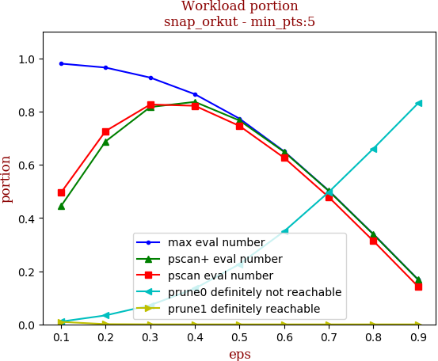 | 

tag | eps-0.1 | eps-0.2 | eps-0.3 | eps-0.4 | eps-0.5 | eps-0.6 | eps-0.7 | eps-0.8 | eps-0.9
--- | --- | --- | --- | --- | --- | --- | --- | --- | ---
prune0 definitely not reachable | 0.010 | 0.034 | 0.072 | 0.135 | 0.227 | 0.350 | 0.497 | 0.661 | 0.831
prune1 definitely reachable | 0.009 | 0.001 | 0.000 | 0.000 | 0.000 | 0.000 | 0.000 | 0.000 | 0.000
max eval number | 0.980 | 0.965 | 0.928 | 0.865 | 0.773 | 0.650 | 0.503 | 0.339 | 0.169
pscan eval number | 0.495 | 0.727 | 0.826 | 0.822 | 0.746 | 0.626 | 0.478 | 0.313 | 0.142
pscan+ eval number | 0.444 | 0.688 | 0.817 | 0.836 | 0.766 | 0.648 | 0.502 | 0.338 | 0.168
serial pscan runtime | 176.912 | 201.380 | 195.265 | 152.046 | 104.250 | 87.674 | 52.443 | 29.814 | 12.790
serial pscan+ runtime | 95.373 | 138.914 | 133.177 | 112.870 | 76.988 | 57.462 | 39.855 | 22.289 | 10.276

## webgraph_uk

workload | runtime
--- | ---
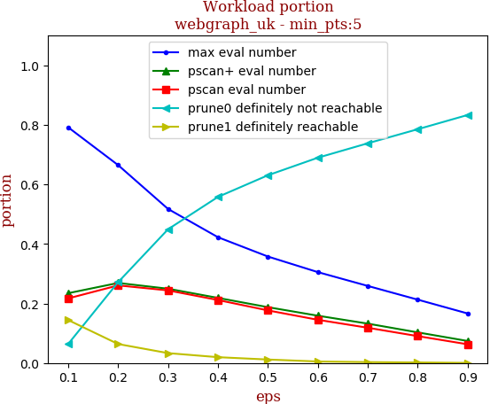 | 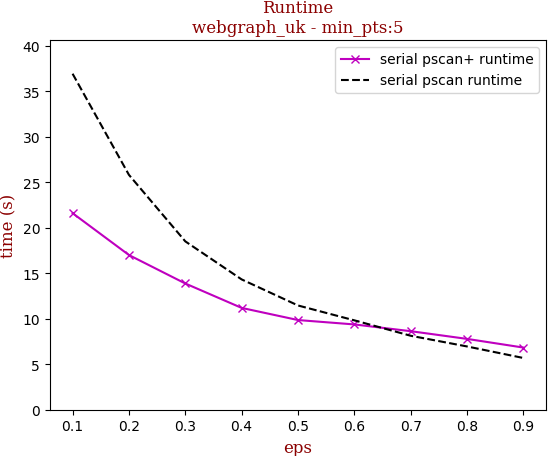

tag | eps-0.1 | eps-0.2 | eps-0.3 | eps-0.4 | eps-0.5 | eps-0.6 | eps-0.7 | eps-0.8 | eps-0.9
--- | --- | --- | --- | --- | --- | --- | --- | --- | ---
prune0 definitely not reachable | 0.064 | 0.272 | 0.449 | 0.558 | 0.631 | 0.690 | 0.738 | 0.785 | 0.833
prune1 definitely reachable | 0.144 | 0.064 | 0.033 | 0.020 | 0.012 | 0.005 | 0.003 | 0.002 | 0.000
max eval number | 0.792 | 0.665 | 0.517 | 0.422 | 0.358 | 0.305 | 0.259 | 0.213 | 0.166
pscan eval number | 0.217 | 0.261 | 0.244 | 0.212 | 0.177 | 0.145 | 0.118 | 0.090 | 0.063
pscan+ eval number | 0.235 | 0.269 | 0.250 | 0.219 | 0.188 | 0.159 | 0.132 | 0.103 | 0.074
serial pscan runtime | 36.924 | 25.810 | 18.501 | 14.319 | 11.455 | 9.821 | 8.127 | 6.951 | 5.683
serial pscan+ runtime | 21.600 | 16.999 | 13.872 | 11.188 | 9.854 | 9.372 | 8.629 | 7.782 | 6.829

## webgraph_webbase

workload | runtime
--- | ---
 | 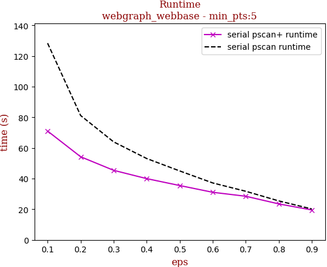

tag | eps-0.1 | eps-0.2 | eps-0.3 | eps-0.4 | eps-0.5 | eps-0.6 | eps-0.7 | eps-0.8 | eps-0.9
--- | --- | --- | --- | --- | --- | --- | --- | --- | ---
prune0 definitely not reachable | 0.080 | 0.265 | 0.388 | 0.482 | 0.555 | 0.625 | 0.684 | 0.751 | 0.813
prune1 definitely reachable | 0.294 | 0.155 | 0.088 | 0.054 | 0.033 | 0.014 | 0.008 | 0.005 | 0.001
max eval number | 0.626 | 0.581 | 0.524 | 0.463 | 0.412 | 0.361 | 0.308 | 0.244 | 0.186
pscan eval number | 0.220 | 0.281 | 0.287 | 0.256 | 0.215 | 0.170 | 0.135 | 0.097 | 0.065
pscan+ eval number | 0.244 | 0.296 | 0.301 | 0.273 | 0.241 | 0.202 | 0.166 | 0.123 | 0.085
serial pscan runtime | 146.030 | 89.716 | 75.893 | 62.764 | 52.310 | 60.173 | 34.236 | 27.175 | 21.852
serial pscan+ runtime | 93.338 | 60.988 | 48.694 | 45.878 | 40.025 | 37.471 | 34.481 | 31.221 | 25.799

## webgraph_twitter

workload | runtime
--- | ---
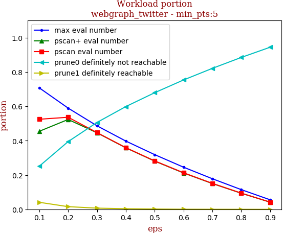 | 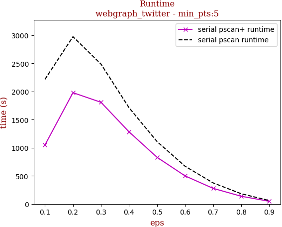

tag | eps-0.1 | eps-0.2 | eps-0.3 | eps-0.4 | eps-0.5 | eps-0.6 | eps-0.7 | eps-0.8 | eps-0.9
--- | --- | --- | --- | --- | --- | --- | --- | --- | ---
prune0 definitely not reachable | 0.251 | 0.395 | 0.506 | 0.599 | 0.679 | 0.754 | 0.821 | 0.885 | 0.944
prune1 definitely reachable | 0.041 | 0.016 | 0.007 | 0.004 | 0.002 | 0.001 | 0.000 | 0.000 | 0.000
max eval number | 0.708 | 0.590 | 0.487 | 0.398 | 0.319 | 0.246 | 0.178 | 0.115 | 0.056
pscan eval number | 0.525 | 0.536 | 0.447 | 0.359 | 0.282 | 0.213 | 0.151 | 0.095 | 0.042
pscan+ eval number | 0.475 | 0.532 | 0.455 | 0.369 | 0.294 | 0.225 | 0.164 | 0.106 | 0.051
serial pscan runtime | 2455.831 | 3023.712 | 2484.324 | 1715.013 | 1112.050 | 672.733 | 376.297 | 183.087 | 61.650
serial pscan+ runtime | 1136.296 | 2053.765 | 1856.111 | 1313.377 | 850.454 | 513.359 | 285.709 | 142.769 | 52.177

## snap_friendster

workload | runtime
--- | ---
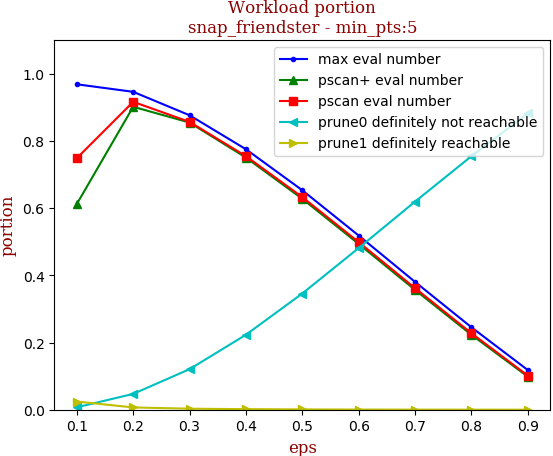 | 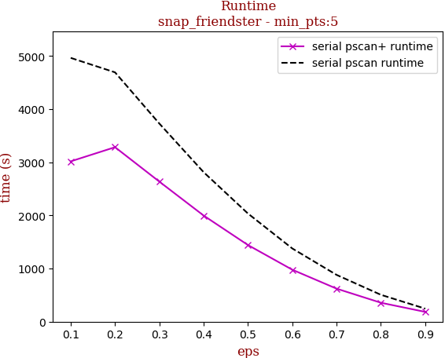

tag | eps-0.1 | eps-0.2 | eps-0.3 | eps-0.4 | eps-0.5 | eps-0.6 | eps-0.7 | eps-0.8 | eps-0.9
--- | --- | --- | --- | --- | --- | --- | --- | --- | ---
prune0 definitely not reachable | 0.007 | 0.047 | 0.121 | 0.223 | 0.346 | 0.481 | 0.619 | 0.754 | 0.882
prune1 definitely reachable | 0.024 | 0.007 | 0.003 | 0.002 | 0.001 | 0.000 | 0.000 | 0.000 | 0.000
max eval number | 0.969 | 0.946 | 0.876 | 0.775 | 0.653 | 0.518 | 0.381 | 0.245 | 0.118
pscan eval number | 0.749 | 0.916 | 0.857 | 0.755 | 0.633 | 0.499 | 0.362 | 0.228 | 0.102
pscan+ eval number | 0.648 | 0.915 | 0.874 | 0.774 | 0.652 | 0.517 | 0.379 | 0.245 | 0.118
serial pscan runtime | 4937.125 | 4706.384 | 3724.794 | 2828.857 | 2061.481 | 1388.170 | 889.585 | 512.659 | 253.215
serial pscan+ runtime | 3176.997 | 3351.631 | 2711.007 | 2053.357 | 1489.294 | 1023.739 | 657.323 | 382.073 | 204.707

## 10million_avgdeg15_maxdeg50_Cdefault

workload | runtime
--- | ---
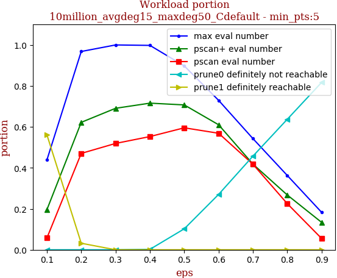 | 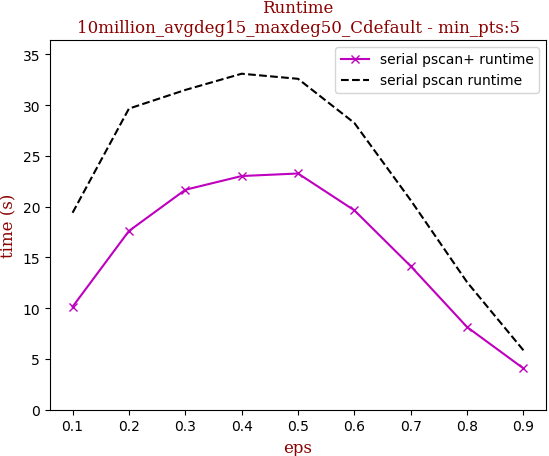

tag | eps-0.1 | eps-0.2 | eps-0.3 | eps-0.4 | eps-0.5 | eps-0.6 | eps-0.7 | eps-0.8 | eps-0.9
--- | --- | --- | --- | --- | --- | --- | --- | --- | ---
prune0 definitely not reachable | 0.000 | 0.000 | 0.000 | 0.002 | 0.102 | 0.270 | 0.457 | 0.637 | 0.817
prune1 definitely reachable | 0.562 | 0.032 | 0.000 | 0.000 | 0.000 | 0.000 | 0.000 | 0.000 | 0.000
max eval number | 0.438 | 0.968 | 1.000 | 0.998 | 0.898 | 0.730 | 0.543 | 0.363 | 0.183
pscan eval number | 0.057 | 0.471 | 0.519 | 0.553 | 0.596 | 0.569 | 0.417 | 0.225 | 0.055
pscan+ eval number | 0.196 | 0.622 | 0.691 | 0.716 | 0.707 | 0.610 | 0.418 | 0.267 | 0.134
serial pscan runtime | 19.562 | 31.546 | 31.672 | 32.967 | 32.107 | 28.351 | 20.766 | 12.362 | 5.942
serial pscan+ runtime | 13.408 | 23.377 | 26.707 | 28.232 | 26.601 | 21.453 | 14.773 | 9.284 | 5.283

