dataset | scalability link
--- | ---
small_snap_dblp | [small_snap_dblp.md](small_snap_dblp.md)
snap_pokec | [snap_pokec.md](snap_pokec.md)
snap_livejournal | [snap_livejournal.md](snap_livejournal.md)
snap_orkut | [snap_orkut.md](snap_orkut.md)
webgraph_uk | [webgraph_uk.md](webgraph_uk.md)
webgraph_webbase | [webgraph_webbase.md](webgraph_webbase.md)
webgraph_twitter | [webgraph_twitter.md](webgraph_twitter.md)
snap_friendster | [snap_friendster.md](snap_friendster.md)

## eps:0.1

with 40 full logical threads | with best thread num
--- | ---
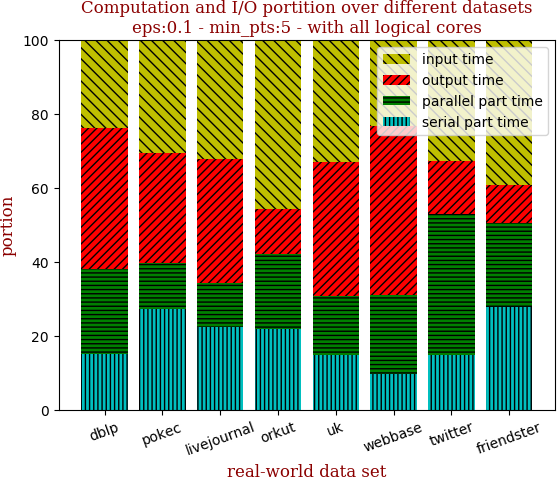 | 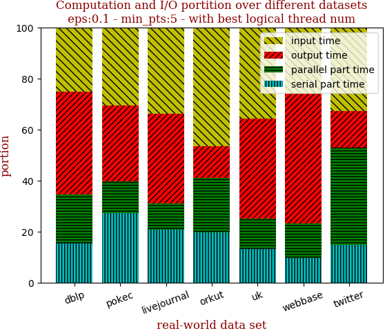

with 40 full logical threads | with best thread num
--- | ---
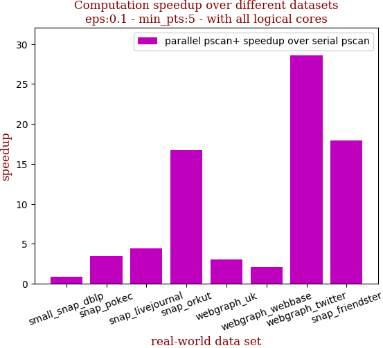 | 

```zsh
best performance thread_num_lst:[2, 40, 24, 32, 24, 8, 40]
```

dataset | edge num | pscan runtime | pscan+ 40 logical-core full speedup | pscan+ best thread_num speedup | thread_num choice
--- | --- | --- | --- | --- | ---
small_snap_dblp | 2,099,732 | 0.318s | 0.914 | 1.067 | 2
snap_pokec | 30,282,866 | 6.925s | 3.496 | 3.496 | 40
snap_livejournal | 69,362,378 | 16.088s | 4.379 | 5.062 | 24
snap_orkut | 234,370,166 | 149.207s | 16.705 | 17.443 | 32
webgraph_uk | 301,136,554 | 37.3s | 3.026 | 4.002 | 24
webgraph_webbase | 1,050,026,736 | 129.071s | 2.118 | 3.159 | 8
webgraph_twitter | 1,369,000,750 | 2223.316s | 28.588 | 28.588 | 40

## eps:0.2

with 40 full logical threads | with best thread num
--- | ---
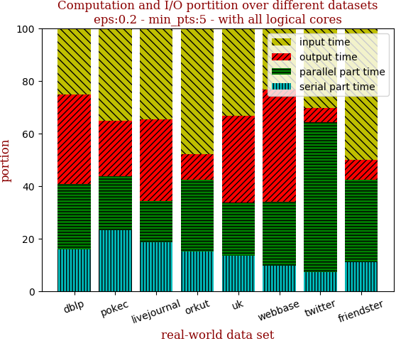 | 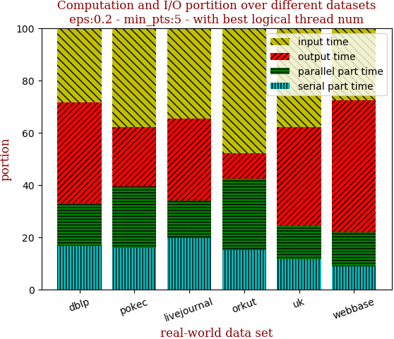

with 40 full logical threads | with best thread num
--- | ---
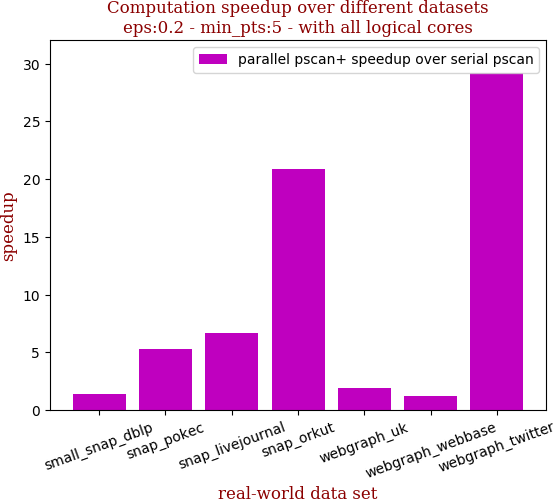 | 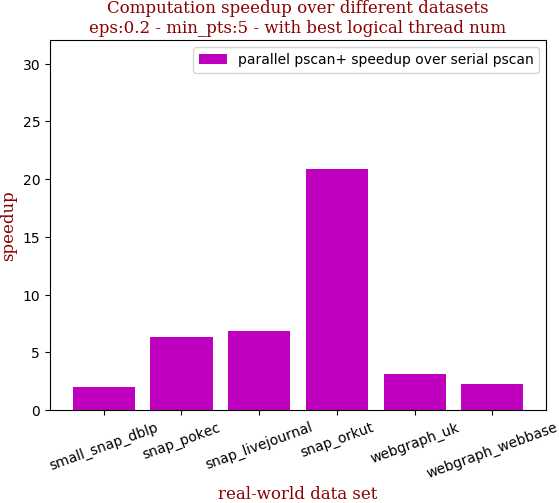

```zsh
best performance thread_num_lst:[4, 24, 32, 40, 8, 4, 40]
```

dataset | edge num | pscan runtime | pscan+ 40 logical-core full speedup | pscan+ best thread_num speedup | thread_num choice
--- | --- | --- | --- | --- | ---
small_snap_dblp | 2,099,732 | 0.504s | 1.424 | 1.992 | 4
snap_pokec | 30,282,866 | 10.004s | 5.279 | 6.304 | 24
snap_livejournal | 69,362,378 | 23.072s | 6.701 | 6.804 | 32
snap_orkut | 234,370,166 | 179.55s | 20.839 | 20.839 | 40
webgraph_uk | 301,136,554 | 26.048s | 1.941 | 3.083 | 8
webgraph_webbase | 1,050,026,736 | 81.475s | 1.218 | 2.239 | 4
webgraph_twitter | 1,369,000,750 | 2973.869s | 29.208 | 29.208 | 40

## eps:0.3

with 40 full logical threads | with best thread num
--- | ---
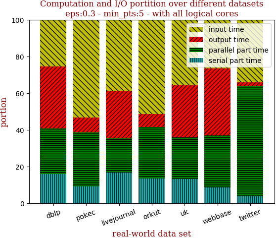 | 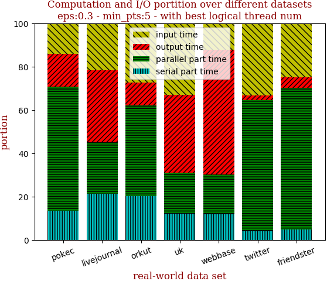

with 40 full logical threads | with best thread num
--- | ---
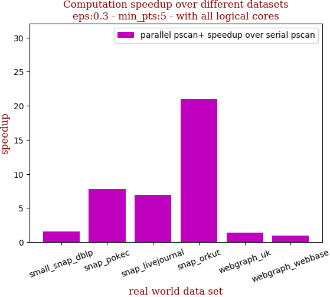 | 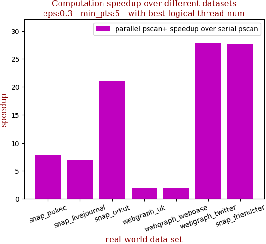

```zsh
best performance thread_num_lst:[4, 32, 40, 40, 8, 4, 40]
```

dataset | edge num | pscan runtime | pscan+ 40 logical-core full speedup | pscan+ best thread_num speedup | thread_num choice
--- | --- | --- | --- | --- | ---
small_snap_dblp | 2,099,732 | 0.555s | 1.586 | 2.079 | 4
snap_pokec | 30,282,866 | 8.597s | 7.815 | 7.851 | 32
snap_livejournal | 69,362,378 | 21.846s | 6.889 | 6.889 | 40
snap_orkut | 234,370,166 | 164.248s | 20.969 | 20.969 | 40
webgraph_uk | 301,136,554 | 18.498s | 1.386 | 2.027 | 8
webgraph_webbase | 1,050,026,736 | 63.705s | 0.989 | 1.929 | 4
webgraph_twitter | 1,369,000,750 | 2487.317s | 27.849 | 27.849 | 40

## eps:0.4

with 40 full logical threads | with best thread num
--- | ---
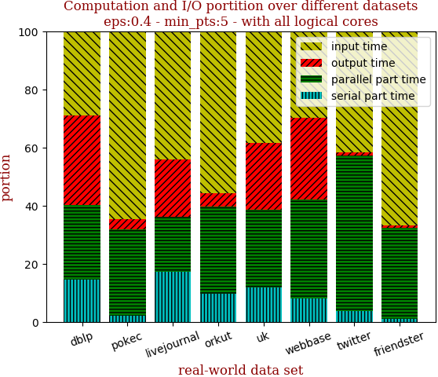 | 

with 40 full logical threads | with best thread num
--- | ---
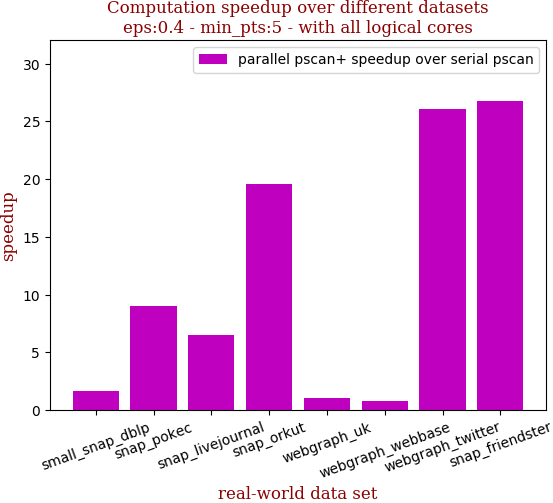 | 

```zsh
best performance thread_num_lst:[8, 40, 32, 40, 4, 4, 40]
```

dataset | edge num | pscan runtime | pscan+ 40 logical-core full speedup | pscan+ best thread_num speedup | thread_num choice
--- | --- | --- | --- | --- | ---
small_snap_dblp | 2,099,732 | 0.491s | 1.610 | 2.154 | 8
snap_pokec | 30,282,866 | 6.82s | 9.045 | 9.045 | 40
snap_livejournal | 69,362,378 | 18.37s | 6.477 | 7.354 | 32
snap_orkut | 234,370,166 | 135.772s | 19.581 | 19.581 | 40
webgraph_uk | 301,136,554 | 14.356s | 1.080 | 1.663 | 4
webgraph_webbase | 1,050,026,736 | 52.978s | 0.818 | 1.812 | 4
webgraph_twitter | 1,369,000,750 | 1712.815s | 26.030 | 26.030 | 40

## eps:0.5

with 40 full logical threads | with best thread num
--- | ---
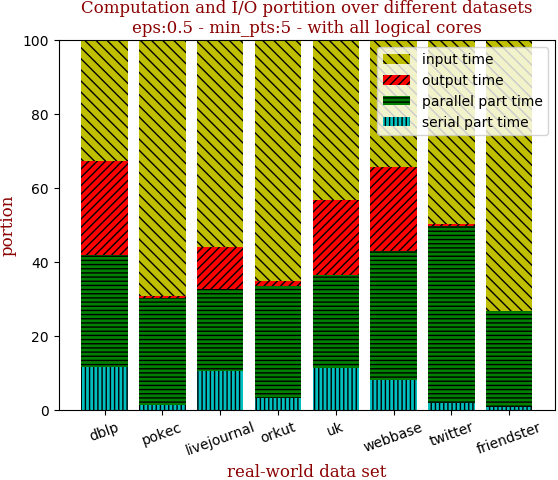 | 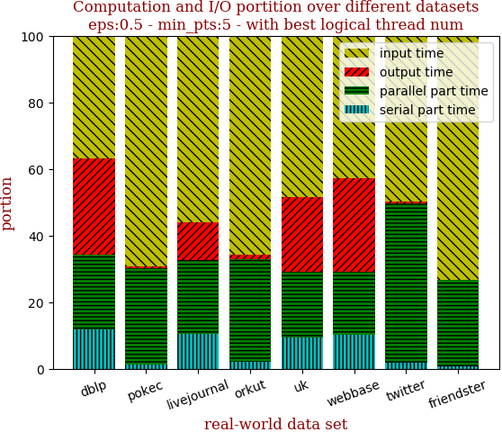

with 40 full logical threads | with best thread num
--- | ---
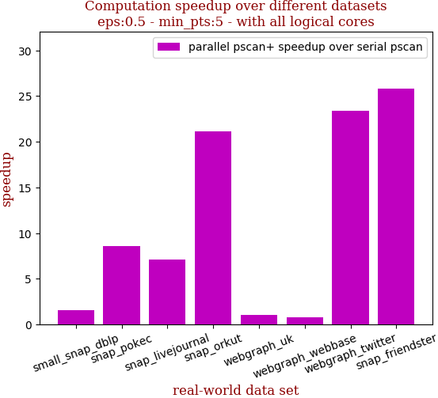 | 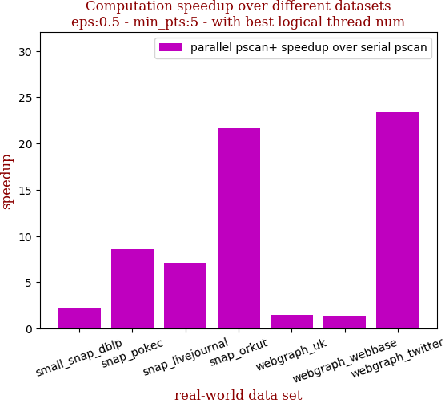

```zsh
best performance thread_num_lst:[8, 40, 40, 32, 8, 4, 40]
```

dataset | edge num | pscan runtime | pscan+ 40 logical-core full speedup | pscan+ best thread_num speedup | thread_num choice
--- | --- | --- | --- | --- | ---
small_snap_dblp | 2,099,732 | 0.441s | 1.575 | 2.151 | 8
snap_pokec | 30,282,866 | 5.709s | 8.585 | 8.585 | 40
snap_livejournal | 69,362,378 | 14.317s | 7.081 | 7.081 | 40
snap_orkut | 234,370,166 | 105.36s | 21.123 | 21.630 | 32
webgraph_uk | 301,136,554 | 11.721s | 1.054 | 1.472 | 8
webgraph_webbase | 1,050,026,736 | 45.006s | 0.784 | 1.430 | 4
webgraph_twitter | 1,369,000,750 | 1112.027s | 23.343 | 23.343 | 40

## eps:0.6

with 40 full logical threads | with best thread num
--- | ---
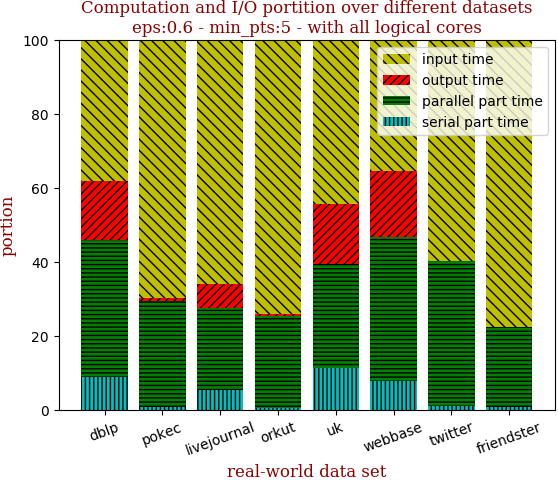 | 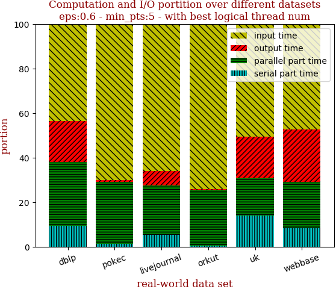

with 40 full logical threads | with best thread num
--- | ---
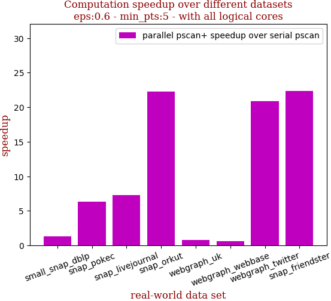 | 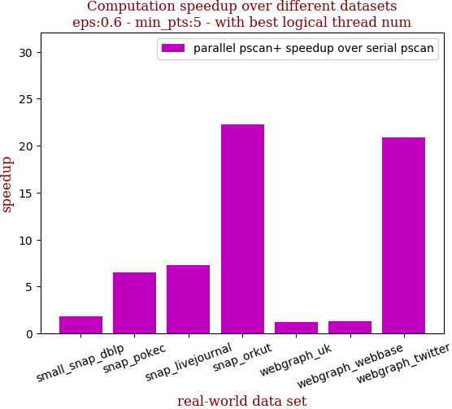

```zsh
best performance thread_num_lst:[8, 32, 40, 40, 4, 4, 40]
```

dataset | edge num | pscan runtime | pscan+ 40 logical-core full speedup | pscan+ best thread_num speedup | thread_num choice
--- | --- | --- | --- | --- | ---
small_snap_dblp | 2,099,732 | 0.346s | 1.306 | 1.802 | 8
snap_pokec | 30,282,866 | 4.122s | 6.361 | 6.471 | 32
snap_livejournal | 69,362,378 | 10.49s | 7.290 | 7.290 | 40
snap_orkut | 234,370,166 | 73.887s | 22.275 | 22.275 | 40
webgraph_uk | 301,136,554 | 9.737s | 0.825 | 1.205 | 4
webgraph_webbase | 1,050,026,736 | 37.624s | 0.620 | 1.326 | 4
webgraph_twitter | 1,369,000,750 | 671.103s | 20.845 | 20.845 | 40

## eps:0.7

with 40 full logical threads | with best thread num
--- | ---
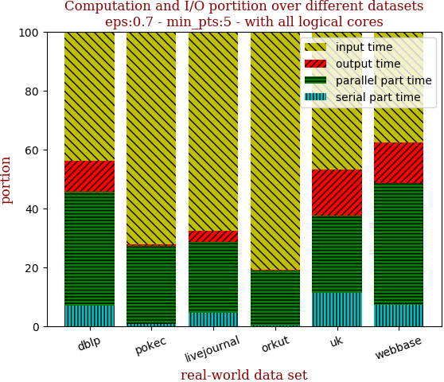 | 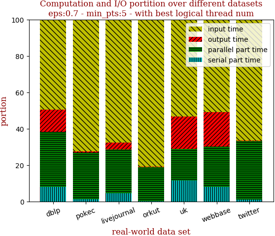

with 40 full logical threads | with best thread num
--- | ---
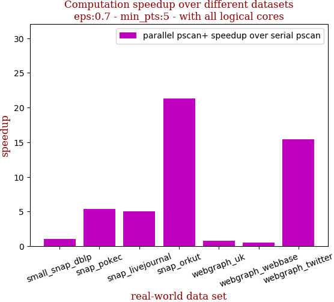 | 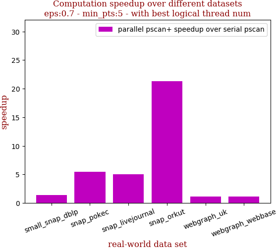

```zsh
best performance thread_num_lst:[4, 32, 40, 40, 4, 4, 32]
```

dataset | edge num | pscan runtime | pscan+ 40 logical-core full speedup | pscan+ best thread_num speedup | thread_num choice
--- | --- | --- | --- | --- | ---
small_snap_dblp | 2,099,732 | 0.245s | 1.070 | 1.433 | 4
snap_pokec | 30,282,866 | 3.098s | 5.360 | 5.464 | 32
snap_livejournal | 69,362,378 | 7.404s | 5.040 | 5.040 | 40
snap_orkut | 234,370,166 | 48.46s | 21.329 | 21.329 | 40
webgraph_uk | 301,136,554 | 8.152s | 0.767 | 1.134 | 4
webgraph_webbase | 1,050,026,736 | 31.675s | 0.533 | 1.166 | 4
webgraph_twitter | 1,369,000,750 | 378.662s | 15.377 | 15.861 | 32

## eps:0.8

with 40 full logical threads | with best thread num
--- | ---
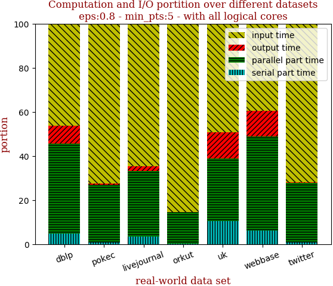 | 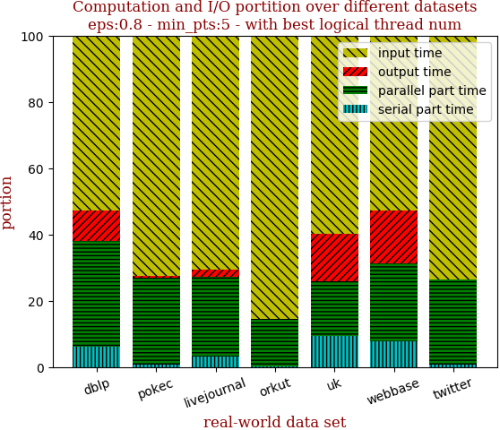

with 40 full logical threads | with best thread num
--- | ---
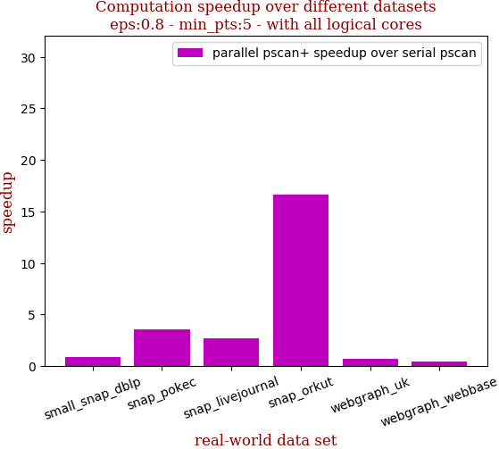 | 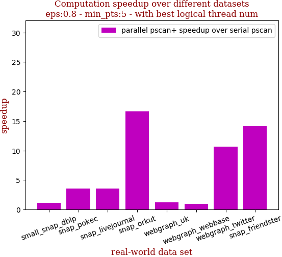

```zsh
best performance thread_num_lst:[4, 40, 24, 40, 4, 4, 32]
```

dataset | edge num | pscan runtime | pscan+ 40 logical-core full speedup | pscan+ best thread_num speedup | thread_num choice
--- | --- | --- | --- | --- | ---
small_snap_dblp | 2,099,732 | 0.183s | 0.843 | 1.158 | 4
snap_pokec | 30,282,866 | 2.009s | 3.537 | 3.537 | 40
snap_livejournal | 69,362,378 | 4.797s | 2.696 | 3.588 | 24
snap_orkut | 234,370,166 | 27.708s | 16.651 | 16.651 | 40
webgraph_uk | 301,136,554 | 7.054s | 0.676 | 1.227 | 4
webgraph_webbase | 1,050,026,736 | 25.399s | 0.446 | 0.935 | 4
webgraph_twitter | 1,369,000,750 | 183.012s | 9.883 | 10.646 | 32

## eps:0.9

with 40 full logical threads | with best thread num
--- | ---
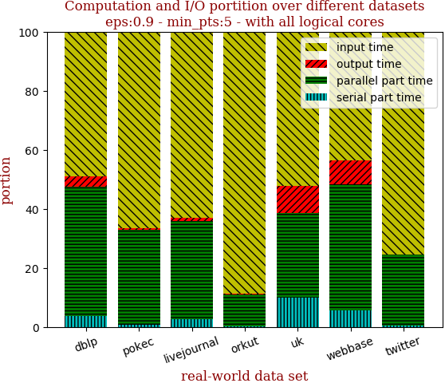 | 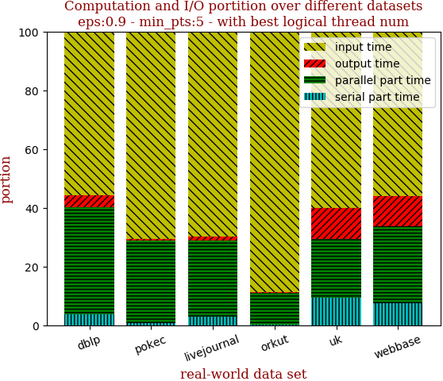

with 40 full logical threads | with best thread num
--- | ---
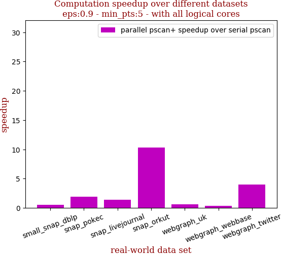 | 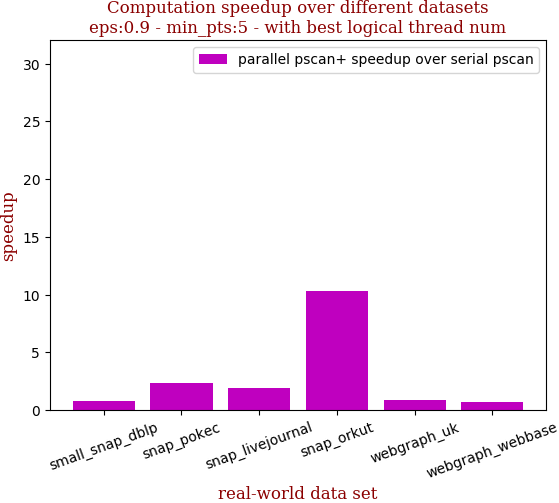

```zsh
best performance thread_num_lst:[2, 8, 8, 40, 4, 2, 24]
```

dataset | edge num | pscan runtime | pscan+ 40 logical-core full speedup | pscan+ best thread_num speedup | thread_num choice
--- | --- | --- | --- | --- | ---
small_snap_dblp | 2,099,732 | 0.121s | 0.565 | 0.761 | 2
snap_pokec | 30,282,866 | 1.453s | 1.914 | 2.332 | 8
snap_livejournal | 69,362,378 | 2.753s | 1.395 | 1.921 | 8
snap_orkut | 234,370,166 | 12.535s | 10.266 | 10.266 | 40
webgraph_uk | 301,136,554 | 5.814s | 0.593 | 0.895 | 4
webgraph_webbase | 1,050,026,736 | 20.091s | 0.392 | 0.722 | 2
webgraph_twitter | 1,369,000,750 | 61.578s | 3.973 | 4.337 | 24

