## eps:0.1

overview | speedup
--- | ---
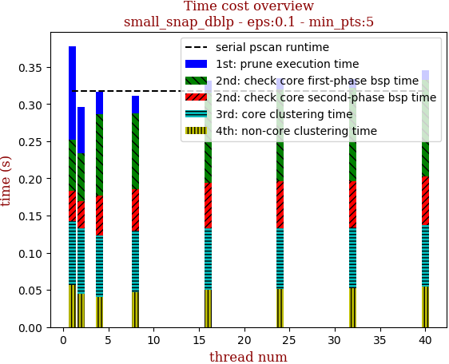 | 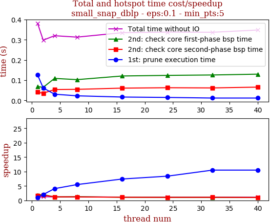

thread_num | prune | check-core 1st bsp | check-core 2nd bsp | cluster-core | cluster-non-core | total | total speedup
--- | --- | --- | --- | --- | --- | --- | ---
1 | 0.126s | 0.069s | 0.041s | 0.085s | 0.057s | 0.381s | 1.000
2 | 0.062s | 0.065s | 0.036s | 0.088s | 0.045s | 0.298s | 1.279
4 | 0.031s | 0.109s | 0.054s | 0.083s | 0.04s | 0.32s | 1.191
8 | 0.023s | 0.103s | 0.055s | 0.083s | 0.047s | 0.313s | 1.217
16 | 0.017s | 0.121s | 0.061s | 0.083s | 0.05s | 0.335s | 1.137
24 | 0.015s | 0.124s | 0.063s | 0.082s | 0.051s | 0.338s | 1.127
32 | 0.012s | 0.126s | 0.062s | 0.082s | 0.052s | 0.337s | 1.131
40 | 0.012s | 0.13s | 0.066s | 0.083s | 0.054s | 0.348s | 1.095

## eps:0.2

overview | speedup
--- | ---
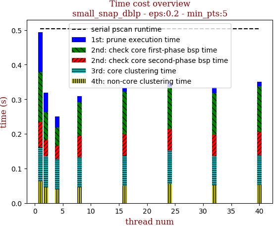 | 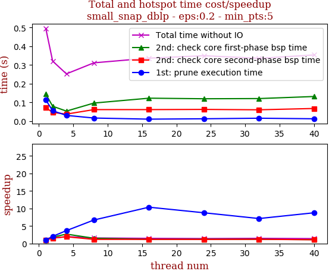

thread_num | prune | check-core 1st bsp | check-core 2nd bsp | cluster-core | cluster-non-core | total | total speedup
--- | --- | --- | --- | --- | --- | --- | ---
1 | 0.114s | 0.145s | 0.073s | 0.098s | 0.063s | 0.496s | 1.000
2 | 0.056s | 0.08s | 0.047s | 0.09s | 0.046s | 0.321s | 1.545
4 | 0.031s | 0.054s | 0.038s | 0.088s | 0.039s | 0.253s | 1.960
8 | 0.017s | 0.097s | 0.062s | 0.087s | 0.046s | 0.312s | 1.590
16 | 0.011s | 0.123s | 0.062s | 0.087s | 0.05s | 0.337s | 1.472
24 | 0.013s | 0.12s | 0.063s | 0.096s | 0.056s | 0.35s | 1.417
32 | 0.016s | 0.121s | 0.061s | 0.085s | 0.051s | 0.336s | 1.476
40 | 0.013s | 0.132s | 0.068s | 0.086s | 0.052s | 0.354s | 1.401

## eps:0.3

overview | speedup
--- | ---
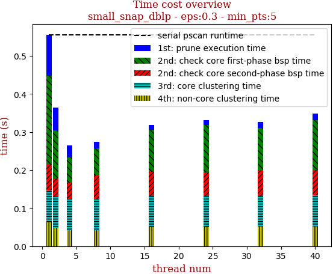 | 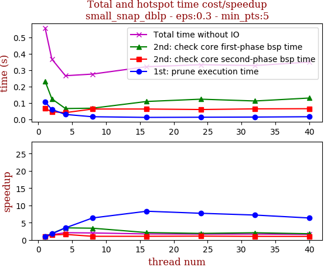

thread_num | prune | check-core 1st bsp | check-core 2nd bsp | cluster-core | cluster-non-core | total | total speedup
--- | --- | --- | --- | --- | --- | --- | ---
1 | 0.108s | 0.234s | 0.067s | 0.084s | 0.063s | 0.558s | 1.000
2 | 0.061s | 0.126s | 0.047s | 0.082s | 0.049s | 0.368s | 1.516
4 | 0.031s | 0.067s | 0.042s | 0.083s | 0.042s | 0.267s | 2.090
8 | 0.017s | 0.069s | 0.064s | 0.082s | 0.042s | 0.277s | 2.014
16 | 0.013s | 0.11s | 0.064s | 0.082s | 0.05s | 0.322s | 1.733
24 | 0.014s | 0.124s | 0.061s | 0.083s | 0.05s | 0.334s | 1.671
32 | 0.015s | 0.113s | 0.065s | 0.082s | 0.051s | 0.329s | 1.696
40 | 0.017s | 0.131s | 0.066s | 0.082s | 0.052s | 0.35s | 1.594

## eps:0.4

overview | speedup
--- | ---
 | 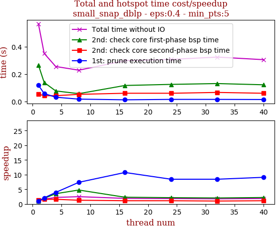

thread_num | prune | check-core 1st bsp | check-core 2nd bsp | cluster-core | cluster-non-core | total | total speedup
--- | --- | --- | --- | --- | --- | --- | ---
1 | 0.118s | 0.266s | 0.053s | 0.067s | 0.06s | 0.568s | 1.000
2 | 0.057s | 0.138s | 0.041s | 0.067s | 0.045s | 0.351s | 1.618
4 | 0.03s | 0.076s | 0.041s | 0.068s | 0.038s | 0.255s | 2.227
8 | 0.016s | 0.056s | 0.051s | 0.064s | 0.039s | 0.228s | 2.491
16 | 0.011s | 0.116s | 0.059s | 0.064s | 0.044s | 0.298s | 1.906
24 | 0.014s | 0.124s | 0.059s | 0.064s | 0.044s | 0.307s | 1.850
32 | 0.014s | 0.13s | 0.065s | 0.065s | 0.047s | 0.324s | 1.753
40 | 0.013s | 0.121s | 0.059s | 0.063s | 0.046s | 0.305s | 1.862

## eps:0.5

overview | speedup
--- | ---
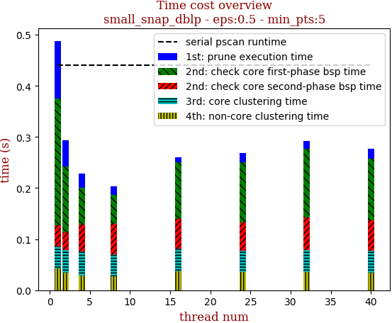 | 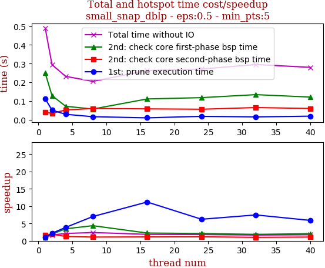

thread_num | prune | check-core 1st bsp | check-core 2nd bsp | cluster-core | cluster-non-core | total | total speedup
--- | --- | --- | --- | --- | --- | --- | ---
1 | 0.112s | 0.249s | 0.041s | 0.044s | 0.042s | 0.49s | 1.000
2 | 0.051s | 0.129s | 0.034s | 0.045s | 0.034s | 0.294s | 1.667
4 | 0.029s | 0.072s | 0.052s | 0.047s | 0.029s | 0.232s | 2.112
8 | 0.016s | 0.057s | 0.06s | 0.042s | 0.028s | 0.205s | 2.390
16 | 0.01s | 0.111s | 0.058s | 0.044s | 0.037s | 0.263s | 1.863
24 | 0.018s | 0.118s | 0.056s | 0.042s | 0.035s | 0.271s | 1.808
32 | 0.015s | 0.134s | 0.065s | 0.043s | 0.035s | 0.295s | 1.661
40 | 0.019s | 0.121s | 0.06s | 0.043s | 0.034s | 0.28s | 1.750

## eps:0.6

overview | speedup
--- | ---
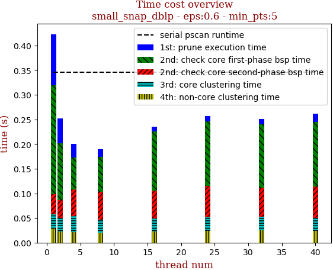 | 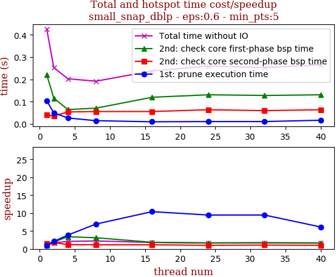

thread_num | prune | check-core 1st bsp | check-core 2nd bsp | cluster-core | cluster-non-core | total | total speedup
--- | --- | --- | --- | --- | --- | --- | ---
1 | 0.104s | 0.221s | 0.041s | 0.029s | 0.028s | 0.426s | 1.000
2 | 0.05s | 0.116s | 0.036s | 0.028s | 0.022s | 0.253s | 1.684
4 | 0.027s | 0.065s | 0.054s | 0.033s | 0.021s | 0.203s | 2.099
8 | 0.015s | 0.071s | 0.056s | 0.027s | 0.02s | 0.192s | 2.219
16 | 0.01s | 0.12s | 0.056s | 0.027s | 0.022s | 0.238s | 1.790
24 | 0.011s | 0.131s | 0.064s | 0.027s | 0.024s | 0.26s | 1.638
32 | 0.011s | 0.128s | 0.06s | 0.027s | 0.025s | 0.253s | 1.684
40 | 0.017s | 0.131s | 0.064s | 0.026s | 0.024s | 0.265s | 1.608

## eps:0.7

overview | speedup
--- | ---
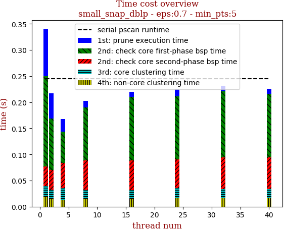 | 

thread_num | prune | check-core 1st bsp | check-core 2nd bsp | cluster-core | cluster-non-core | total | total speedup
--- | --- | --- | --- | --- | --- | --- | ---
1 | 0.09s | 0.173s | 0.038s | 0.02s | 0.019s | 0.344s | 1.000
2 | 0.048s | 0.099s | 0.037s | 0.018s | 0.015s | 0.219s | 1.571
4 | 0.024s | 0.06s | 0.049s | 0.022s | 0.013s | 0.171s | 2.012
8 | 0.013s | 0.101s | 0.057s | 0.018s | 0.014s | 0.206s | 1.670
16 | 0.01s | 0.121s | 0.057s | 0.017s | 0.015s | 0.223s | 1.543
24 | 0.014s | 0.12s | 0.056s | 0.018s | 0.017s | 0.228s | 1.509
32 | 0.011s | 0.127s | 0.06s | 0.018s | 0.016s | 0.234s | 1.470
40 | 0.01s | 0.122s | 0.06s | 0.017s | 0.017s | 0.229s | 1.502

## eps:0.8

overview | speedup
--- | ---
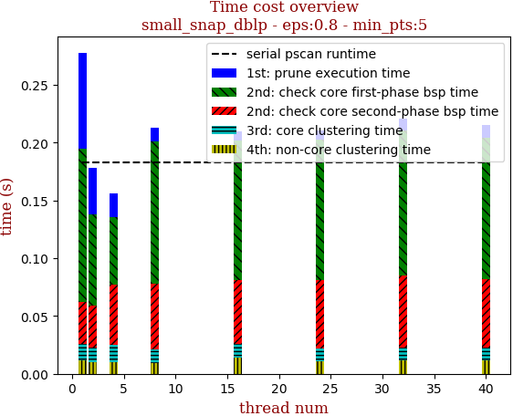 | 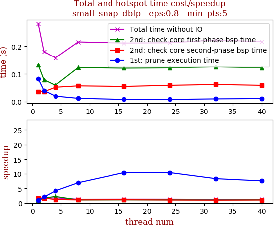

thread_num | prune | check-core 1st bsp | check-core 2nd bsp | cluster-core | cluster-non-core | total | total speedup
--- | --- | --- | --- | --- | --- | --- | ---
1 | 0.083s | 0.133s | 0.036s | 0.014s | 0.012s | 0.282s | 1.000
2 | 0.04s | 0.079s | 0.036s | 0.013s | 0.01s | 0.181s | 1.558
4 | 0.02s | 0.059s | 0.052s | 0.015s | 0.01s | 0.158s | 1.785
8 | 0.012s | 0.123s | 0.057s | 0.012s | 0.009s | 0.216s | 1.306
16 | 0.008s | 0.121s | 0.055s | 0.012s | 0.014s | 0.212s | 1.330
24 | 0.008s | 0.122s | 0.059s | 0.011s | 0.011s | 0.213s | 1.324
32 | 0.01s | 0.126s | 0.062s | 0.011s | 0.012s | 0.223s | 1.265
40 | 0.011s | 0.122s | 0.059s | 0.011s | 0.012s | 0.217s | 1.300

## eps:0.9

overview | speedup
--- | ---
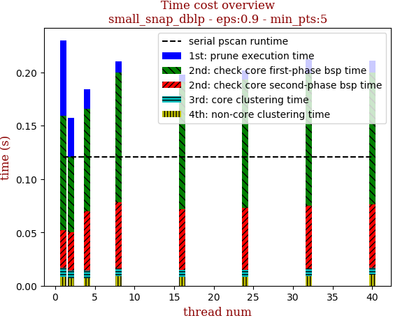 | 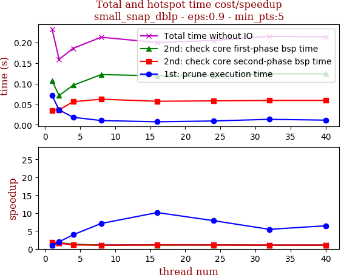

thread_num | prune | check-core 1st bsp | check-core 2nd bsp | cluster-core | cluster-non-core | total | total speedup
--- | --- | --- | --- | --- | --- | --- | ---
1 | 0.071s | 0.107s | 0.035s | 0.009s | 0.008s | 0.233s | 1.000
2 | 0.036s | 0.071s | 0.036s | 0.007s | 0.007s | 0.159s | 1.465
4 | 0.018s | 0.096s | 0.056s | 0.007s | 0.007s | 0.186s | 1.253
8 | 0.01s | 0.122s | 0.062s | 0.007s | 0.009s | 0.213s | 1.094
16 | 0.007s | 0.119s | 0.057s | 0.007s | 0.008s | 0.2s | 1.165
24 | 0.009s | 0.12s | 0.058s | 0.007s | 0.008s | 0.205s | 1.137
32 | 0.013s | 0.124s | 0.059s | 0.007s | 0.009s | 0.215s | 1.084
40 | 0.011s | 0.124s | 0.059s | 0.007s | 0.01s | 0.214s | 1.089

