## eps:0.1

overview | speedup
--- | ---
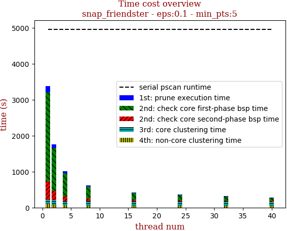 | 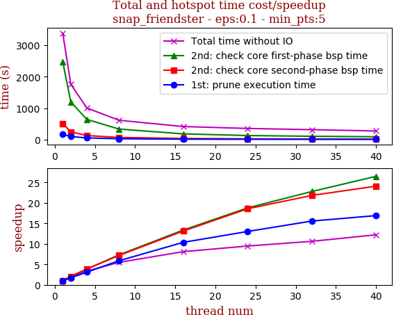

thread_num | prune | check-core 1st bsp | check-core 2nd bsp | cluster-core | cluster-non-core | total | total speedup
--- | --- | --- | --- | --- | --- | --- | ---
1 | 173.922s | 2475.372s | 513.171s | 114.143s | 106.992s | 3383.624s | 1.000
2 | 101.294s | 1201.366s | 247.854s | 134.716s | 75.78s | 1761.013s | 1.921
4 | 56.254s | 643.904s | 132.632s | 115.877s | 59.59s | 1008.261s | 3.356
8 | 29.581s | 338.313s | 71.554s | 129.546s | 48.153s | 617.152s | 5.483
16 | 16.779s | 185.146s | 39.094s | 131.118s | 45.874s | 418.015s | 8.095
24 | 13.36s | 131.861s | 27.659s | 135.571s | 48.809s | 357.264s | 9.471
32 | 11.176s | 108.693s | 23.517s | 127.187s | 48.184s | 318.762s | 10.615
40 | 10.292s | 93.483s | 21.313s | 105.206s | 46.811s | 277.108s | 12.210

## eps:0.2

overview | speedup
--- | ---
 | 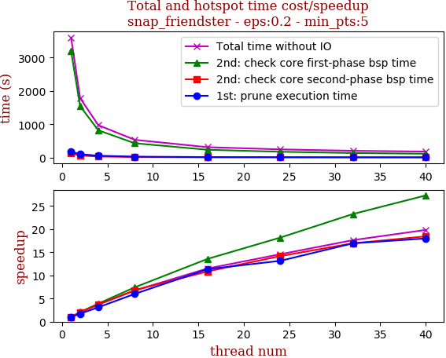

thread_num | prune | check-core 1st bsp | check-core 2nd bsp | cluster-core | cluster-non-core | total | total speedup
--- | --- | --- | --- | --- | --- | --- | ---
1 | 178.452s | 3200.381s | 126.763s | 25.986s | 70.067s | 3601.653s | 1.000
2 | 103.713s | 1542.275s | 62.631s | 24.48s | 48.656s | 1781.76s | 2.021
4 | 57.46s | 819.825s | 34.151s | 28.302s | 32.863s | 972.606s | 3.703
8 | 29.76s | 431.36s | 18.659s | 28.424s | 26.137s | 534.345s | 6.740
16 | 15.733s | 236.017s | 11.68s | 27.954s | 22.175s | 313.564s | 11.486
24 | 13.577s | 176.214s | 8.945s | 27.799s | 20.647s | 247.186s | 14.571
32 | 10.542s | 137.581s | 7.484s | 26.834s | 21.992s | 204.442s | 17.617
40 | 9.925s | 117.317s | 6.876s | 27.57s | 19.979s | 181.672s | 19.825

## eps:0.3

overview | speedup
--- | ---
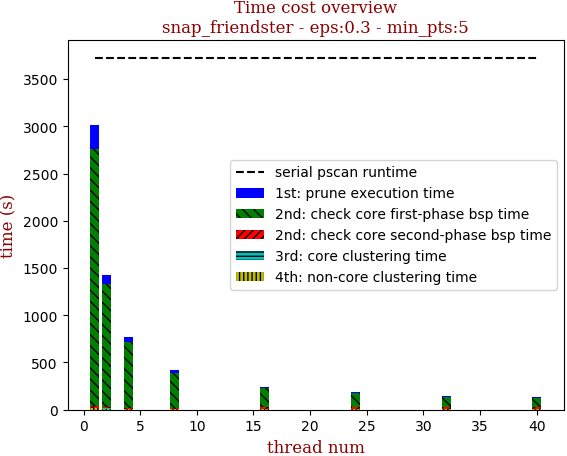 | 

thread_num | prune | check-core 1st bsp | check-core 2nd bsp | cluster-core | cluster-non-core | total | total speedup
--- | --- | --- | --- | --- | --- | --- | ---
1 | 254.025s | 2718.261s | 16.587s | 4.16s | 16.522s | 3009.561s | 1.000
2 | 101.393s | 1301.685s | 10.424s | 4.152s | 9.585s | 1427.243s | 2.109
4 | 55.881s | 692.529s | 7.326s | 4.981s | 7.11s | 767.831s | 3.920
8 | 28.858s | 364.627s | 11.69s | 4.049s | 6.023s | 415.251s | 7.248
16 | 14.641s | 198.611s | 15.781s | 5.412s | 5.88s | 240.33s | 12.523
24 | 13.347s | 147.78s | 16.94s | 5.119s | 4.899s | 188.093s | 16.000
32 | 10.423s | 112.302s | 17.647s | 5.09s | 4.929s | 150.395s | 20.011
40 | 9.596s | 99.949s | 15.637s | 4.812s | 4.621s | 134.621s | 22.356

## eps:0.4

overview | speedup
--- | ---
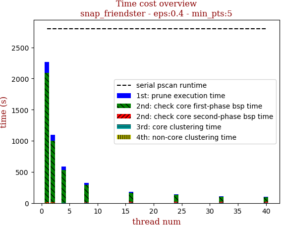 | 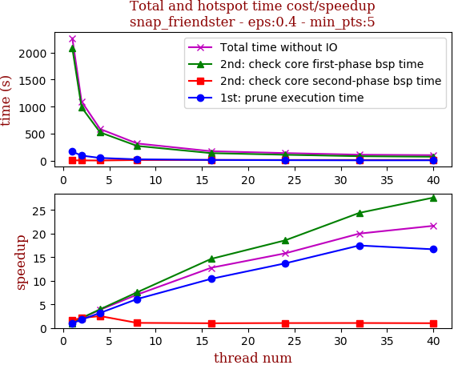

thread_num | prune | check-core 1st bsp | check-core 2nd bsp | cluster-core | cluster-non-core | total | total speedup
--- | --- | --- | --- | --- | --- | --- | ---
1 | 169.908s | 2080.347s | 9.8s | 0.804s | 2.86s | 2263.724s | 1.000
2 | 96.799s | 987.563s | 7.624s | 0.879s | 2.002s | 1094.872s | 2.068
4 | 53.268s | 525.385s | 6.417s | 0.864s | 1.714s | 587.651s | 3.852
8 | 27.711s | 275.119s | 15.025s | 1.374s | 1.286s | 320.52s | 7.063
16 | 16.32s | 142.054s | 16.163s | 1.482s | 1.393s | 177.417s | 12.759
24 | 12.404s | 112.009s | 15.561s | 1.662s | 1.481s | 143.121s | 15.817
32 | 9.72s | 85.292s | 15.398s | 1.629s | 1.145s | 113.189s | 20.000
40 | 10.191s | 75.306s | 16.025s | 1.69s | 1.365s | 104.582s | 21.645

## eps:0.5

overview | speedup
--- | ---
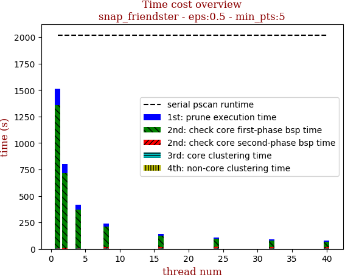 | 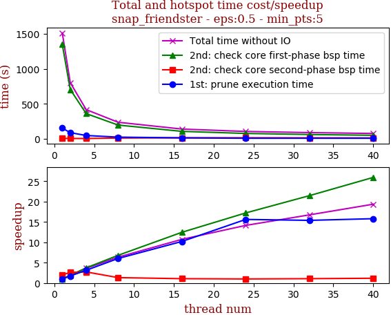

thread_num | prune | check-core 1st bsp | check-core 2nd bsp | cluster-core | cluster-non-core | total | total speedup
--- | --- | --- | --- | --- | --- | --- | ---
1 | 154.581s | 1347.921s | 8.474s | 0.414s | 0.944s | 1512.339s | 1.000
2 | 89.393s | 706.078s | 6.519s | 0.211s | 0.672s | 802.877s | 1.884
4 | 49.208s | 361.48s | 6.233s | 0.454s | 0.876s | 418.256s | 3.616
8 | 25.651s | 198.08s | 12.771s | 0.849s | 0.576s | 237.932s | 6.356
16 | 15.142s | 108.169s | 15.933s | 1.236s | 0.524s | 141.012s | 10.725
24 | 9.897s | 78.321s | 17.002s | 1.162s | 0.504s | 106.89s | 14.149
32 | 10.044s | 62.815s | 15.89s | 1.078s | 0.495s | 90.332s | 16.742
40 | 9.782s | 51.964s | 14.493s | 1.334s | 0.544s | 78.122s | 19.359

## eps:0.6

overview | speedup
--- | ---
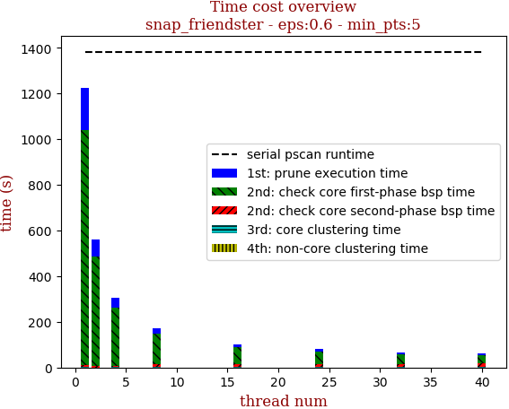 | 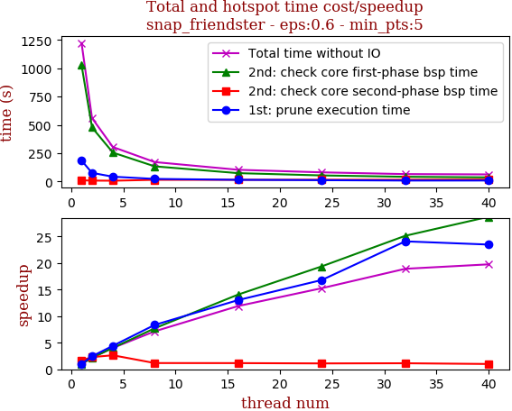

thread_num | prune | check-core 1st bsp | check-core 2nd bsp | cluster-core | cluster-non-core | total | total speedup
--- | --- | --- | --- | --- | --- | --- | ---
1 | 184.658s | 1027.629s | 9.863s | 0.287s | 0.719s | 1223.16s | 1.000
2 | 75.438s | 477.148s | 7.221s | 0.146s | 0.347s | 560.303s | 2.183
4 | 41.774s | 254.882s | 6.282s | 0.303s | 0.688s | 303.933s | 4.024
8 | 22.113s | 133.23s | 14.113s | 1.16s | 0.569s | 171.189s | 7.145
16 | 14.172s | 73.057s | 14.254s | 0.783s | 0.472s | 102.743s | 11.905
24 | 10.993s | 53.06s | 14.995s | 0.795s | 0.316s | 80.163s | 15.258
32 | 7.668s | 40.899s | 14.591s | 1.093s | 0.405s | 64.661s | 18.917
40 | 7.866s | 35.798s | 16.584s | 1.273s | 0.397s | 61.92s | 19.754

## eps:0.7

overview | speedup
--- | ---
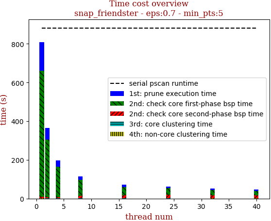 | 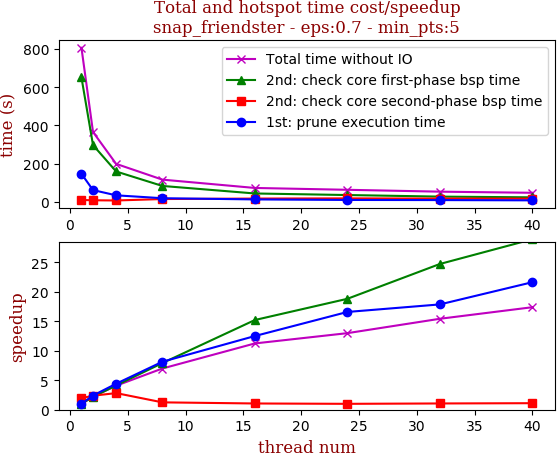

thread_num | prune | check-core 1st bsp | check-core 2nd bsp | cluster-core | cluster-non-core | total | total speedup
--- | --- | --- | --- | --- | --- | --- | ---
1 | 146.101s | 651.828s | 8.703s | 0.245s | 0.578s | 807.458s | 1.000
2 | 60.629s | 296.832s | 7.188s | 0.291s | 0.423s | 365.366s | 2.210
4 | 33.143s | 158.236s | 6.049s | 0.277s | 0.49s | 198.197s | 4.074
8 | 17.947s | 82.335s | 13.66s | 1.172s | 0.37s | 115.487s | 6.992
16 | 11.687s | 42.833s | 16.111s | 0.803s | 0.363s | 71.799s | 11.246
24 | 8.809s | 34.64s | 17.068s | 1.28s | 0.362s | 62.163s | 12.989
32 | 8.178s | 26.364s | 16.071s | 1.15s | 0.571s | 52.338s | 15.428
40 | 6.754s | 22.538s | 15.406s | 1.104s | 0.627s | 46.433s | 17.390

## eps:0.8

overview | speedup
--- | ---
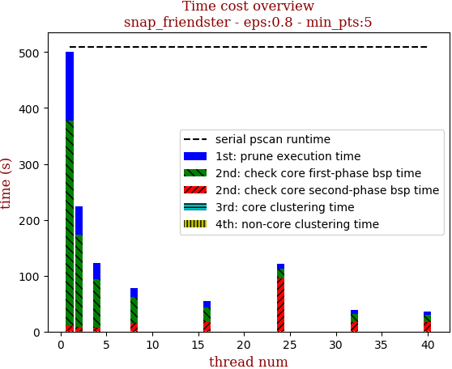 | 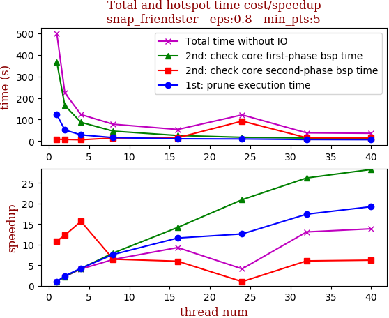

thread_num | prune | check-core 1st bsp | check-core 2nd bsp | cluster-core | cluster-non-core | total | total speedup
--- | --- | --- | --- | --- | --- | --- | ---
1 | 123.175s | 368.435s | 8.567s | 0.276s | 0.449s | 500.905s | 1.000
2 | 51.499s | 164.92s | 7.561s | 0.111s | 0.287s | 224.381s | 2.232
4 | 28.943s | 87.415s | 5.944s | 0.279s | 0.68s | 123.265s | 4.064
8 | 16.191s | 46.253s | 14.399s | 1.071s | 0.459s | 78.376s | 6.391
16 | 10.612s | 25.98s | 15.594s | 1.311s | 0.435s | 53.935s | 9.287
24 | 9.773s | 17.604s | 93.009s | 1.16s | 0.351s | 121.899s | 4.109
32 | 7.08s | 14.055s | 15.393s | 1.219s | 0.52s | 38.269s | 13.089
40 | 6.404s | 13.028s | 14.965s | 0.932s | 0.823s | 36.154s | 13.855

## eps:0.9

overview | speedup
--- | ---
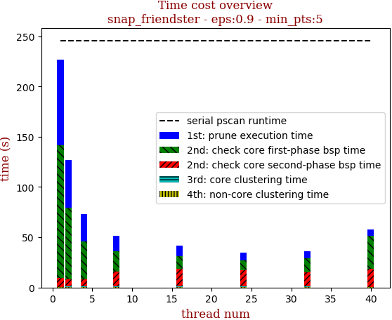 | 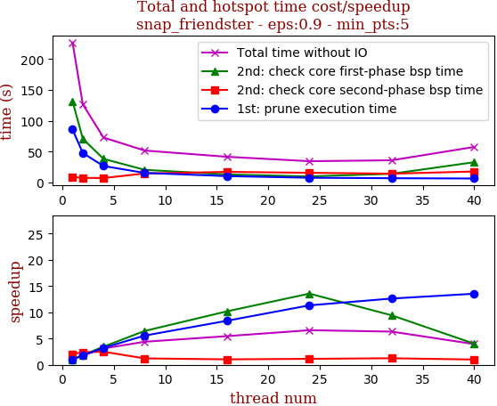

thread_num | prune | check-core 1st bsp | check-core 2nd bsp | cluster-core | cluster-non-core | total | total speedup
--- | --- | --- | --- | --- | --- | --- | ---
1 | 85.78s | 131.773s | 8.636s | 0.205s | 0.544s | 226.944s | 1.000
2 | 47.592s | 70.817s | 7.374s | 0.27s | 0.588s | 126.643s | 1.792
4 | 26.632s | 38.256s | 7.087s | 0.27s | 0.609s | 72.856s | 3.115
8 | 15.415s | 20.433s | 14.489s | 0.833s | 0.537s | 51.71s | 4.389
16 | 10.221s | 12.934s | 17.085s | 0.969s | 0.35s | 41.568s | 5.460
24 | 7.573s | 9.715s | 15.592s | 0.919s | 0.614s | 34.416s | 6.594
32 | 6.795s | 13.983s | 14.164s | 0.405s | 0.56s | 35.909s | 6.320
40 | 6.334s | 32.761s | 17.692s | 0.259s | 0.454s | 57.503s | 3.947

