## eps:0.1

overview | speedup
--- | ---
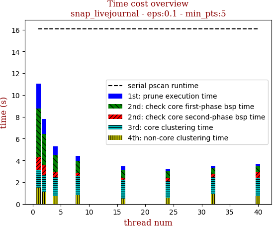 | 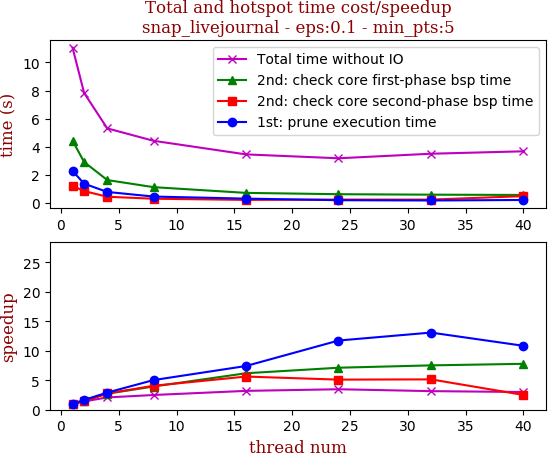

thread_num | prune | check-core 1st bsp | check-core 2nd bsp | cluster-core | cluster-non-core | total | total speedup
--- | --- | --- | --- | --- | --- | --- | ---
1 | 2.277s | 4.424s | 1.215s | 1.606s | 1.517s | 11.042s | 1.000
2 | 1.369s | 2.911s | 0.843s | 1.623s | 1.073s | 7.822s | 1.412
4 | 0.782s | 1.628s | 0.44s | 1.724s | 0.728s | 5.305s | 2.081
8 | 0.453s | 1.123s | 0.299s | 1.754s | 0.789s | 4.422s | 2.497
16 | 0.307s | 0.715s | 0.216s | 1.72s | 0.494s | 3.454s | 3.197
24 | 0.194s | 0.621s | 0.238s | 1.563s | 0.56s | 3.178s | 3.475
32 | 0.174s | 0.588s | 0.236s | 1.593s | 0.908s | 3.501s | 3.154
40 | 0.21s | 0.568s | 0.485s | 1.685s | 0.724s | 3.674s | 3.005

## eps:0.2

overview | speedup
--- | ---
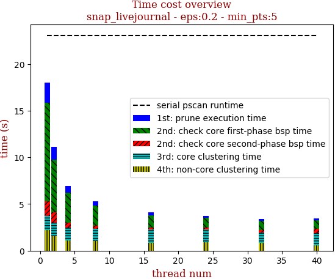 | 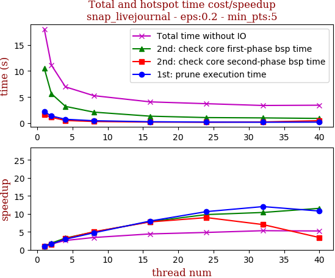

thread_num | prune | check-core 1st bsp | check-core 2nd bsp | cluster-core | cluster-non-core | total | total speedup
--- | --- | --- | --- | --- | --- | --- | ---
1 | 2.2s | 10.501s | 1.621s | 1.464s | 2.231s | 18.02s | 1.000
2 | 1.376s | 5.663s | 1.125s | 1.43s | 1.547s | 11.143s | 1.617
4 | 0.747s | 3.215s | 0.516s | 1.401s | 1.074s | 6.956s | 2.591
8 | 0.466s | 2.12s | 0.323s | 1.358s | 1.004s | 5.275s | 3.416
16 | 0.275s | 1.341s | 0.209s | 1.43s | 0.825s | 4.082s | 4.415
24 | 0.207s | 1.071s | 0.181s | 1.36s | 0.909s | 3.732s | 4.829
32 | 0.183s | 1.011s | 0.231s | 1.107s | 0.856s | 3.391s | 5.314
40 | 0.204s | 0.91s | 0.476s | 1.247s | 0.603s | 3.443s | 5.234

## eps:0.3

overview | speedup
--- | ---
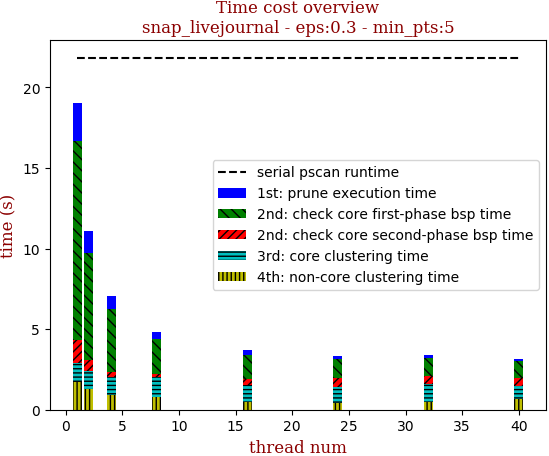 | 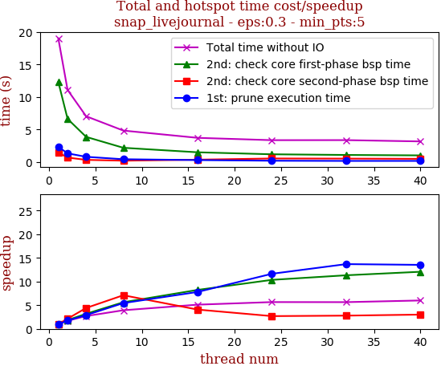

thread_num | prune | check-core 1st bsp | check-core 2nd bsp | cluster-core | cluster-non-core | total | total speedup
--- | --- | --- | --- | --- | --- | --- | ---
1 | 2.34s | 12.334s | 1.471s | 1.175s | 1.704s | 19.027s | 1.000
2 | 1.335s | 6.638s | 0.687s | 1.134s | 1.293s | 11.091s | 1.716
4 | 0.804s | 3.867s | 0.333s | 1.12s | 0.911s | 7.038s | 2.703
8 | 0.43s | 2.192s | 0.207s | 1.193s | 0.816s | 4.84s | 3.931
16 | 0.3s | 1.498s | 0.361s | 1.05s | 0.509s | 3.721s | 5.113
24 | 0.201s | 1.191s | 0.546s | 0.982s | 0.439s | 3.362s | 5.659
32 | 0.171s | 1.089s | 0.526s | 1.116s | 0.465s | 3.37s | 5.646
40 | 0.173s | 1.022s | 0.488s | 0.802s | 0.683s | 3.171s | 6.000

## eps:0.4

overview | speedup
--- | ---
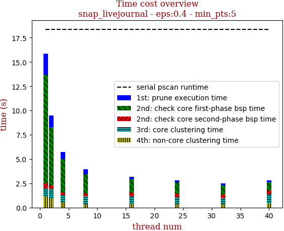 | 

thread_num | prune | check-core 1st bsp | check-core 2nd bsp | cluster-core | cluster-non-core | total | total speedup
--- | --- | --- | --- | --- | --- | --- | ---
1 | 2.185s | 11.133s | 0.474s | 0.859s | 1.182s | 15.836s | 1.000
2 | 1.177s | 6.029s | 0.4s | 0.906s | 0.966s | 9.481s | 1.670
4 | 0.738s | 3.458s | 0.236s | 0.8s | 0.505s | 5.739s | 2.759
8 | 0.498s | 2.008s | 0.276s | 0.8s | 0.368s | 3.953s | 4.006
16 | 0.277s | 1.361s | 0.39s | 0.743s | 0.408s | 3.181s | 4.978
24 | 0.2s | 1.119s | 0.434s | 0.739s | 0.286s | 2.781s | 5.694
32 | 0.175s | 0.931s | 0.397s | 0.709s | 0.283s | 2.498s | 6.339
40 | 0.159s | 0.889s | 0.436s | 0.897s | 0.446s | 2.836s | 5.584

## eps:0.5

overview | speedup
--- | ---
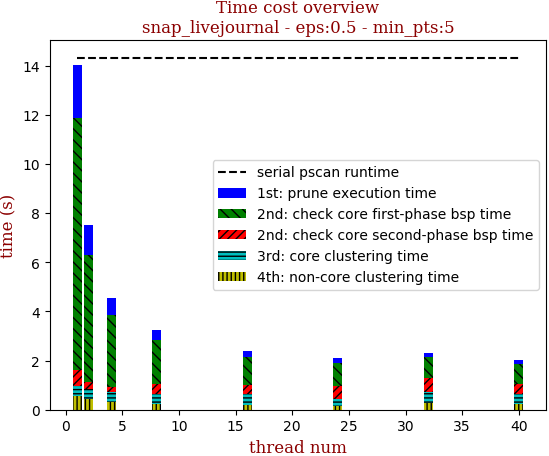 | 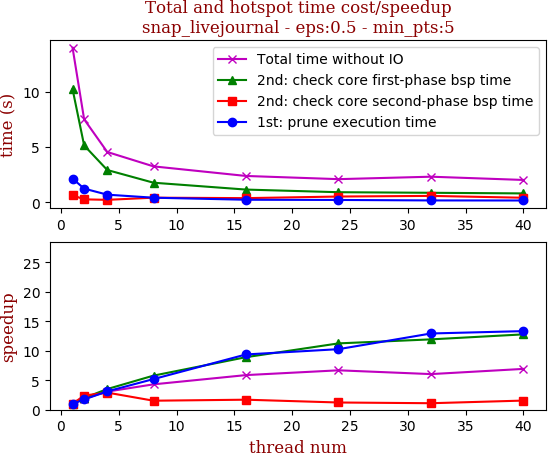

thread_num | prune | check-core 1st bsp | check-core 2nd bsp | cluster-core | cluster-non-core | total | total speedup
--- | --- | --- | --- | --- | --- | --- | ---
1 | 2.147s | 10.252s | 0.636s | 0.407s | 0.561s | 14.005s | 1.000
2 | 1.236s | 5.152s | 0.264s | 0.421s | 0.442s | 7.519s | 1.863
4 | 0.689s | 2.923s | 0.219s | 0.409s | 0.314s | 4.557s | 3.073
8 | 0.413s | 1.772s | 0.416s | 0.416s | 0.232s | 3.253s | 4.305
16 | 0.229s | 1.15s | 0.374s | 0.419s | 0.209s | 2.384s | 5.875
24 | 0.209s | 0.911s | 0.519s | 0.286s | 0.166s | 2.095s | 6.685
32 | 0.166s | 0.859s | 0.577s | 0.427s | 0.285s | 2.317s | 6.044
40 | 0.161s | 0.802s | 0.41s | 0.405s | 0.241s | 2.022s | 6.926

## eps:0.6

overview | speedup
--- | ---
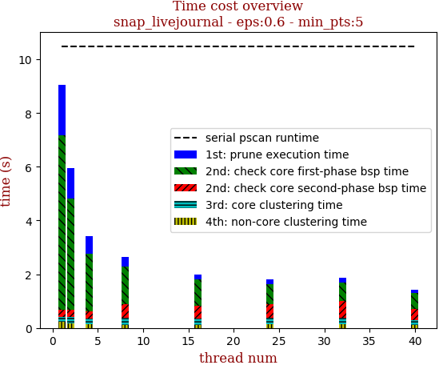 | 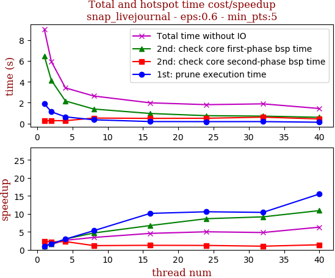

thread_num | prune | check-core 1st bsp | check-core 2nd bsp | cluster-core | cluster-non-core | total | total speedup
--- | --- | --- | --- | --- | --- | --- | ---
1 | 1.894s | 6.488s | 0.256s | 0.204s | 0.216s | 9.061s | 1.000
2 | 1.127s | 4.147s | 0.276s | 0.225s | 0.173s | 5.95s | 1.523
4 | 0.638s | 2.162s | 0.266s | 0.207s | 0.143s | 3.419s | 2.650
8 | 0.357s | 1.39s | 0.523s | 0.244s | 0.122s | 2.64s | 3.432
16 | 0.187s | 0.962s | 0.49s | 0.236s | 0.107s | 1.985s | 4.565
24 | 0.179s | 0.75s | 0.503s | 0.247s | 0.126s | 1.808s | 5.012
32 | 0.182s | 0.708s | 0.609s | 0.247s | 0.137s | 1.886s | 4.804
40 | 0.122s | 0.595s | 0.438s | 0.163s | 0.118s | 1.439s | 6.297

## eps:0.7

overview | speedup
--- | ---
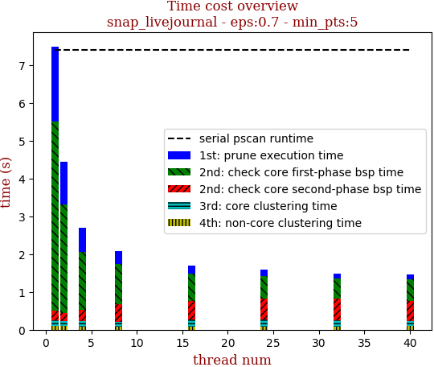 | 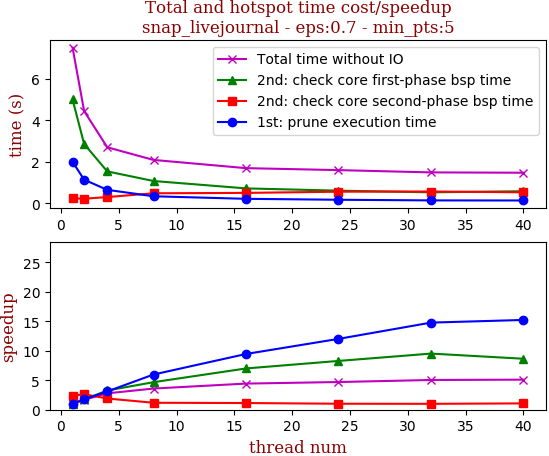

thread_num | prune | check-core 1st bsp | check-core 2nd bsp | cluster-core | cluster-non-core | total | total speedup
--- | --- | --- | --- | --- | --- | --- | ---
1 | 1.995s | 4.999s | 0.237s | 0.149s | 0.111s | 7.493s | 1.000
2 | 1.133s | 2.854s | 0.215s | 0.138s | 0.098s | 4.44s | 1.688
4 | 0.644s | 1.533s | 0.296s | 0.141s | 0.079s | 2.696s | 2.779
8 | 0.334s | 1.07s | 0.478s | 0.121s | 0.079s | 2.086s | 3.592
16 | 0.211s | 0.714s | 0.497s | 0.177s | 0.088s | 1.69s | 4.434
24 | 0.166s | 0.604s | 0.555s | 0.179s | 0.087s | 1.595s | 4.698
32 | 0.135s | 0.525s | 0.564s | 0.173s | 0.085s | 1.485s | 5.046
40 | 0.131s | 0.578s | 0.525s | 0.143s | 0.09s | 1.469s | 5.101

## eps:0.8

overview | speedup
--- | ---
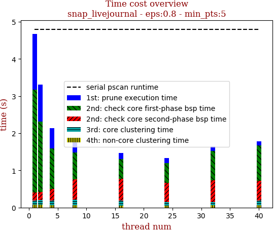 | 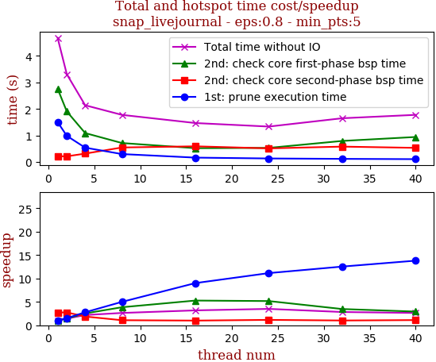

thread_num | prune | check-core 1st bsp | check-core 2nd bsp | cluster-core | cluster-non-core | total | total speedup
--- | --- | --- | --- | --- | --- | --- | ---
1 | 1.505s | 2.762s | 0.217s | 0.11s | 0.08s | 4.678s | 1.000
2 | 0.988s | 1.906s | 0.216s | 0.119s | 0.077s | 3.308s | 1.414
4 | 0.542s | 1.092s | 0.318s | 0.119s | 0.068s | 2.14s | 2.186
8 | 0.301s | 0.717s | 0.549s | 0.146s | 0.063s | 1.778s | 2.631
16 | 0.167s | 0.523s | 0.593s | 0.129s | 0.055s | 1.47s | 3.182
24 | 0.135s | 0.534s | 0.515s | 0.096s | 0.053s | 1.337s | 3.499
32 | 0.12s | 0.796s | 0.582s | 0.093s | 0.058s | 1.651s | 2.833
40 | 0.109s | 0.945s | 0.535s | 0.117s | 0.07s | 1.779s | 2.630

## eps:0.9

overview | speedup
--- | ---
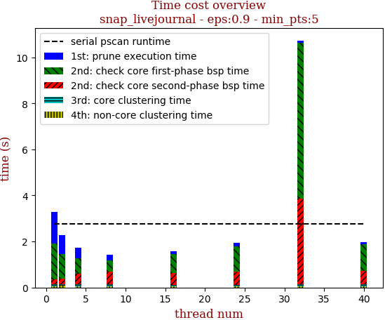 | 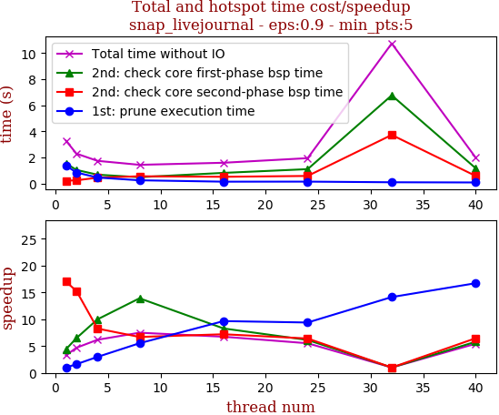

thread_num | prune | check-core 1st bsp | check-core 2nd bsp | cluster-core | cluster-non-core | total | total speedup
--- | --- | --- | --- | --- | --- | --- | ---
1 | 1.371s | 1.537s | 0.219s | 0.088s | 0.064s | 3.282s | 1.000
2 | 0.843s | 1.042s | 0.244s | 0.09s | 0.068s | 2.289s | 1.434
4 | 0.46s | 0.677s | 0.451s | 0.09s | 0.057s | 1.738s | 1.888
8 | 0.248s | 0.486s | 0.556s | 0.088s | 0.052s | 1.433s | 2.290
16 | 0.142s | 0.816s | 0.517s | 0.071s | 0.043s | 1.592s | 2.062
24 | 0.146s | 1.102s | 0.581s | 0.07s | 0.042s | 1.944s | 1.688
32 | 0.097s | 6.758s | 3.724s | 0.085s | 0.063s | 10.731s | 0.306
40 | 0.082s | 1.163s | 0.576s | 0.088s | 0.061s | 1.973s | 1.663

