## eps:0.1

overview | speedup
--- | ---
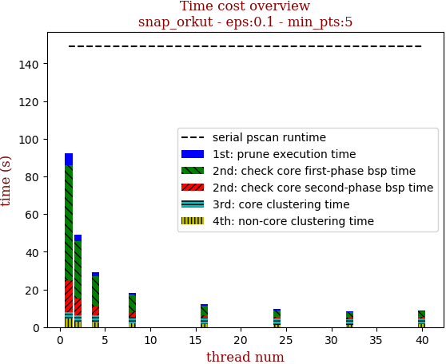 | 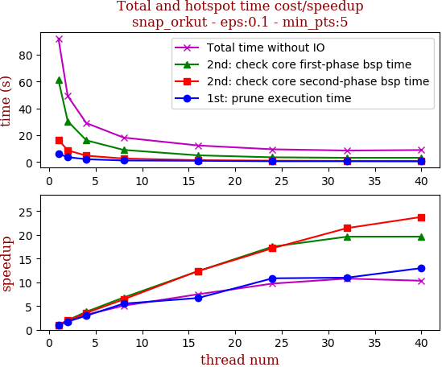

thread_num | prune | check-core 1st bsp | check-core 2nd bsp | cluster-core | cluster-non-core | total | total speedup
--- | --- | --- | --- | --- | --- | --- | ---
1 | 6.161s | 61.401s | 16.646s | 3.649s | 4.42s | 92.28s | 1.000
2 | 3.591s | 30.462s | 8.734s | 3.4s | 3.043s | 49.233s | 1.874
4 | 2.078s | 16.173s | 4.685s | 3.555s | 2.565s | 29.057s | 3.176
8 | 1.119s | 9.033s | 2.6s | 3.496s | 1.972s | 18.222s | 5.064
16 | 0.921s | 4.972s | 1.345s | 3.438s | 1.661s | 12.34s | 7.478
24 | 0.568s | 3.505s | 0.969s | 3.21s | 1.225s | 9.48s | 9.734
32 | 0.561s | 3.13s | 0.777s | 2.852s | 1.231s | 8.554s | 10.788
40 | 0.474s | 3.128s | 0.7s | 2.898s | 1.729s | 8.932s | 10.331

## eps:0.2

overview | speedup
--- | ---
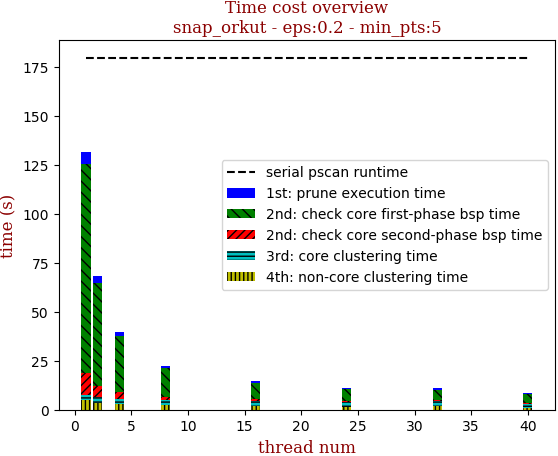 | 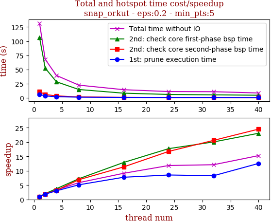

thread_num | prune | check-core 1st bsp | check-core 2nd bsp | cluster-core | cluster-non-core | total | total speedup
--- | --- | --- | --- | --- | --- | --- | ---
1 | 6.191s | 106.59s | 11.103s | 2.818s | 4.942s | 131.645s | 1.000
2 | 3.342s | 52.534s | 5.871s | 2.939s | 3.459s | 68.147s | 1.932
4 | 2.054s | 28.4s | 3.496s | 2.832s | 2.777s | 39.561s | 3.328
8 | 1.21s | 14.748s | 1.611s | 2.661s | 2.212s | 22.444s | 5.865
16 | 0.799s | 8.254s | 0.977s | 2.665s | 1.721s | 14.419s | 9.130
24 | 0.726s | 6.018s | 0.663s | 2.085s | 1.636s | 11.13s | 11.828
32 | 0.748s | 5.315s | 0.539s | 2.555s | 1.707s | 10.867s | 12.114
40 | 0.493s | 4.621s | 0.453s | 1.957s | 1.089s | 8.616s | 15.279

## eps:0.3

overview | speedup
--- | ---
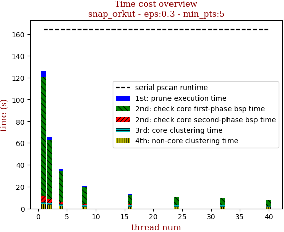 | 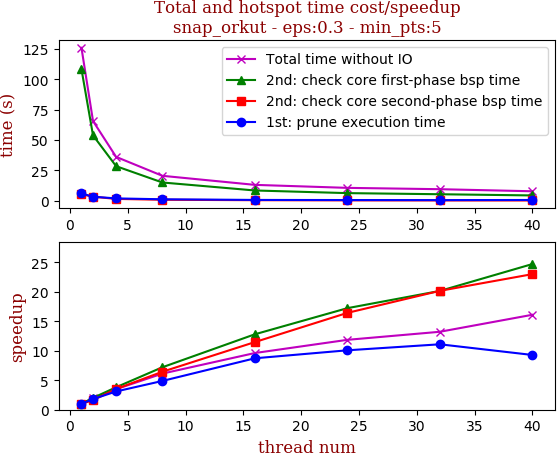

thread_num | prune | check-core 1st bsp | check-core 2nd bsp | cluster-core | cluster-non-core | total | total speedup
--- | --- | --- | --- | --- | --- | --- | ---
1 | 6.038s | 108.624s | 5.405s | 1.922s | 4.172s | 126.164s | 1.000
2 | 3.345s | 53.932s | 3.357s | 1.969s | 3.143s | 65.748s | 1.919
4 | 1.949s | 28.503s | 1.534s | 1.98s | 2.202s | 36.17s | 3.488
8 | 1.237s | 15.078s | 0.839s | 1.963s | 1.465s | 20.584s | 6.129
16 | 0.692s | 8.487s | 0.471s | 2.046s | 1.418s | 13.116s | 9.619
24 | 0.599s | 6.305s | 0.329s | 2.032s | 1.374s | 10.641s | 11.856
32 | 0.544s | 5.39s | 0.268s | 2.059s | 1.278s | 9.541s | 13.223
40 | 0.65s | 4.396s | 0.235s | 1.511s | 1.038s | 7.833s | 16.107

## eps:0.4

overview | speedup
--- | ---
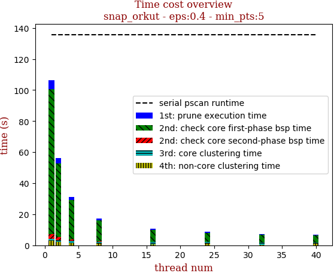 | 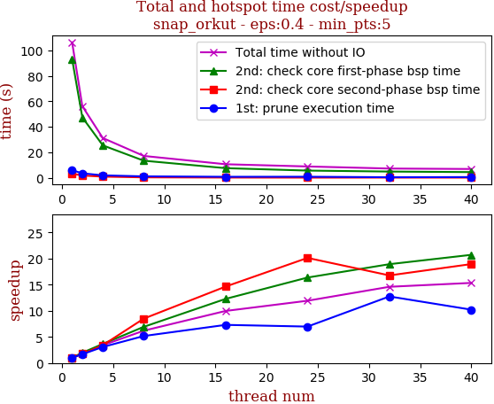

thread_num | prune | check-core 1st bsp | check-core 2nd bsp | cluster-core | cluster-non-core | total | total speedup
--- | --- | --- | --- | --- | --- | --- | ---
1 | 5.964s | 93.121s | 3.22s | 1.193s | 2.844s | 106.344s | 1.000
2 | 3.546s | 47.425s | 1.852s | 1.247s | 2.123s | 56.195s | 1.892
4 | 1.943s | 25.47s | 0.943s | 1.371s | 1.509s | 31.239s | 3.404
8 | 1.154s | 13.446s | 0.379s | 1.208s | 0.997s | 17.187s | 6.187
16 | 0.817s | 7.584s | 0.22s | 1.351s | 0.694s | 10.669s | 9.968
24 | 0.855s | 5.691s | 0.16s | 1.303s | 0.909s | 8.921s | 11.921
32 | 0.468s | 4.921s | 0.192s | 1.254s | 0.449s | 7.287s | 14.594
40 | 0.584s | 4.496s | 0.17s | 0.774s | 0.907s | 6.934s | 15.337

## eps:0.5

overview | speedup
--- | ---
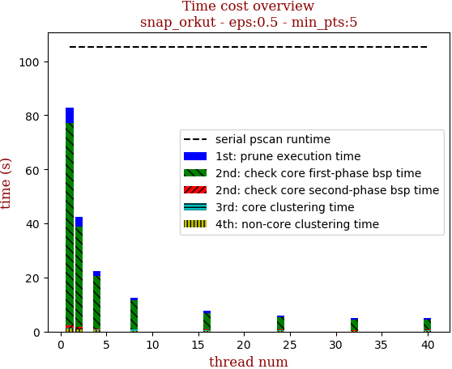 | 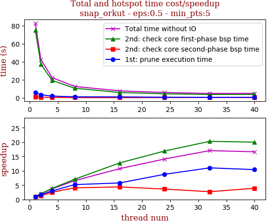

thread_num | prune | check-core 1st bsp | check-core 2nd bsp | cluster-core | cluster-non-core | total | total speedup
--- | --- | --- | --- | --- | --- | --- | ---
1 | 5.618s | 74.995s | 0.905s | 0.352s | 1.028s | 82.9s | 1.000
2 | 3.403s | 37.255s | 0.7s | 0.323s | 0.674s | 42.358s | 1.957
4 | 1.887s | 19.386s | 0.356s | 0.347s | 0.393s | 22.372s | 3.706
8 | 1.085s | 10.644s | 0.223s | 0.355s | 0.313s | 12.623s | 6.567
16 | 0.975s | 5.883s | 0.207s | 0.325s | 0.332s | 7.724s | 10.733
24 | 0.64s | 4.443s | 0.25s | 0.305s | 0.24s | 5.88s | 14.099
32 | 0.51s | 3.702s | 0.335s | 0.159s | 0.162s | 4.871s | 17.019
40 | 0.54s | 3.755s | 0.232s | 0.163s | 0.295s | 4.988s | 16.620

## eps:0.6

overview | speedup
--- | ---
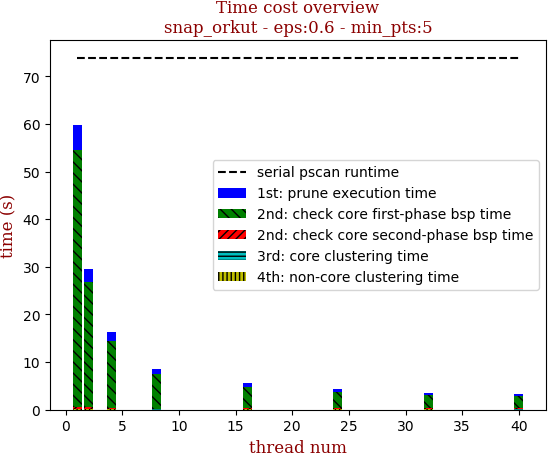 | 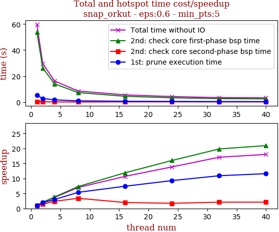

thread_num | prune | check-core 1st bsp | check-core 2nd bsp | cluster-core | cluster-non-core | total | total speedup
--- | --- | --- | --- | --- | --- | --- | ---
1 | 5.374s | 53.749s | 0.458s | 0.066s | 0.143s | 59.793s | 1.000
2 | 2.795s | 26.264s | 0.326s | 0.06s | 0.13s | 29.578s | 2.022
4 | 1.815s | 14.115s | 0.192s | 0.065s | 0.091s | 16.28s | 3.673
8 | 1.001s | 7.371s | 0.135s | 0.032s | 0.041s | 8.582s | 6.967
16 | 0.726s | 4.519s | 0.23s | 0.052s | 0.059s | 5.589s | 10.698
24 | 0.578s | 3.36s | 0.268s | 0.052s | 0.056s | 4.316s | 13.854
32 | 0.493s | 2.71s | 0.219s | 0.026s | 0.051s | 3.503s | 17.069
40 | 0.463s | 2.564s | 0.218s | 0.033s | 0.036s | 3.317s | 18.026

## eps:0.7

overview | speedup
--- | ---
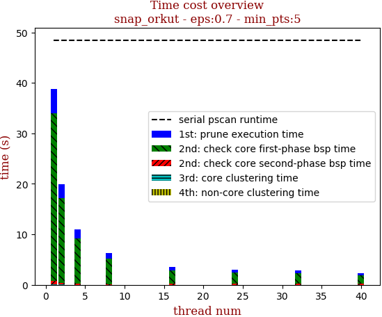 | 

thread_num | prune | check-core 1st bsp | check-core 2nd bsp | cluster-core | cluster-non-core | total | total speedup
--- | --- | --- | --- | --- | --- | --- | ---
1 | 4.847s | 33.258s | 0.695s | 0.021s | 0.027s | 38.85s | 1.000
2 | 2.801s | 16.856s | 0.27s | 0.02s | 0.022s | 19.972s | 1.945
4 | 1.7s | 9.022s | 0.164s | 0.01s | 0.018s | 10.918s | 3.558
8 | 1.162s | 4.995s | 0.117s | 0.006s | 0.013s | 6.296s | 6.171
16 | 0.652s | 2.622s | 0.236s | 0.011s | 0.019s | 3.543s | 10.965
24 | 0.492s | 2.232s | 0.218s | 0.005s | 0.011s | 2.96s | 13.125
32 | 0.524s | 2.041s | 0.226s | 0.005s | 0.011s | 2.81s | 13.826
40 | 0.392s | 1.623s | 0.237s | 0.005s | 0.012s | 2.272s | 17.099

## eps:0.8

overview | speedup
--- | ---
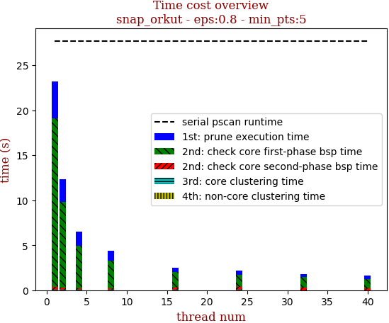 | 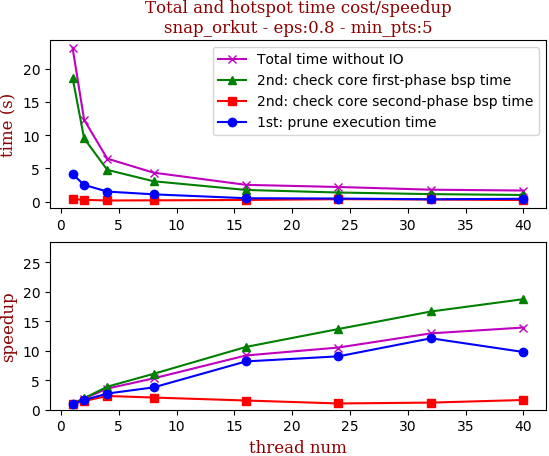

thread_num | prune | check-core 1st bsp | check-core 2nd bsp | cluster-core | cluster-non-core | total | total speedup
--- | --- | --- | --- | --- | --- | --- | ---
1 | 4.131s | 18.664s | 0.378s | 0.015s | 0.013s | 23.204s | 1.000
2 | 2.517s | 9.531s | 0.256s | 0.014s | 0.013s | 12.334s | 1.881
4 | 1.506s | 4.78s | 0.162s | 0.014s | 0.014s | 6.477s | 3.583
8 | 1.091s | 3.066s | 0.183s | 0.007s | 0.013s | 4.363s | 5.318
16 | 0.504s | 1.752s | 0.242s | 0.006s | 0.014s | 2.521s | 9.204
24 | 0.456s | 1.363s | 0.356s | 0.007s | 0.015s | 2.199s | 10.552
32 | 0.341s | 1.12s | 0.313s | 0.003s | 0.011s | 1.791s | 12.956
40 | 0.422s | 0.995s | 0.229s | 0.004s | 0.011s | 1.664s | 13.945

## eps:0.9

overview | speedup
--- | ---
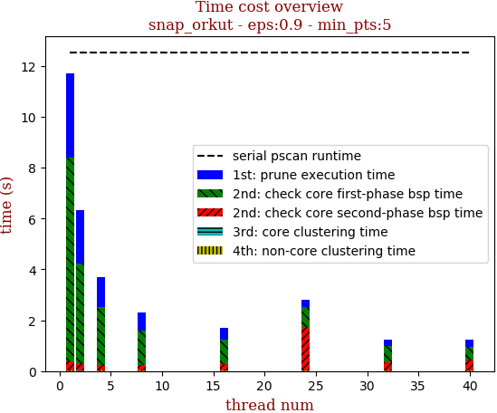 | 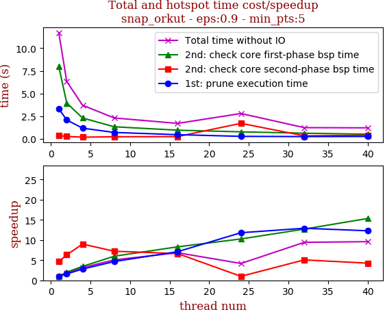

thread_num | prune | check-core 1st bsp | check-core 2nd bsp | cluster-core | cluster-non-core | total | total speedup
--- | --- | --- | --- | --- | --- | --- | ---
1 | 3.318s | 7.993s | 0.37s | 0.015s | 0.012s | 11.71s | 1.000
2 | 2.091s | 3.96s | 0.272s | 0.002s | 0.007s | 6.335s | 1.848
4 | 1.185s | 2.309s | 0.191s | 0.014s | 0.012s | 3.714s | 3.153
8 | 0.712s | 1.337s | 0.238s | 0.007s | 0.012s | 2.309s | 5.071
16 | 0.467s | 0.962s | 0.259s | 0.007s | 0.013s | 1.711s | 6.844
24 | 0.281s | 0.779s | 1.718s | 0.005s | 0.015s | 2.8s | 4.182
32 | 0.257s | 0.629s | 0.339s | 0.003s | 0.011s | 1.242s | 9.428
40 | 0.27s | 0.521s | 0.403s | 0.006s | 0.019s | 1.221s | 9.590

