## eps:0.1

overview | speedup
--- | ---
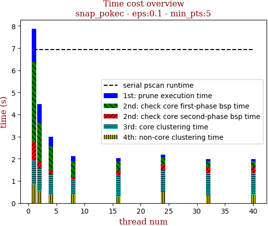 | 

thread_num | prune | check-core 1st bsp | check-core 2nd bsp | cluster-core | cluster-non-core | total | total speedup
--- | --- | --- | --- | --- | --- | --- | ---
1 | 1.511s | 3.621s | 0.83s | 1.066s | 0.853s | 7.883s | 1.000
2 | 0.832s | 1.752s | 0.298s | 1.039s | 0.545s | 4.47s | 1.764
4 | 0.43s | 1.098s | 0.167s | 0.922s | 0.388s | 3.008s | 2.621
8 | 0.224s | 0.701s | 0.117s | 0.669s | 0.403s | 2.118s | 3.722
16 | 0.144s | 0.431s | 0.21s | 0.957s | 0.295s | 2.04s | 3.864
24 | 0.111s | 0.332s | 0.244s | 0.985s | 0.518s | 2.194s | 3.593
32 | 0.087s | 0.291s | 0.241s | 1.022s | 0.345s | 1.988s | 3.965
40 | 0.092s | 0.263s | 0.263s | 0.975s | 0.385s | 1.981s | 3.979

## eps:0.2

overview | speedup
--- | ---
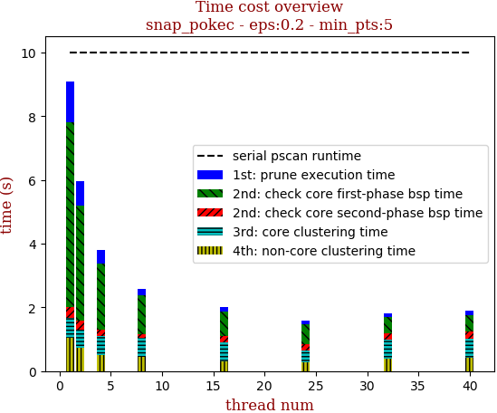 | 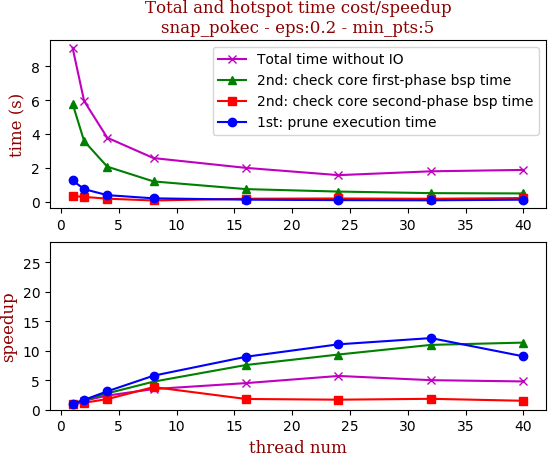

thread_num | prune | check-core 1st bsp | check-core 2nd bsp | cluster-core | cluster-non-core | total | total speedup
--- | --- | --- | --- | --- | --- | --- | ---
1 | 1.276s | 5.796s | 0.361s | 0.601s | 1.054s | 9.091s | 1.000
2 | 0.762s | 3.591s | 0.305s | 0.559s | 0.733s | 5.952s | 1.527
4 | 0.409s | 2.087s | 0.201s | 0.578s | 0.514s | 3.792s | 2.397
8 | 0.221s | 1.217s | 0.094s | 0.606s | 0.451s | 2.592s | 3.507
16 | 0.142s | 0.764s | 0.198s | 0.592s | 0.315s | 2.014s | 4.514
24 | 0.115s | 0.619s | 0.212s | 0.353s | 0.285s | 1.587s | 5.728
32 | 0.105s | 0.527s | 0.195s | 0.599s | 0.385s | 1.813s | 5.014
40 | 0.141s | 0.509s | 0.238s | 0.578s | 0.426s | 1.895s | 4.797

## eps:0.3

overview | speedup
--- | ---
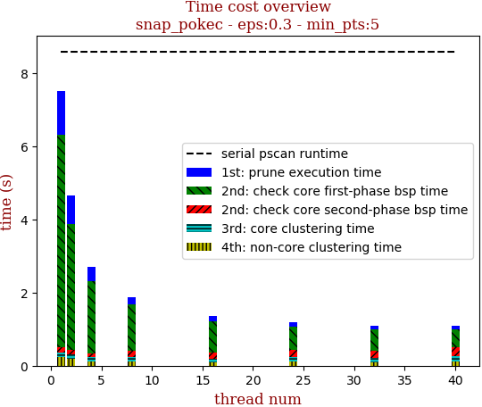 | 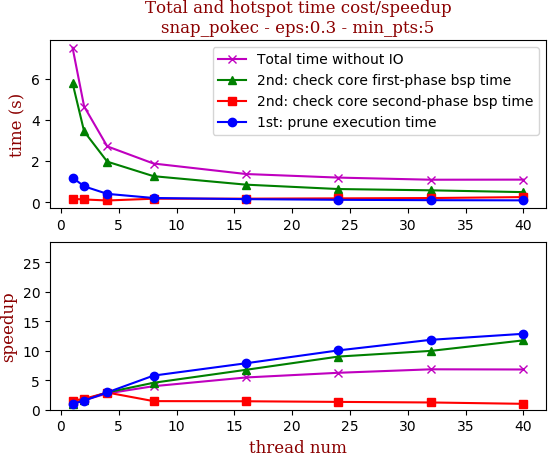

thread_num | prune | check-core 1st bsp | check-core 2nd bsp | cluster-core | cluster-non-core | total | total speedup
--- | --- | --- | --- | --- | --- | --- | ---
1 | 1.198s | 5.79s | 0.163s | 0.127s | 0.227s | 7.508s | 1.000
2 | 0.773s | 3.441s | 0.136s | 0.119s | 0.18s | 4.652s | 1.614
4 | 0.408s | 1.973s | 0.086s | 0.123s | 0.124s | 2.716s | 2.764
8 | 0.207s | 1.267s | 0.172s | 0.122s | 0.112s | 1.882s | 3.989
16 | 0.152s | 0.855s | 0.175s | 0.099s | 0.088s | 1.372s | 5.472
24 | 0.119s | 0.642s | 0.189s | 0.14s | 0.106s | 1.198s | 6.267
32 | 0.101s | 0.58s | 0.204s | 0.117s | 0.09s | 1.095s | 6.857
40 | 0.093s | 0.492s | 0.251s | 0.156s | 0.106s | 1.1s | 6.825

## eps:0.4

overview | speedup
--- | ---
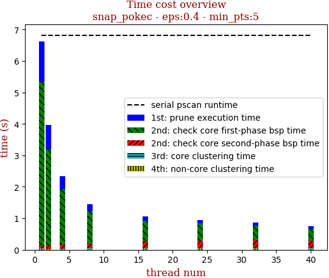 | 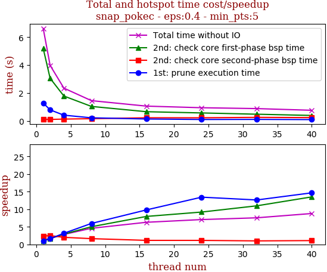

thread_num | prune | check-core 1st bsp | check-core 2nd bsp | cluster-core | cluster-non-core | total | total speedup
--- | --- | --- | --- | --- | --- | --- | ---
1 | 1.276s | 5.188s | 0.105s | 0.021s | 0.032s | 6.625s | 1.000
2 | 0.784s | 3.052s | 0.099s | 0.015s | 0.026s | 3.978s | 1.665
4 | 0.404s | 1.777s | 0.123s | 0.015s | 0.022s | 2.344s | 2.826
8 | 0.214s | 1.032s | 0.151s | 0.024s | 0.022s | 1.446s | 4.582
16 | 0.13s | 0.652s | 0.216s | 0.029s | 0.024s | 1.053s | 6.292
24 | 0.095s | 0.564s | 0.217s | 0.03s | 0.029s | 0.938s | 7.063
32 | 0.101s | 0.473s | 0.247s | 0.028s | 0.025s | 0.876s | 7.563
40 | 0.087s | 0.384s | 0.228s | 0.029s | 0.023s | 0.754s | 8.786

## eps:0.5

overview | speedup
--- | ---
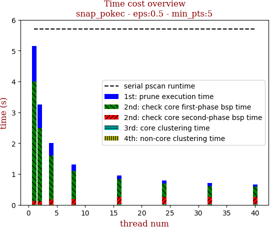 | 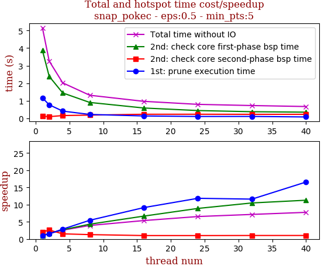

thread_num | prune | check-core 1st bsp | check-core 2nd bsp | cluster-core | cluster-non-core | total | total speedup
--- | --- | --- | --- | --- | --- | --- | ---
1 | 1.16s | 3.869s | 0.11s | 0.005s | 0.01s | 5.156s | 1.000
2 | 0.764s | 2.388s | 0.086s | 0.01s | 0.009s | 3.261s | 1.581
4 | 0.404s | 1.441s | 0.15s | 0.007s | 0.011s | 2.016s | 2.558
8 | 0.213s | 0.898s | 0.176s | 0.012s | 0.007s | 1.309s | 3.939
16 | 0.127s | 0.581s | 0.224s | 0.016s | 0.011s | 0.961s | 5.365
24 | 0.098s | 0.435s | 0.225s | 0.018s | 0.011s | 0.789s | 6.535
32 | 0.1s | 0.369s | 0.22s | 0.016s | 0.012s | 0.721s | 7.151
40 | 0.07s | 0.343s | 0.219s | 0.017s | 0.012s | 0.665s | 7.753

## eps:0.6

overview | speedup
--- | ---
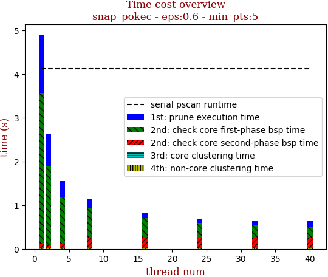 | 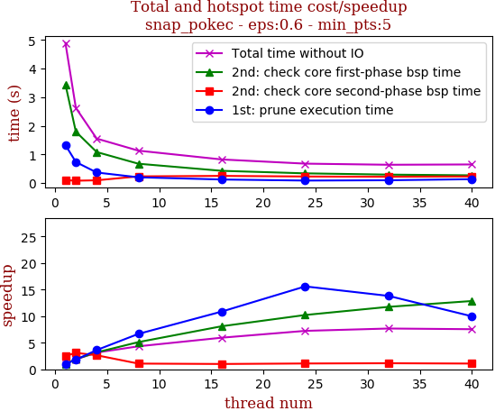

thread_num | prune | check-core 1st bsp | check-core 2nd bsp | cluster-core | cluster-non-core | total | total speedup
--- | --- | --- | --- | --- | --- | --- | ---
1 | 1.326s | 3.444s | 0.099s | 0.01s | 0.008s | 4.889s | 1.000
2 | 0.733s | 1.792s | 0.08s | 0.008s | 0.006s | 2.623s | 1.864
4 | 0.366s | 1.081s | 0.094s | 0.003s | 0.005s | 1.551s | 3.152
8 | 0.199s | 0.673s | 0.231s | 0.016s | 0.009s | 1.13s | 4.327
16 | 0.122s | 0.425s | 0.248s | 0.015s | 0.01s | 0.822s | 5.948
24 | 0.085s | 0.337s | 0.227s | 0.016s | 0.009s | 0.676s | 7.232
32 | 0.096s | 0.293s | 0.218s | 0.015s | 0.012s | 0.637s | 7.675
40 | 0.133s | 0.268s | 0.23s | 0.003s | 0.011s | 0.648s | 7.545

## eps:0.7

overview | speedup
--- | ---
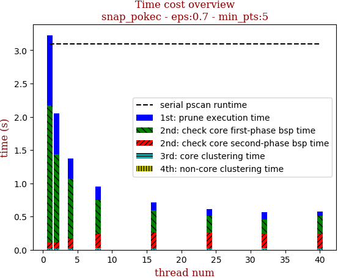 | 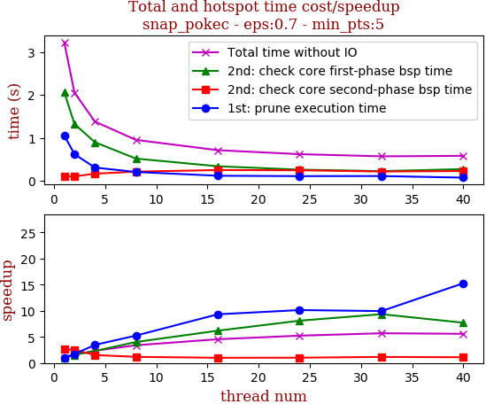

thread_num | prune | check-core 1st bsp | check-core 2nd bsp | cluster-core | cluster-non-core | total | total speedup
--- | --- | --- | --- | --- | --- | --- | ---
1 | 1.054s | 2.066s | 0.091s | 0.009s | 0.007s | 3.23s | 1.000
2 | 0.616s | 1.321s | 0.099s | 0.008s | 0.008s | 2.054s | 1.573
4 | 0.304s | 0.895s | 0.161s | 0.005s | 0.009s | 1.378s | 2.344
8 | 0.201s | 0.514s | 0.209s | 0.015s | 0.009s | 0.951s | 3.396
16 | 0.113s | 0.334s | 0.246s | 0.004s | 0.011s | 0.71s | 4.549
24 | 0.104s | 0.255s | 0.241s | 0.003s | 0.011s | 0.617s | 5.235
32 | 0.106s | 0.221s | 0.212s | 0.015s | 0.011s | 0.567s | 5.697
40 | 0.069s | 0.268s | 0.223s | 0.005s | 0.011s | 0.578s | 5.588

## eps:0.8

overview | speedup
--- | ---
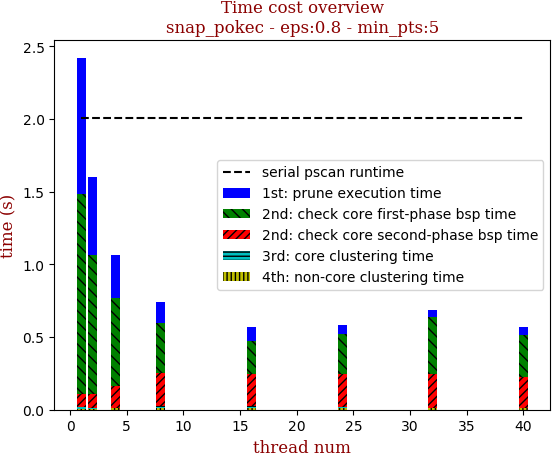 | 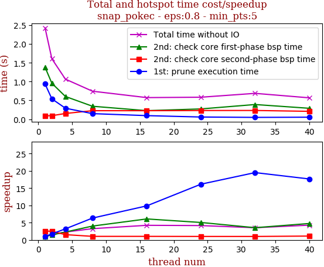

thread_num | prune | check-core 1st bsp | check-core 2nd bsp | cluster-core | cluster-non-core | total | total speedup
--- | --- | --- | --- | --- | --- | --- | ---
1 | 0.936s | 1.379s | 0.09s | 0.009s | 0.007s | 2.425s | 1.000
2 | 0.541s | 0.955s | 0.093s | 0.008s | 0.007s | 1.606s | 1.510
4 | 0.292s | 0.604s | 0.152s | 0.005s | 0.009s | 1.065s | 2.277
8 | 0.148s | 0.344s | 0.226s | 0.015s | 0.009s | 0.744s | 3.259
16 | 0.095s | 0.227s | 0.226s | 0.013s | 0.01s | 0.574s | 4.225
24 | 0.058s | 0.273s | 0.231s | 0.009s | 0.009s | 0.584s | 4.152
32 | 0.048s | 0.39s | 0.232s | 0.004s | 0.01s | 0.687s | 3.530
40 | 0.053s | 0.29s | 0.209s | 0.004s | 0.01s | 0.568s | 4.269

## eps:0.9

overview | speedup
--- | ---
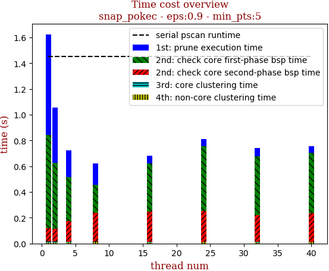 | 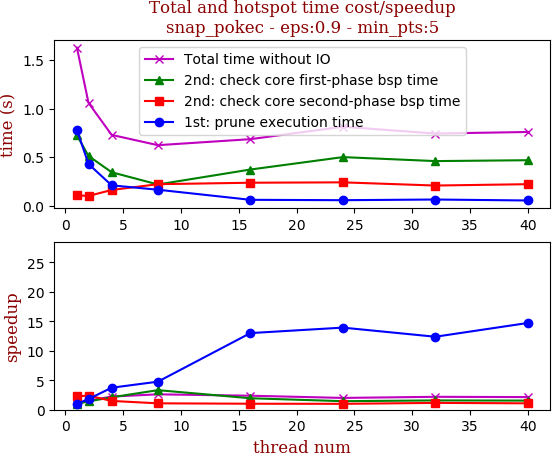

thread_num | prune | check-core 1st bsp | check-core 2nd bsp | cluster-core | cluster-non-core | total | total speedup
--- | --- | --- | --- | --- | --- | --- | ---
1 | 0.78s | 0.724s | 0.106s | 0.006s | 0.009s | 1.627s | 1.000
2 | 0.429s | 0.512s | 0.1s | 0.005s | 0.01s | 1.059s | 1.536
4 | 0.209s | 0.344s | 0.161s | 0.003s | 0.008s | 0.729s | 2.232
8 | 0.164s | 0.218s | 0.221s | 0.006s | 0.012s | 0.623s | 2.612
16 | 0.06s | 0.372s | 0.236s | 0.004s | 0.01s | 0.685s | 2.375
24 | 0.056s | 0.5s | 0.24s | 0.003s | 0.011s | 0.813s | 2.001
32 | 0.063s | 0.459s | 0.207s | 0.003s | 0.009s | 0.743s | 2.190
40 | 0.053s | 0.468s | 0.221s | 0.003s | 0.011s | 0.759s | 2.144

