## eps:0.1

overview | speedup
--- | ---
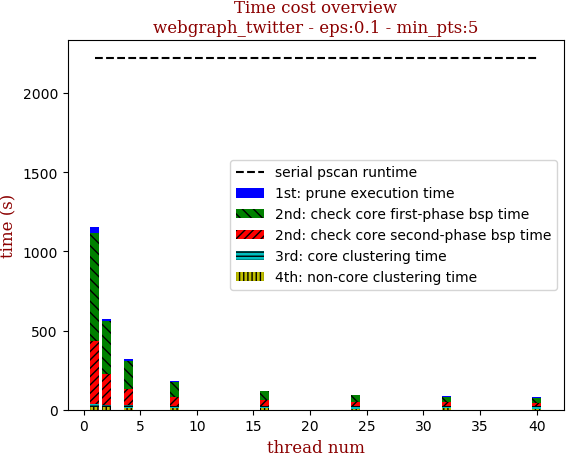 | 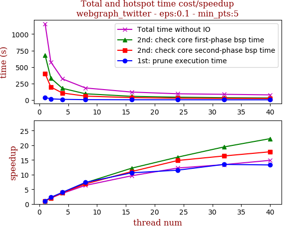

thread_num | prune | check-core 1st bsp | check-core 2nd bsp | cluster-core | cluster-non-core | total | total speedup
--- | --- | --- | --- | --- | --- | --- | ---
1 | 39.048s | 680.981s | 401.1s | 14.612s | 20.266s | 1156.01s | 1.000
2 | 17.274s | 330.94s | 196.604s | 14.658s | 15.541s | 575.021s | 2.010
4 | 9.878s | 177.073s | 106.197s | 15.376s | 11.715s | 320.242s | 3.610
8 | 5.314s | 94.25s | 58.732s | 14.545s | 9.681s | 182.525s | 6.333
16 | 3.679s | 55.831s | 36.322s | 15.394s | 9.117s | 120.345s | 9.606
24 | 3.389s | 42.65s | 27.063s | 14.127s | 7.111s | 94.343s | 12.253
32 | 2.896s | 35.048s | 24.513s | 15.087s | 8.658s | 86.205s | 13.410
40 | 2.937s | 30.593s | 22.551s | 14.084s | 7.603s | 77.771s | 14.864

## eps:0.2

overview | speedup
--- | ---
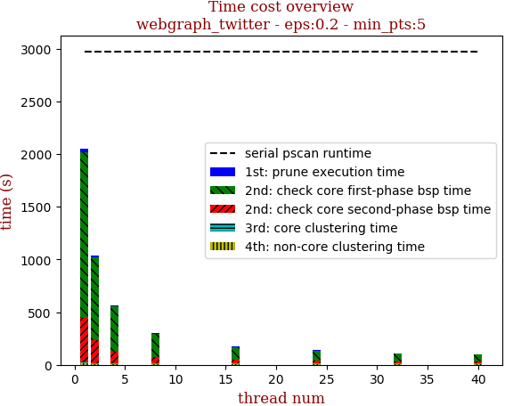 | 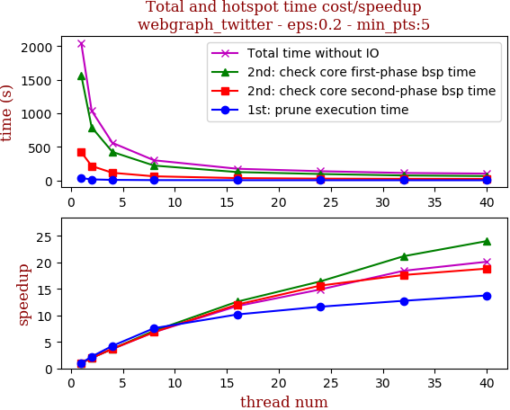

thread_num | prune | check-core 1st bsp | check-core 2nd bsp | cluster-core | cluster-non-core | total | total speedup
--- | --- | --- | --- | --- | --- | --- | ---
1 | 34.824s | 1569.116s | 421.893s | 6.602s | 16.322s | 2048.76s | 1.000
2 | 15.626s | 792.439s | 215.2s | 6.226s | 9.502s | 1038.997s | 1.972
4 | 8.201s | 424.374s | 113.735s | 6.753s | 6.608s | 559.674s | 3.661
8 | 4.592s | 221.394s | 61.606s | 6.732s | 5.903s | 300.23s | 6.824
16 | 3.422s | 124.619s | 35.033s | 6.626s | 4.554s | 174.255s | 11.757
24 | 2.992s | 95.575s | 27.0s | 7.451s | 4.49s | 137.511s | 14.899
32 | 2.73s | 74.131s | 23.938s | 6.103s | 4.348s | 111.253s | 18.415
40 | 2.53s | 65.321s | 22.414s | 7.173s | 4.377s | 101.817s | 20.122

## eps:0.3

overview | speedup
--- | ---
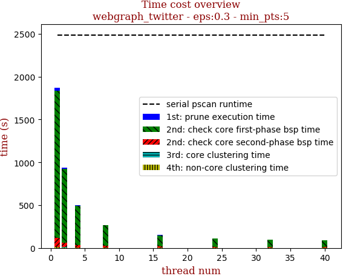 | 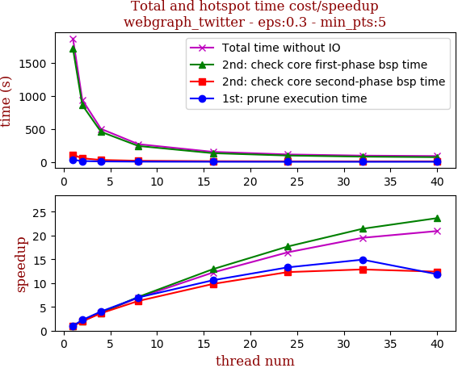

thread_num | prune | check-core 1st bsp | check-core 2nd bsp | cluster-core | cluster-non-core | total | total speedup
--- | --- | --- | --- | --- | --- | --- | ---
1 | 31.444s | 1717.213s | 108.779s | 2.98s | 9.708s | 1870.128s | 1.000
2 | 13.973s | 862.04s | 55.44s | 3.096s | 6.228s | 940.779s | 1.988
4 | 7.814s | 456.701s | 29.738s | 3.076s | 3.945s | 501.277s | 3.731
8 | 4.506s | 242.099s | 17.434s | 2.359s | 3.066s | 269.467s | 6.940
16 | 2.966s | 132.725s | 11.071s | 3.323s | 2.826s | 152.913s | 12.230
24 | 2.363s | 97.069s | 8.836s | 2.385s | 2.925s | 113.582s | 16.465
32 | 2.107s | 80.183s | 8.452s | 2.367s | 2.717s | 95.829s | 19.515
40 | 2.65s | 72.585s | 8.773s | 2.74s | 2.564s | 89.314s | 20.939

## eps:0.4

overview | speedup
--- | ---
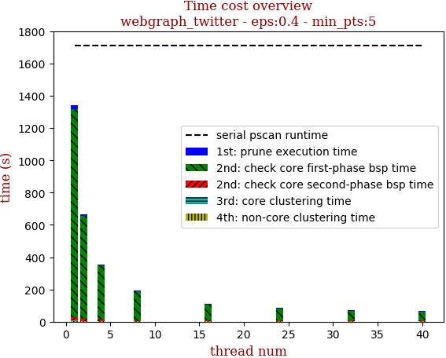 | 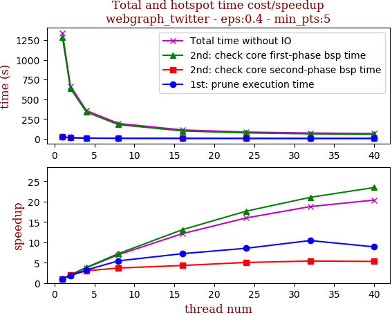

thread_num | prune | check-core 1st bsp | check-core 2nd bsp | cluster-core | cluster-non-core | total | total speedup
--- | --- | --- | --- | --- | --- | --- | ---
1 | 23.035s | 1288.969s | 20.982s | 2.465s | 5.039s | 1340.493s | 1.000
2 | 12.74s | 638.011s | 10.971s | 2.598s | 3.003s | 667.326s | 2.009
4 | 7.179s | 336.825s | 6.965s | 3.046s | 2.178s | 356.195s | 3.763
8 | 4.231s | 178.356s | 5.7s | 2.629s | 1.836s | 192.754s | 6.954
16 | 3.195s | 98.415s | 4.864s | 2.194s | 1.891s | 110.562s | 12.124
24 | 2.697s | 72.988s | 4.153s | 2.192s | 1.795s | 83.827s | 15.991
32 | 2.208s | 61.253s | 3.884s | 2.234s | 1.817s | 71.398s | 18.775
40 | 2.593s | 54.949s | 3.954s | 2.516s | 1.787s | 65.801s | 20.372

## eps:0.5

overview | speedup
--- | ---
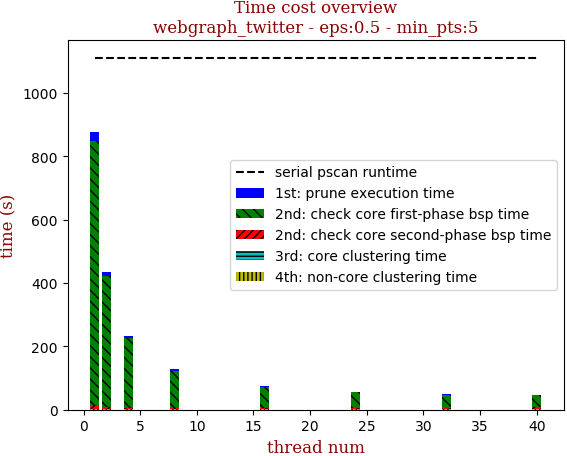 | 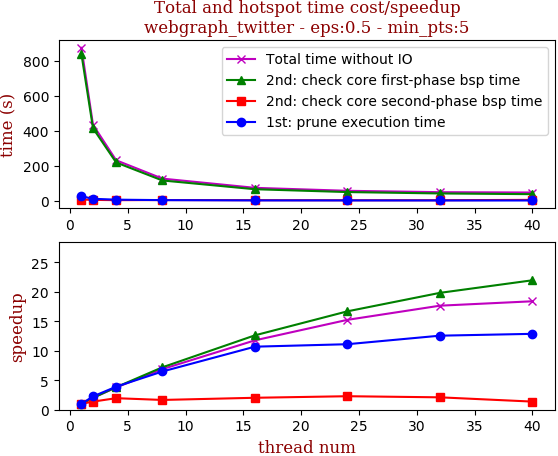

thread_num | prune | check-core 1st bsp | check-core 2nd bsp | cluster-core | cluster-non-core | total | total speedup
--- | --- | --- | --- | --- | --- | --- | ---
1 | 26.428s | 839.477s | 7.661s | 0.737s | 2.091s | 876.397s | 1.000
2 | 11.706s | 415.505s | 5.569s | 0.824s | 1.571s | 435.177s | 2.014
4 | 6.767s | 219.722s | 3.914s | 0.75s | 1.078s | 232.234s | 3.774
8 | 4.075s | 116.671s | 4.618s | 0.836s | 1.051s | 127.252s | 6.887
16 | 2.471s | 66.537s | 3.781s | 0.763s | 0.921s | 74.476s | 11.768
24 | 2.378s | 50.296s | 3.345s | 0.531s | 0.932s | 57.484s | 15.246
32 | 2.104s | 42.346s | 3.643s | 0.619s | 0.944s | 49.658s | 17.649
40 | 2.053s | 38.231s | 5.556s | 0.883s | 0.914s | 47.639s | 18.397

## eps:0.6

overview | speedup
--- | ---
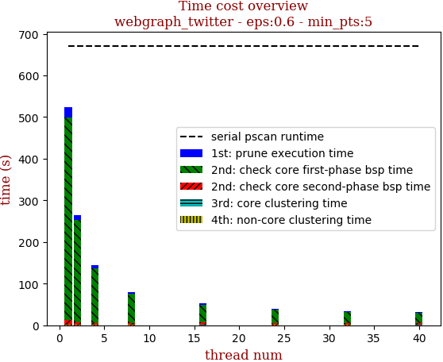 | 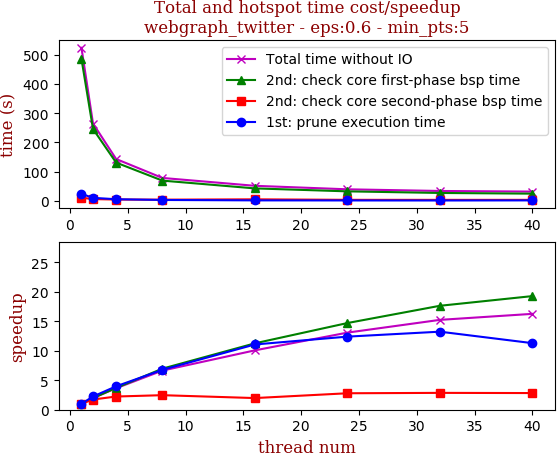

thread_num | prune | check-core 1st bsp | check-core 2nd bsp | cluster-core | cluster-non-core | total | total speedup
--- | --- | --- | --- | --- | --- | --- | ---
1 | 24.44s | 485.965s | 11.436s | 0.445s | 1.32s | 523.61s | 1.000
2 | 10.895s | 246.088s | 6.604s | 0.458s | 0.707s | 264.755s | 1.978
4 | 6.149s | 131.267s | 5.107s | 0.454s | 0.519s | 143.498s | 3.649
8 | 3.611s | 69.749s | 4.637s | 0.444s | 0.425s | 78.868s | 6.639
16 | 2.208s | 43.145s | 5.784s | 0.456s | 0.395s | 51.991s | 10.071
24 | 1.971s | 33.05s | 4.096s | 0.447s | 0.468s | 40.034s | 13.079
32 | 1.846s | 27.562s | 4.001s | 0.476s | 0.466s | 34.353s | 15.242
40 | 2.164s | 25.212s | 4.046s | 0.35s | 0.42s | 32.195s | 16.264

## eps:0.7

overview | speedup
--- | ---
 | 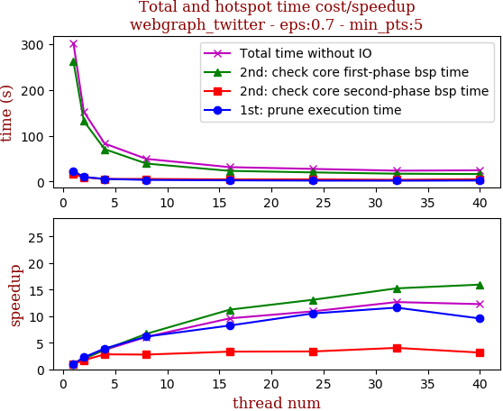

thread_num | prune | check-core 1st bsp | check-core 2nd bsp | cluster-core | cluster-non-core | total | total speedup
--- | --- | --- | --- | --- | --- | --- | ---
1 | 22.78s | 262.262s | 15.993s | 0.33s | 0.705s | 302.074s | 1.000
2 | 10.117s | 131.826s | 9.339s | 0.345s | 0.571s | 152.201s | 1.985
4 | 5.817s | 70.683s | 5.684s | 0.354s | 0.377s | 82.918s | 3.643
8 | 3.702s | 39.288s | 5.775s | 0.331s | 0.397s | 49.495s | 6.103
16 | 2.765s | 23.367s | 4.811s | 0.182s | 0.386s | 31.514s | 9.585
24 | 2.166s | 20.041s | 4.758s | 0.331s | 0.387s | 27.686s | 10.911
32 | 1.963s | 17.217s | 3.972s | 0.359s | 0.361s | 23.874s | 12.653
40 | 2.381s | 16.457s | 5.079s | 0.34s | 0.367s | 24.626s | 12.266

## eps:0.8

overview | speedup
--- | ---
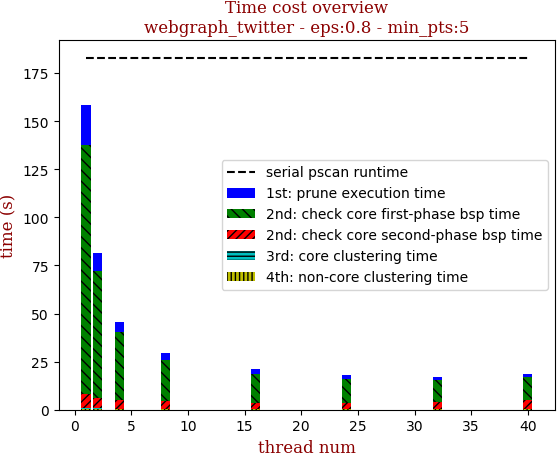 | 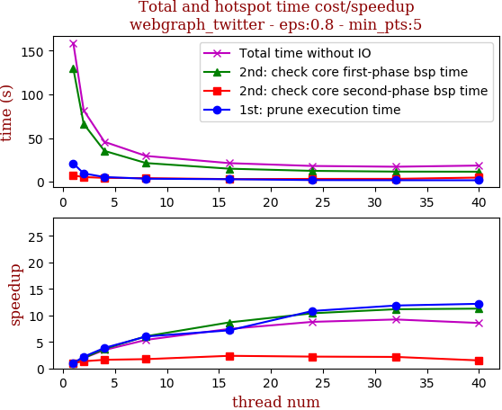

thread_num | prune | check-core 1st bsp | check-core 2nd bsp | cluster-core | cluster-non-core | total | total speedup
--- | --- | --- | --- | --- | --- | --- | ---
1 | 20.971s | 129.724s | 7.242s | 0.169s | 0.565s | 158.672s | 1.000
2 | 9.532s | 66.136s | 5.379s | 0.159s | 0.527s | 81.74s | 1.941
4 | 5.427s | 35.285s | 4.459s | 0.158s | 0.334s | 45.666s | 3.475
8 | 3.483s | 21.38s | 4.145s | 0.169s | 0.328s | 29.509s | 5.377
16 | 2.92s | 14.946s | 3.053s | 0.095s | 0.273s | 21.289s | 7.453
24 | 1.935s | 12.474s | 3.258s | 0.128s | 0.27s | 18.068s | 8.782
32 | 1.768s | 11.621s | 3.346s | 0.147s | 0.304s | 17.19s | 9.230
40 | 1.721s | 11.507s | 4.802s | 0.159s | 0.326s | 18.518s | 8.569

## eps:0.9

overview | speedup
--- | ---
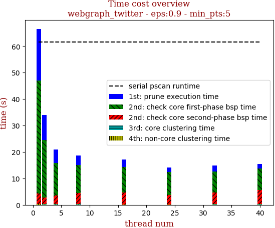 | 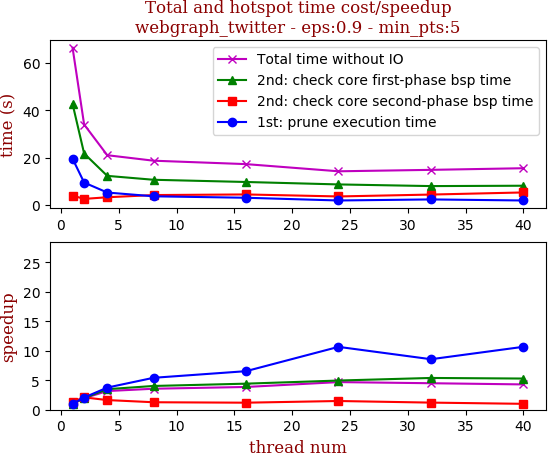

thread_num | prune | check-core 1st bsp | check-core 2nd bsp | cluster-core | cluster-non-core | total | total speedup
--- | --- | --- | --- | --- | --- | --- | ---
1 | 19.526s | 42.736s | 3.915s | 0.123s | 0.232s | 66.535s | 1.000
2 | 9.431s | 21.729s | 2.5s | 0.128s | 0.226s | 34.018s | 1.956
4 | 5.2s | 12.259s | 3.197s | 0.124s | 0.227s | 21.011s | 3.167
8 | 3.606s | 10.606s | 4.128s | 0.123s | 0.221s | 18.687s | 3.560
16 | 2.986s | 9.667s | 4.389s | 0.064s | 0.127s | 17.237s | 3.860
24 | 1.831s | 8.633s | 3.541s | 0.063s | 0.127s | 14.197s | 4.687
32 | 2.279s | 7.929s | 4.34s | 0.092s | 0.163s | 14.806s | 4.494
40 | 1.829s | 8.081s | 5.237s | 0.123s | 0.225s | 15.498s | 4.293

