## eps:0.1

overview | speedup
--- | ---
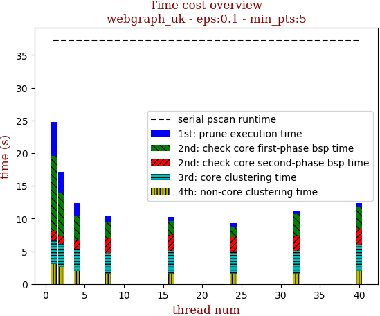 | 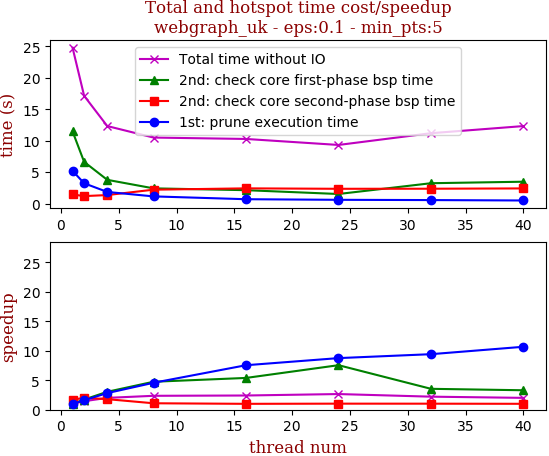

thread_num | prune | check-core 1st bsp | check-core 2nd bsp | cluster-core | cluster-non-core | total | total speedup
--- | --- | --- | --- | --- | --- | --- | ---
1 | 5.201s | 11.468s | 1.446s | 3.597s | 3.069s | 24.783s | 1.000
2 | 3.226s | 6.629s | 1.184s | 3.593s | 2.5s | 17.135s | 1.446
4 | 1.845s | 3.772s | 1.349s | 3.367s | 1.991s | 12.328s | 2.010
8 | 1.138s | 2.417s | 2.207s | 3.28s | 1.452s | 10.497s | 2.361
16 | 0.689s | 2.127s | 2.416s | 3.493s | 1.547s | 10.275s | 2.412
24 | 0.594s | 1.518s | 2.347s | 3.254s | 1.605s | 9.321s | 2.659
32 | 0.552s | 3.234s | 2.358s | 3.556s | 1.487s | 11.189s | 2.215
40 | 0.487s | 3.474s | 2.407s | 3.946s | 2.008s | 12.326s | 2.011

## eps:0.2

overview | speedup
--- | ---
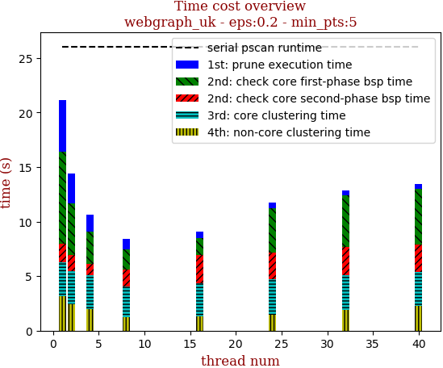 | 

thread_num | prune | check-core 1st bsp | check-core 2nd bsp | cluster-core | cluster-non-core | total | total speedup
--- | --- | --- | --- | --- | --- | --- | ---
1 | 4.732s | 8.397s | 1.756s | 3.036s | 3.198s | 21.122s | 1.000
2 | 2.709s | 4.793s | 1.426s | 3.052s | 2.433s | 14.415s | 1.465
4 | 1.555s | 2.98s | 1.02s | 3.123s | 1.994s | 10.674s | 1.979
8 | 0.963s | 1.902s | 1.539s | 2.82s | 1.222s | 8.449s | 2.500
16 | 0.596s | 1.516s | 2.647s | 2.992s | 1.326s | 9.08s | 2.326
24 | 0.555s | 4.035s | 2.472s | 3.264s | 1.444s | 11.776s | 1.794
32 | 0.406s | 4.745s | 2.573s | 3.18s | 1.926s | 12.835s | 1.646
40 | 0.401s | 5.116s | 2.515s | 3.107s | 2.274s | 13.417s | 1.574

## eps:0.3

overview | speedup
--- | ---
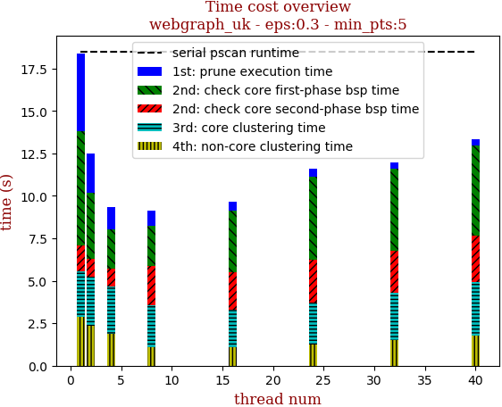 | 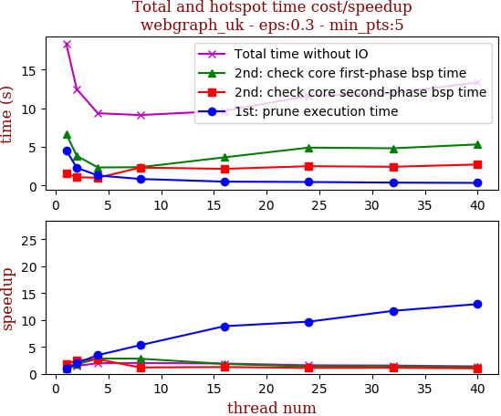

thread_num | prune | check-core 1st bsp | check-core 2nd bsp | cluster-core | cluster-non-core | total | total speedup
--- | --- | --- | --- | --- | --- | --- | ---
1 | 4.577s | 6.695s | 1.549s | 2.67s | 2.881s | 18.375s | 1.000
2 | 2.306s | 3.856s | 1.088s | 2.852s | 2.368s | 12.475s | 1.473
4 | 1.318s | 2.352s | 1.011s | 2.788s | 1.891s | 9.365s | 1.962
8 | 0.861s | 2.383s | 2.331s | 2.446s | 1.101s | 9.127s | 2.013
16 | 0.517s | 3.66s | 2.173s | 2.198s | 1.11s | 9.664s | 1.901
24 | 0.472s | 4.919s | 2.514s | 2.45s | 1.267s | 11.625s | 1.581
32 | 0.391s | 4.83s | 2.437s | 2.828s | 1.49s | 11.98s | 1.534
40 | 0.353s | 5.331s | 2.737s | 3.136s | 1.787s | 13.349s | 1.377

## eps:0.4

overview | speedup
--- | ---
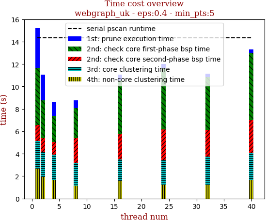 | 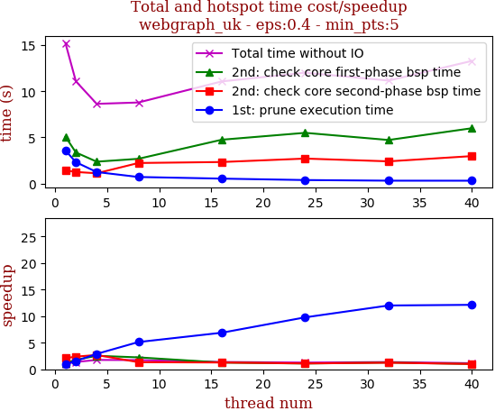

thread_num | prune | check-core 1st bsp | check-core 2nd bsp | cluster-core | cluster-non-core | total | total speedup
--- | --- | --- | --- | --- | --- | --- | ---
1 | 3.579s | 5.071s | 1.417s | 2.481s | 2.672s | 15.223s | 1.000
2 | 2.306s | 3.36s | 1.242s | 2.243s | 1.924s | 11.079s | 1.374
4 | 1.234s | 2.358s | 1.101s | 2.256s | 1.675s | 8.63s | 1.764
8 | 0.698s | 2.67s | 2.215s | 2.018s | 1.172s | 8.777s | 1.734
16 | 0.52s | 4.74s | 2.322s | 1.945s | 1.536s | 11.064s | 1.376
24 | 0.366s | 5.486s | 2.694s | 2.224s | 1.233s | 12.006s | 1.268
32 | 0.298s | 4.709s | 2.394s | 2.553s | 1.199s | 11.154s | 1.365
40 | 0.295s | 5.987s | 2.964s | 2.366s | 1.674s | 13.288s | 1.146

## eps:0.5

overview | speedup
--- | ---
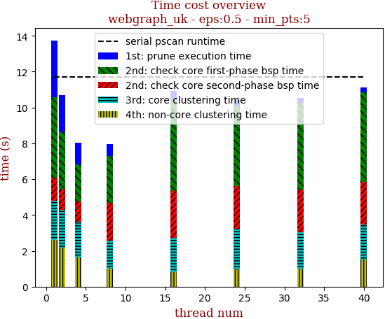 | 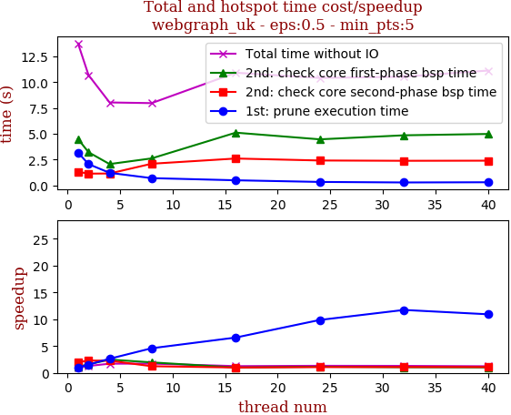

thread_num | prune | check-core 1st bsp | check-core 2nd bsp | cluster-core | cluster-non-core | total | total speedup
--- | --- | --- | --- | --- | --- | --- | ---
1 | 3.168s | 4.482s | 1.305s | 2.168s | 2.624s | 13.751s | 1.000
2 | 2.05s | 3.201s | 1.126s | 2.118s | 2.18s | 10.678s | 1.288
4 | 1.203s | 2.054s | 1.139s | 1.999s | 1.632s | 8.031s | 1.712
8 | 0.69s | 2.604s | 2.086s | 1.581s | 1.002s | 7.965s | 1.726
16 | 0.481s | 5.1s | 2.592s | 1.933s | 0.804s | 10.912s | 1.260
24 | 0.321s | 4.453s | 2.401s | 2.272s | 0.954s | 10.406s | 1.321
32 | 0.27s | 4.844s | 2.372s | 2.039s | 0.997s | 10.526s | 1.306
40 | 0.29s | 4.973s | 2.383s | 1.966s | 1.51s | 11.124s | 1.236

## eps:0.6

overview | speedup
--- | ---
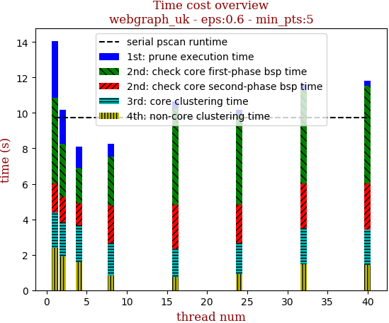 | 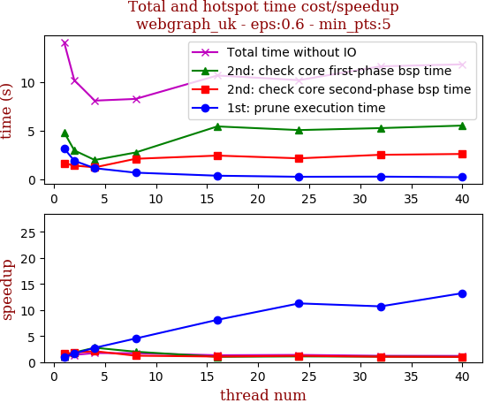

thread_num | prune | check-core 1st bsp | check-core 2nd bsp | cluster-core | cluster-non-core | total | total speedup
--- | --- | --- | --- | --- | --- | --- | ---
1 | 3.189s | 4.84s | 1.668s | 1.993s | 2.372s | 14.065s | 1.000
2 | 1.918s | 2.982s | 1.43s | 1.939s | 1.898s | 10.168s | 1.383
4 | 1.161s | 2.003s | 1.249s | 2.081s | 1.587s | 8.083s | 1.740
8 | 0.704s | 2.769s | 2.126s | 1.838s | 0.814s | 8.256s | 1.704
16 | 0.393s | 5.44s | 2.452s | 1.597s | 0.766s | 10.654s | 1.320
24 | 0.283s | 5.066s | 2.173s | 1.741s | 0.915s | 10.181s | 1.381
32 | 0.298s | 5.269s | 2.536s | 2.029s | 1.464s | 11.598s | 1.213
40 | 0.241s | 5.526s | 2.619s | 1.986s | 1.422s | 11.799s | 1.192

## eps:0.7

overview | speedup
--- | ---
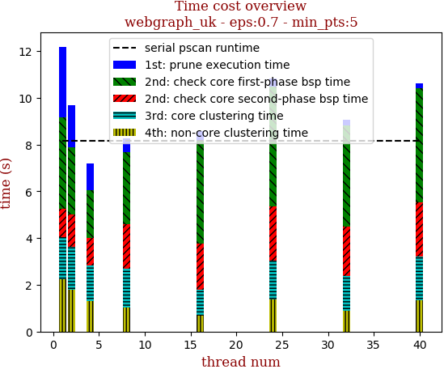 | 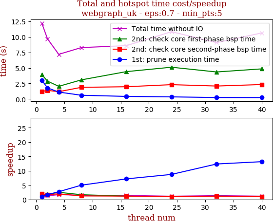

thread_num | prune | check-core 1st bsp | check-core 2nd bsp | cluster-core | cluster-non-core | total | total speedup
--- | --- | --- | --- | --- | --- | --- | ---
1 | 3.029s | 3.914s | 1.214s | 1.793s | 2.236s | 12.189s | 1.000
2 | 1.794s | 2.881s | 1.393s | 1.821s | 1.788s | 9.682s | 1.259
4 | 1.121s | 2.045s | 1.182s | 1.52s | 1.319s | 7.191s | 1.695
8 | 0.609s | 3.08s | 1.884s | 1.684s | 1.015s | 8.275s | 1.473
16 | 0.422s | 4.41s | 1.979s | 1.105s | 0.67s | 8.589s | 1.419
24 | 0.347s | 5.118s | 2.314s | 1.678s | 1.371s | 10.831s | 1.125
32 | 0.245s | 4.354s | 2.091s | 1.501s | 0.885s | 9.078s | 1.343
40 | 0.23s | 4.852s | 2.333s | 1.876s | 1.336s | 10.63s | 1.147

## eps:0.8

overview | speedup
--- | ---
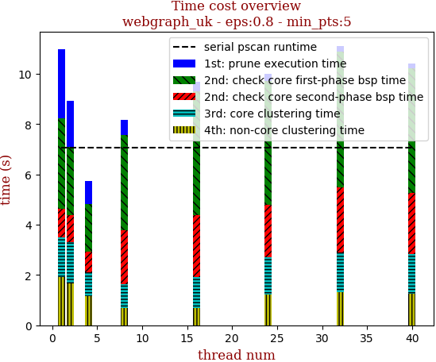 | 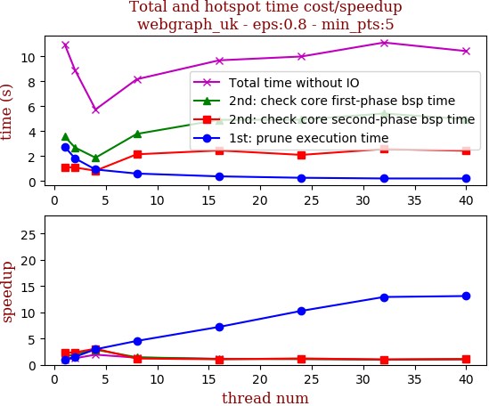

thread_num | prune | check-core 1st bsp | check-core 2nd bsp | cluster-core | cluster-non-core | total | total speedup
--- | --- | --- | --- | --- | --- | --- | ---
1 | 2.765s | 3.587s | 1.13s | 1.597s | 1.903s | 10.984s | 1.000
2 | 1.828s | 2.696s | 1.09s | 1.623s | 1.679s | 8.919s | 1.232
4 | 0.934s | 1.879s | 0.838s | 0.925s | 1.168s | 5.748s | 1.911
8 | 0.608s | 3.785s | 2.153s | 0.931s | 0.691s | 8.171s | 1.344
16 | 0.383s | 4.917s | 2.459s | 1.242s | 0.685s | 9.688s | 1.134
24 | 0.269s | 4.924s | 2.105s | 1.484s | 1.209s | 9.995s | 1.099
32 | 0.214s | 5.424s | 2.575s | 1.573s | 1.327s | 11.115s | 0.988
40 | 0.211s | 4.956s | 2.434s | 1.579s | 1.245s | 10.428s | 1.053

## eps:0.9

overview | speedup
--- | ---
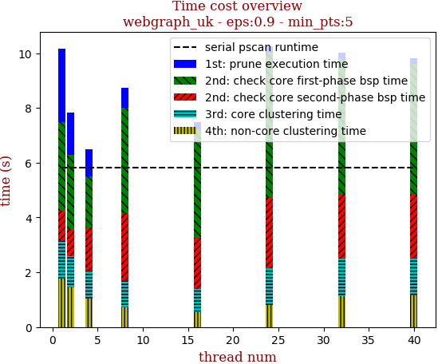 | 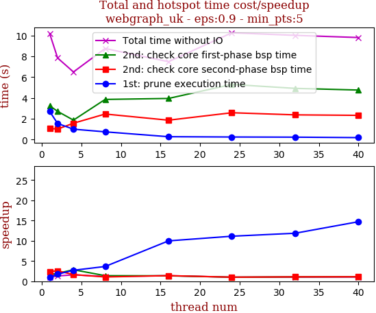

thread_num | prune | check-core 1st bsp | check-core 2nd bsp | cluster-core | cluster-non-core | total | total speedup
--- | --- | --- | --- | --- | --- | --- | ---
1 | 2.693s | 3.245s | 1.07s | 1.393s | 1.772s | 10.175s | 1.000
2 | 1.54s | 2.705s | 1.004s | 1.148s | 1.438s | 7.838s | 1.298
4 | 0.994s | 1.864s | 1.567s | 1.013s | 1.055s | 6.496s | 1.566
8 | 0.739s | 3.855s | 2.451s | 0.993s | 0.71s | 8.751s | 1.163
16 | 0.27s | 3.949s | 1.859s | 0.857s | 0.543s | 7.482s | 1.360
24 | 0.242s | 5.297s | 2.574s | 1.348s | 0.796s | 10.262s | 0.992
32 | 0.227s | 4.917s | 2.371s | 1.37s | 1.127s | 10.015s | 1.016
40 | 0.183s | 4.756s | 2.324s | 1.377s | 1.163s | 9.805s | 1.038

