## eps:0.1

overview | speedup
--- | ---
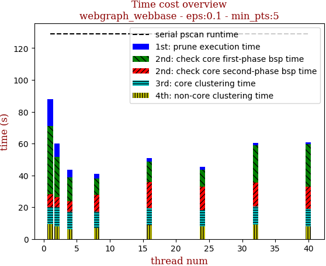 | 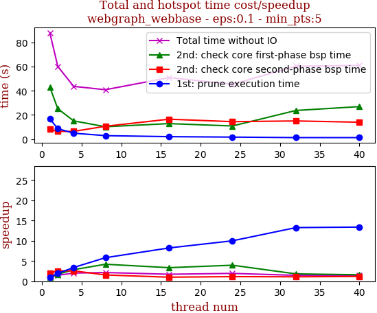

thread_num | prune | check-core 1st bsp | check-core 2nd bsp | cluster-core | cluster-non-core | total | total speedup
--- | --- | --- | --- | --- | --- | --- | ---
1 | 16.756s | 43.061s | 8.123s | 10.617s | 9.407s | 87.967s | 1.000
2 | 8.644s | 25.186s | 6.41s | 11.932s | 7.982s | 60.157s | 1.462
4 | 4.93s | 15.089s | 6.403s | 10.991s | 6.217s | 43.635s | 2.016
8 | 2.881s | 10.254s | 10.64s | 10.131s | 6.955s | 40.864s | 2.153
16 | 2.037s | 12.837s | 16.492s | 10.771s | 8.733s | 50.875s | 1.729
24 | 1.677s | 10.877s | 14.45s | 10.567s | 7.818s | 45.393s | 1.938
32 | 1.264s | 23.706s | 15.038s | 11.354s | 8.927s | 60.298s | 1.459
40 | 1.252s | 26.904s | 13.983s | 10.724s | 8.087s | 60.953s | 1.443

## eps:0.2

overview | speedup
--- | ---
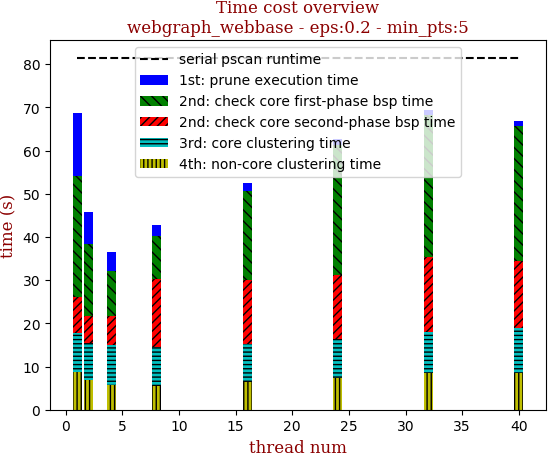 | 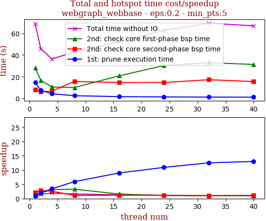

thread_num | prune | check-core 1st bsp | check-core 2nd bsp | cluster-core | cluster-non-core | total | total speedup
--- | --- | --- | --- | --- | --- | --- | ---
1 | 14.638s | 28.063s | 8.216s | 9.064s | 8.784s | 68.768s | 1.000
2 | 7.522s | 16.58s | 6.195s | 8.702s | 6.787s | 45.79s | 1.502
4 | 4.261s | 10.525s | 6.687s | 9.11s | 5.809s | 36.395s | 1.889
8 | 2.47s | 9.988s | 15.603s | 9.173s | 5.436s | 42.676s | 1.611
16 | 1.631s | 20.822s | 14.632s | 8.887s | 6.396s | 52.372s | 1.313
24 | 1.341s | 30.24s | 14.626s | 9.18s | 7.267s | 62.658s | 1.098
32 | 1.17s | 32.935s | 17.219s | 9.473s | 8.56s | 69.362s | 0.991
40 | 1.127s | 31.289s | 15.489s | 10.551s | 8.418s | 66.877s | 1.028

## eps:0.3

overview | speedup
--- | ---
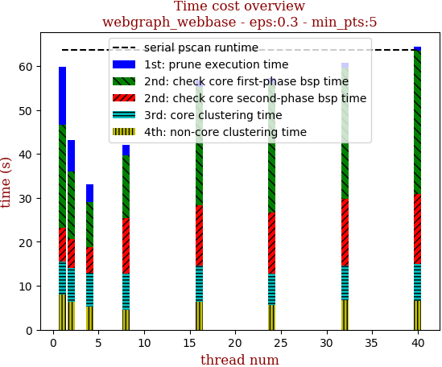 | 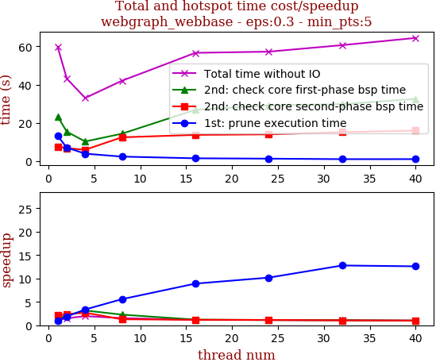

thread_num | prune | check-core 1st bsp | check-core 2nd bsp | cluster-core | cluster-non-core | total | total speedup
--- | --- | --- | --- | --- | --- | --- | ---
1 | 13.198s | 23.345s | 7.641s | 7.509s | 8.066s | 59.761s | 1.000
2 | 7.054s | 15.375s | 6.748s | 7.559s | 6.398s | 43.136s | 1.385
4 | 3.91s | 10.282s | 5.952s | 7.573s | 5.315s | 33.033s | 1.809
8 | 2.368s | 14.345s | 12.465s | 8.237s | 4.611s | 42.028s | 1.422
16 | 1.483s | 26.845s | 13.72s | 8.254s | 6.323s | 56.627s | 1.055
24 | 1.296s | 29.186s | 14.014s | 7.07s | 5.678s | 57.247s | 1.044
32 | 1.033s | 29.792s | 15.162s | 7.974s | 6.69s | 60.654s | 0.985
40 | 1.048s | 32.527s | 15.973s | 8.323s | 6.558s | 64.431s | 0.928

## eps:0.4

overview | speedup
--- | ---
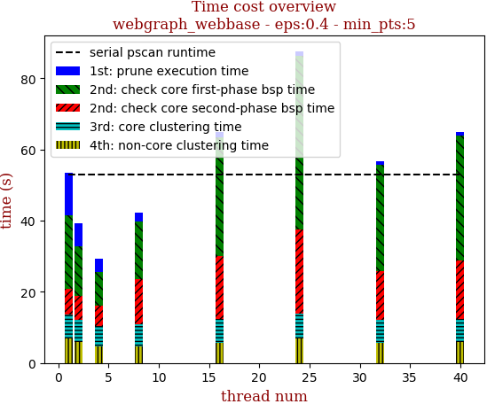 | 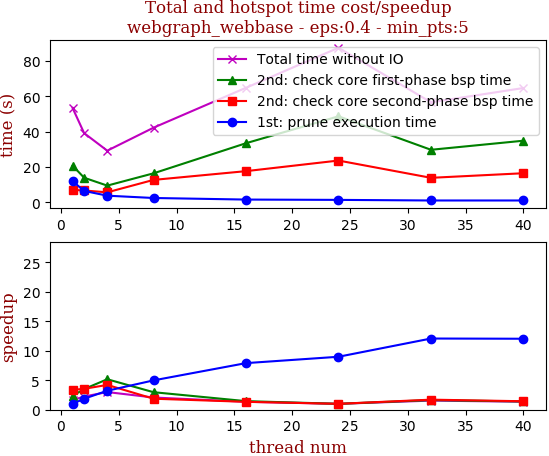

thread_num | prune | check-core 1st bsp | check-core 2nd bsp | cluster-core | cluster-non-core | total | total speedup
--- | --- | --- | --- | --- | --- | --- | ---
1 | 11.969s | 20.749s | 7.017s | 6.826s | 6.907s | 53.47s | 1.000
2 | 6.412s | 13.89s | 6.66s | 6.403s | 5.817s | 39.184s | 1.365
4 | 3.718s | 9.426s | 5.617s | 5.839s | 4.631s | 29.235s | 1.829
8 | 2.405s | 16.389s | 12.662s | 6.272s | 4.539s | 42.271s | 1.265
16 | 1.514s | 33.467s | 17.628s | 6.562s | 5.733s | 64.907s | 0.824
24 | 1.332s | 48.712s | 23.641s | 6.964s | 6.946s | 87.598s | 0.610
32 | 0.991s | 29.741s | 13.842s | 6.5s | 5.593s | 56.669s | 0.944
40 | 0.994s | 34.89s | 16.448s | 6.642s | 5.788s | 64.764s | 0.826

## eps:0.5

overview | speedup
--- | ---
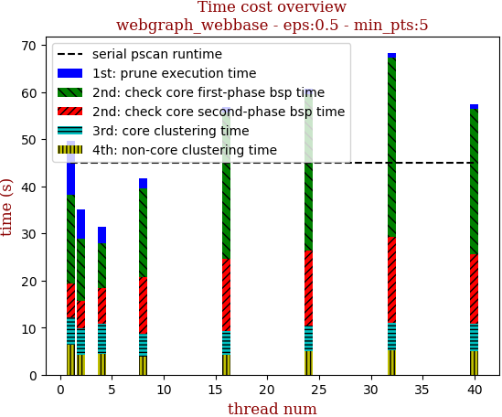 | 

thread_num | prune | check-core 1st bsp | check-core 2nd bsp | cluster-core | cluster-non-core | total | total speedup
--- | --- | --- | --- | --- | --- | --- | ---
1 | 11.453s | 18.864s | 7.252s | 5.707s | 6.43s | 49.709s | 1.000
2 | 6.09s | 13.269s | 5.795s | 5.582s | 4.309s | 35.047s | 1.418
4 | 3.486s | 9.592s | 7.525s | 6.411s | 4.45s | 31.466s | 1.580
8 | 2.096s | 18.902s | 11.997s | 4.891s | 3.739s | 41.626s | 1.194
16 | 1.19s | 30.967s | 15.286s | 5.038s | 4.278s | 56.763s | 0.876
24 | 1.192s | 33.039s | 15.948s | 5.574s | 4.907s | 60.662s | 0.819
32 | 1.04s | 38.034s | 18.228s | 5.753s | 5.262s | 68.32s | 0.728
40 | 0.884s | 30.907s | 14.681s | 6.0s | 4.905s | 57.38s | 0.866

## eps:0.6

overview | speedup
--- | ---
 | 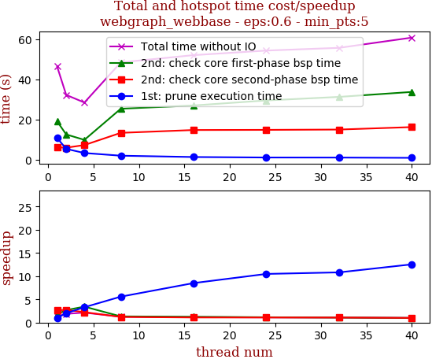

thread_num | prune | check-core 1st bsp | check-core 2nd bsp | cluster-core | cluster-non-core | total | total speedup
--- | --- | --- | --- | --- | --- | --- | ---
1 | 10.764s | 19.038s | 6.1s | 4.704s | 5.707s | 46.316s | 1.000
2 | 5.325s | 12.499s | 5.915s | 4.178s | 4.257s | 32.176s | 1.439
4 | 3.257s | 9.804s | 7.216s | 4.171s | 3.93s | 28.38s | 1.632
8 | 1.928s | 25.29s | 13.301s | 4.373s | 3.47s | 48.365s | 0.958
16 | 1.265s | 26.924s | 14.703s | 4.922s | 4.153s | 51.968s | 0.891
24 | 1.027s | 29.427s | 14.775s | 4.81s | 4.206s | 54.248s | 0.854
32 | 0.995s | 31.194s | 14.937s | 4.749s | 3.724s | 55.602s | 0.833
40 | 0.858s | 33.662s | 16.163s | 5.766s | 4.246s | 60.697s | 0.763

## eps:0.7

overview | speedup
--- | ---
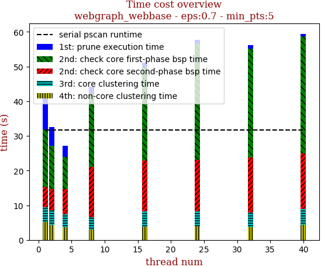 | 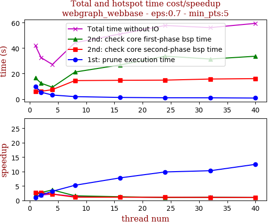

thread_num | prune | check-core 1st bsp | check-core 2nd bsp | cluster-core | cluster-non-core | total | total speedup
--- | --- | --- | --- | --- | --- | --- | ---
1 | 9.972s | 16.615s | 5.913s | 4.15s | 5.232s | 41.884s | 1.000
2 | 5.372s | 12.468s | 6.088s | 4.293s | 4.325s | 32.549s | 1.287
4 | 3.172s | 9.287s | 7.395s | 3.585s | 3.726s | 27.169s | 1.542
8 | 1.903s | 21.202s | 14.512s | 3.568s | 3.049s | 44.237s | 0.947
16 | 1.278s | 26.805s | 14.734s | 4.387s | 3.875s | 51.081s | 0.820
24 | 1.011s | 33.667s | 14.871s | 4.288s | 3.926s | 57.766s | 0.725
32 | 0.969s | 31.441s | 15.722s | 4.256s | 3.716s | 56.106s | 0.747
40 | 0.798s | 33.63s | 16.037s | 4.598s | 4.375s | 59.441s | 0.705

## eps:0.8

overview | speedup
--- | ---
 | 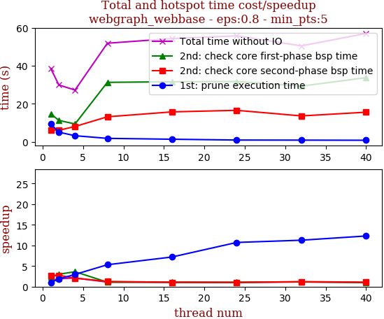

thread_num | prune | check-core 1st bsp | check-core 2nd bsp | cluster-core | cluster-non-core | total | total speedup
--- | --- | --- | --- | --- | --- | --- | ---
1 | 9.321s | 14.669s | 6.076s | 3.484s | 4.991s | 38.543s | 1.000
2 | 5.011s | 11.224s | 6.01s | 3.621s | 4.002s | 29.871s | 1.290
4 | 3.147s | 9.328s | 8.007s | 3.249s | 3.443s | 27.179s | 1.418
8 | 1.756s | 31.241s | 13.11s | 3.217s | 2.516s | 51.843s | 0.743
16 | 1.297s | 31.545s | 15.697s | 3.348s | 2.391s | 54.28s | 0.710
24 | 0.87s | 31.677s | 16.511s | 3.614s | 3.053s | 55.728s | 0.692
32 | 0.828s | 29.265s | 13.571s | 3.719s | 3.061s | 50.446s | 0.764
40 | 0.759s | 33.698s | 15.527s | 3.733s | 3.286s | 57.006s | 0.676

## eps:0.9

overview | speedup
--- | ---
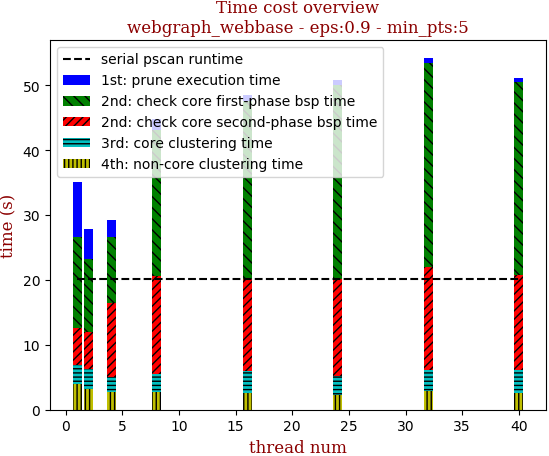 | 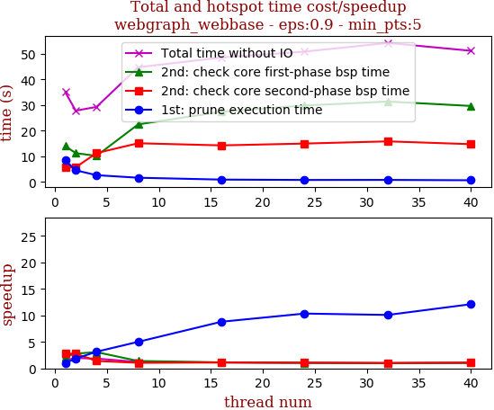

thread_num | prune | check-core 1st bsp | check-core 2nd bsp | cluster-core | cluster-non-core | total | total speedup
--- | --- | --- | --- | --- | --- | --- | ---
1 | 8.431s | 14.043s | 5.65s | 3.015s | 3.92s | 35.061s | 1.000
2 | 4.591s | 11.275s | 5.747s | 3.07s | 3.146s | 27.836s | 1.260
4 | 2.678s | 10.206s | 11.306s | 2.389s | 2.73s | 29.311s | 1.196
8 | 1.683s | 22.49s | 15.135s | 2.807s | 2.656s | 44.774s | 0.783
16 | 0.958s | 27.421s | 14.298s | 3.264s | 2.633s | 48.58s | 0.722
24 | 0.815s | 29.847s | 15.014s | 3.001s | 2.198s | 50.877s | 0.689
32 | 0.836s | 31.399s | 15.868s | 3.327s | 2.826s | 54.258s | 0.646
40 | 0.696s | 29.679s | 14.777s | 3.419s | 2.627s | 51.202s | 0.685

