dataset | scalability link
--- | ---
small_snap_dblp | [small_snap_dblp.md](small_snap_dblp.md)
snap_pokec | [snap_pokec.md](snap_pokec.md)
snap_livejournal | [snap_livejournal.md](snap_livejournal.md)
snap_orkut | [snap_orkut.md](snap_orkut.md)
webgraph_uk | [webgraph_uk.md](webgraph_uk.md)
webgraph_webbase | [webgraph_webbase.md](webgraph_webbase.md)
webgraph_twitter | [webgraph_twitter.md](webgraph_twitter.md)
snap_friendster | [snap_friendster.md](snap_friendster.md)

## eps:0.1

with 40 full logical threads | with best thread num
--- | ---
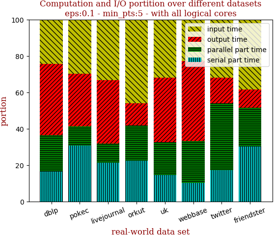 | 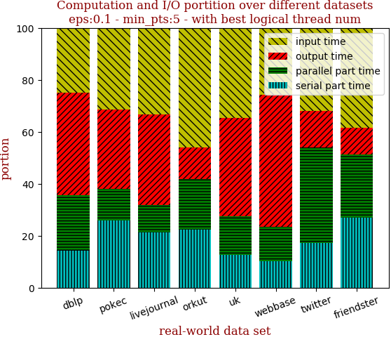

with 40 full logical threads | with best thread num
--- | ---
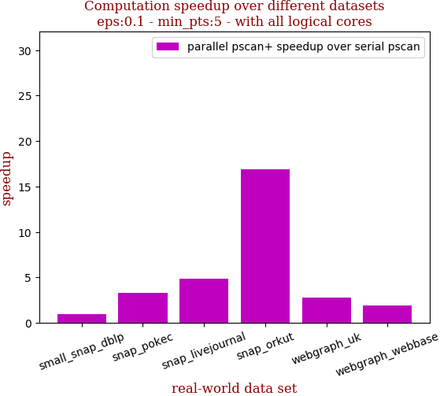 | 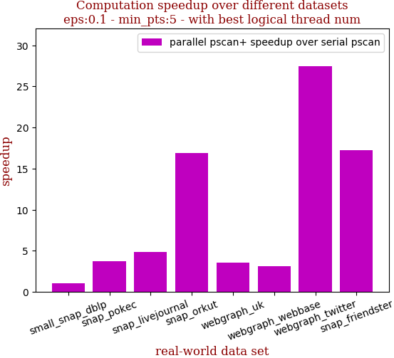

```zsh
best performance thread_num_lst:[4, 16, 40, 40, 8, 8, 40, 32]
```

dataset | edge num | pscan runtime | pscan+ 40 logical-core full speedup | pscan+ best thread_num speedup | thread_num choice
--- | --- | --- | --- | --- | ---
small_snap_dblp | 2,099,732 | 0.318s | 0.970 | 1.010 | 4
snap_pokec | 30,282,866 | 6.925s | 3.262 | 3.741 | 16
snap_livejournal | 69,362,378 | 16.088s | 4.871 | 4.871 | 40
snap_orkut | 234,370,166 | 149.207s | 16.917 | 16.917 | 40
webgraph_uk | 301,136,554 | 37.3s | 2.754 | 3.550 | 8
webgraph_webbase | 1,050,026,736 | 129.071s | 1.917 | 3.081 | 8
webgraph_twitter | 1,369,000,750 | 2223.316s | 27.434 | 27.434 | 40
snap_friendster | 3,612,134,270 | 4959.734s | 17.165 | 17.251 | 32

## eps:0.2

with 40 full logical threads | with best thread num
--- | ---
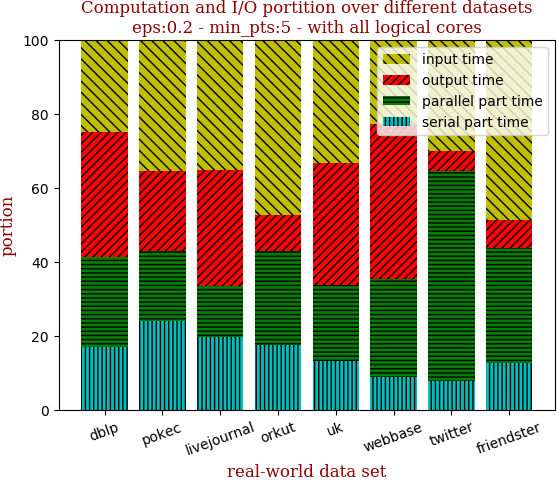 | 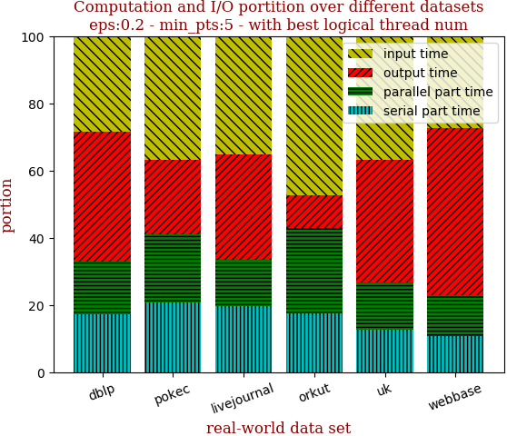

with 40 full logical threads | with best thread num
--- | ---
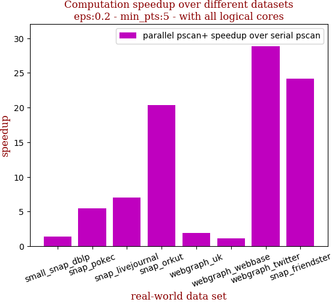 | 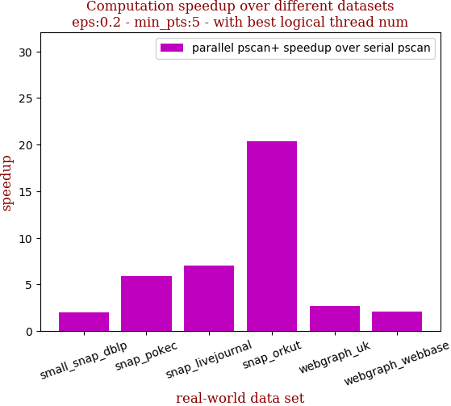

```zsh
best performance thread_num_lst:[4, 32, 40, 40, 8, 4, 40, 40]
```

dataset | edge num | pscan runtime | pscan+ 40 logical-core full speedup | pscan+ best thread_num speedup | thread_num choice
--- | --- | --- | --- | --- | ---
small_snap_dblp | 2,099,732 | 0.504s | 1.392 | 1.992 | 4
snap_pokec | 30,282,866 | 10.004s | 5.422 | 5.892 | 32
snap_livejournal | 69,362,378 | 23.072s | 6.992 | 6.992 | 40
snap_orkut | 234,370,166 | 179.55s | 20.329 | 20.329 | 40
webgraph_uk | 301,136,554 | 26.048s | 1.930 | 2.711 | 8
webgraph_webbase | 1,050,026,736 | 81.475s | 1.145 | 2.111 | 4
webgraph_twitter | 1,369,000,750 | 2973.869s | 28.823 | 28.823 | 40
snap_friendster | 3,612,134,270 | 4673.88s | 24.184 | 24.184 | 40

## eps:0.3

with 40 full logical threads | with best thread num
--- | ---
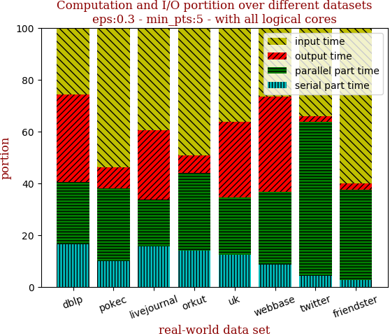 | 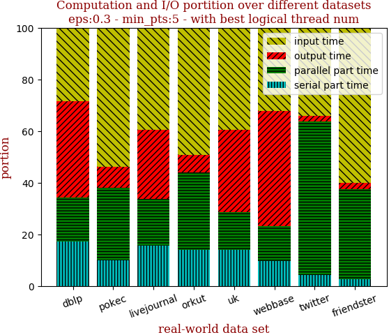

with 40 full logical threads | with best thread num
--- | ---
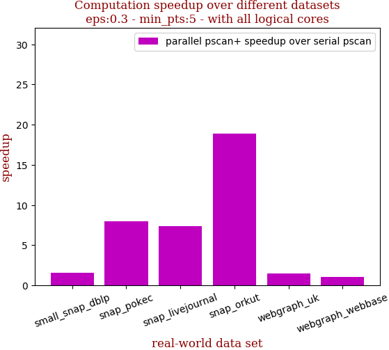 | 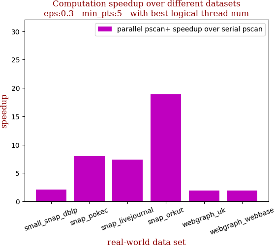

```zsh
best performance thread_num_lst:[4, 40, 40, 40, 4, 4, 40, 40]
```

dataset | edge num | pscan runtime | pscan+ 40 logical-core full speedup | pscan+ best thread_num speedup | thread_num choice
--- | --- | --- | --- | --- | ---
small_snap_dblp | 2,099,732 | 0.555s | 1.604 | 2.094 | 4
snap_pokec | 30,282,866 | 8.597s | 7.968 | 7.968 | 40
snap_livejournal | 69,362,378 | 21.846s | 7.385 | 7.385 | 40
snap_orkut | 234,370,166 | 164.248s | 18.918 | 18.918 | 40
webgraph_uk | 301,136,554 | 18.498s | 1.462 | 1.934 | 4
webgraph_webbase | 1,050,026,736 | 63.705s | 1.003 | 1.922 | 4
webgraph_twitter | 1,369,000,750 | 2487.317s | 27.744 | 27.744 | 40
snap_friendster | 3,612,134,270 | 3726.302s | 27.792 | 27.792 | 40

## eps:0.4

with 40 full logical threads | with best thread num
--- | ---
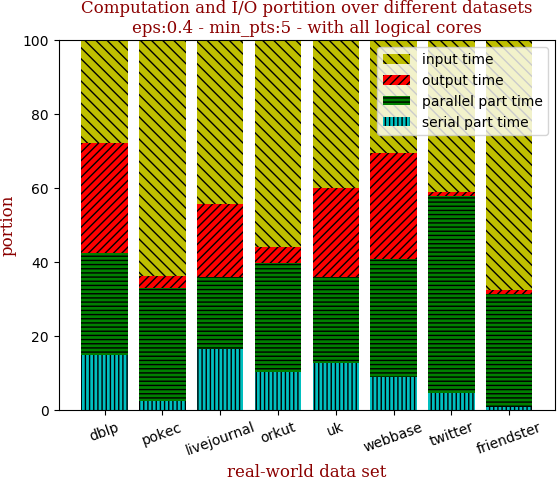 | 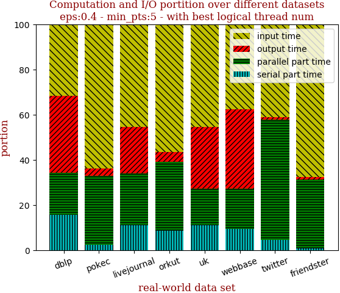

with 40 full logical threads | with best thread num
--- | ---
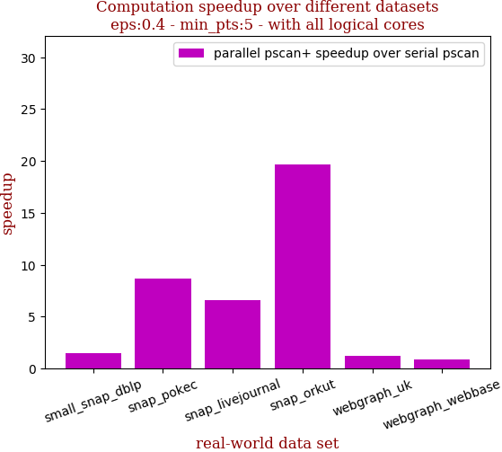 | 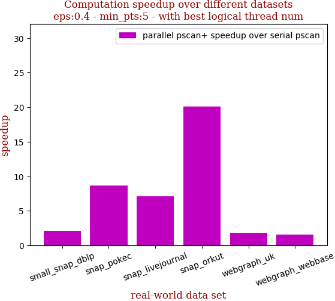

```zsh
best performance thread_num_lst:[8, 40, 24, 32, 8, 4, 40, 40]
```

dataset | edge num | pscan runtime | pscan+ 40 logical-core full speedup | pscan+ best thread_num speedup | thread_num choice
--- | --- | --- | --- | --- | ---
small_snap_dblp | 2,099,732 | 0.491s | 1.470 | 2.054 | 8
snap_pokec | 30,282,866 | 6.82s | 8.633 | 8.633 | 40
snap_livejournal | 69,362,378 | 18.37s | 6.575 | 7.095 | 24
snap_orkut | 234,370,166 | 135.772s | 19.697 | 20.129 | 32
webgraph_uk | 301,136,554 | 14.356s | 1.208 | 1.808 | 8
webgraph_webbase | 1,050,026,736 | 52.978s | 0.864 | 1.593 | 4
webgraph_twitter | 1,369,000,750 | 1712.815s | 25.416 | 25.416 | 40
snap_friendster | 3,612,134,270 | 2801.607s | 28.095 | 28.095 | 40

## eps:0.5

with 40 full logical threads | with best thread num
--- | ---
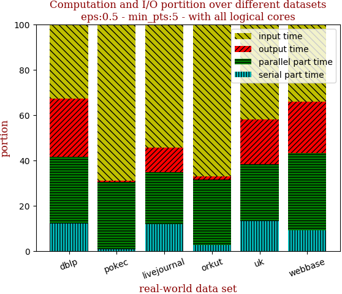 | 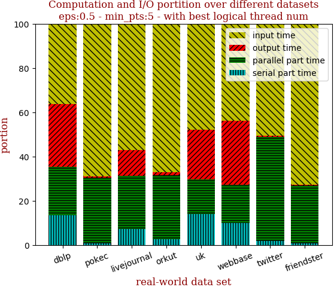

with 40 full logical threads | with best thread num
--- | ---
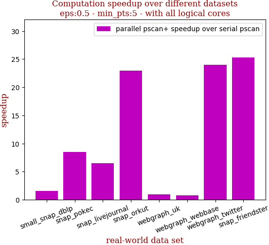 | 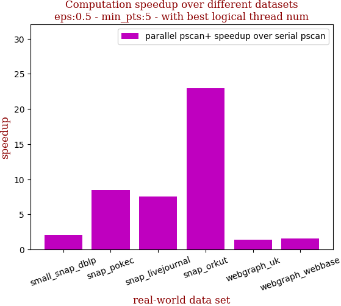

```zsh
best performance thread_num_lst:[4, 40, 24, 40, 4, 4, 40, 40]
```

dataset | edge num | pscan runtime | pscan+ 40 logical-core full speedup | pscan+ best thread_num speedup | thread_num choice
--- | --- | --- | --- | --- | ---
small_snap_dblp | 2,099,732 | 0.441s | 1.586 | 2.061 | 4
snap_pokec | 30,282,866 | 5.709s | 8.470 | 8.470 | 40
snap_livejournal | 69,362,378 | 14.317s | 6.475 | 7.527 | 24
snap_orkut | 234,370,166 | 105.36s | 22.954 | 22.954 | 40
webgraph_uk | 301,136,554 | 11.721s | 0.968 | 1.429 | 4
webgraph_webbase | 1,050,026,736 | 45.006s | 0.774 | 1.568 | 4
webgraph_twitter | 1,369,000,750 | 1112.027s | 23.960 | 23.960 | 40
snap_friendster | 3,612,134,270 | 2019.334s | 25.322 | 25.322 | 40

## eps:0.6

with 40 full logical threads | with best thread num
--- | ---
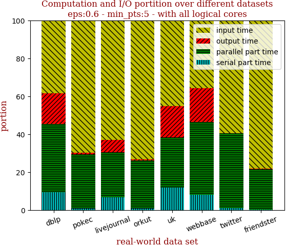 | 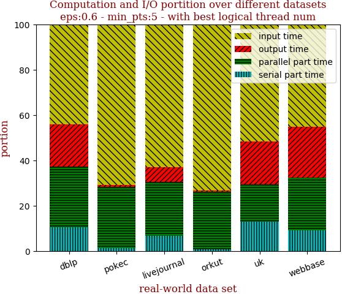

with 40 full logical threads | with best thread num
--- | ---
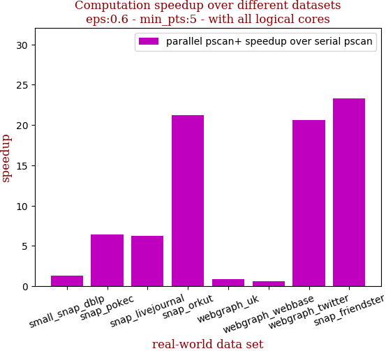 | 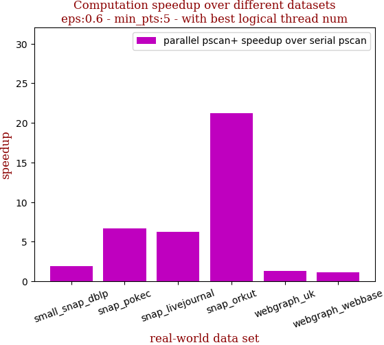

```zsh
best performance thread_num_lst:[4, 32, 40, 40, 4, 4, 40, 40]
```

dataset | edge num | pscan runtime | pscan+ 40 logical-core full speedup | pscan+ best thread_num speedup | thread_num choice
--- | --- | --- | --- | --- | ---
small_snap_dblp | 2,099,732 | 0.346s | 1.336 | 1.870 | 4
snap_pokec | 30,282,866 | 4.122s | 6.381 | 6.713 | 32
snap_livejournal | 69,362,378 | 10.49s | 6.263 | 6.263 | 40
snap_orkut | 234,370,166 | 73.887s | 21.250 | 21.250 | 40
webgraph_uk | 301,136,554 | 9.737s | 0.865 | 1.295 | 4
webgraph_webbase | 1,050,026,736 | 37.624s | 0.628 | 1.142 | 4
webgraph_twitter | 1,369,000,750 | 671.103s | 20.577 | 20.577 | 40
snap_friendster | 3,612,134,270 | 1382.493s | 23.328 | 23.328 | 40

## eps:0.7

with 40 full logical threads | with best thread num
--- | ---
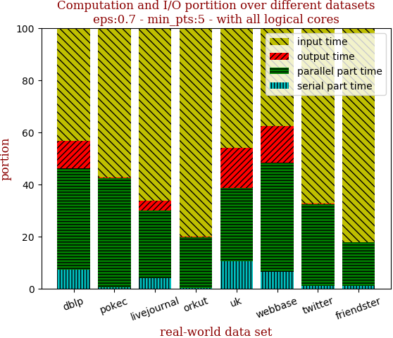 | 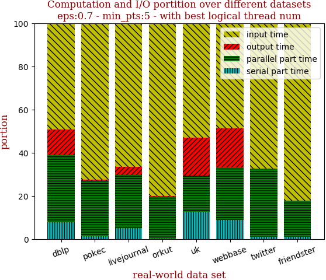

with 40 full logical threads | with best thread num
--- | ---
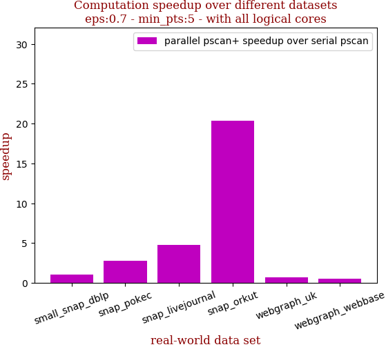 | 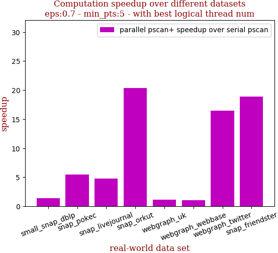

```zsh
best performance thread_num_lst:[4, 24, 32, 40, 4, 4, 40, 40]
```

dataset | edge num | pscan runtime | pscan+ 40 logical-core full speedup | pscan+ best thread_num speedup | thread_num choice
--- | --- | --- | --- | --- | ---
small_snap_dblp | 2,099,732 | 0.245s | 1.052 | 1.416 | 4
snap_pokec | 30,282,866 | 3.098s | 2.756 | 5.445 | 24
snap_livejournal | 69,362,378 | 7.404s | 4.755 | 4.802 | 32
snap_orkut | 234,370,166 | 48.46s | 20.310 | 20.310 | 40
webgraph_uk | 301,136,554 | 8.152s | 0.735 | 1.109 | 4
webgraph_webbase | 1,050,026,736 | 31.675s | 0.535 | 1.011 | 4
webgraph_twitter | 1,369,000,750 | 378.662s | 16.422 | 16.422 | 40
snap_friendster | 3,612,134,270 | 881.861s | 18.898 | 18.898 | 40

## eps:0.8

with 40 full logical threads | with best thread num
--- | ---
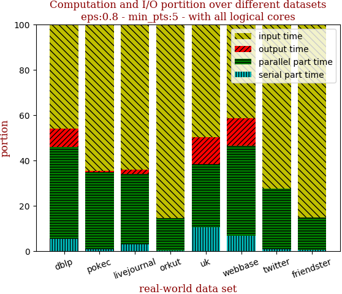 | 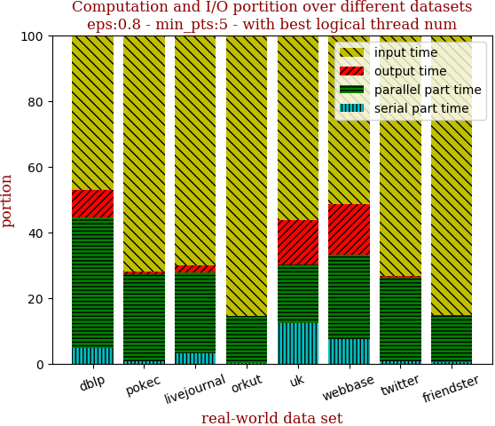

with 40 full logical threads | with best thread num
--- | ---
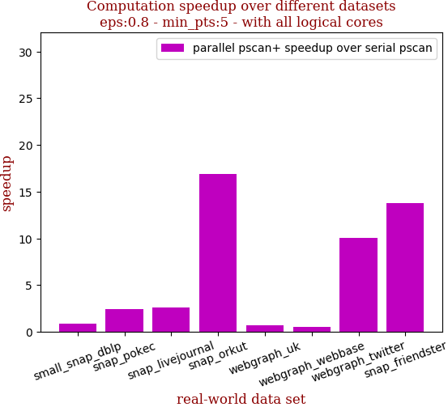 | 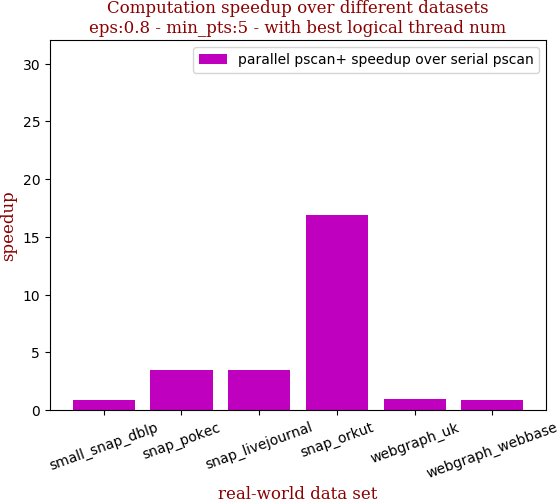

```zsh
best performance thread_num_lst:[4, 16, 16, 40, 4, 4, 32, 40]
```

dataset | edge num | pscan runtime | pscan+ 40 logical-core full speedup | pscan+ best thread_num speedup | thread_num choice
--- | --- | --- | --- | --- | ---
small_snap_dblp | 2,099,732 | 0.183s | 0.836 | 0.880 | 4
snap_pokec | 30,282,866 | 2.009s | 2.444 | 3.458 | 16
snap_livejournal | 69,362,378 | 4.797s | 2.606 | 3.501 | 16
snap_orkut | 234,370,166 | 27.708s | 16.854 | 16.854 | 40
webgraph_uk | 301,136,554 | 7.054s | 0.690 | 0.992 | 4
webgraph_webbase | 1,050,026,736 | 25.399s | 0.492 | 0.854 | 4
webgraph_twitter | 1,369,000,750 | 183.012s | 10.090 | 10.590 | 32
snap_friendster | 3,612,134,270 | 509.733s | 13.746 | 13.746 | 40

## eps:0.9

with 40 full logical threads | with best thread num
--- | ---
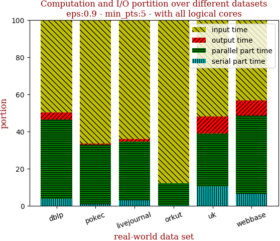 | 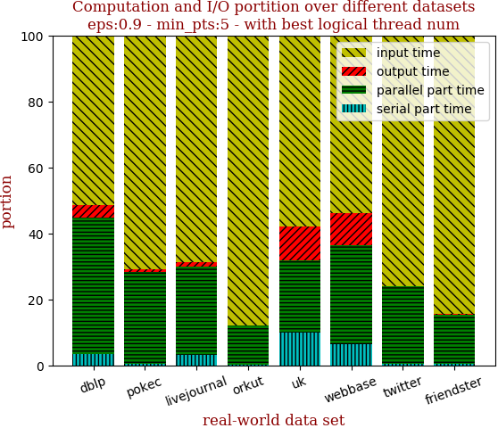

with 40 full logical threads | with best thread num
--- | ---
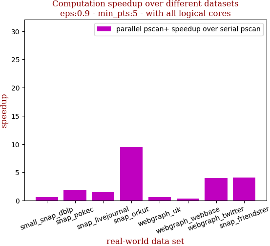 | 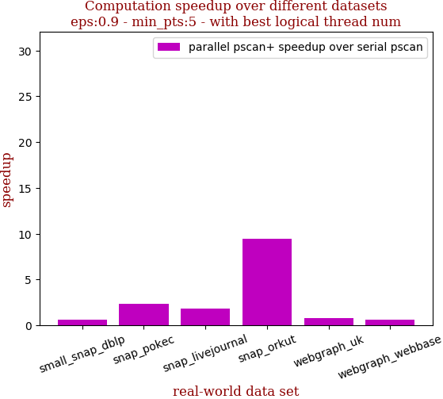

```zsh
best performance thread_num_lst:[4, 4, 4, 40, 4, 4, 32, 24]
```

dataset | edge num | pscan runtime | pscan+ 40 logical-core full speedup | pscan+ best thread_num speedup | thread_num choice
--- | --- | --- | --- | --- | ---
small_snap_dblp | 2,099,732 | 0.121s | 0.590 | 0.630 | 4
snap_pokec | 30,282,866 | 1.453s | 1.922 | 2.374 | 4
snap_livejournal | 69,362,378 | 2.753s | 1.477 | 1.824 | 4
snap_orkut | 234,370,166 | 12.535s | 9.439 | 9.439 | 40
webgraph_uk | 301,136,554 | 5.814s | 0.583 | 0.798 | 4
webgraph_webbase | 1,050,026,736 | 20.091s | 0.389 | 0.645 | 4
webgraph_twitter | 1,369,000,750 | 61.578s | 3.978 | 4.075 | 32
snap_friendster | 3,612,134,270 | 245.702s | 4.099 | 6.240 | 24

