## eps:0.1

overview | speedup
--- | ---
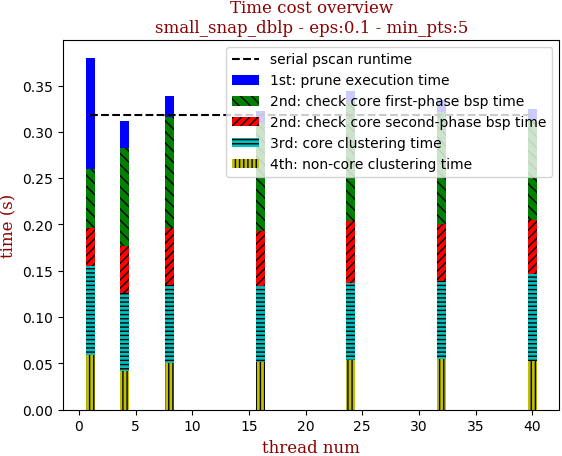 | 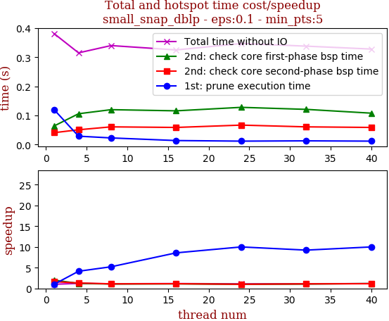

thread_num | prune | check-core 1st bsp | check-core 2nd bsp | cluster-core | cluster-non-core | total | total speedup
--- | --- | --- | --- | --- | --- | --- | ---
1 | 0.12s | 0.064s | 0.041s | 0.096s | 0.059s | 0.381s | 1.000
4 | 0.029s | 0.106s | 0.051s | 0.084s | 0.042s | 0.315s | 1.210
8 | 0.023s | 0.12s | 0.061s | 0.085s | 0.05s | 0.34s | 1.121
16 | 0.014s | 0.116s | 0.059s | 0.083s | 0.051s | 0.325s | 1.172
24 | 0.012s | 0.128s | 0.067s | 0.083s | 0.054s | 0.347s | 1.098
32 | 0.013s | 0.121s | 0.061s | 0.084s | 0.055s | 0.338s | 1.127
40 | 0.012s | 0.108s | 0.059s | 0.093s | 0.053s | 0.328s | 1.162

## eps:0.2

overview | speedup
--- | ---
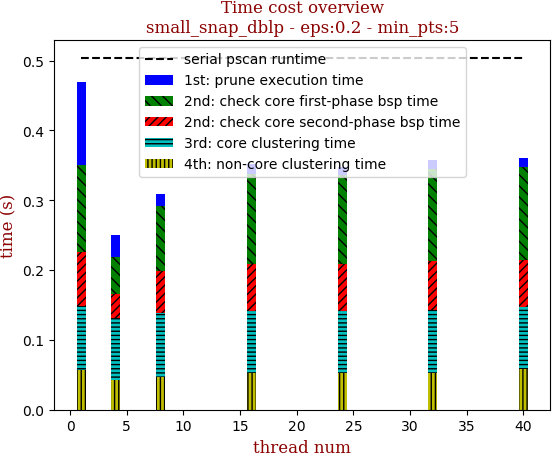 | 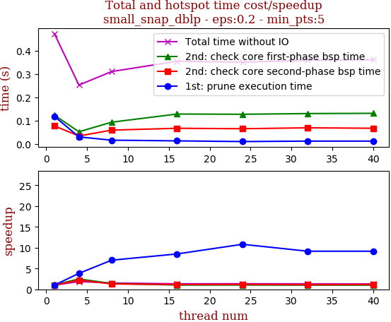

thread_num | prune | check-core 1st bsp | check-core 2nd bsp | cluster-core | cluster-non-core | total | total speedup
--- | --- | --- | --- | --- | --- | --- | ---
1 | 0.119s | 0.124s | 0.078s | 0.091s | 0.057s | 0.473s | 1.000
4 | 0.031s | 0.053s | 0.035s | 0.089s | 0.042s | 0.253s | 1.870
8 | 0.017s | 0.094s | 0.06s | 0.091s | 0.047s | 0.311s | 1.521
16 | 0.014s | 0.129s | 0.068s | 0.089s | 0.052s | 0.355s | 1.332
24 | 0.011s | 0.128s | 0.066s | 0.09s | 0.052s | 0.351s | 1.348
32 | 0.013s | 0.131s | 0.07s | 0.09s | 0.053s | 0.359s | 1.318
40 | 0.013s | 0.132s | 0.068s | 0.089s | 0.058s | 0.362s | 1.307

## eps:0.3

overview | speedup
--- | ---
 | 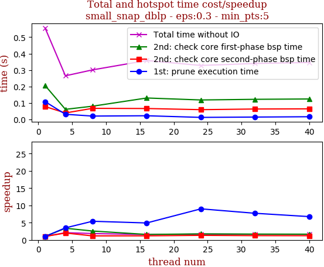

thread_num | prune | check-core 1st bsp | check-core 2nd bsp | cluster-core | cluster-non-core | total | total speedup
--- | --- | --- | --- | --- | --- | --- | ---
1 | 0.108s | 0.206s | 0.078s | 0.088s | 0.074s | 0.556s | 1.000
4 | 0.031s | 0.061s | 0.039s | 0.086s | 0.045s | 0.265s | 2.098
8 | 0.02s | 0.08s | 0.067s | 0.088s | 0.044s | 0.301s | 1.847
16 | 0.022s | 0.13s | 0.066s | 0.084s | 0.053s | 0.358s | 1.553
24 | 0.012s | 0.118s | 0.059s | 0.085s | 0.051s | 0.328s | 1.695
32 | 0.014s | 0.122s | 0.063s | 0.085s | 0.054s | 0.34s | 1.635
40 | 0.016s | 0.124s | 0.064s | 0.085s | 0.055s | 0.346s | 1.607

## eps:0.4

overview | speedup
--- | ---
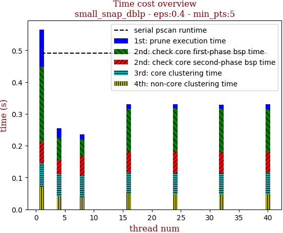 | 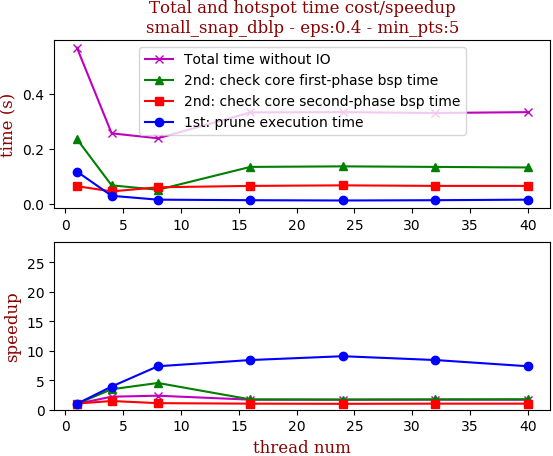

thread_num | prune | check-core 1st bsp | check-core 2nd bsp | cluster-core | cluster-non-core | total | total speedup
--- | --- | --- | --- | --- | --- | --- | ---
1 | 0.118s | 0.236s | 0.065s | 0.076s | 0.07s | 0.568s | 1.000
4 | 0.03s | 0.068s | 0.046s | 0.068s | 0.042s | 0.257s | 2.210
8 | 0.016s | 0.052s | 0.061s | 0.068s | 0.038s | 0.239s | 2.377
16 | 0.014s | 0.135s | 0.066s | 0.066s | 0.049s | 0.333s | 1.706
24 | 0.013s | 0.137s | 0.068s | 0.065s | 0.048s | 0.334s | 1.701
32 | 0.014s | 0.135s | 0.066s | 0.066s | 0.048s | 0.331s | 1.716
40 | 0.016s | 0.133s | 0.066s | 0.067s | 0.048s | 0.334s | 1.701

## eps:0.5

overview | speedup
--- | ---
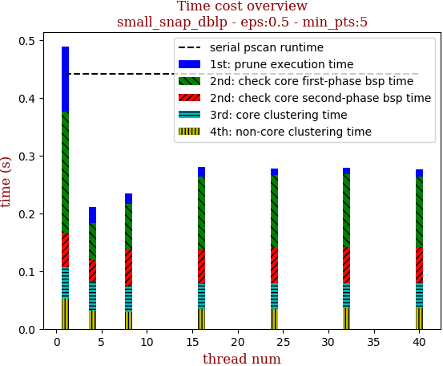 | 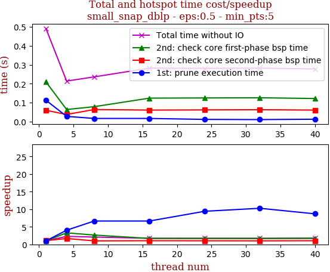

thread_num | prune | check-core 1st bsp | check-core 2nd bsp | cluster-core | cluster-non-core | total | total speedup
--- | --- | --- | --- | --- | --- | --- | ---
1 | 0.113s | 0.21s | 0.06s | 0.053s | 0.053s | 0.491s | 1.000
4 | 0.028s | 0.064s | 0.038s | 0.049s | 0.032s | 0.214s | 2.294
8 | 0.017s | 0.079s | 0.064s | 0.045s | 0.029s | 0.236s | 2.081
16 | 0.017s | 0.124s | 0.061s | 0.044s | 0.034s | 0.282s | 1.741
24 | 0.012s | 0.125s | 0.062s | 0.044s | 0.035s | 0.281s | 1.747
32 | 0.011s | 0.126s | 0.063s | 0.043s | 0.036s | 0.282s | 1.741
40 | 0.013s | 0.122s | 0.061s | 0.044s | 0.036s | 0.278s | 1.766

## eps:0.6

overview | speedup
--- | ---
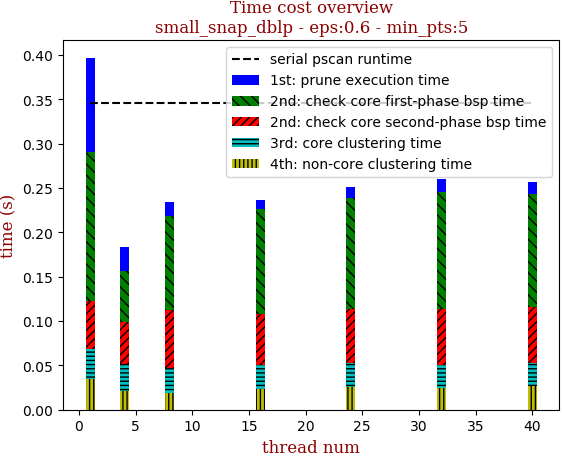 | 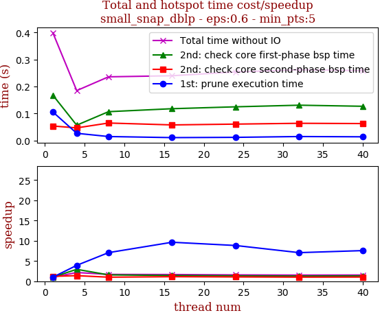

thread_num | prune | check-core 1st bsp | check-core 2nd bsp | cluster-core | cluster-non-core | total | total speedup
--- | --- | --- | --- | --- | --- | --- | ---
1 | 0.106s | 0.168s | 0.054s | 0.034s | 0.035s | 0.399s | 1.000
4 | 0.027s | 0.057s | 0.047s | 0.031s | 0.021s | 0.185s | 2.157
8 | 0.015s | 0.107s | 0.065s | 0.028s | 0.019s | 0.236s | 1.691
16 | 0.011s | 0.118s | 0.058s | 0.027s | 0.023s | 0.24s | 1.663
24 | 0.012s | 0.125s | 0.061s | 0.027s | 0.026s | 0.254s | 1.571
32 | 0.015s | 0.131s | 0.064s | 0.026s | 0.024s | 0.262s | 1.523
40 | 0.014s | 0.127s | 0.063s | 0.026s | 0.027s | 0.259s | 1.541

## eps:0.7

overview | speedup
--- | ---
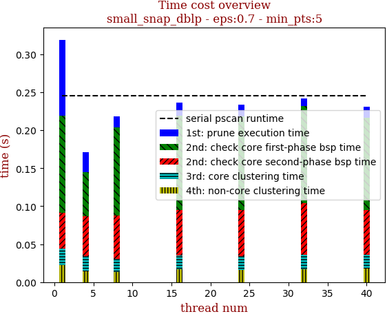 | 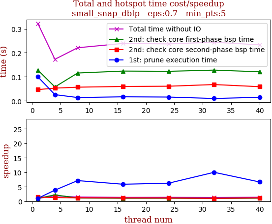

thread_num | prune | check-core 1st bsp | check-core 2nd bsp | cluster-core | cluster-non-core | total | total speedup
--- | --- | --- | --- | --- | --- | --- | ---
1 | 0.1s | 0.128s | 0.047s | 0.022s | 0.022s | 0.322s | 1.000
4 | 0.026s | 0.058s | 0.053s | 0.02s | 0.014s | 0.173s | 1.861
8 | 0.014s | 0.116s | 0.057s | 0.018s | 0.013s | 0.221s | 1.457
16 | 0.017s | 0.124s | 0.06s | 0.018s | 0.017s | 0.239s | 1.347
24 | 0.016s | 0.123s | 0.061s | 0.018s | 0.016s | 0.237s | 1.359
32 | 0.01s | 0.128s | 0.068s | 0.019s | 0.017s | 0.244s | 1.320
40 | 0.015s | 0.121s | 0.059s | 0.018s | 0.018s | 0.233s | 1.382

## eps:0.8

overview | speedup
--- | ---
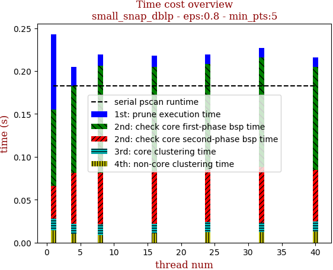 | 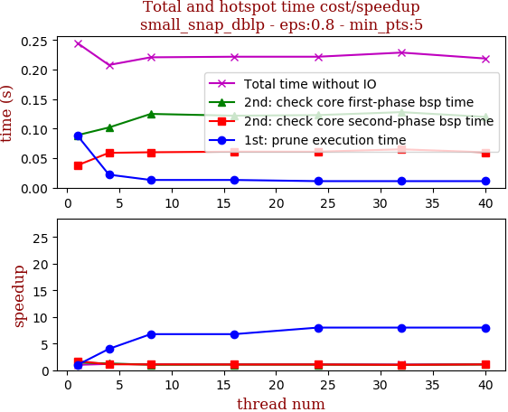

thread_num | prune | check-core 1st bsp | check-core 2nd bsp | cluster-core | cluster-non-core | total | total speedup
--- | --- | --- | --- | --- | --- | --- | ---
1 | 0.088s | 0.089s | 0.038s | 0.014s | 0.014s | 0.245s | 1.000
4 | 0.022s | 0.102s | 0.059s | 0.012s | 0.01s | 0.208s | 1.178
8 | 0.013s | 0.125s | 0.06s | 0.012s | 0.009s | 0.221s | 1.109
16 | 0.013s | 0.122s | 0.061s | 0.011s | 0.011s | 0.222s | 1.104
24 | 0.011s | 0.123s | 0.061s | 0.012s | 0.012s | 0.222s | 1.104
32 | 0.011s | 0.128s | 0.065s | 0.011s | 0.012s | 0.229s | 1.070
40 | 0.011s | 0.12s | 0.06s | 0.012s | 0.013s | 0.219s | 1.119

## eps:0.9

overview | speedup
--- | ---
 | 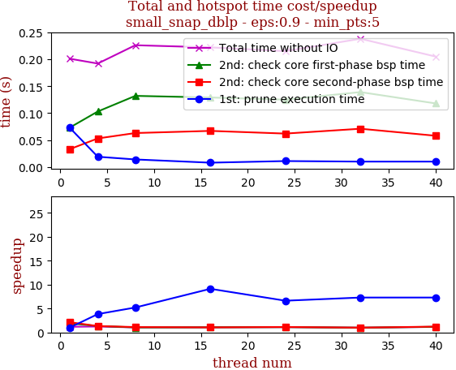

thread_num | prune | check-core 1st bsp | check-core 2nd bsp | cluster-core | cluster-non-core | total | total speedup
--- | --- | --- | --- | --- | --- | --- | ---
1 | 0.073s | 0.073s | 0.033s | 0.01s | 0.009s | 0.201s | 1.000
4 | 0.019s | 0.103s | 0.053s | 0.008s | 0.007s | 0.192s | 1.047
8 | 0.014s | 0.132s | 0.063s | 0.007s | 0.007s | 0.226s | 0.889
16 | 0.008s | 0.129s | 0.067s | 0.007s | 0.008s | 0.222s | 0.905
24 | 0.011s | 0.125s | 0.062s | 0.007s | 0.008s | 0.215s | 0.935
32 | 0.01s | 0.139s | 0.071s | 0.007s | 0.009s | 0.238s | 0.845
40 | 0.01s | 0.118s | 0.058s | 0.007s | 0.009s | 0.205s | 0.980

