## eps:0.1

overview | speedup
--- | ---
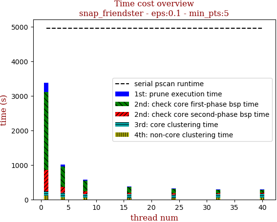 | 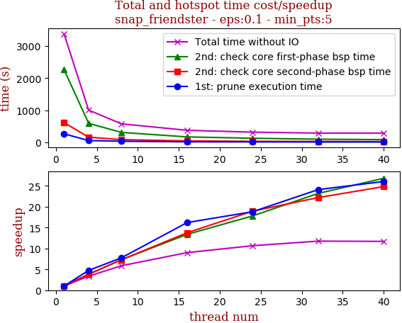

thread_num | prune | check-core 1st bsp | check-core 2nd bsp | cluster-core | cluster-non-core | total | total speedup
--- | --- | --- | --- | --- | --- | --- | ---
1 | 265.31s | 2265.344s | 614.661s | 128.494s | 106.127s | 3379.957s | 1.000
4 | 55.935s | 591.911s | 161.121s | 131.048s | 64.212s | 1004.249s | 3.366
8 | 34.198s | 309.891s | 84.373s | 100.911s | 47.237s | 576.614s | 5.862
16 | 16.383s | 169.41s | 44.692s | 100.149s | 44.78s | 375.418s | 9.003
24 | 14.114s | 127.326s | 32.468s | 100.328s | 42.797s | 317.045s | 10.661
32 | 11.012s | 97.721s | 27.716s | 101.199s | 49.848s | 287.503s | 11.756
40 | 10.188s | 84.507s | 24.759s | 120.493s | 48.982s | 288.937s | 11.698

## eps:0.2

overview | speedup
--- | ---
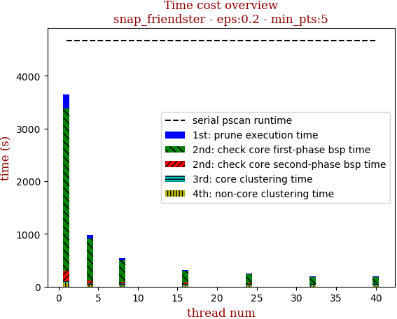 | 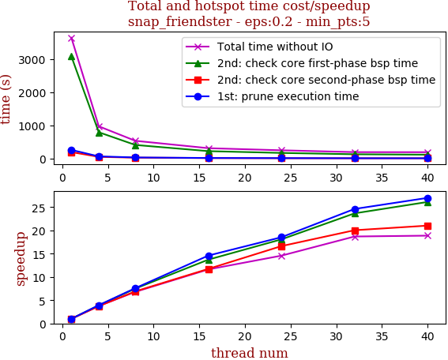

thread_num | prune | check-core 1st bsp | check-core 2nd bsp | cluster-core | cluster-non-core | total | total speedup
--- | --- | --- | --- | --- | --- | --- | ---
1 | 262.266s | 3084.081s | 196.396s | 30.243s | 74.119s | 3647.116s | 1.000
4 | 66.688s | 795.006s | 52.747s | 25.936s | 34.416s | 974.798s | 3.741
8 | 34.559s | 411.574s | 28.478s | 32.554s | 29.442s | 536.611s | 6.797
16 | 17.971s | 224.785s | 16.74s | 29.155s | 25.265s | 313.928s | 11.618
24 | 14.15s | 170.625s | 11.812s | 28.056s | 25.565s | 250.219s | 14.576
32 | 10.658s | 130.334s | 9.802s | 24.692s | 19.66s | 195.159s | 18.688
40 | 9.717s | 118.104s | 9.341s | 32.426s | 23.665s | 193.264s | 18.871

## eps:0.3

overview | speedup
--- | ---
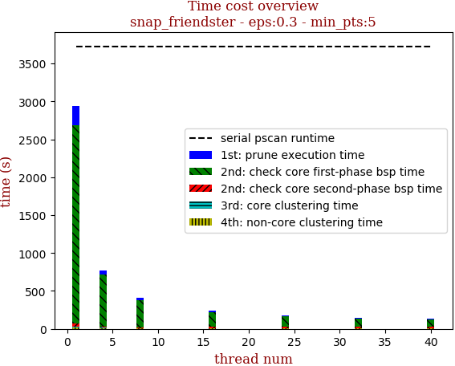 | 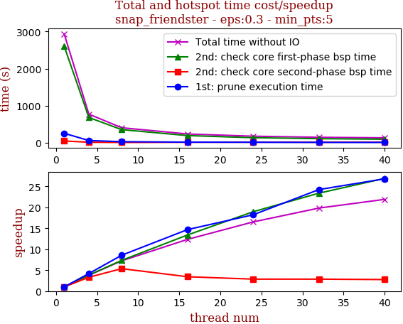

thread_num | prune | check-core 1st bsp | check-core 2nd bsp | cluster-core | cluster-non-core | total | total speedup
--- | --- | --- | --- | --- | --- | --- | ---
1 | 256.487s | 2606.589s | 49.141s | 4.319s | 20.758s | 2937.298s | 1.000
4 | 61.176s | 682.898s | 14.843s | 4.389s | 9.998s | 773.31s | 3.798
8 | 29.91s | 354.835s | 9.159s | 5.185s | 6.763s | 405.855s | 7.237
16 | 17.465s | 194.507s | 14.301s | 5.122s | 6.44s | 237.841s | 12.350
24 | 14.071s | 137.505s | 17.168s | 4.233s | 4.782s | 177.762s | 16.524
32 | 10.578s | 111.465s | 17.185s | 3.957s | 4.932s | 148.143s | 19.827
40 | 9.565s | 96.829s | 17.821s | 5.463s | 4.396s | 134.076s | 21.908

## eps:0.4

overview | speedup
--- | ---
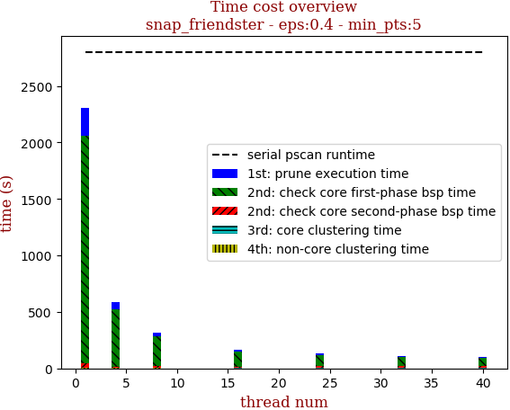 | 

thread_num | prune | check-core 1st bsp | check-core 2nd bsp | cluster-core | cluster-non-core | total | total speedup
--- | --- | --- | --- | --- | --- | --- | ---
1 | 243.407s | 2019.485s | 38.45s | 1.126s | 3.451s | 2305.922s | 1.000
4 | 60.215s | 510.843s | 12.321s | 1.134s | 1.952s | 586.468s | 3.932
8 | 28.257s | 269.81s | 14.689s | 0.934s | 2.519s | 316.212s | 7.292
16 | 16.208s | 136.69s | 13.518s | 0.963s | 1.298s | 168.68s | 13.670
24 | 13.96s | 101.227s | 17.69s | 0.661s | 1.48s | 135.019s | 17.079
32 | 9.468s | 81.858s | 17.332s | 0.919s | 1.348s | 110.929s | 20.787
40 | 10.12s | 70.948s | 16.427s | 0.791s | 1.431s | 99.72s | 23.124

## eps:0.5

overview | speedup
--- | ---
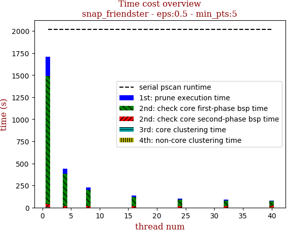 | 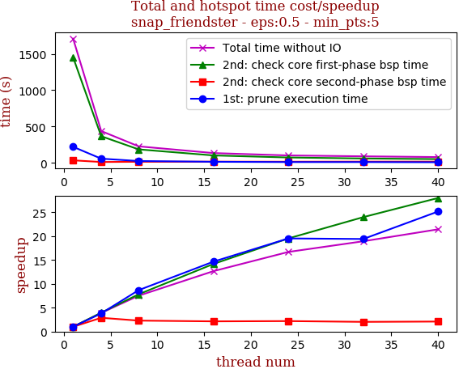

thread_num | prune | check-core 1st bsp | check-core 2nd bsp | cluster-core | cluster-non-core | total | total speedup
--- | --- | --- | --- | --- | --- | --- | ---
1 | 220.976s | 1451.636s | 35.023s | 0.448s | 1.194s | 1709.281s | 1.000
4 | 58.061s | 366.965s | 12.142s | 0.443s | 0.708s | 438.322s | 3.900
8 | 25.458s | 185.739s | 15.263s | 0.408s | 0.57s | 227.441s | 7.515
16 | 15.074s | 102.403s | 16.374s | 0.442s | 0.623s | 134.919s | 12.669
24 | 11.318s | 74.34s | 15.95s | 0.266s | 0.531s | 102.407s | 16.691
32 | 11.389s | 60.518s | 17.237s | 0.35s | 0.81s | 90.307s | 18.927
40 | 8.779s | 51.836s | 16.689s | 0.432s | 2.005s | 79.745s | 21.434

## eps:0.6

overview | speedup
--- | ---
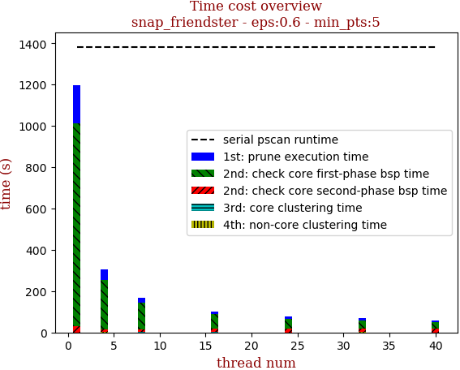 | 

thread_num | prune | check-core 1st bsp | check-core 2nd bsp | cluster-core | cluster-non-core | total | total speedup
--- | --- | --- | --- | --- | --- | --- | ---
1 | 187.105s | 980.086s | 29.895s | 0.216s | 0.524s | 1197.83s | 1.000
4 | 49.009s | 241.813s | 12.206s | 0.314s | 1.462s | 304.807s | 3.930
8 | 24.566s | 126.31s | 15.686s | 0.335s | 0.549s | 167.45s | 7.153
16 | 14.338s | 69.993s | 17.473s | 0.324s | 0.747s | 102.879s | 11.643
24 | 10.085s | 48.97s | 16.082s | 0.327s | 0.499s | 75.965s | 15.768
32 | 10.324s | 40.553s | 17.461s | 0.324s | 0.913s | 69.578s | 17.216
40 | 7.971s | 33.642s | 16.821s | 0.294s | 0.534s | 59.264s | 20.212

## eps:0.7

overview | speedup
--- | ---
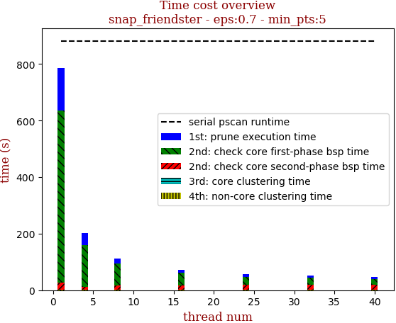 | 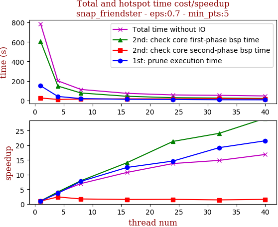

thread_num | prune | check-core 1st bsp | check-core 2nd bsp | cluster-core | cluster-non-core | total | total speedup
--- | --- | --- | --- | --- | --- | --- | ---
1 | 151.135s | 608.111s | 25.713s | 0.273s | 1.258s | 786.493s | 1.000
4 | 41.569s | 148.174s | 10.786s | 0.281s | 0.641s | 201.454s | 3.904
8 | 19.621s | 76.858s | 15.057s | 0.284s | 1.407s | 113.23s | 6.946
16 | 12.144s | 43.252s | 16.804s | 0.287s | 0.713s | 73.204s | 10.744
24 | 10.333s | 28.521s | 16.444s | 0.217s | 1.556s | 57.074s | 13.780
32 | 7.876s | 25.271s | 18.462s | 0.288s | 1.053s | 52.953s | 14.853
40 | 7.021s | 20.834s | 16.518s | 1.13s | 1.159s | 46.665s | 16.854

## eps:0.8

overview | speedup
--- | ---
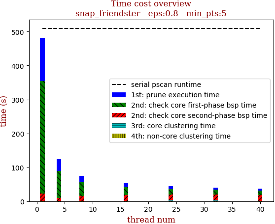 | 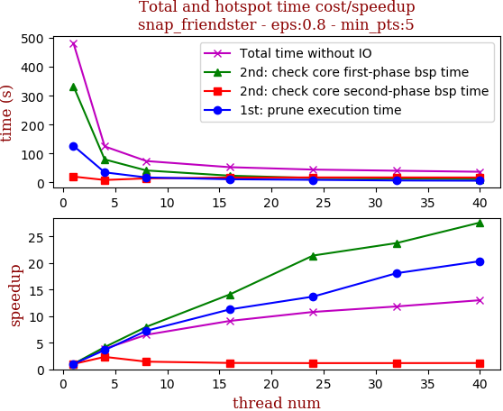

thread_num | prune | check-core 1st bsp | check-core 2nd bsp | cluster-core | cluster-non-core | total | total speedup
--- | --- | --- | --- | --- | --- | --- | ---
1 | 126.967s | 333.05s | 20.463s | 0.273s | 1.313s | 482.07s | 1.000
4 | 35.121s | 79.699s | 8.757s | 0.276s | 0.948s | 124.805s | 3.863
8 | 17.506s | 41.637s | 14.234s | 0.277s | 0.534s | 74.193s | 6.498
16 | 11.267s | 23.643s | 17.123s | 0.278s | 0.651s | 52.966s | 9.101
24 | 9.279s | 15.555s | 17.611s | 0.961s | 1.239s | 44.649s | 10.797
32 | 7.02s | 14.02s | 17.551s | 1.069s | 1.093s | 40.756s | 11.828
40 | 6.241s | 12.062s | 17.365s | 1.051s | 0.36s | 37.083s | 13.000

## eps:0.9

overview | speedup
--- | ---
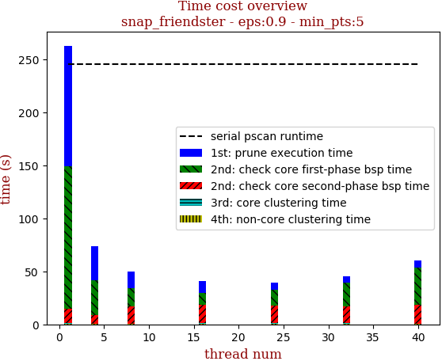 | 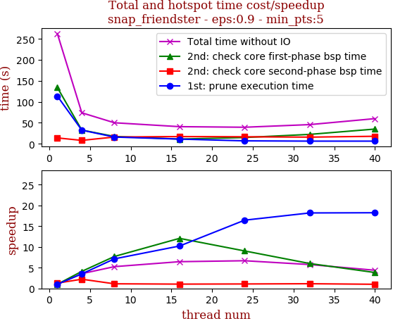

thread_num | prune | check-core 1st bsp | check-core 2nd bsp | cluster-core | cluster-non-core | total | total speedup
--- | --- | --- | --- | --- | --- | --- | ---
1 | 113.682s | 134.192s | 13.914s | 0.269s | 0.747s | 262.809s | 1.000
4 | 32.459s | 32.659s | 8.02s | 0.271s | 0.47s | 73.882s | 3.557
8 | 15.955s | 17.432s | 15.998s | 0.25s | 0.443s | 50.081s | 5.248
16 | 11.124s | 11.12s | 17.155s | 1.013s | 0.36s | 40.774s | 6.446
24 | 6.911s | 14.86s | 16.591s | 0.496s | 0.516s | 39.378s | 6.674
32 | 6.249s | 22.367s | 15.764s | 0.438s | 0.871s | 45.693s | 5.752
40 | 6.233s | 35.036s | 17.825s | 0.271s | 0.58s | 59.948s | 4.384

