## eps:0.1

overview | speedup
--- | ---
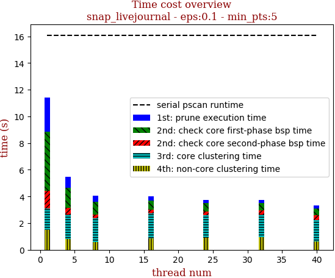 | 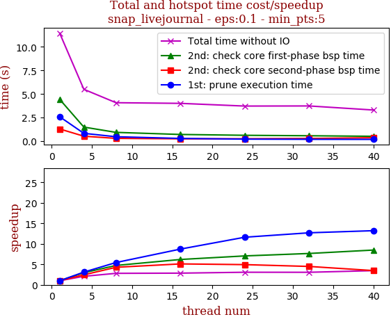

thread_num | prune | check-core 1st bsp | check-core 2nd bsp | cluster-core | cluster-non-core | total | total speedup
--- | --- | --- | --- | --- | --- | --- | ---
1 | 2.59s | 4.43s | 1.297s | 1.616s | 1.498s | 11.434s | 1.000
4 | 0.834s | 1.497s | 0.532s | 1.803s | 0.826s | 5.495s | 2.081
8 | 0.476s | 0.937s | 0.303s | 1.764s | 0.594s | 4.077s | 2.805
16 | 0.297s | 0.716s | 0.254s | 1.881s | 0.857s | 4.008s | 2.853
24 | 0.223s | 0.628s | 0.263s | 1.713s | 0.892s | 3.722s | 3.072
32 | 0.204s | 0.579s | 0.289s | 1.697s | 0.962s | 3.734s | 3.062
40 | 0.196s | 0.522s | 0.373s | 1.585s | 0.625s | 3.303s | 3.462

## eps:0.2

overview | speedup
--- | ---
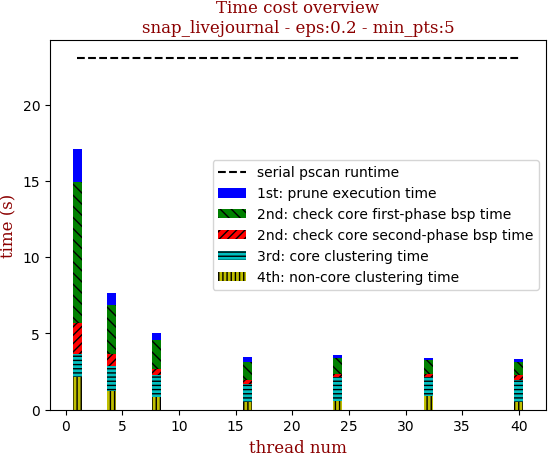 | 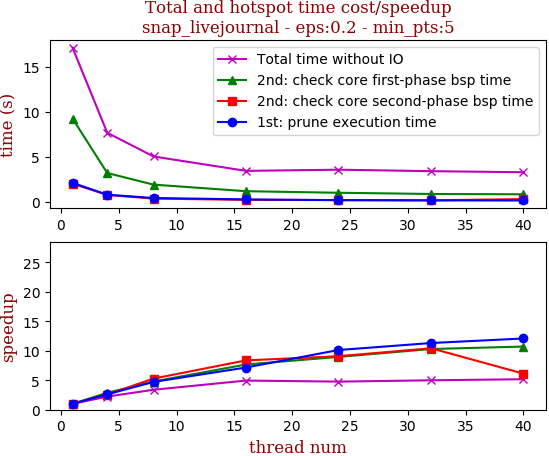

thread_num | prune | check-core 1st bsp | check-core 2nd bsp | cluster-core | cluster-non-core | total | total speedup
--- | --- | --- | --- | --- | --- | --- | ---
1 | 2.127s | 9.238s | 2.033s | 1.539s | 2.138s | 17.077s | 1.000
4 | 0.814s | 3.215s | 0.79s | 1.59s | 1.256s | 7.667s | 2.227
8 | 0.451s | 1.931s | 0.385s | 1.416s | 0.861s | 5.046s | 3.384
16 | 0.297s | 1.204s | 0.243s | 1.188s | 0.517s | 3.453s | 4.946
24 | 0.21s | 1.031s | 0.224s | 1.554s | 0.56s | 3.582s | 4.767
32 | 0.188s | 0.897s | 0.195s | 1.267s | 0.87s | 3.421s | 4.992
40 | 0.176s | 0.862s | 0.332s | 1.422s | 0.504s | 3.3s | 5.175

## eps:0.3

overview | speedup
--- | ---
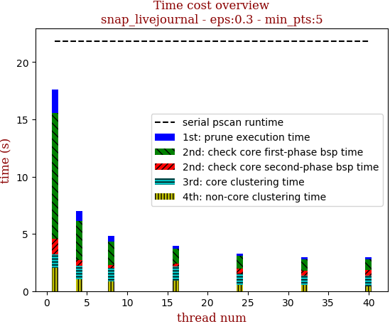 | 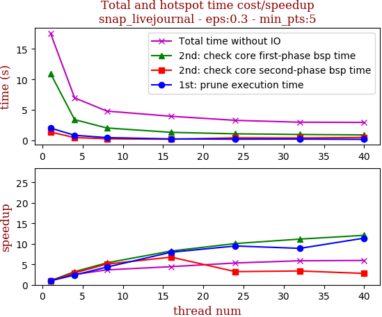

thread_num | prune | check-core 1st bsp | check-core 2nd bsp | cluster-core | cluster-non-core | total | total speedup
--- | --- | --- | --- | --- | --- | --- | ---
1 | 2.029s | 10.984s | 1.38s | 1.162s | 2.024s | 17.581s | 1.000
4 | 0.847s | 3.411s | 0.473s | 1.211s | 1.035s | 6.979s | 2.519
8 | 0.469s | 2.049s | 0.273s | 1.169s | 0.851s | 4.815s | 3.651
16 | 0.255s | 1.33s | 0.204s | 1.28s | 0.893s | 3.965s | 4.434
24 | 0.214s | 1.09s | 0.429s | 1.048s | 0.512s | 3.296s | 5.334
32 | 0.228s | 0.984s | 0.408s | 0.846s | 0.523s | 2.991s | 5.878
40 | 0.178s | 0.909s | 0.495s | 0.931s | 0.441s | 2.958s | 5.944

## eps:0.4

overview | speedup
--- | ---
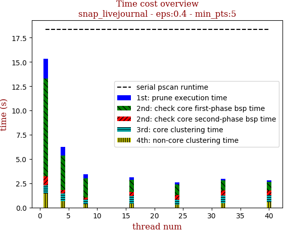 | 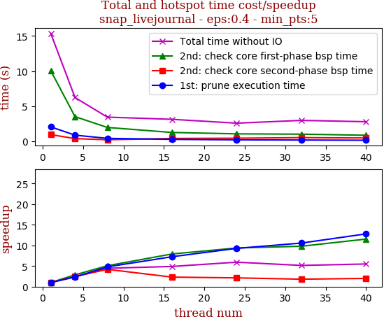

thread_num | prune | check-core 1st bsp | check-core 2nd bsp | cluster-core | cluster-non-core | total | total speedup
--- | --- | --- | --- | --- | --- | --- | ---
1 | 2.06s | 10.045s | 0.964s | 0.816s | 1.457s | 15.344s | 1.000
4 | 0.886s | 3.519s | 0.395s | 0.792s | 0.638s | 6.233s | 2.462
8 | 0.43s | 1.981s | 0.23s | 0.451s | 0.353s | 3.447s | 4.451
16 | 0.284s | 1.268s | 0.418s | 0.767s | 0.397s | 3.136s | 4.893
24 | 0.222s | 1.072s | 0.454s | 0.53s | 0.308s | 2.589s | 5.927
32 | 0.195s | 1.026s | 0.535s | 0.755s | 0.47s | 2.985s | 5.140
40 | 0.161s | 0.871s | 0.483s | 0.742s | 0.534s | 2.794s | 5.492

## eps:0.5

overview | speedup
--- | ---
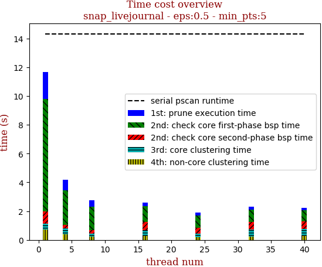 | 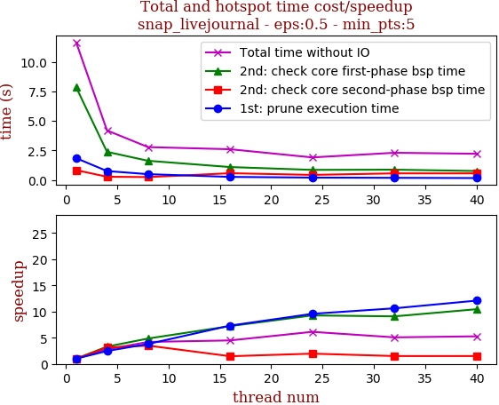

thread_num | prune | check-core 1st bsp | check-core 2nd bsp | cluster-core | cluster-non-core | total | total speedup
--- | --- | --- | --- | --- | --- | --- | ---
1 | 1.837s | 7.836s | 0.825s | 0.427s | 0.718s | 11.646s | 1.000
4 | 0.746s | 2.374s | 0.263s | 0.418s | 0.385s | 4.189s | 2.780
8 | 0.483s | 1.616s | 0.236s | 0.205s | 0.233s | 2.776s | 4.195
16 | 0.251s | 1.085s | 0.563s | 0.431s | 0.262s | 2.595s | 4.488
24 | 0.192s | 0.846s | 0.421s | 0.266s | 0.174s | 1.902s | 6.123
32 | 0.173s | 0.863s | 0.55s | 0.454s | 0.253s | 2.296s | 5.072
40 | 0.152s | 0.75s | 0.549s | 0.488s | 0.269s | 2.211s | 5.267

## eps:0.6

overview | speedup
--- | ---
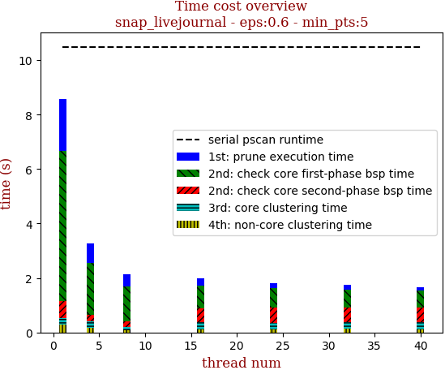 | 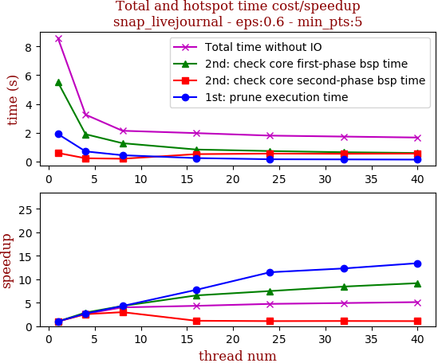

thread_num | prune | check-core 1st bsp | check-core 2nd bsp | cluster-core | cluster-non-core | total | total speedup
--- | --- | --- | --- | --- | --- | --- | ---
1 | 1.919s | 5.516s | 0.603s | 0.239s | 0.303s | 8.582s | 1.000
4 | 0.712s | 1.905s | 0.236s | 0.24s | 0.167s | 3.263s | 2.630
8 | 0.447s | 1.281s | 0.202s | 0.131s | 0.08s | 2.145s | 4.001
16 | 0.248s | 0.842s | 0.523s | 0.245s | 0.12s | 1.981s | 4.332
24 | 0.167s | 0.737s | 0.559s | 0.228s | 0.114s | 1.808s | 4.747
32 | 0.156s | 0.654s | 0.547s | 0.248s | 0.133s | 1.741s | 4.929
40 | 0.143s | 0.602s | 0.561s | 0.241s | 0.125s | 1.675s | 5.124

## eps:0.7

overview | speedup
--- | ---
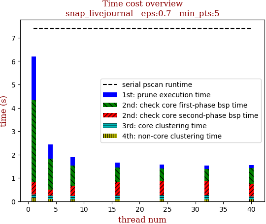 | 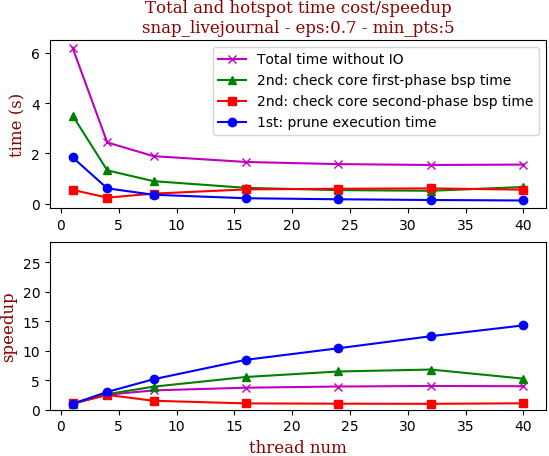

thread_num | prune | check-core 1st bsp | check-core 2nd bsp | cluster-core | cluster-non-core | total | total speedup
--- | --- | --- | --- | --- | --- | --- | ---
1 | 1.846s | 3.51s | 0.55s | 0.159s | 0.137s | 6.206s | 1.000
4 | 0.612s | 1.328s | 0.243s | 0.159s | 0.095s | 2.439s | 2.544
8 | 0.357s | 0.898s | 0.402s | 0.151s | 0.083s | 1.893s | 3.278
16 | 0.218s | 0.632s | 0.57s | 0.167s | 0.071s | 1.661s | 3.736
24 | 0.177s | 0.541s | 0.596s | 0.172s | 0.086s | 1.576s | 3.938
32 | 0.148s | 0.515s | 0.611s | 0.177s | 0.088s | 1.542s | 4.025
40 | 0.129s | 0.666s | 0.559s | 0.127s | 0.073s | 1.557s | 3.986

## eps:0.8

overview | speedup
--- | ---
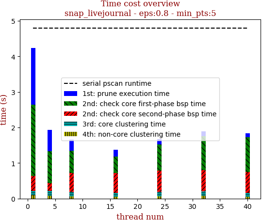 | 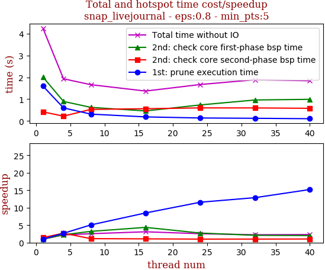

thread_num | prune | check-core 1st bsp | check-core 2nd bsp | cluster-core | cluster-non-core | total | total speedup
--- | --- | --- | --- | --- | --- | --- | ---
1 | 1.597s | 2.01s | 0.419s | 0.128s | 0.087s | 4.243s | 1.000
4 | 0.6s | 0.896s | 0.222s | 0.131s | 0.08s | 1.932s | 2.196
8 | 0.315s | 0.624s | 0.531s | 0.122s | 0.066s | 1.662s | 2.553
16 | 0.188s | 0.461s | 0.562s | 0.103s | 0.053s | 1.37s | 3.097
24 | 0.138s | 0.736s | 0.6s | 0.124s | 0.069s | 1.67s | 2.541
32 | 0.124s | 0.962s | 0.598s | 0.129s | 0.072s | 1.888s | 2.247
40 | 0.105s | 0.992s | 0.581s | 0.105s | 0.054s | 1.841s | 2.305

## eps:0.9

overview | speedup
--- | ---
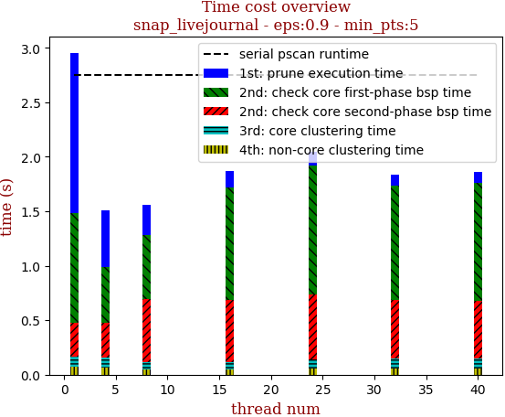 | 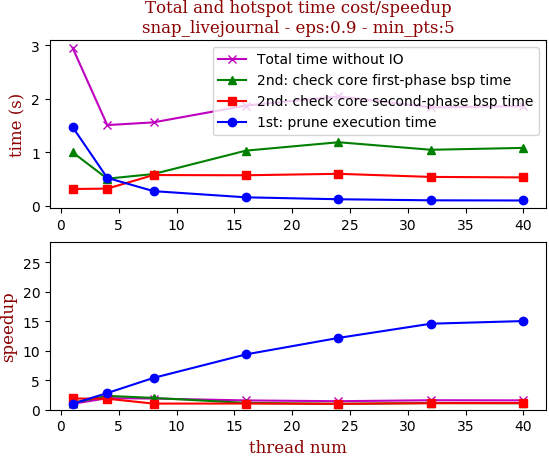

thread_num | prune | check-core 1st bsp | check-core 2nd bsp | cluster-core | cluster-non-core | total | total speedup
--- | --- | --- | --- | --- | --- | --- | ---
1 | 1.474s | 1.0s | 0.313s | 0.094s | 0.073s | 2.956s | 1.000
4 | 0.521s | 0.506s | 0.32s | 0.096s | 0.063s | 1.509s | 1.959
8 | 0.273s | 0.593s | 0.574s | 0.072s | 0.045s | 1.56s | 1.895
16 | 0.157s | 1.031s | 0.57s | 0.07s | 0.044s | 1.874s | 1.577
24 | 0.121s | 1.188s | 0.597s | 0.084s | 0.053s | 2.046s | 1.445
32 | 0.101s | 1.047s | 0.539s | 0.091s | 0.059s | 1.84s | 1.607
40 | 0.098s | 1.082s | 0.53s | 0.09s | 0.06s | 1.864s | 1.586

