## eps:0.1

overview | speedup
--- | ---
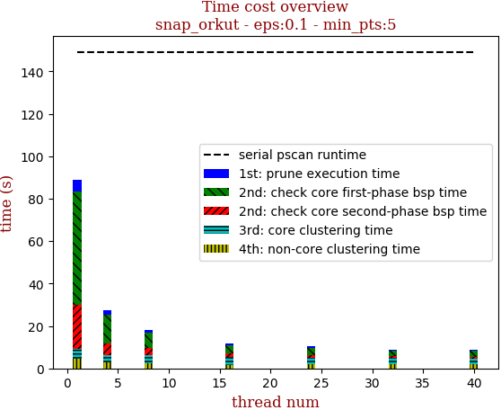 | 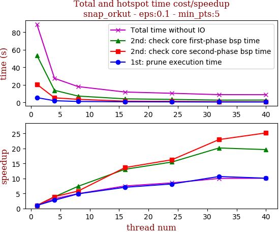

thread_num | prune | check-core 1st bsp | check-core 2nd bsp | cluster-core | cluster-non-core | total | total speedup
--- | --- | --- | --- | --- | --- | --- | ---
1 | 5.487s | 53.669s | 20.649s | 4.389s | 4.747s | 88.945s | 1.000
4 | 1.99s | 13.822s | 5.265s | 3.733s | 2.638s | 27.451s | 3.240
8 | 1.127s | 7.274s | 3.568s | 3.856s | 2.241s | 18.069s | 4.923
16 | 0.777s | 4.108s | 1.515s | 3.761s | 1.703s | 11.867s | 7.495
24 | 0.672s | 3.465s | 1.271s | 3.211s | 1.807s | 10.428s | 8.529
32 | 0.515s | 2.661s | 0.899s | 2.968s | 1.843s | 8.889s | 10.006
40 | 0.544s | 2.735s | 0.82s | 2.863s | 1.856s | 8.82s | 10.084

## eps:0.2

overview | speedup
--- | ---
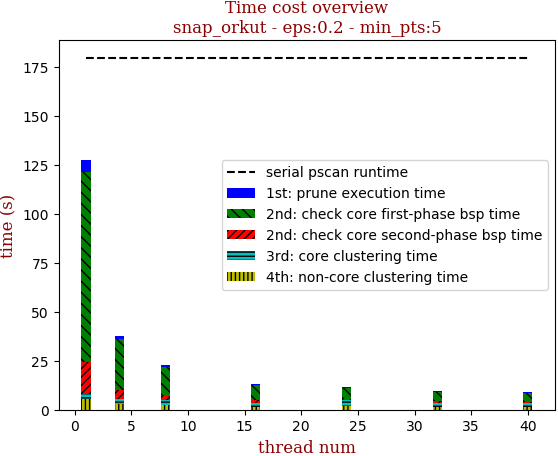 | 

thread_num | prune | check-core 1st bsp | check-core 2nd bsp | cluster-core | cluster-non-core | total | total speedup
--- | --- | --- | --- | --- | --- | --- | ---
1 | 6.119s | 97.186s | 16.24s | 2.77s | 5.274s | 127.593s | 1.000
4 | 1.913s | 25.84s | 4.414s | 2.709s | 2.857s | 37.736s | 3.381
8 | 1.106s | 13.907s | 2.471s | 2.739s | 2.438s | 22.663s | 5.630
16 | 0.9s | 7.607s | 1.302s | 2.049s | 1.415s | 13.275s | 9.612
24 | 0.685s | 5.457s | 0.789s | 2.842s | 1.903s | 11.679s | 10.925
32 | 0.611s | 4.779s | 0.686s | 2.251s | 1.38s | 9.711s | 13.139
40 | 0.51s | 4.153s | 0.583s | 2.042s | 1.54s | 8.832s | 14.447

## eps:0.3

overview | speedup
--- | ---
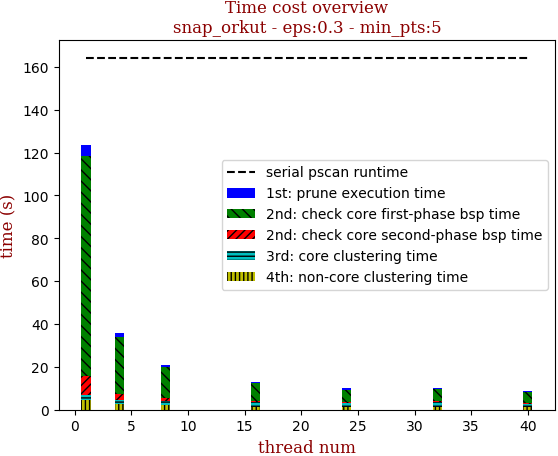 | 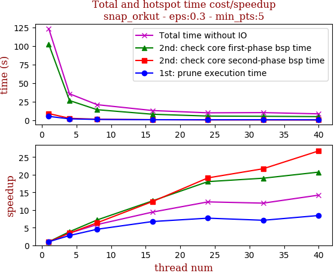

thread_num | prune | check-core 1st bsp | check-core 2nd bsp | cluster-core | cluster-non-core | total | total speedup
--- | --- | --- | --- | --- | --- | --- | ---
1 | 5.275s | 102.377s | 9.092s | 2.128s | 4.586s | 123.461s | 1.000
4 | 1.901s | 26.596s | 2.636s | 2.075s | 2.481s | 35.691s | 3.459
8 | 1.16s | 14.244s | 1.423s | 2.175s | 1.993s | 20.997s | 5.880
16 | 0.783s | 8.127s | 0.733s | 2.013s | 1.455s | 13.113s | 9.415
24 | 0.686s | 5.673s | 0.476s | 1.87s | 1.329s | 10.037s | 12.301
32 | 0.744s | 5.385s | 0.419s | 2.381s | 1.401s | 10.333s | 11.948
40 | 0.625s | 4.938s | 0.34s | 1.382s | 1.393s | 8.682s | 14.220

## eps:0.4

overview | speedup
--- | ---
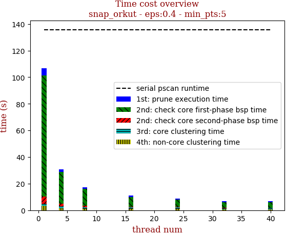 | 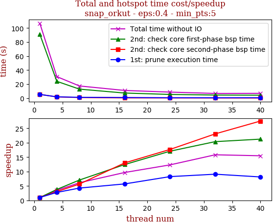

thread_num | prune | check-core 1st bsp | check-core 2nd bsp | cluster-core | cluster-non-core | total | total speedup
--- | --- | --- | --- | --- | --- | --- | ---
1 | 5.339s | 91.006s | 5.421s | 1.548s | 3.326s | 106.643s | 1.000
4 | 1.932s | 24.036s | 1.79s | 1.388s | 1.585s | 30.734s | 3.470
8 | 1.251s | 12.9s | 0.957s | 1.365s | 0.935s | 17.41s | 6.125
16 | 0.935s | 7.323s | 0.417s | 1.461s | 0.887s | 11.026s | 9.672
24 | 0.648s | 5.338s | 0.307s | 1.506s | 0.864s | 8.666s | 12.306
32 | 0.588s | 4.467s | 0.235s | 0.894s | 0.56s | 6.745s | 15.811
40 | 0.657s | 4.284s | 0.197s | 0.97s | 0.782s | 6.893s | 15.471

## eps:0.5

overview | speedup
--- | ---
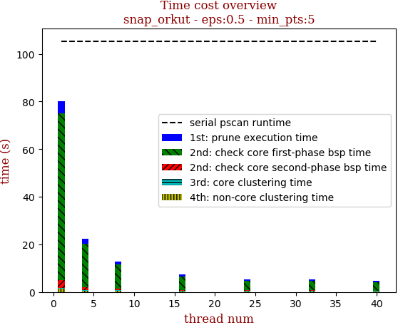 | 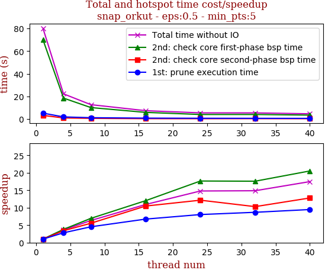

thread_num | prune | check-core 1st bsp | check-core 2nd bsp | cluster-core | cluster-non-core | total | total speedup
--- | --- | --- | --- | --- | --- | --- | ---
1 | 5.184s | 70.142s | 3.184s | 0.408s | 1.294s | 80.215s | 1.000
4 | 1.847s | 18.483s | 0.937s | 0.4s | 0.564s | 22.234s | 3.608
8 | 1.144s | 10.1s | 0.574s | 0.425s | 0.427s | 12.673s | 6.330
16 | 0.77s | 5.841s | 0.304s | 0.185s | 0.243s | 7.346s | 10.920
24 | 0.645s | 3.975s | 0.262s | 0.201s | 0.339s | 5.424s | 14.789
32 | 0.597s | 3.988s | 0.309s | 0.348s | 0.154s | 5.398s | 14.860
40 | 0.547s | 3.417s | 0.249s | 0.209s | 0.165s | 4.59s | 17.476

## eps:0.6

overview | speedup
--- | ---
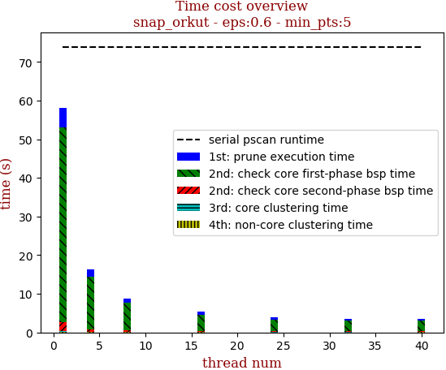 | 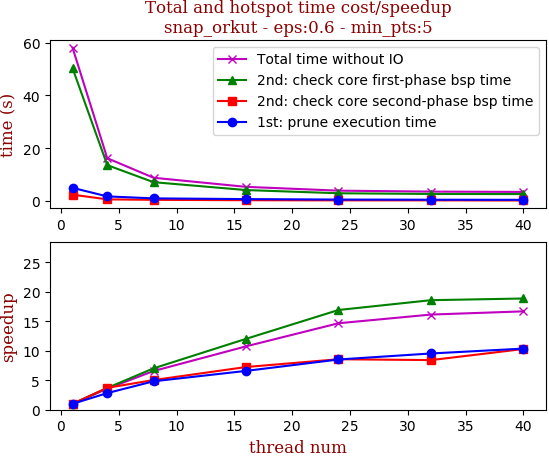

thread_num | prune | check-core 1st bsp | check-core 2nd bsp | cluster-core | cluster-non-core | total | total speedup
--- | --- | --- | --- | --- | --- | --- | ---
1 | 5.019s | 50.267s | 2.441s | 0.07s | 0.219s | 58.019s | 1.000
4 | 1.779s | 13.619s | 0.658s | 0.065s | 0.106s | 16.229s | 3.575
8 | 1.041s | 7.163s | 0.485s | 0.064s | 0.086s | 8.842s | 6.562
16 | 0.762s | 4.181s | 0.337s | 0.057s | 0.056s | 5.397s | 10.750
24 | 0.589s | 2.971s | 0.285s | 0.061s | 0.046s | 3.955s | 14.670
32 | 0.526s | 2.705s | 0.29s | 0.031s | 0.04s | 3.594s | 16.143
40 | 0.484s | 2.664s | 0.237s | 0.029s | 0.06s | 3.477s | 16.687

## eps:0.7

overview | speedup
--- | ---
 | 

thread_num | prune | check-core 1st bsp | check-core 2nd bsp | cluster-core | cluster-non-core | total | total speedup
--- | --- | --- | --- | --- | --- | --- | ---
1 | 4.541s | 31.366s | 1.863s | 0.019s | 0.031s | 37.823s | 1.000
4 | 1.746s | 8.102s | 0.525s | 0.016s | 0.02s | 10.411s | 3.633
8 | 1.085s | 4.654s | 0.37s | 0.009s | 0.015s | 6.136s | 6.164
16 | 0.686s | 2.696s | 0.268s | 0.008s | 0.013s | 3.673s | 10.298
24 | 0.53s | 2.203s | 0.278s | 0.012s | 0.018s | 3.044s | 12.425
32 | 0.459s | 2.022s | 0.266s | 0.012s | 0.019s | 2.781s | 13.601
40 | 0.428s | 1.684s | 0.253s | 0.006s | 0.012s | 2.386s | 15.852

## eps:0.8

overview | speedup
--- | ---
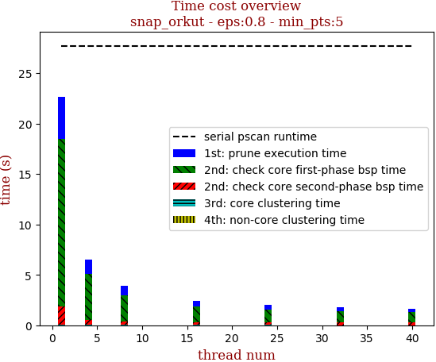 | 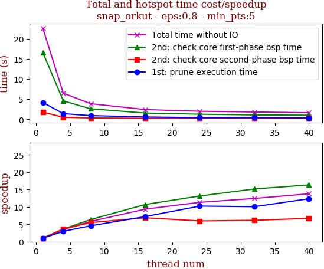

thread_num | prune | check-core 1st bsp | check-core 2nd bsp | cluster-core | cluster-non-core | total | total speedup
--- | --- | --- | --- | --- | --- | --- | ---
1 | 4.198s | 16.627s | 1.804s | 0.016s | 0.015s | 22.663s | 1.000
4 | 1.404s | 4.579s | 0.492s | 0.011s | 0.013s | 6.502s | 3.486
8 | 0.919s | 2.615s | 0.328s | 0.01s | 0.014s | 3.889s | 5.827
16 | 0.581s | 1.555s | 0.262s | 0.008s | 0.014s | 2.422s | 9.357
24 | 0.41s | 1.265s | 0.302s | 0.007s | 0.015s | 2.002s | 11.320
32 | 0.417s | 1.096s | 0.293s | 0.003s | 0.011s | 1.823s | 12.432
40 | 0.34s | 1.018s | 0.269s | 0.004s | 0.011s | 1.644s | 13.785

## eps:0.9

overview | speedup
--- | ---
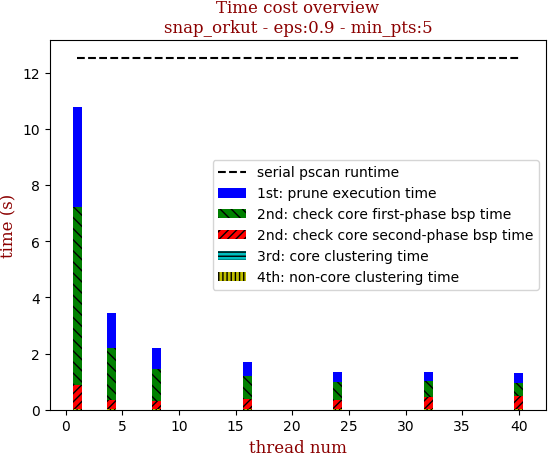 | 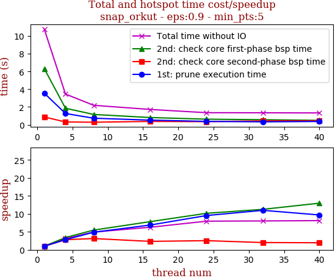

thread_num | prune | check-core 1st bsp | check-core 2nd bsp | cluster-core | cluster-non-core | total | total speedup
--- | --- | --- | --- | --- | --- | --- | ---
1 | 3.557s | 6.317s | 0.869s | 0.015s | 0.012s | 10.773s | 1.000
4 | 1.262s | 1.858s | 0.309s | 0.011s | 0.012s | 3.455s | 3.118
8 | 0.729s | 1.153s | 0.278s | 0.009s | 0.013s | 2.185s | 4.930
16 | 0.517s | 0.807s | 0.371s | 0.006s | 0.016s | 1.719s | 6.267
24 | 0.373s | 0.622s | 0.342s | 0.003s | 0.01s | 1.353s | 7.962
32 | 0.324s | 0.561s | 0.431s | 0.006s | 0.017s | 1.342s | 8.028
40 | 0.367s | 0.487s | 0.444s | 0.006s | 0.021s | 1.328s | 8.112

