## eps:0.1

overview | speedup
--- | ---
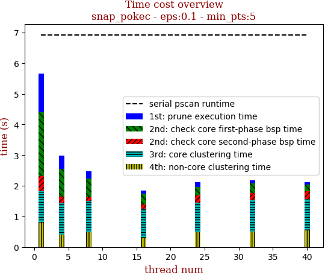 | 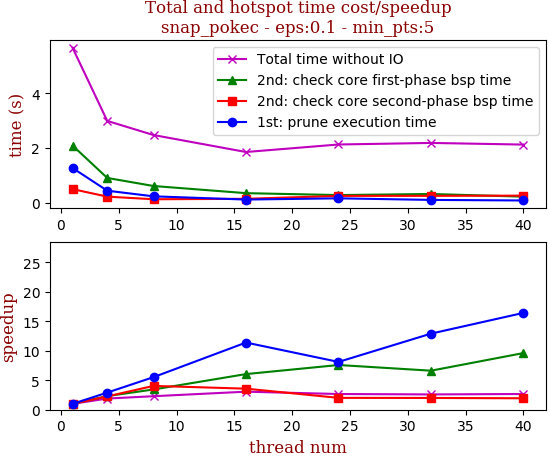

thread_num | prune | check-core 1st bsp | check-core 2nd bsp | cluster-core | cluster-non-core | total | total speedup
--- | --- | --- | --- | --- | --- | --- | ---
1 | 1.265s | 2.086s | 0.493s | 1.023s | 0.795s | 5.666s | 1.000
4 | 0.435s | 0.902s | 0.218s | 1.023s | 0.408s | 2.989s | 1.896
8 | 0.229s | 0.607s | 0.122s | 1.017s | 0.494s | 2.472s | 2.292
16 | 0.111s | 0.345s | 0.138s | 0.961s | 0.293s | 1.851s | 3.061
24 | 0.156s | 0.275s | 0.245s | 0.955s | 0.493s | 2.126s | 2.665
32 | 0.098s | 0.315s | 0.247s | 1.006s | 0.514s | 2.183s | 2.596
40 | 0.077s | 0.217s | 0.254s | 1.03s | 0.542s | 2.123s | 2.669

## eps:0.2

overview | speedup
--- | ---
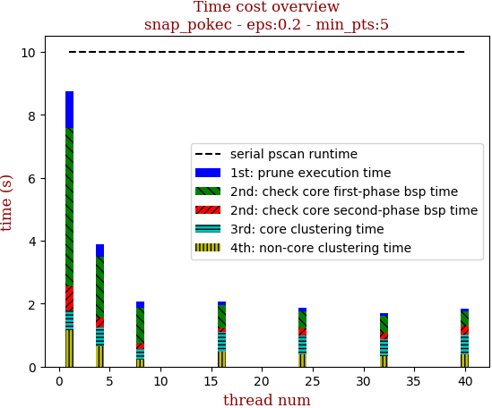 | 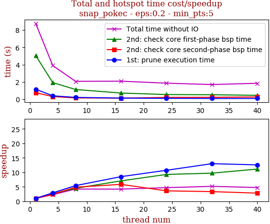

thread_num | prune | check-core 1st bsp | check-core 2nd bsp | cluster-core | cluster-non-core | total | total speedup
--- | --- | --- | --- | --- | --- | --- | ---
1 | 1.156s | 5.049s | 0.753s | 0.631s | 1.16s | 8.751s | 1.000
4 | 0.398s | 1.924s | 0.31s | 0.617s | 0.639s | 3.89s | 2.250
8 | 0.214s | 1.129s | 0.155s | 0.337s | 0.233s | 2.071s | 4.225
16 | 0.136s | 0.717s | 0.129s | 0.61s | 0.489s | 2.085s | 4.197
24 | 0.108s | 0.545s | 0.209s | 0.598s | 0.397s | 1.859s | 4.707
32 | 0.089s | 0.52s | 0.226s | 0.539s | 0.321s | 1.698s | 5.154
40 | 0.092s | 0.454s | 0.268s | 0.629s | 0.399s | 1.845s | 4.743

## eps:0.3

overview | speedup
--- | ---
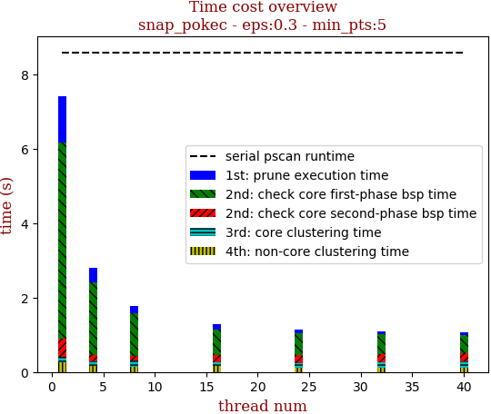 | 

thread_num | prune | check-core 1st bsp | check-core 2nd bsp | cluster-core | cluster-non-core | total | total speedup
--- | --- | --- | --- | --- | --- | --- | ---
1 | 1.263s | 5.265s | 0.483s | 0.145s | 0.271s | 7.43s | 1.000
4 | 0.404s | 1.96s | 0.156s | 0.133s | 0.157s | 2.812s | 2.642
8 | 0.208s | 1.132s | 0.138s | 0.149s | 0.15s | 1.779s | 4.177
16 | 0.139s | 0.699s | 0.203s | 0.094s | 0.156s | 1.293s | 5.746
24 | 0.104s | 0.571s | 0.212s | 0.138s | 0.111s | 1.14s | 6.518
32 | 0.09s | 0.514s | 0.239s | 0.145s | 0.109s | 1.1s | 6.755
40 | 0.094s | 0.466s | 0.237s | 0.158s | 0.122s | 1.079s | 6.886

## eps:0.4

overview | speedup
--- | ---
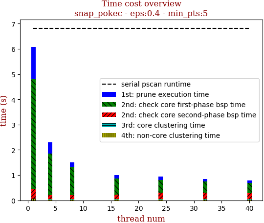 | 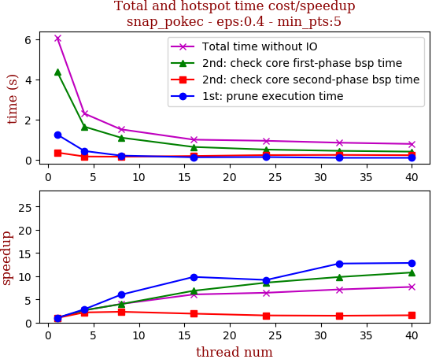

thread_num | prune | check-core 1st bsp | check-core 2nd bsp | cluster-core | cluster-non-core | total | total speedup
--- | --- | --- | --- | --- | --- | --- | ---
1 | 1.259s | 4.381s | 0.361s | 0.022s | 0.048s | 6.074s | 1.000
4 | 0.439s | 1.647s | 0.165s | 0.019s | 0.027s | 2.299s | 2.642
8 | 0.21s | 1.104s | 0.155s | 0.019s | 0.025s | 1.517s | 4.004
16 | 0.128s | 0.639s | 0.188s | 0.016s | 0.028s | 1.002s | 6.062
24 | 0.137s | 0.509s | 0.235s | 0.031s | 0.03s | 0.945s | 6.428
32 | 0.099s | 0.446s | 0.244s | 0.03s | 0.03s | 0.851s | 7.137
40 | 0.098s | 0.406s | 0.23s | 0.028s | 0.025s | 0.79s | 7.689

## eps:0.5

overview | speedup
--- | ---
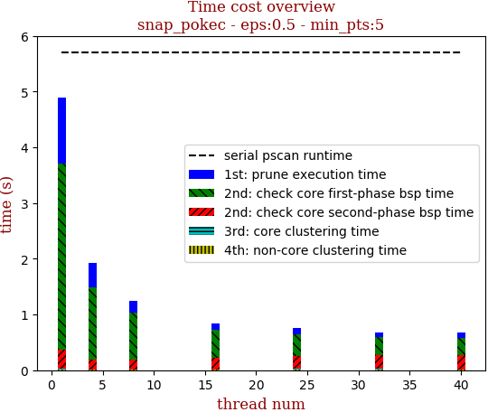 | 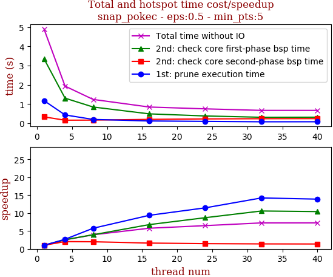

thread_num | prune | check-core 1st bsp | check-core 2nd bsp | cluster-core | cluster-non-core | total | total speedup
--- | --- | --- | --- | --- | --- | --- | ---
1 | 1.181s | 3.355s | 0.338s | 0.011s | 0.012s | 4.899s | 1.000
4 | 0.439s | 1.309s | 0.165s | 0.009s | 0.009s | 1.934s | 2.533
8 | 0.205s | 0.85s | 0.17s | 0.005s | 0.011s | 1.244s | 3.938
16 | 0.126s | 0.495s | 0.208s | 0.005s | 0.012s | 0.849s | 5.770
24 | 0.103s | 0.385s | 0.232s | 0.018s | 0.013s | 0.754s | 6.497
32 | 0.083s | 0.317s | 0.243s | 0.016s | 0.012s | 0.675s | 7.258
40 | 0.085s | 0.322s | 0.247s | 0.005s | 0.012s | 0.674s | 7.269

## eps:0.6

overview | speedup
--- | ---
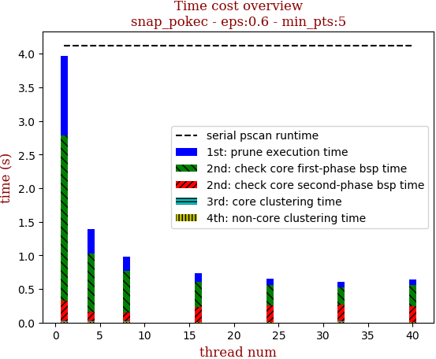 | 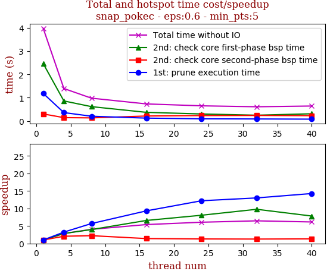

thread_num | prune | check-core 1st bsp | check-core 2nd bsp | cluster-core | cluster-non-core | total | total speedup
--- | --- | --- | --- | --- | --- | --- | ---
1 | 1.184s | 2.461s | 0.306s | 0.009s | 0.008s | 3.972s | 1.000
4 | 0.364s | 0.863s | 0.148s | 0.008s | 0.008s | 1.395s | 2.847
8 | 0.208s | 0.619s | 0.137s | 0.008s | 0.008s | 0.982s | 4.045
16 | 0.127s | 0.374s | 0.218s | 0.003s | 0.01s | 0.735s | 5.404
24 | 0.097s | 0.305s | 0.236s | 0.004s | 0.01s | 0.654s | 6.073
32 | 0.091s | 0.252s | 0.242s | 0.015s | 0.011s | 0.614s | 6.469
40 | 0.083s | 0.314s | 0.232s | 0.003s | 0.011s | 0.646s | 6.149

## eps:0.7

overview | speedup
--- | ---
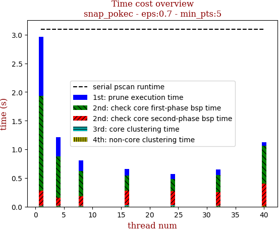 | 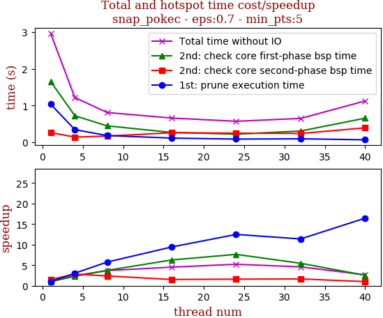

thread_num | prune | check-core 1st bsp | check-core 2nd bsp | cluster-core | cluster-non-core | total | total speedup
--- | --- | --- | --- | --- | --- | --- | ---
1 | 1.036s | 1.655s | 0.26s | 0.009s | 0.007s | 2.97s | 1.000
4 | 0.341s | 0.72s | 0.138s | 0.008s | 0.008s | 1.217s | 2.440
8 | 0.18s | 0.444s | 0.164s | 0.008s | 0.01s | 0.808s | 3.676
16 | 0.11s | 0.264s | 0.257s | 0.014s | 0.009s | 0.657s | 4.521
24 | 0.083s | 0.217s | 0.244s | 0.014s | 0.01s | 0.569s | 5.220
32 | 0.091s | 0.303s | 0.236s | 0.005s | 0.01s | 0.647s | 4.590
40 | 0.063s | 0.654s | 0.39s | 0.004s | 0.011s | 1.124s | 2.642

## eps:0.8

overview | speedup
--- | ---
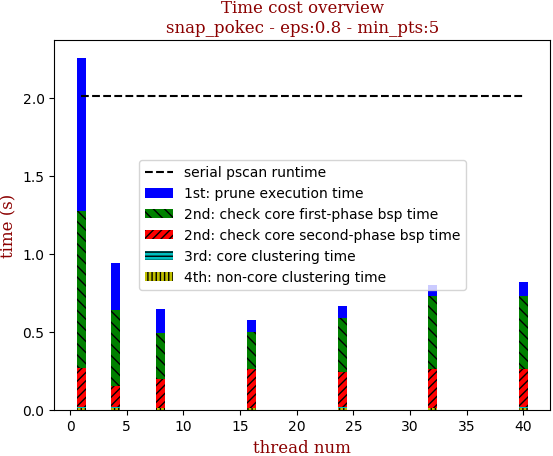 | 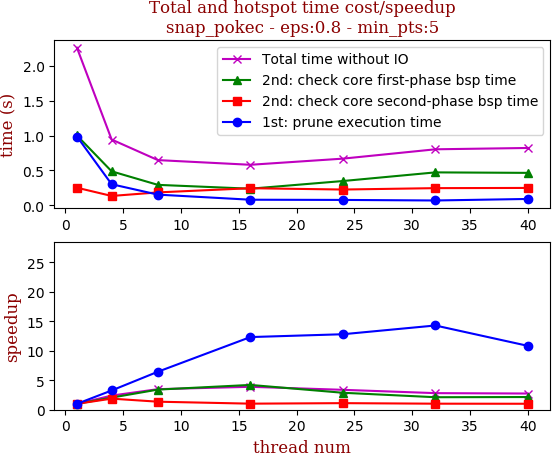

thread_num | prune | check-core 1st bsp | check-core 2nd bsp | cluster-core | cluster-non-core | total | total speedup
--- | --- | --- | --- | --- | --- | --- | ---
1 | 0.986s | 1.001s | 0.252s | 0.01s | 0.008s | 2.259s | 1.000
4 | 0.302s | 0.487s | 0.134s | 0.008s | 0.009s | 0.943s | 2.396
8 | 0.153s | 0.293s | 0.185s | 0.005s | 0.009s | 0.648s | 3.486
16 | 0.08s | 0.238s | 0.245s | 0.005s | 0.009s | 0.581s | 3.888
24 | 0.077s | 0.348s | 0.226s | 0.006s | 0.009s | 0.669s | 3.377
32 | 0.069s | 0.472s | 0.246s | 0.003s | 0.01s | 0.803s | 2.813
40 | 0.091s | 0.465s | 0.249s | 0.004s | 0.011s | 0.822s | 2.748

## eps:0.9

overview | speedup
--- | ---
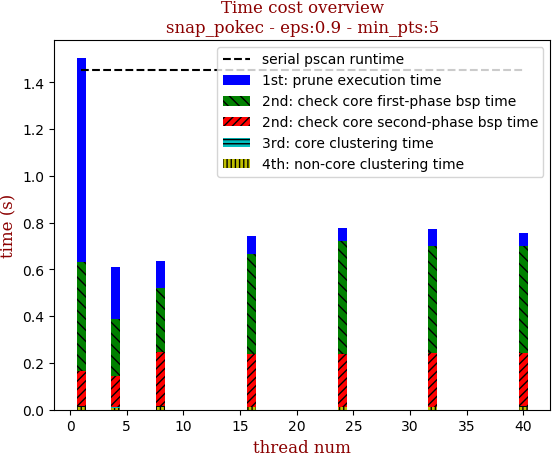 | 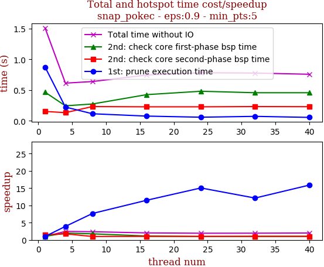

thread_num | prune | check-core 1st bsp | check-core 2nd bsp | cluster-core | cluster-non-core | total | total speedup
--- | --- | --- | --- | --- | --- | --- | ---
1 | 0.873s | 0.465s | 0.152s | 0.005s | 0.01s | 1.509s | 1.000
4 | 0.223s | 0.243s | 0.132s | 0.004s | 0.007s | 0.612s | 2.466
8 | 0.114s | 0.273s | 0.231s | 0.004s | 0.012s | 0.638s | 2.365
16 | 0.076s | 0.425s | 0.227s | 0.003s | 0.01s | 0.744s | 2.028
24 | 0.058s | 0.48s | 0.227s | 0.003s | 0.01s | 0.781s | 1.932
32 | 0.072s | 0.456s | 0.231s | 0.003s | 0.01s | 0.776s | 1.945
40 | 0.055s | 0.456s | 0.229s | 0.003s | 0.011s | 0.756s | 1.996

