## eps:0.1

overview | speedup
--- | ---
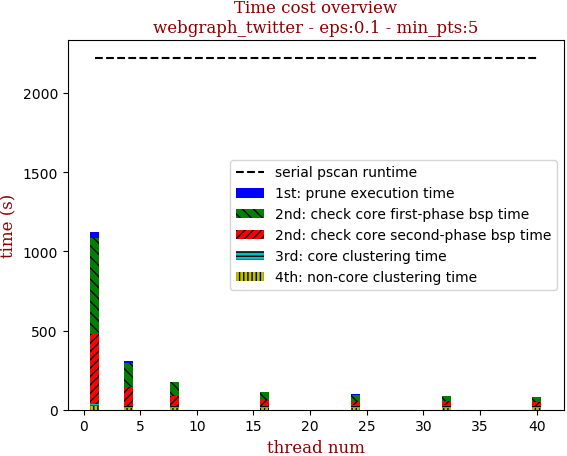 | 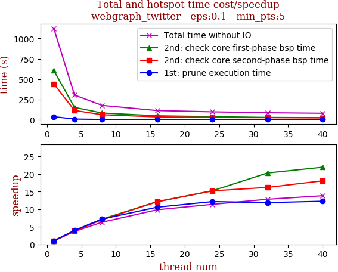

thread_num | prune | check-core 1st bsp | check-core 2nd bsp | cluster-core | cluster-non-core | total | total speedup
--- | --- | --- | --- | --- | --- | --- | ---
1 | 38.767s | 604.845s | 442.287s | 15.96s | 20.75s | 1122.613s | 1.000
4 | 9.757s | 153.054s | 115.605s | 15.764s | 10.8s | 304.982s | 3.681
8 | 5.384s | 84.192s | 63.035s | 15.874s | 9.404s | 177.892s | 6.311
16 | 3.663s | 49.681s | 36.451s | 15.886s | 8.296s | 113.98s | 9.849
24 | 3.184s | 39.663s | 29.047s | 18.131s | 8.539s | 98.567s | 11.389
32 | 3.262s | 29.782s | 27.283s | 18.377s | 8.735s | 87.441s | 12.839
40 | 3.159s | 27.547s | 24.448s | 17.541s | 8.345s | 81.043s | 13.852

## eps:0.2

overview | speedup
--- | ---
 | 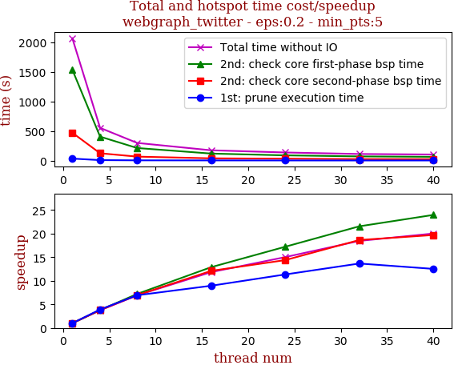

thread_num | prune | check-core 1st bsp | check-core 2nd bsp | cluster-core | cluster-non-core | total | total speedup
--- | --- | --- | --- | --- | --- | --- | ---
1 | 34.198s | 1534.689s | 470.594s | 8.942s | 16.936s | 2065.362s | 1.000
4 | 8.738s | 405.055s | 124.09s | 7.508s | 7.454s | 552.847s | 3.736
8 | 4.937s | 212.862s | 67.814s | 7.31s | 5.846s | 298.77s | 6.913
16 | 3.822s | 119.09s | 38.874s | 7.858s | 4.905s | 174.552s | 11.832
24 | 3.016s | 89.149s | 32.727s | 7.783s | 4.85s | 137.527s | 15.018
32 | 2.504s | 71.241s | 25.244s | 8.5s | 4.471s | 111.963s | 18.447
40 | 2.731s | 64.058s | 23.89s | 8.158s | 4.339s | 103.178s | 20.017

## eps:0.3

overview | speedup
--- | ---
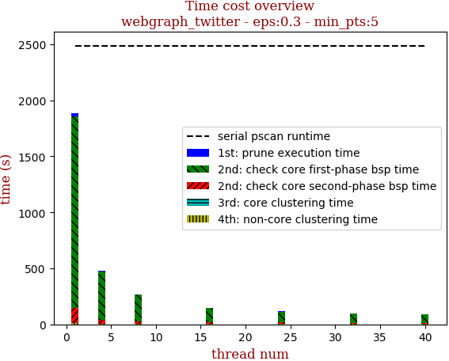 | 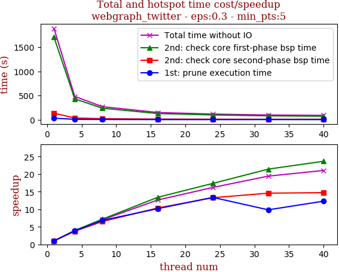

thread_num | prune | check-core 1st bsp | check-core 2nd bsp | cluster-core | cluster-non-core | total | total speedup
--- | --- | --- | --- | --- | --- | --- | ---
1 | 31.199s | 1706.851s | 133.314s | 3.642s | 10.863s | 1885.872s | 1.000
4 | 8.085s | 430.485s | 35.597s | 3.644s | 3.8s | 481.613s | 3.916
8 | 4.566s | 237.896s | 20.467s | 3.542s | 3.173s | 269.647s | 6.994
16 | 3.07s | 127.436s | 12.883s | 3.031s | 2.898s | 149.322s | 12.630
24 | 2.335s | 98.332s | 10.036s | 3.244s | 2.428s | 116.379s | 16.205
32 | 3.173s | 79.727s | 9.152s | 3.041s | 2.035s | 97.13s | 19.416
40 | 2.538s | 72.19s | 9.061s | 3.245s | 2.618s | 89.654s | 21.035

## eps:0.4

overview | speedup
--- | ---
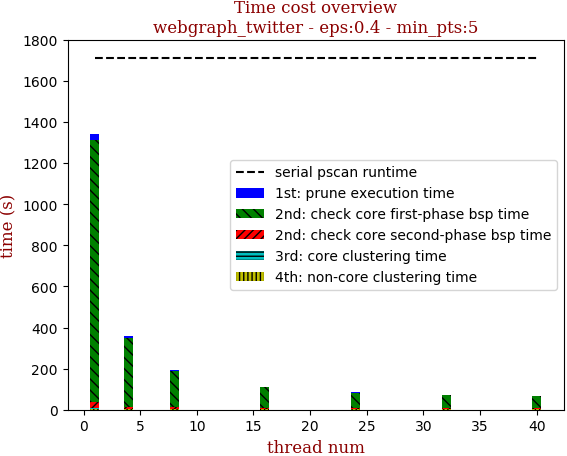 | 

thread_num | prune | check-core 1st bsp | check-core 2nd bsp | cluster-core | cluster-non-core | total | total speedup
--- | --- | --- | --- | --- | --- | --- | ---
1 | 28.819s | 1272.767s | 30.696s | 3.034s | 5.571s | 1340.89s | 1.000
4 | 7.514s | 334.287s | 9.615s | 3.689s | 1.88s | 356.988s | 3.756
8 | 4.31s | 176.41s | 6.965s | 3.04s | 1.747s | 192.475s | 6.967
16 | 3.88s | 98.745s | 5.477s | 3.003s | 1.704s | 112.812s | 11.886
24 | 2.447s | 72.618s | 4.729s | 2.604s | 1.807s | 84.208s | 15.924
32 | 3.008s | 61.344s | 4.268s | 2.648s | 1.692s | 72.962s | 18.378
40 | 2.466s | 54.954s | 4.649s | 3.581s | 1.739s | 67.391s | 19.897

## eps:0.5

overview | speedup
--- | ---
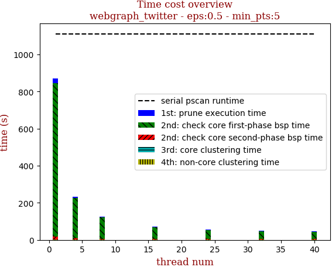 | 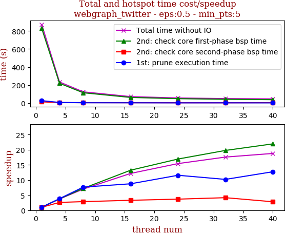

thread_num | prune | check-core 1st bsp | check-core 2nd bsp | cluster-core | cluster-non-core | total | total speedup
--- | --- | --- | --- | --- | --- | --- | ---
1 | 26.694s | 827.941s | 13.587s | 0.79s | 2.565s | 871.58s | 1.000
4 | 6.967s | 219.431s | 5.244s | 0.927s | 1.264s | 233.835s | 3.727
8 | 3.489s | 114.512s | 4.764s | 0.808s | 1.005s | 124.58s | 6.996
16 | 3.051s | 62.539s | 4.123s | 0.827s | 1.054s | 71.596s | 12.174
24 | 2.308s | 48.885s | 3.697s | 0.623s | 0.981s | 56.496s | 15.427
32 | 2.616s | 41.875s | 3.269s | 0.769s | 1.039s | 49.571s | 17.582
40 | 2.097s | 37.725s | 4.839s | 0.795s | 0.953s | 46.411s | 18.780

## eps:0.6

overview | speedup
--- | ---
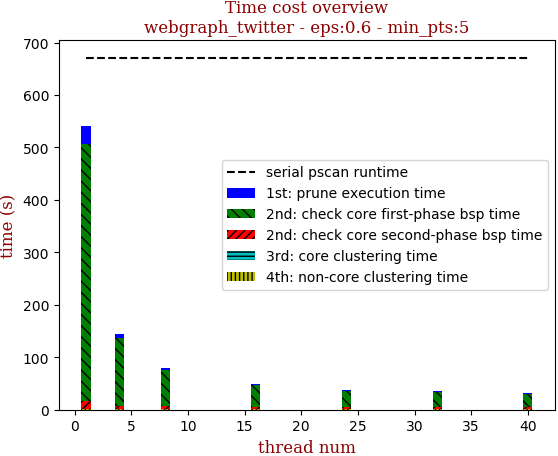 | 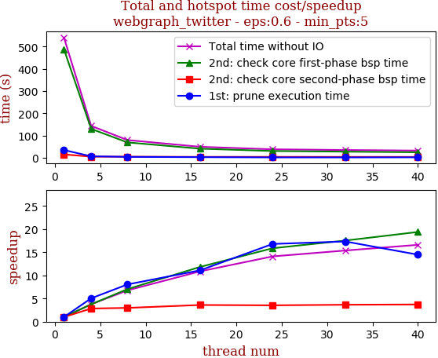

thread_num | prune | check-core 1st bsp | check-core 2nd bsp | cluster-core | cluster-non-core | total | total speedup
--- | --- | --- | --- | --- | --- | --- | ---
1 | 35.215s | 488.626s | 15.529s | 0.477s | 1.498s | 541.346s | 1.000
4 | 6.979s | 130.355s | 5.47s | 0.477s | 0.584s | 143.868s | 3.763
8 | 4.377s | 69.451s | 5.219s | 0.367s | 0.604s | 80.02s | 6.765
16 | 3.174s | 41.316s | 4.311s | 0.478s | 0.509s | 49.79s | 10.873
24 | 2.097s | 30.79s | 4.397s | 0.496s | 0.604s | 38.386s | 14.103
32 | 2.032s | 27.878s | 4.246s | 0.426s | 0.626s | 35.211s | 15.374
40 | 2.432s | 25.211s | 4.182s | 0.316s | 0.47s | 32.614s | 16.599

## eps:0.7

overview | speedup
--- | ---
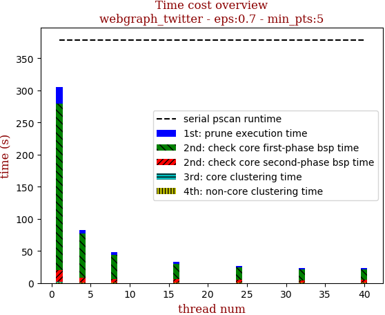 | 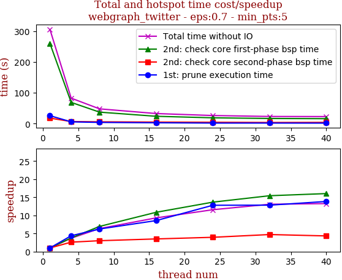

thread_num | prune | check-core 1st bsp | check-core 2nd bsp | cluster-core | cluster-non-core | total | total speedup
--- | --- | --- | --- | --- | --- | --- | ---
1 | 25.954s | 260.1s | 18.079s | 0.345s | 1.255s | 305.736s | 1.000
4 | 5.933s | 69.013s | 6.937s | 0.362s | 0.474s | 82.721s | 3.696
8 | 4.16s | 37.409s | 6.014s | 0.201s | 0.264s | 48.051s | 6.363
16 | 3.03s | 23.951s | 5.171s | 0.347s | 0.332s | 32.834s | 9.312
24 | 2.028s | 19.04s | 4.579s | 0.369s | 0.412s | 26.429s | 11.568
32 | 2.024s | 16.854s | 3.839s | 0.242s | 0.414s | 23.377s | 13.078
40 | 1.874s | 16.231s | 4.179s | 0.371s | 0.401s | 23.058s | 13.259

## eps:0.8

overview | speedup
--- | ---
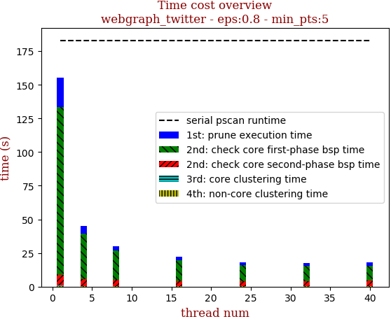 | 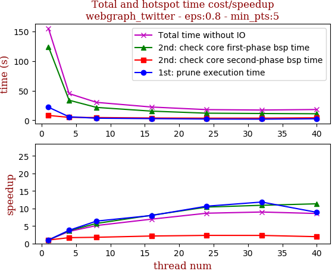

thread_num | prune | check-core 1st bsp | check-core 2nd bsp | cluster-core | cluster-non-core | total | total speedup
--- | --- | --- | --- | --- | --- | --- | ---
1 | 22.072s | 124.331s | 8.151s | 0.175s | 0.586s | 155.318s | 1.000
4 | 5.853s | 33.863s | 4.884s | 0.166s | 0.322s | 45.09s | 3.445
8 | 3.449s | 21.682s | 4.59s | 0.176s | 0.329s | 30.229s | 5.138
16 | 2.76s | 15.418s | 3.814s | 0.108s | 0.245s | 22.347s | 6.950
24 | 2.072s | 11.959s | 3.521s | 0.133s | 0.275s | 17.962s | 8.647
32 | 1.865s | 11.399s | 3.536s | 0.142s | 0.336s | 17.282s | 8.987
40 | 2.48s | 10.972s | 4.181s | 0.163s | 0.338s | 18.138s | 8.563

## eps:0.9

overview | speedup
--- | ---
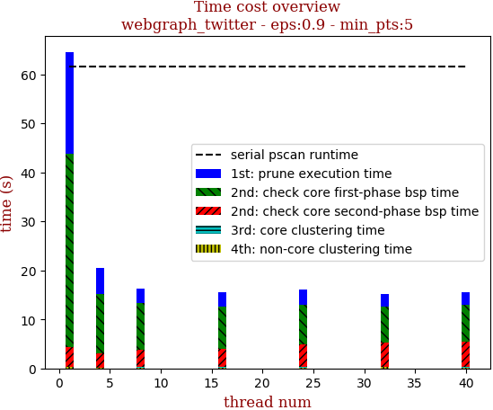 | 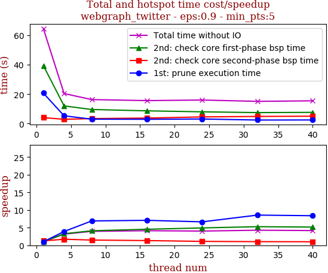

thread_num | prune | check-core 1st bsp | check-core 2nd bsp | cluster-core | cluster-non-core | total | total speedup
--- | --- | --- | --- | --- | --- | --- | ---
1 | 20.736s | 39.396s | 4.045s | 0.126s | 0.247s | 64.554s | 1.000
4 | 5.301s | 12.017s | 2.922s | 0.066s | 0.13s | 20.439s | 3.158
8 | 3.004s | 9.586s | 3.386s | 0.122s | 0.215s | 16.316s | 3.956
16 | 2.931s | 8.663s | 3.758s | 0.091s | 0.175s | 15.621s | 4.133
24 | 3.12s | 8.001s | 4.544s | 0.125s | 0.223s | 16.015s | 4.031
32 | 2.423s | 7.472s | 4.862s | 0.126s | 0.226s | 15.111s | 4.272
40 | 2.475s | 7.632s | 5.03s | 0.126s | 0.215s | 15.481s | 4.170

