## eps:0.1

overview | speedup
--- | ---
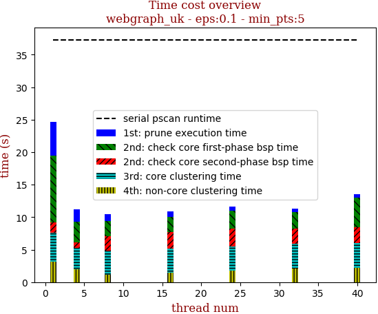 | 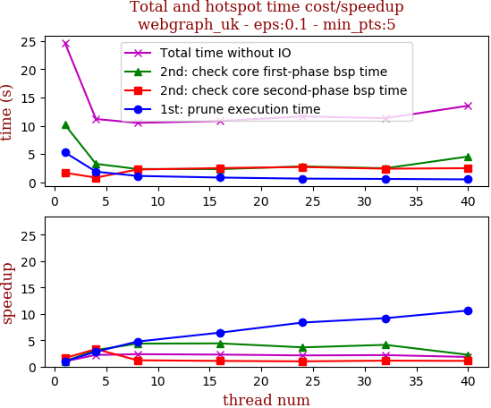

thread_num | prune | check-core 1st bsp | check-core 2nd bsp | cluster-core | cluster-non-core | total | total speedup
--- | --- | --- | --- | --- | --- | --- | ---
1 | 5.272s | 10.194s | 1.664s | 4.46s | 3.116s | 24.71s | 1.000
4 | 1.865s | 3.251s | 0.81s | 3.234s | 2.031s | 11.194s | 2.207
8 | 1.111s | 2.339s | 2.243s | 3.627s | 1.186s | 10.508s | 2.352
16 | 0.819s | 2.316s | 2.498s | 3.71s | 1.502s | 10.847s | 2.278
24 | 0.631s | 2.794s | 2.694s | 3.783s | 1.748s | 11.654s | 2.120
32 | 0.574s | 2.473s | 2.389s | 3.76s | 2.133s | 11.334s | 2.180
40 | 0.496s | 4.548s | 2.48s | 3.867s | 2.15s | 13.544s | 1.824

## eps:0.2

overview | speedup
--- | ---
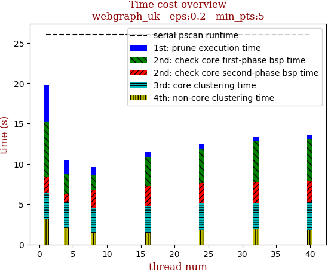 | 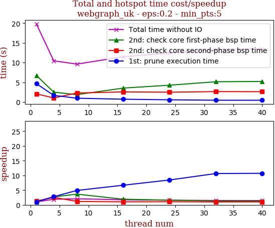

thread_num | prune | check-core 1st bsp | check-core 2nd bsp | cluster-core | cluster-non-core | total | total speedup
--- | --- | --- | --- | --- | --- | --- | ---
1 | 4.645s | 6.744s | 2.057s | 3.245s | 3.131s | 19.824s | 1.000
4 | 1.675s | 2.487s | 1.025s | 3.296s | 1.963s | 10.448s | 1.897
8 | 0.95s | 1.853s | 2.268s | 3.152s | 1.382s | 9.609s | 2.063
16 | 0.697s | 3.52s | 2.551s | 3.319s | 1.383s | 11.473s | 1.728
24 | 0.55s | 4.256s | 2.474s | 3.342s | 1.833s | 12.461s | 1.591
32 | 0.437s | 5.135s | 2.631s | 3.159s | 1.923s | 13.289s | 1.492
40 | 0.434s | 5.2s | 2.609s | 3.387s | 1.866s | 13.499s | 1.469

## eps:0.3

overview | speedup
--- | ---
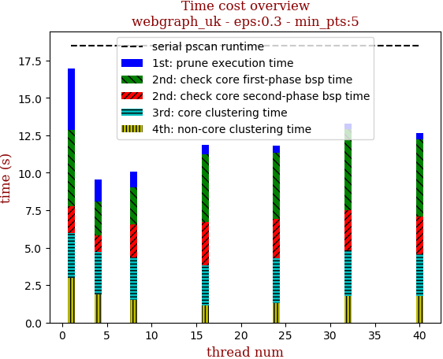 | 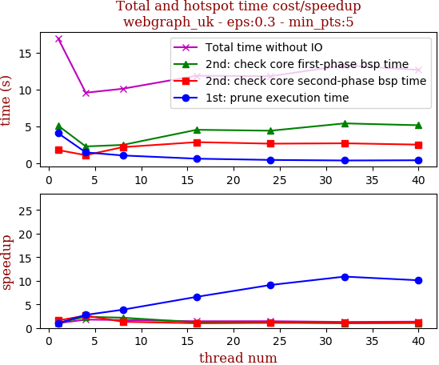

thread_num | prune | check-core 1st bsp | check-core 2nd bsp | cluster-core | cluster-non-core | total | total speedup
--- | --- | --- | --- | --- | --- | --- | ---
1 | 4.082s | 5.112s | 1.793s | 2.974s | 2.989s | 16.953s | 1.000
4 | 1.472s | 2.279s | 1.093s | 2.858s | 1.858s | 9.564s | 1.773
8 | 1.055s | 2.485s | 2.185s | 2.841s | 1.53s | 10.102s | 1.678
16 | 0.619s | 4.537s | 2.863s | 2.713s | 1.131s | 11.87s | 1.428
24 | 0.448s | 4.413s | 2.655s | 2.997s | 1.287s | 11.803s | 1.436
32 | 0.375s | 5.405s | 2.704s | 3.052s | 1.75s | 13.289s | 1.276
40 | 0.404s | 5.154s | 2.526s | 2.794s | 1.771s | 12.652s | 1.340

## eps:0.4

overview | speedup
--- | ---
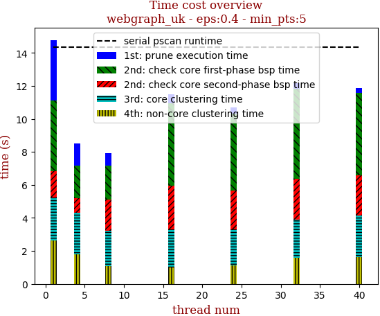 | 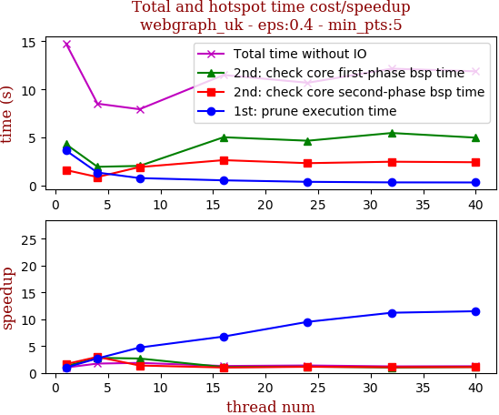

thread_num | prune | check-core 1st bsp | check-core 2nd bsp | cluster-core | cluster-non-core | total | total speedup
--- | --- | --- | --- | --- | --- | --- | ---
1 | 3.644s | 4.297s | 1.607s | 2.599s | 2.631s | 14.784s | 1.000
4 | 1.348s | 1.948s | 0.884s | 2.519s | 1.812s | 8.517s | 1.736
8 | 0.772s | 2.04s | 1.92s | 2.142s | 1.063s | 7.94s | 1.862
16 | 0.538s | 5.024s | 2.64s | 2.307s | 0.992s | 11.504s | 1.285
24 | 0.383s | 4.661s | 2.326s | 2.191s | 1.13s | 10.695s | 1.382
32 | 0.325s | 5.465s | 2.476s | 2.293s | 1.598s | 12.159s | 1.216
40 | 0.317s | 4.981s | 2.423s | 2.553s | 1.608s | 11.884s | 1.244

## eps:0.5

overview | speedup
--- | ---
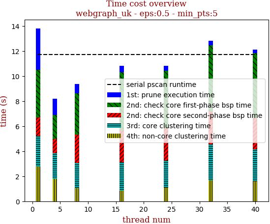 | 

thread_num | prune | check-core 1st bsp | check-core 2nd bsp | cluster-core | cluster-non-core | total | total speedup
--- | --- | --- | --- | --- | --- | --- | ---
1 | 3.286s | 3.824s | 1.493s | 2.433s | 2.765s | 13.803s | 1.000
4 | 1.308s | 1.917s | 1.13s | 2.045s | 1.797s | 8.2s | 1.683
8 | 0.739s | 3.302s | 2.25s | 2.033s | 1.03s | 9.357s | 1.475
16 | 0.485s | 4.65s | 2.533s | 2.261s | 0.862s | 10.793s | 1.279
24 | 0.366s | 4.627s | 2.547s | 2.18s | 1.079s | 10.802s | 1.278
32 | 0.353s | 5.321s | 2.622s | 2.856s | 1.674s | 12.83s | 1.076
40 | 0.283s | 5.196s | 2.491s | 2.548s | 1.588s | 12.109s | 1.140

## eps:0.6

overview | speedup
--- | ---
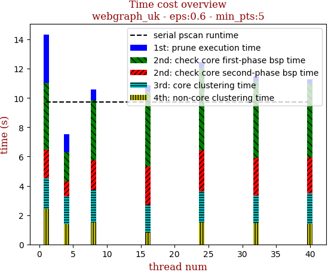 | 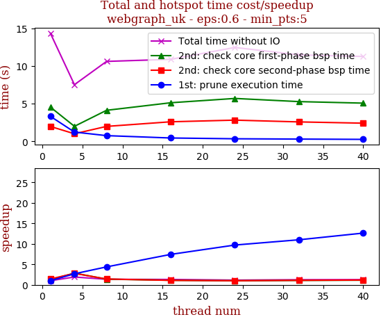

thread_num | prune | check-core 1st bsp | check-core 2nd bsp | cluster-core | cluster-non-core | total | total speedup
--- | --- | --- | --- | --- | --- | --- | ---
1 | 3.321s | 4.546s | 1.978s | 2.047s | 2.445s | 14.341s | 1.000
4 | 1.232s | 1.995s | 1.006s | 1.924s | 1.358s | 7.518s | 1.908
8 | 0.759s | 4.117s | 1.984s | 2.259s | 1.479s | 10.601s | 1.353
16 | 0.447s | 5.119s | 2.596s | 1.894s | 0.818s | 10.878s | 1.318
24 | 0.342s | 5.691s | 2.815s | 2.103s | 1.493s | 12.45s | 1.152
32 | 0.302s | 5.27s | 2.579s | 1.838s | 1.473s | 11.466s | 1.251
40 | 0.263s | 5.068s | 2.411s | 2.107s | 1.404s | 11.258s | 1.274

## eps:0.7

overview | speedup
--- | ---
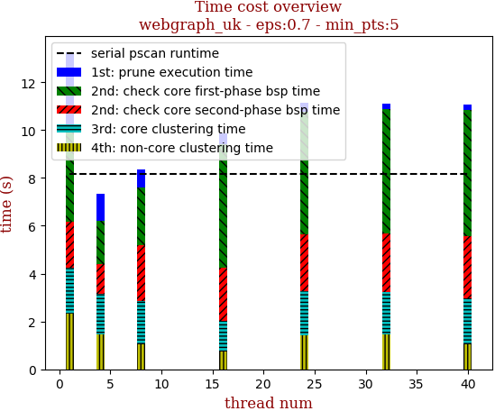 | 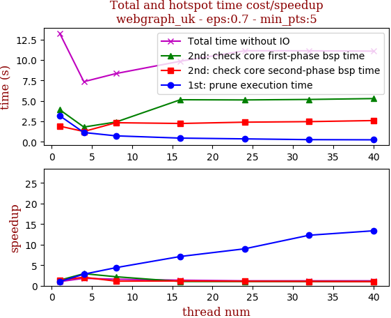

thread_num | prune | check-core 1st bsp | check-core 2nd bsp | cluster-core | cluster-non-core | total | total speedup
--- | --- | --- | --- | --- | --- | --- | ---
1 | 3.181s | 3.919s | 1.907s | 1.938s | 2.319s | 13.269s | 1.000
4 | 1.132s | 1.801s | 1.258s | 1.708s | 1.449s | 7.351s | 1.805
8 | 0.723s | 2.416s | 2.33s | 1.813s | 1.059s | 8.346s | 1.590
16 | 0.447s | 5.141s | 2.238s | 1.291s | 0.732s | 9.852s | 1.347
24 | 0.354s | 5.117s | 2.396s | 1.851s | 1.41s | 11.131s | 1.192
32 | 0.259s | 5.178s | 2.463s | 1.749s | 1.473s | 11.125s | 1.193
40 | 0.238s | 5.283s | 2.594s | 1.914s | 1.057s | 11.088s | 1.197

## eps:0.8

overview | speedup
--- | ---
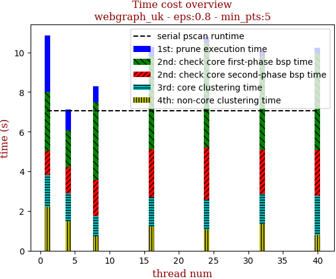 | 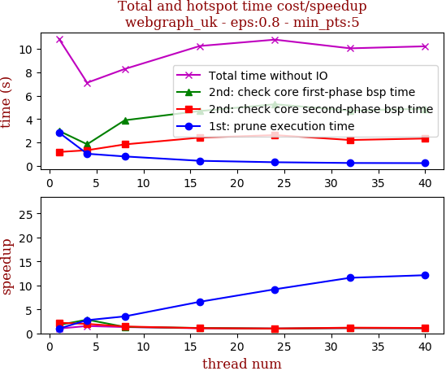

thread_num | prune | check-core 1st bsp | check-core 2nd bsp | cluster-core | cluster-non-core | total | total speedup
--- | --- | --- | --- | --- | --- | --- | ---
1 | 2.85s | 2.995s | 1.188s | 1.618s | 2.209s | 10.863s | 1.000
4 | 1.037s | 1.847s | 1.337s | 1.4s | 1.487s | 7.111s | 1.528
8 | 0.806s | 3.9s | 1.835s | 1.015s | 0.727s | 8.286s | 1.311
16 | 0.433s | 4.69s | 2.418s | 1.488s | 1.221s | 10.253s | 1.059
24 | 0.31s | 5.266s | 2.629s | 1.515s | 1.072s | 10.796s | 1.006
32 | 0.246s | 4.726s | 2.212s | 1.514s | 1.353s | 10.053s | 1.081
40 | 0.235s | 4.893s | 2.34s | 1.953s | 0.803s | 10.227s | 1.062

## eps:0.9

overview | speedup
--- | ---
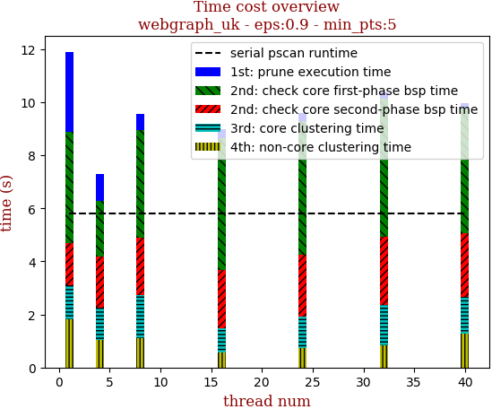 | 

thread_num | prune | check-core 1st bsp | check-core 2nd bsp | cluster-core | cluster-non-core | total | total speedup
--- | --- | --- | --- | --- | --- | --- | ---
1 | 3.022s | 4.182s | 1.588s | 1.297s | 1.812s | 11.905s | 1.000
4 | 0.992s | 2.119s | 1.923s | 1.196s | 1.05s | 7.282s | 1.635
8 | 0.606s | 4.03s | 2.179s | 1.615s | 1.114s | 9.547s | 1.247
16 | 0.336s | 4.979s | 2.207s | 0.903s | 0.563s | 8.991s | 1.324
24 | 0.275s | 5.06s | 2.318s | 1.186s | 0.74s | 9.581s | 1.243
32 | 0.239s | 5.214s | 2.575s | 1.496s | 0.845s | 10.372s | 1.148
40 | 0.225s | 4.677s | 2.406s | 1.384s | 1.283s | 9.978s | 1.193

