## eps:0.1

overview | speedup
--- | ---
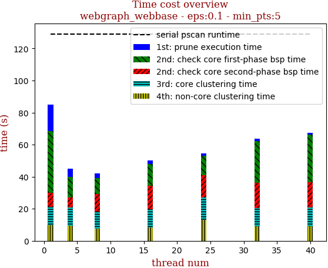 | 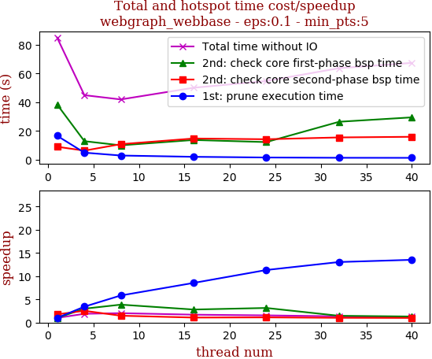

thread_num | prune | check-core 1st bsp | check-core 2nd bsp | cluster-core | cluster-non-core | total | total speedup
--- | --- | --- | --- | --- | --- | --- | ---
1 | 16.594s | 38.374s | 8.952s | 11.171s | 9.849s | 84.944s | 1.000
4 | 4.836s | 12.831s | 6.249s | 11.402s | 9.54s | 44.863s | 1.893
8 | 2.842s | 9.935s | 10.754s | 10.773s | 7.583s | 41.889s | 2.028
16 | 1.943s | 13.662s | 14.692s | 11.435s | 8.286s | 50.024s | 1.698
24 | 1.465s | 12.197s | 14.176s | 13.627s | 13.236s | 54.711s | 1.553
32 | 1.272s | 26.346s | 15.443s | 11.421s | 9.175s | 63.659s | 1.334
40 | 1.227s | 29.41s | 15.881s | 11.848s | 8.968s | 67.344s | 1.261

## eps:0.2

overview | speedup
--- | ---
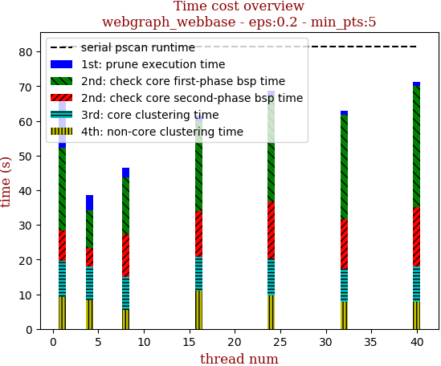 | 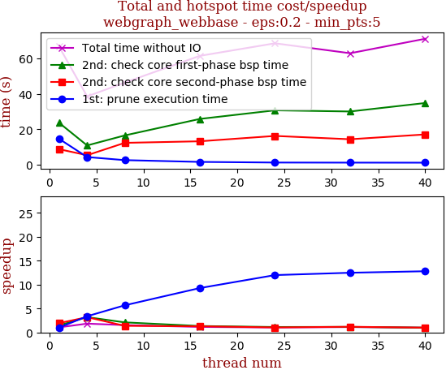

thread_num | prune | check-core 1st bsp | check-core 2nd bsp | cluster-core | cluster-non-core | total | total speedup
--- | --- | --- | --- | --- | --- | --- | ---
1 | 14.655s | 23.739s | 8.781s | 10.565s | 9.115s | 66.861s | 1.000
4 | 4.325s | 10.882s | 5.354s | 9.859s | 8.166s | 38.595s | 1.732
8 | 2.583s | 16.54s | 12.347s | 9.472s | 5.437s | 46.387s | 1.441
16 | 1.579s | 25.865s | 13.233s | 9.789s | 11.041s | 61.514s | 1.087
24 | 1.222s | 30.731s | 16.261s | 10.7s | 9.686s | 68.606s | 0.975
32 | 1.174s | 30.075s | 14.379s | 9.647s | 7.704s | 62.985s | 1.062
40 | 1.145s | 34.866s | 17.105s | 10.326s | 7.724s | 71.174s | 0.939

## eps:0.3

overview | speedup
--- | ---
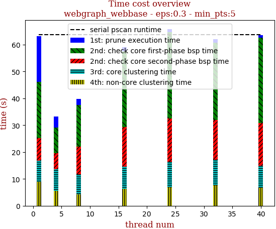 | 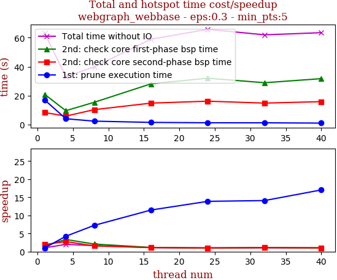

thread_num | prune | check-core 1st bsp | check-core 2nd bsp | cluster-core | cluster-non-core | total | total speedup
--- | --- | --- | --- | --- | --- | --- | ---
1 | 17.085s | 20.944s | 8.325s | 7.812s | 8.984s | 63.158s | 1.000
4 | 4.029s | 9.589s | 5.839s | 8.159s | 5.527s | 33.15s | 1.905
8 | 2.359s | 15.391s | 10.302s | 7.469s | 4.308s | 39.832s | 1.586
16 | 1.488s | 28.151s | 14.821s | 8.246s | 6.291s | 58.999s | 1.070
24 | 1.231s | 32.053s | 16.152s | 9.489s | 6.895s | 65.822s | 0.960
32 | 1.212s | 28.904s | 14.828s | 9.462s | 7.608s | 62.017s | 1.018
40 | 1.003s | 31.736s | 15.844s | 8.285s | 6.635s | 63.506s | 0.995

## eps:0.4

overview | speedup
--- | ---
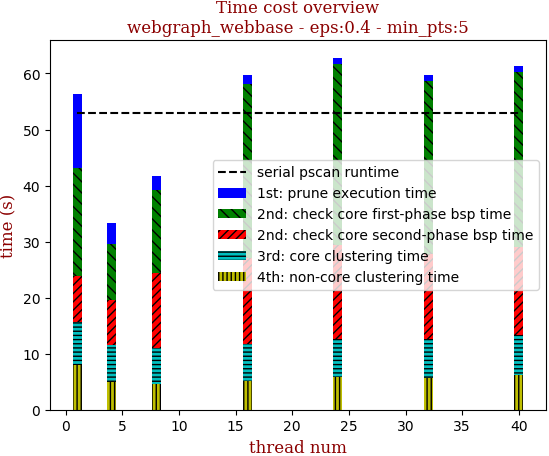 | 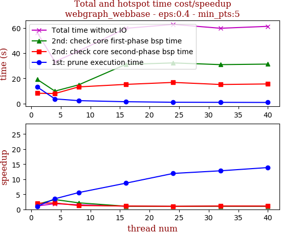

thread_num | prune | check-core 1st bsp | check-core 2nd bsp | cluster-core | cluster-non-core | total | total speedup
--- | --- | --- | --- | --- | --- | --- | ---
1 | 13.252s | 19.254s | 8.264s | 7.623s | 8.035s | 56.431s | 1.000
4 | 3.771s | 9.93s | 7.986s | 6.681s | 4.895s | 33.266s | 1.696
8 | 2.382s | 14.878s | 13.275s | 6.507s | 4.577s | 41.622s | 1.356
16 | 1.524s | 31.148s | 15.275s | 6.633s | 5.125s | 59.707s | 0.945
24 | 1.111s | 32.286s | 16.834s | 6.788s | 5.794s | 62.816s | 0.898
32 | 1.035s | 30.932s | 15.178s | 6.982s | 5.636s | 59.764s | 0.944
40 | 0.955s | 31.357s | 15.622s | 7.228s | 6.119s | 61.283s | 0.921

## eps:0.5

overview | speedup
--- | ---
 | 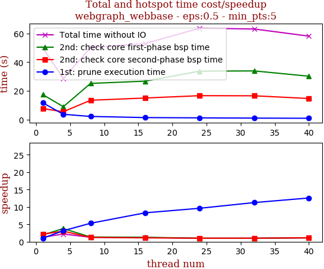

thread_num | prune | check-core 1st bsp | check-core 2nd bsp | cluster-core | cluster-non-core | total | total speedup
--- | --- | --- | --- | --- | --- | --- | ---
1 | 11.681s | 17.404s | 7.667s | 6.444s | 6.774s | 49.971s | 1.000
4 | 3.7s | 8.971s | 5.495s | 5.942s | 4.59s | 28.7s | 1.741
8 | 2.203s | 25.213s | 13.482s | 5.247s | 3.984s | 50.131s | 0.997
16 | 1.406s | 26.778s | 15.038s | 6.031s | 3.741s | 52.997s | 0.943
24 | 1.215s | 33.741s | 16.669s | 6.898s | 5.159s | 63.685s | 0.785
32 | 1.038s | 33.916s | 16.58s | 6.401s | 5.168s | 63.105s | 0.792
40 | 0.929s | 30.213s | 14.696s | 6.426s | 5.869s | 58.136s | 0.860

## eps:0.6

overview | speedup
--- | ---
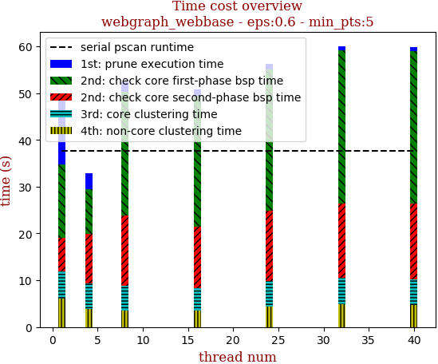 | 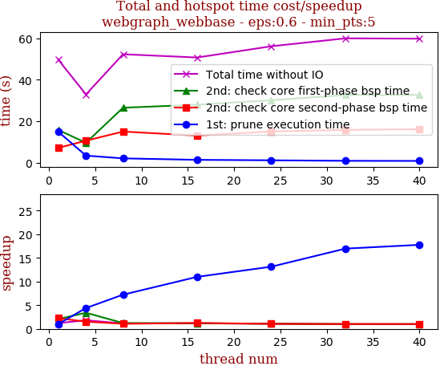

thread_num | prune | check-core 1st bsp | check-core 2nd bsp | cluster-core | cluster-non-core | total | total speedup
--- | --- | --- | --- | --- | --- | --- | ---
1 | 14.992s | 15.813s | 7.133s | 5.788s | 6.091s | 49.819s | 1.000
4 | 3.404s | 9.61s | 10.613s | 5.382s | 3.941s | 32.953s | 1.512
8 | 2.075s | 26.536s | 15.023s | 5.18s | 3.561s | 52.378s | 0.951
16 | 1.364s | 27.99s | 13.086s | 4.735s | 3.616s | 50.793s | 0.981
24 | 1.141s | 30.136s | 15.064s | 5.527s | 4.351s | 56.223s | 0.886
32 | 0.884s | 32.708s | 15.851s | 5.771s | 4.841s | 60.057s | 0.830
40 | 0.844s | 32.709s | 16.123s | 5.522s | 4.689s | 59.89s | 0.832

## eps:0.7

overview | speedup
--- | ---
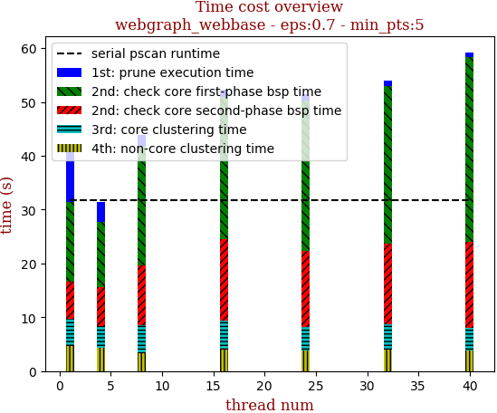 | 

thread_num | prune | check-core 1st bsp | check-core 2nd bsp | cluster-core | cluster-non-core | total | total speedup
--- | --- | --- | --- | --- | --- | --- | ---
1 | 10.699s | 14.903s | 6.879s | 5.063s | 4.611s | 42.157s | 1.000
4 | 3.557s | 12.158s | 7.267s | 4.05s | 4.305s | 31.339s | 1.345
8 | 2.183s | 21.972s | 11.123s | 5.233s | 3.34s | 43.854s | 0.961
16 | 1.388s | 26.46s | 15.149s | 5.442s | 3.931s | 52.373s | 0.805
24 | 1.098s | 28.049s | 14.161s | 4.324s | 3.792s | 51.427s | 0.820
32 | 0.924s | 29.308s | 15.003s | 4.778s | 3.928s | 53.945s | 0.781
40 | 0.817s | 34.45s | 15.977s | 4.126s | 3.862s | 59.236s | 0.712

## eps:0.8

overview | speedup
--- | ---
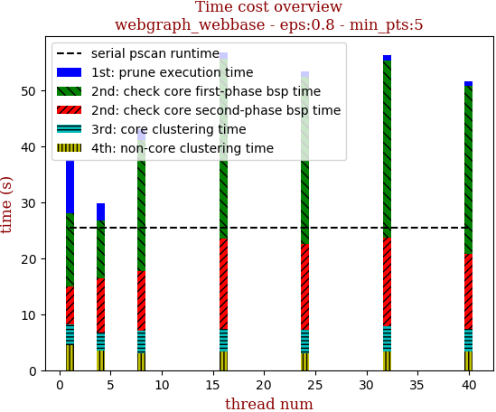 | 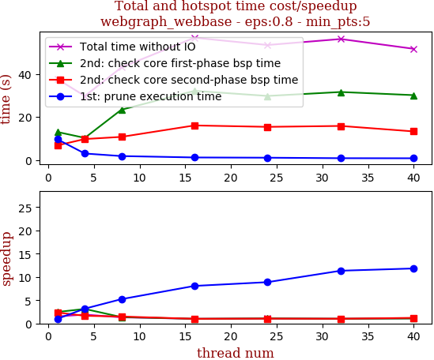

thread_num | prune | check-core 1st bsp | check-core 2nd bsp | cluster-core | cluster-non-core | total | total speedup
--- | --- | --- | --- | --- | --- | --- | ---
1 | 9.634s | 13.026s | 6.809s | 3.648s | 4.491s | 37.611s | 1.000
4 | 3.028s | 10.284s | 9.744s | 3.223s | 3.451s | 29.737s | 1.265
8 | 1.845s | 23.35s | 10.746s | 3.952s | 3.057s | 42.957s | 0.876
16 | 1.194s | 32.119s | 16.058s | 3.986s | 3.422s | 56.784s | 0.662
24 | 1.085s | 29.746s | 15.402s | 4.169s | 2.991s | 53.396s | 0.704
32 | 0.85s | 31.585s | 15.828s | 4.533s | 3.376s | 56.175s | 0.670
40 | 0.815s | 30.118s | 13.28s | 4.072s | 3.339s | 51.627s | 0.729

## eps:0.9

overview | speedup
--- | ---
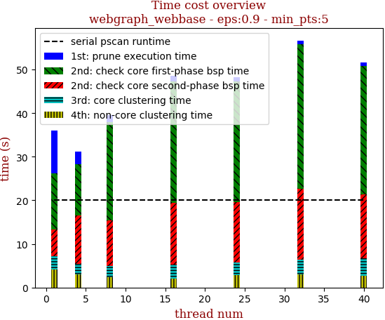 | 

thread_num | prune | check-core 1st bsp | check-core 2nd bsp | cluster-core | cluster-non-core | total | total speedup
--- | --- | --- | --- | --- | --- | --- | ---
1 | 9.95s | 12.79s | 6.089s | 3.066s | 4.19s | 36.091s | 1.000
4 | 2.84s | 11.777s | 11.03s | 2.554s | 2.953s | 31.157s | 1.158
8 | 1.619s | 22.641s | 10.359s | 2.561s | 2.449s | 39.635s | 0.911
16 | 1.165s | 27.974s | 14.022s | 3.25s | 2.097s | 48.514s | 0.744
24 | 0.94s | 27.819s | 13.731s | 3.013s | 2.783s | 48.29s | 0.747
32 | 0.808s | 33.216s | 16.313s | 3.4s | 2.934s | 56.673s | 0.637
40 | 0.728s | 29.419s | 14.767s | 4.014s | 2.662s | 51.593s | 0.700

