dataset | scalability link
--- | ---
small_snap_dblp | [small_snap_dblp.md](small_snap_dblp.md)
snap_pokec | [snap_pokec.md](snap_pokec.md)
snap_livejournal | [snap_livejournal.md](snap_livejournal.md)
snap_orkut | [snap_orkut.md](snap_orkut.md)
webgraph_uk | [webgraph_uk.md](webgraph_uk.md)
webgraph_webbase | [webgraph_webbase.md](webgraph_webbase.md)
webgraph_twitter | [webgraph_twitter.md](webgraph_twitter.md)
snap_friendster | [snap_friendster.md](snap_friendster.md)

## eps:0.1

with 40 full logical threads | with best thread num
--- | ---
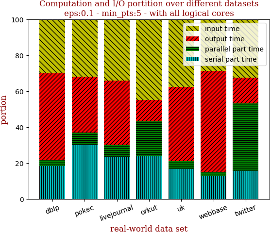 | 

with 40 full logical threads | with best thread num
--- | ---
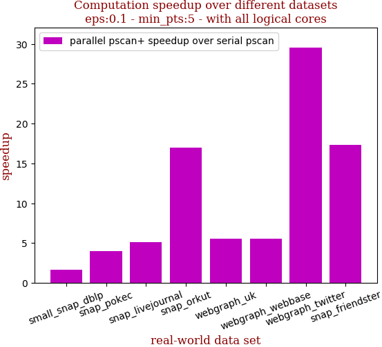 | 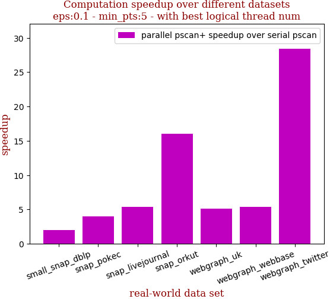

```zsh
best performance thread_num_lst:[40, 32, 24, 40, 32, 32, 40, 40]
```

dataset | edge num | pscan runtime | pscan+ 40 logical-core full speedup | pscan+ best thread_num speedup | thread_num choice
--- | --- | --- | --- | --- | ---
small_snap_dblp | 2,099,732 | 0.318s | 2.013 | 2.013 | 40
snap_pokec | 30,282,866 | 6.925s | 3.919 | 4.003 | 32
snap_livejournal | 69,362,378 | 16.088s | 5.232 | 5.400 | 24
snap_orkut | 234,370,166 | 149.207s | 16.008 | 16.008 | 40
webgraph_uk | 301,136,554 | 37.3s | 5.022 | 5.134 | 32
webgraph_webbase | 1,050,026,736 | 129.071s | 5.328 | 5.385 | 32
webgraph_twitter | 1,369,000,750 | 2223.316s | 28.366 | 28.366 | 40
snap_friendster | 3,612,134,270 | 4959.734s | 16.183 | 16.183 | 40

## eps:0.2

with 40 full logical threads | with best thread num
--- | ---
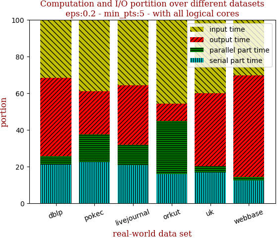 | 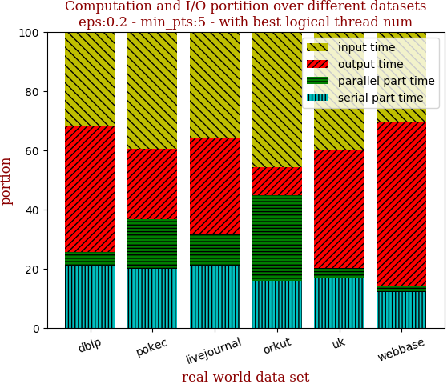

with 40 full logical threads | with best thread num
--- | ---
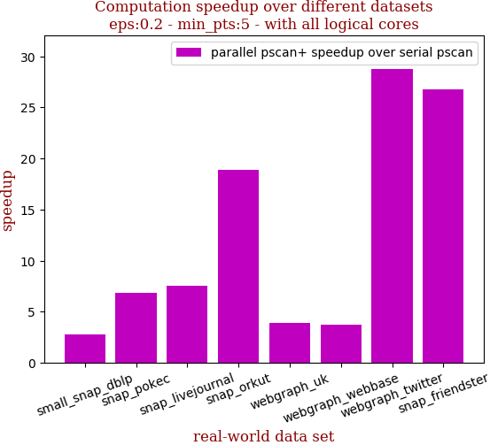 | 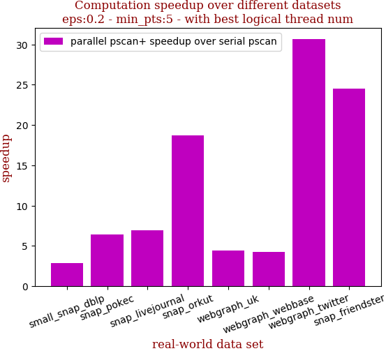

```zsh
best performance thread_num_lst:[40, 24, 40, 40, 40, 32, 40, 40]
```

dataset | edge num | pscan runtime | pscan+ 40 logical-core full speedup | pscan+ best thread_num speedup | thread_num choice
--- | --- | --- | --- | --- | ---
small_snap_dblp | 2,099,732 | 0.504s | 2.816 | 2.816 | 40
snap_pokec | 30,282,866 | 10.004s | 6.843 | 7.040 | 24
snap_livejournal | 69,362,378 | 23.072s | 7.498 | 7.498 | 40
snap_orkut | 234,370,166 | 179.55s | 18.874 | 18.874 | 40
webgraph_uk | 301,136,554 | 26.048s | 3.888 | 3.888 | 40
webgraph_webbase | 1,050,026,736 | 81.475s | 3.772 | 3.781 | 32
webgraph_twitter | 1,369,000,750 | 2973.869s | 28.712 | 28.712 | 40
snap_friendster | 3,612,134,270 | 4673.88s | 26.781 | 26.781 | 40

## eps:0.3

with 40 full logical threads | with best thread num
--- | ---
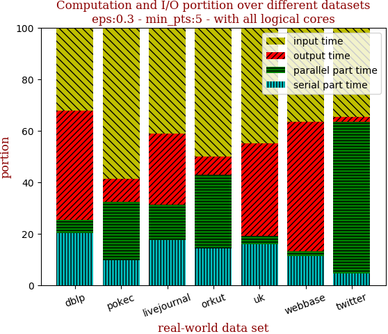 | 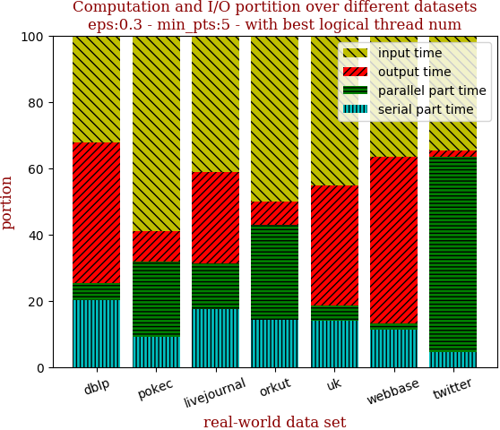

with 40 full logical threads | with best thread num
--- | ---
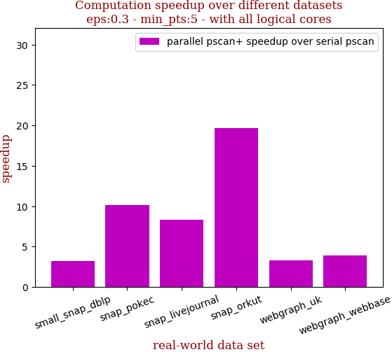 | 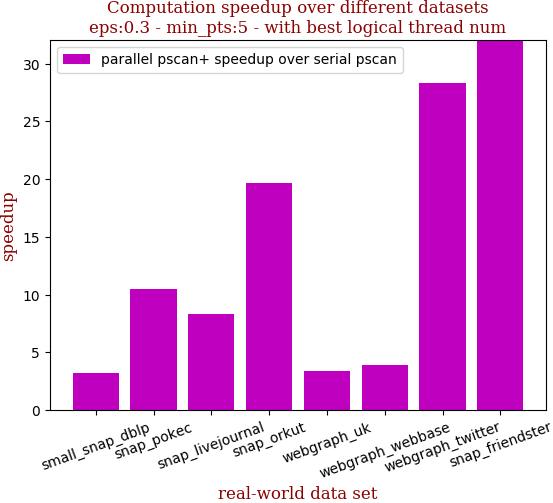

```zsh
best performance thread_num_lst:[40, 32, 40, 40, 16, 40, 40, 40]
```

dataset | edge num | pscan runtime | pscan+ 40 logical-core full speedup | pscan+ best thread_num speedup | thread_num choice
--- | --- | --- | --- | --- | ---
small_snap_dblp | 2,099,732 | 0.555s | 3.171 | 3.171 | 40
snap_pokec | 30,282,866 | 8.597s | 10.162 | 10.446 | 32
snap_livejournal | 69,362,378 | 21.846s | 8.319 | 8.319 | 40
snap_orkut | 234,370,166 | 164.248s | 19.668 | 19.668 | 40
webgraph_uk | 301,136,554 | 18.498s | 3.264 | 3.403 | 16
webgraph_webbase | 1,050,026,736 | 63.705s | 3.879 | 3.879 | 40
webgraph_twitter | 1,369,000,750 | 2487.317s | 28.301 | 28.301 | 40
snap_friendster | 3,612,134,270 | 3726.302s | 32.207 | 32.207 | 40

## eps:0.4

with 40 full logical threads | with best thread num
--- | ---
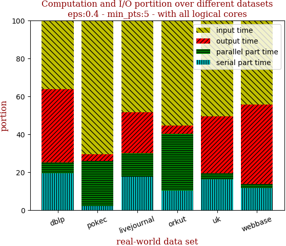 | 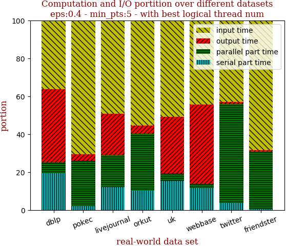

with 40 full logical threads | with best thread num
--- | ---
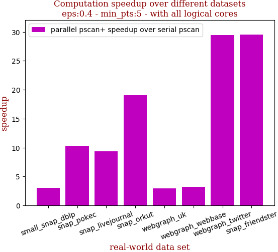 | 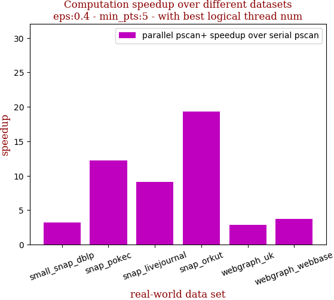

```zsh
best performance thread_num_lst:[40, 40, 24, 40, 32, 40, 40, 40]
```

dataset | edge num | pscan runtime | pscan+ 40 logical-core full speedup | pscan+ best thread_num speedup | thread_num choice
--- | --- | --- | --- | --- | ---
small_snap_dblp | 2,099,732 | 0.491s | 3.188 | 3.188 | 40
snap_pokec | 30,282,866 | 6.82s | 12.244 | 12.244 | 40
snap_livejournal | 69,362,378 | 18.37s | 8.612 | 9.076 | 24
snap_orkut | 234,370,166 | 135.772s | 19.275 | 19.275 | 40
webgraph_uk | 301,136,554 | 14.356s | 2.839 | 2.890 | 32
webgraph_webbase | 1,050,026,736 | 52.978s | 3.724 | 3.724 | 40
webgraph_twitter | 1,369,000,750 | 1712.815s | 27.522 | 27.522 | 40
snap_friendster | 3,612,134,270 | 2801.607s | 28.934 | 28.934 | 40

## eps:0.5

with 40 full logical threads | with best thread num
--- | ---
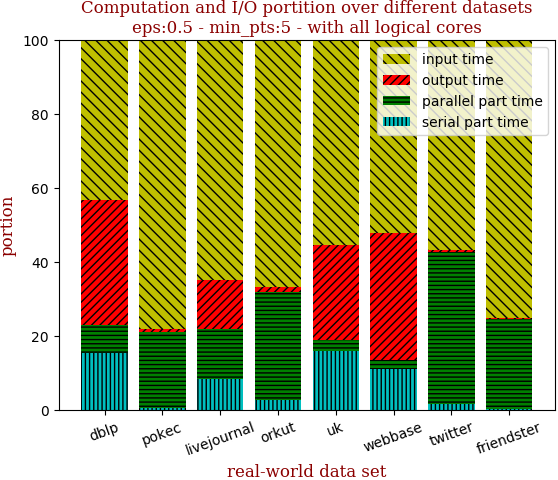 | 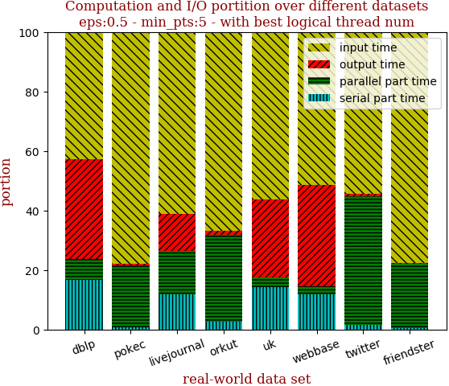

with 40 full logical threads | with best thread num
--- | ---
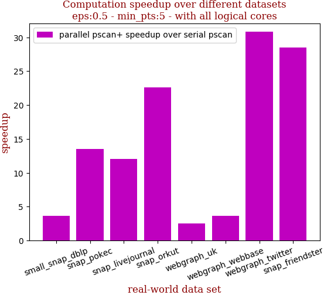 | 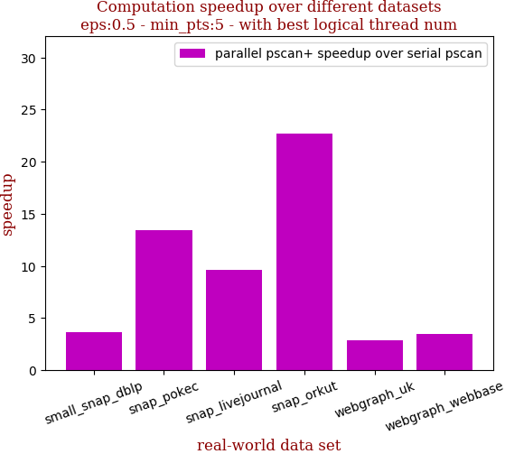

```zsh
best performance thread_num_lst:[40, 40, 40, 40, 32, 40, 40, 40]
```

dataset | edge num | pscan runtime | pscan+ 40 logical-core full speedup | pscan+ best thread_num speedup | thread_num choice
--- | --- | --- | --- | --- | ---
small_snap_dblp | 2,099,732 | 0.441s | 3.645 | 3.645 | 40
snap_pokec | 30,282,866 | 5.709s | 13.465 | 13.465 | 40
snap_livejournal | 69,362,378 | 14.317s | 9.628 | 9.628 | 40
snap_orkut | 234,370,166 | 105.36s | 22.726 | 22.726 | 40
webgraph_uk | 301,136,554 | 11.721s | 2.566 | 2.827 | 32
webgraph_webbase | 1,050,026,736 | 45.006s | 3.436 | 3.436 | 40
webgraph_twitter | 1,369,000,750 | 1112.027s | 28.133 | 28.133 | 40
snap_friendster | 3,612,134,270 | 2019.334s | 32.939 | 32.939 | 40

## eps:0.6

with 40 full logical threads | with best thread num
--- | ---
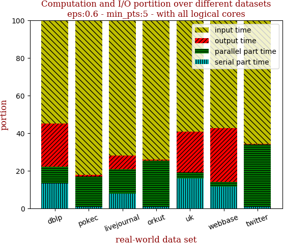 | 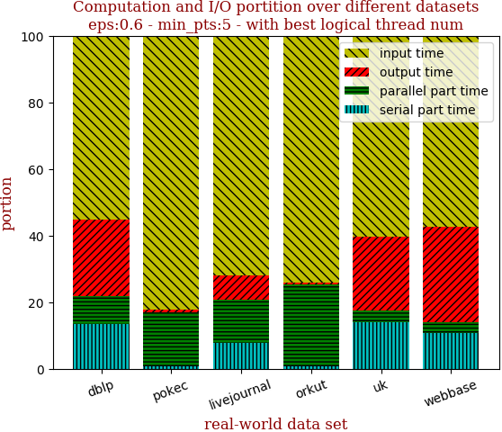

with 40 full logical threads | with best thread num
--- | ---
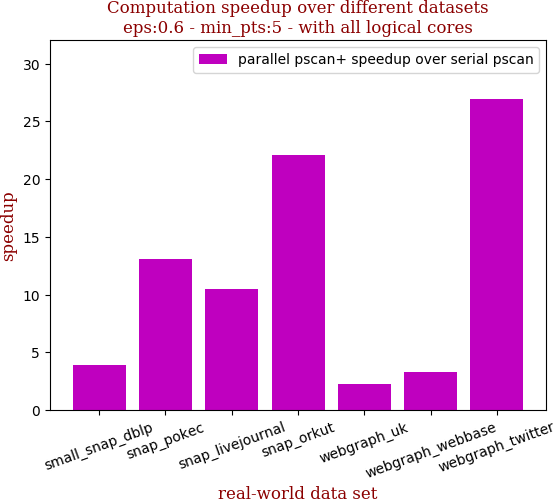 | 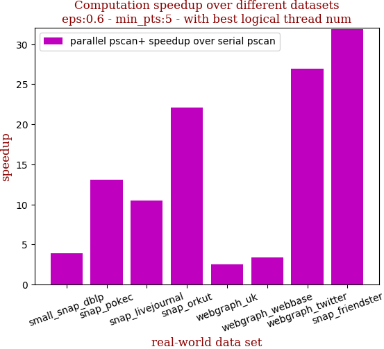

```zsh
best performance thread_num_lst:[32, 40, 40, 40, 32, 24, 40, 40]
```

dataset | edge num | pscan runtime | pscan+ 40 logical-core full speedup | pscan+ best thread_num speedup | thread_num choice
--- | --- | --- | --- | --- | ---
small_snap_dblp | 2,099,732 | 0.346s | 3.888 | 3.932 | 32
snap_pokec | 30,282,866 | 4.122s | 13.086 | 13.086 | 40
snap_livejournal | 69,362,378 | 10.49s | 10.459 | 10.459 | 40
snap_orkut | 234,370,166 | 73.887s | 22.115 | 22.115 | 40
webgraph_uk | 301,136,554 | 9.737s | 2.278 | 2.523 | 32
webgraph_webbase | 1,050,026,736 | 37.624s | 3.339 | 3.355 | 24
webgraph_twitter | 1,369,000,750 | 671.103s | 26.970 | 26.970 | 40
snap_friendster | 3,612,134,270 | 1382.493s | 31.894 | 31.894 | 40

## eps:0.7

with 40 full logical threads | with best thread num
--- | ---
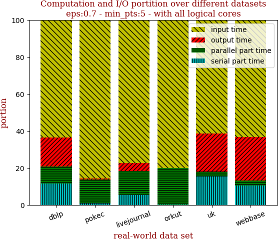 | 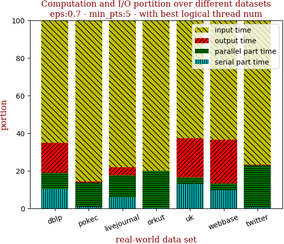

with 40 full logical threads | with best thread num
--- | ---
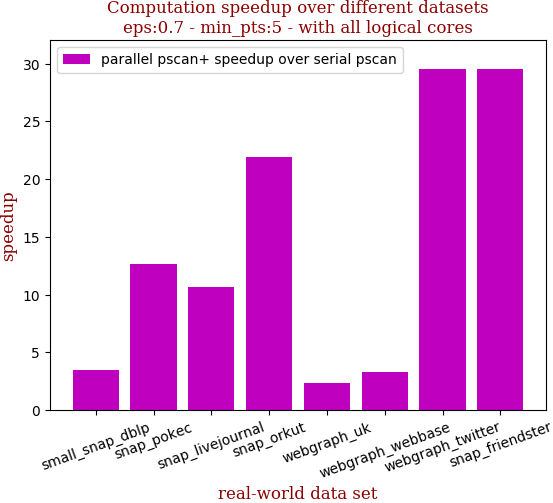 | 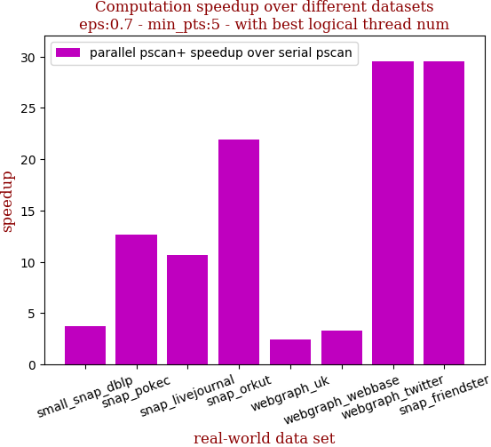

```zsh
best performance thread_num_lst:[24, 40, 32, 40, 24, 16, 40, 40]
```

dataset | edge num | pscan runtime | pscan+ 40 logical-core full speedup | pscan+ best thread_num speedup | thread_num choice
--- | --- | --- | --- | --- | ---
small_snap_dblp | 2,099,732 | 0.245s | 3.311 | 3.712 | 24
snap_pokec | 30,282,866 | 3.098s | 12.543 | 12.543 | 40
snap_livejournal | 69,362,378 | 7.404s | 8.964 | 9.554 | 32
snap_orkut | 234,370,166 | 48.46s | 20.066 | 20.066 | 40
webgraph_uk | 301,136,554 | 8.152s | 2.085 | 2.353 | 24
webgraph_webbase | 1,050,026,736 | 31.675s | 3.338 | 3.349 | 16
webgraph_twitter | 1,369,000,750 | 378.662s | 26.334 | 26.334 | 40
snap_friendster | 3,612,134,270 | 881.861s | 27.477 | 27.477 | 40

## eps:0.8

with 40 full logical threads | with best thread num
--- | ---
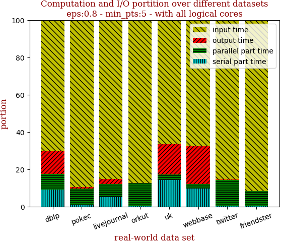 | 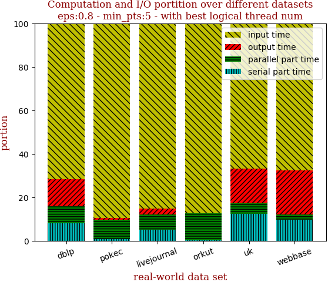

with 40 full logical threads | with best thread num
--- | ---
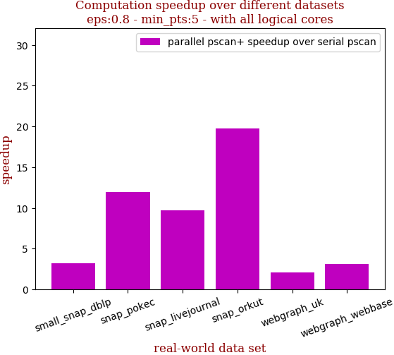 | 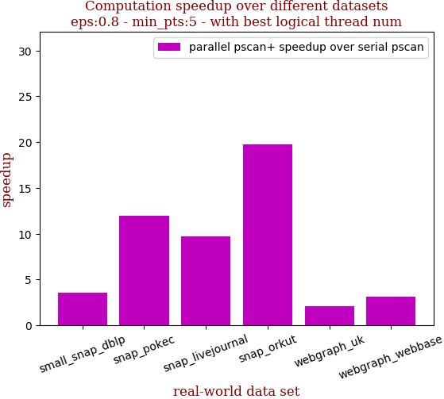

```zsh
best performance thread_num_lst:[32, 40, 40, 40, 16, 32, 40, 40]
```

dataset | edge num | pscan runtime | pscan+ 40 logical-core full speedup | pscan+ best thread_num speedup | thread_num choice
--- | --- | --- | --- | --- | ---
small_snap_dblp | 2,099,732 | 0.183s | 3.211 | 3.588 | 32
snap_pokec | 30,282,866 | 2.009s | 11.958 | 11.958 | 40
snap_livejournal | 69,362,378 | 4.797s | 9.691 | 9.691 | 40
snap_orkut | 234,370,166 | 27.708s | 19.777 | 19.777 | 40
webgraph_uk | 301,136,554 | 7.054s | 2.046 | 2.069 | 16
webgraph_webbase | 1,050,026,736 | 25.399s | 3.098 | 3.118 | 32
webgraph_twitter | 1,369,000,750 | 183.012s | 22.919 | 22.919 | 40
snap_friendster | 3,612,134,270 | 509.733s | 26.520 | 26.520 | 40

## eps:0.9

with 40 full logical threads | with best thread num
--- | ---
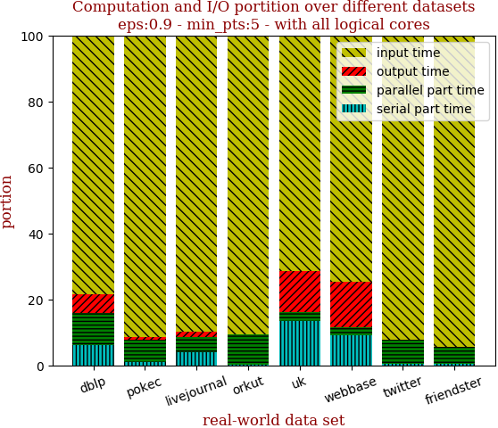 | 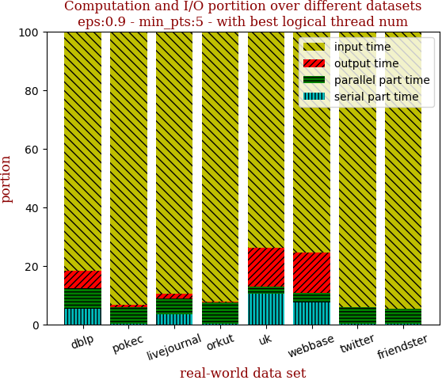

with 40 full logical threads | with best thread num
--- | ---
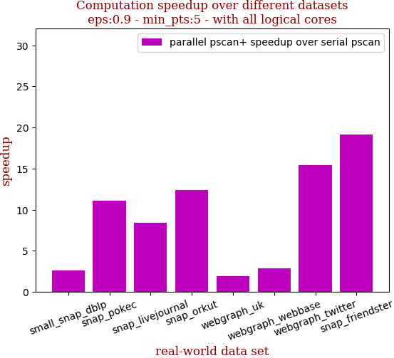 | 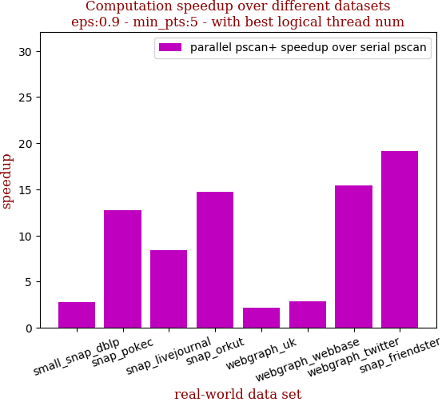

```zsh
best performance thread_num_lst:[24, 32, 40, 32, 24, 32, 40, 40]
```

dataset | edge num | pscan runtime | pscan+ 40 logical-core full speedup | pscan+ best thread_num speedup | thread_num choice
--- | --- | --- | --- | --- | ---
small_snap_dblp | 2,099,732 | 0.121s | 2.574 | 2.814 | 24
snap_pokec | 30,282,866 | 1.453s | 11.092 | 12.746 | 32
snap_livejournal | 69,362,378 | 2.753s | 8.419 | 8.419 | 40
snap_orkut | 234,370,166 | 12.535s | 12.374 | 14.764 | 32
webgraph_uk | 301,136,554 | 5.814s | 1.946 | 2.203 | 24
webgraph_webbase | 1,050,026,736 | 20.091s | 2.829 | 2.885 | 32
webgraph_twitter | 1,369,000,750 | 61.578s | 15.391 | 15.391 | 40
snap_friendster | 3,612,134,270 | 245.702s | 19.182 | 19.182 | 40

