## eps:0.1

overview | speedup
--- | ---
 | 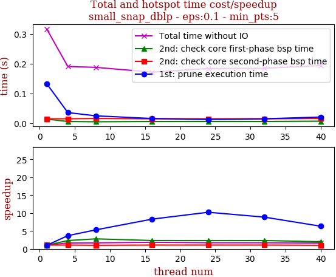

thread_num | prune | check-core 1st bsp | check-core 2nd bsp | cluster-core | cluster-non-core | total | total speedup
--- | --- | --- | --- | --- | --- | --- | ---
1 | 0.133s | 0.014s | 0.015s | 0.088s | 0.058s | 0.317s | 1.000
4 | 0.036s | 0.006s | 0.015s | 0.09s | 0.034s | 0.191s | 1.660
8 | 0.025s | 0.005s | 0.016s | 0.094s | 0.039s | 0.188s | 1.686
16 | 0.016s | 0.006s | 0.015s | 0.083s | 0.042s | 0.172s | 1.843
24 | 0.013s | 0.006s | 0.015s | 0.095s | 0.045s | 0.184s | 1.723
32 | 0.015s | 0.006s | 0.015s | 0.093s | 0.046s | 0.185s | 1.714
40 | 0.021s | 0.007s | 0.016s | 0.095s | 0.047s | 0.194s | 1.634

## eps:0.2

overview | speedup
--- | ---
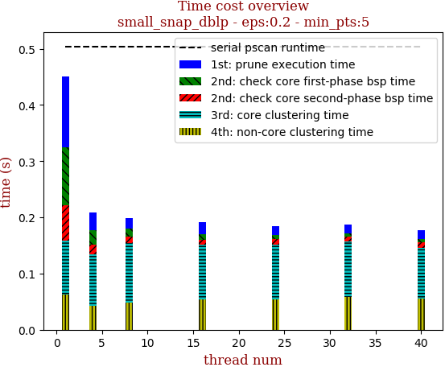 | 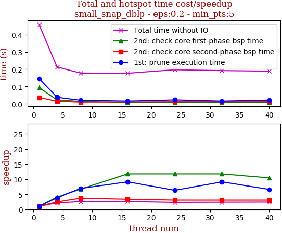

thread_num | prune | check-core 1st bsp | check-core 2nd bsp | cluster-core | cluster-non-core | total | total speedup
--- | --- | --- | --- | --- | --- | --- | ---
1 | 0.146s | 0.094s | 0.037s | 0.102s | 0.07s | 0.459s | 1.000
4 | 0.038s | 0.023s | 0.015s | 0.092s | 0.036s | 0.213s | 2.155
8 | 0.021s | 0.014s | 0.01s | 0.09s | 0.034s | 0.178s | 2.579
16 | 0.016s | 0.008s | 0.011s | 0.094s | 0.039s | 0.177s | 2.593
24 | 0.023s | 0.008s | 0.012s | 0.098s | 0.046s | 0.197s | 2.330
32 | 0.016s | 0.008s | 0.012s | 0.098s | 0.05s | 0.192s | 2.391
40 | 0.022s | 0.009s | 0.012s | 0.089s | 0.048s | 0.189s | 2.429

## eps:0.3

overview | speedup
--- | ---
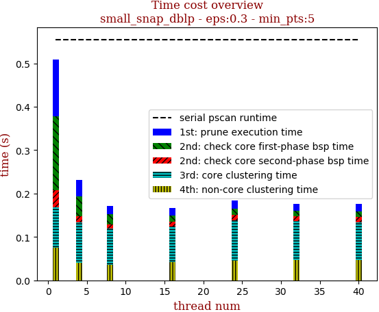 | 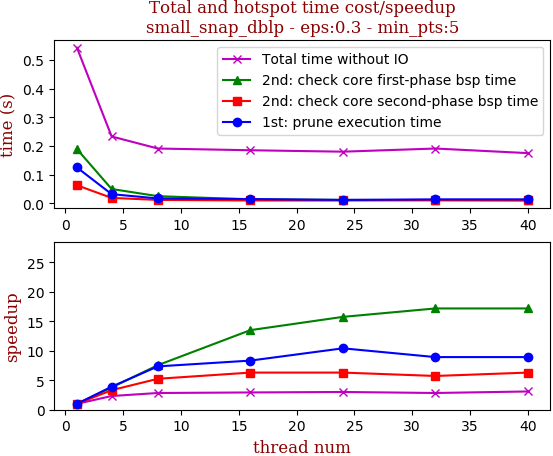

thread_num | prune | check-core 1st bsp | check-core 2nd bsp | cluster-core | cluster-non-core | total | total speedup
--- | --- | --- | --- | --- | --- | --- | ---
1 | 0.131s | 0.171s | 0.039s | 0.093s | 0.075s | 0.518s | 1.000
4 | 0.037s | 0.046s | 0.014s | 0.093s | 0.041s | 0.24s | 2.158
8 | 0.02s | 0.023s | 0.01s | 0.083s | 0.036s | 0.182s | 2.846
16 | 0.017s | 0.015s | 0.011s | 0.082s | 0.042s | 0.176s | 2.943
24 | 0.019s | 0.014s | 0.013s | 0.092s | 0.046s | 0.192s | 2.698
32 | 0.016s | 0.012s | 0.011s | 0.09s | 0.047s | 0.185s | 2.800
40 | 0.017s | 0.013s | 0.012s | 0.087s | 0.047s | 0.185s | 2.800

## eps:0.4

overview | speedup
--- | ---
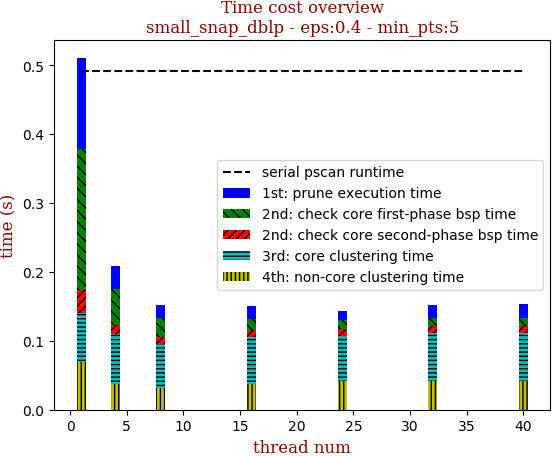 | 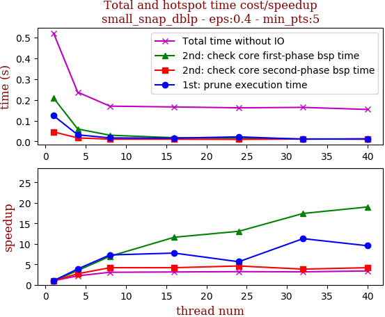

thread_num | prune | check-core 1st bsp | check-core 2nd bsp | cluster-core | cluster-non-core | total | total speedup
--- | --- | --- | --- | --- | --- | --- | ---
1 | 0.132s | 0.205s | 0.033s | 0.072s | 0.069s | 0.564s | 1.000
4 | 0.034s | 0.052s | 0.013s | 0.073s | 0.037s | 0.218s | 2.587
8 | 0.019s | 0.027s | 0.01s | 0.065s | 0.031s | 0.161s | 3.503
16 | 0.018s | 0.017s | 0.009s | 0.069s | 0.037s | 0.161s | 3.503
24 | 0.014s | 0.013s | 0.01s | 0.065s | 0.042s | 0.153s | 3.686
32 | 0.019s | 0.012s | 0.01s | 0.07s | 0.041s | 0.16s | 3.525
40 | 0.02s | 0.012s | 0.01s | 0.069s | 0.042s | 0.162s | 3.481

## eps:0.5

overview | speedup
--- | ---
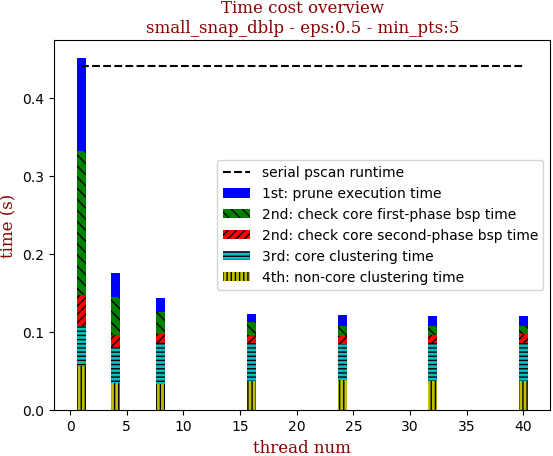 | 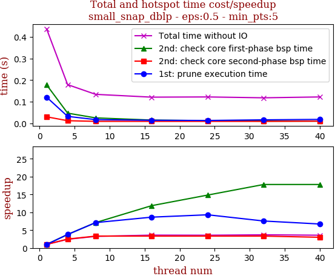

thread_num | prune | check-core 1st bsp | check-core 2nd bsp | cluster-core | cluster-non-core | total | total speedup
--- | --- | --- | --- | --- | --- | --- | ---
1 | 0.121s | 0.178s | 0.03s | 0.049s | 0.05s | 0.437s | 1.000
4 | 0.032s | 0.047s | 0.012s | 0.051s | 0.028s | 0.179s | 2.441
8 | 0.017s | 0.025s | 0.009s | 0.049s | 0.026s | 0.134s | 3.261
16 | 0.014s | 0.015s | 0.009s | 0.045s | 0.029s | 0.121s | 3.612
24 | 0.013s | 0.012s | 0.009s | 0.047s | 0.031s | 0.122s | 3.582
32 | 0.016s | 0.01s | 0.009s | 0.043s | 0.031s | 0.118s | 3.703
40 | 0.018s | 0.01s | 0.01s | 0.046s | 0.031s | 0.122s | 3.582

## eps:0.6

overview | speedup
--- | ---
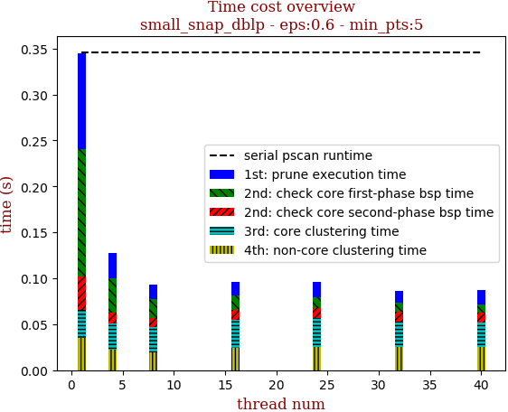 | 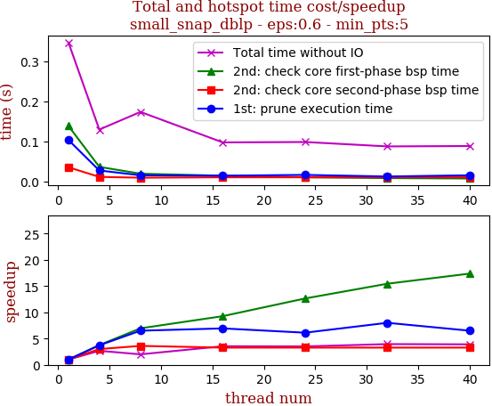

thread_num | prune | check-core 1st bsp | check-core 2nd bsp | cluster-core | cluster-non-core | total | total speedup
--- | --- | --- | --- | --- | --- | --- | ---
1 | 0.101s | 0.132s | 0.025s | 0.031s | 0.031s | 0.327s | 1.000
4 | 0.029s | 0.036s | 0.009s | 0.031s | 0.018s | 0.131s | 2.496
8 | 0.016s | 0.019s | 0.008s | 0.029s | 0.014s | 0.093s | 3.516
16 | 0.012s | 0.012s | 0.008s | 0.031s | 0.018s | 0.088s | 3.716
24 | 0.014s | 0.009s | 0.008s | 0.029s | 0.019s | 0.087s | 3.759
32 | 0.013s | 0.009s | 0.009s | 0.029s | 0.02s | 0.087s | 3.759
40 | 0.013s | 0.008s | 0.009s | 0.029s | 0.02s | 0.087s | 3.759

## eps:0.7

overview | speedup
--- | ---
 | 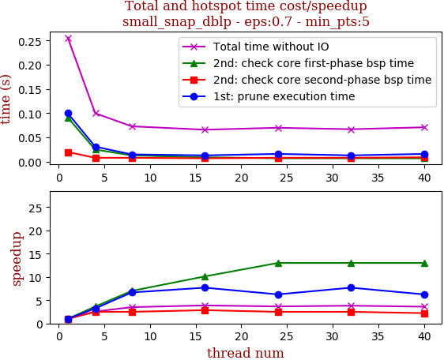

thread_num | prune | check-core 1st bsp | check-core 2nd bsp | cluster-core | cluster-non-core | total | total speedup
--- | --- | --- | --- | --- | --- | --- | ---
1 | 0.1s | 0.091s | 0.02s | 0.02s | 0.018s | 0.256s | 1.000
4 | 0.031s | 0.025s | 0.008s | 0.018s | 0.011s | 0.1s | 2.560
8 | 0.015s | 0.013s | 0.008s | 0.02s | 0.01s | 0.073s | 3.507
16 | 0.013s | 0.009s | 0.007s | 0.018s | 0.012s | 0.066s | 3.879
24 | 0.016s | 0.007s | 0.008s | 0.02s | 0.012s | 0.07s | 3.657
32 | 0.013s | 0.007s | 0.008s | 0.019s | 0.014s | 0.067s | 3.821
40 | 0.016s | 0.007s | 0.009s | 0.019s | 0.013s | 0.071s | 3.606

## eps:0.8

overview | speedup
--- | ---
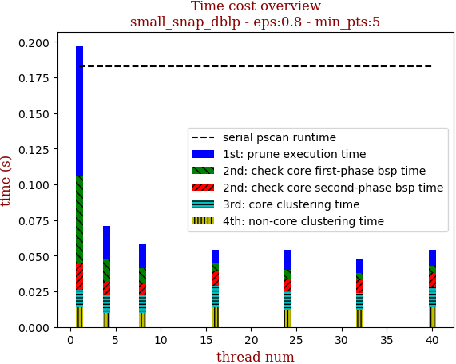 | 

thread_num | prune | check-core 1st bsp | check-core 2nd bsp | cluster-core | cluster-non-core | total | total speedup
--- | --- | --- | --- | --- | --- | --- | ---
1 | 0.092s | 0.052s | 0.012s | 0.013s | 0.01s | 0.186s | 1.000
4 | 0.024s | 0.015s | 0.006s | 0.013s | 0.007s | 0.071s | 2.620
8 | 0.014s | 0.01s | 0.007s | 0.013s | 0.006s | 0.056s | 3.321
16 | 0.011s | 0.005s | 0.007s | 0.013s | 0.007s | 0.05s | 3.720
24 | 0.009s | 0.005s | 0.008s | 0.013s | 0.008s | 0.05s | 3.720
32 | 0.011s | 0.005s | 0.007s | 0.012s | 0.008s | 0.05s | 3.720
40 | 0.011s | 0.005s | 0.008s | 0.013s | 0.009s | 0.052s | 3.577

## eps:0.9

overview | speedup
--- | ---
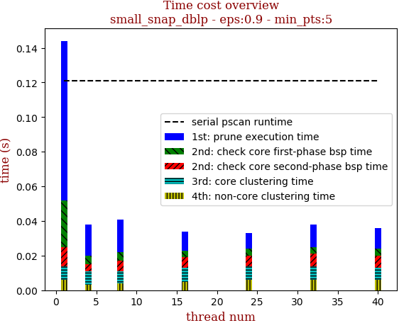 | 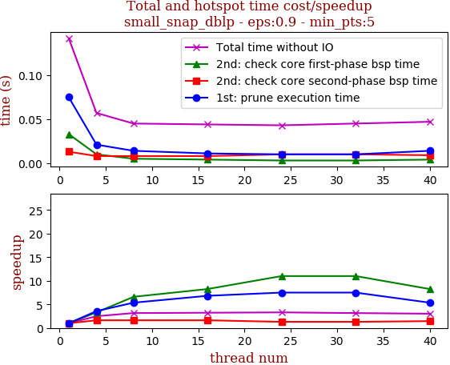

thread_num | prune | check-core 1st bsp | check-core 2nd bsp | cluster-core | cluster-non-core | total | total speedup
--- | --- | --- | --- | --- | --- | --- | ---
1 | 0.092s | 0.027s | 0.011s | 0.008s | 0.006s | 0.15s | 1.000
4 | 0.018s | 0.005s | 0.004s | 0.008s | 0.003s | 0.045s | 3.333
8 | 0.019s | 0.005s | 0.006s | 0.007s | 0.004s | 0.047s | 3.191
16 | 0.011s | 0.004s | 0.006s | 0.008s | 0.005s | 0.04s | 3.750
24 | 0.009s | 0.004s | 0.006s | 0.008s | 0.006s | 0.039s | 3.846
32 | 0.013s | 0.004s | 0.007s | 0.008s | 0.006s | 0.043s | 3.488
40 | 0.012s | 0.004s | 0.007s | 0.007s | 0.006s | 0.042s | 3.571

