## eps:0.1

overview | speedup
--- | ---
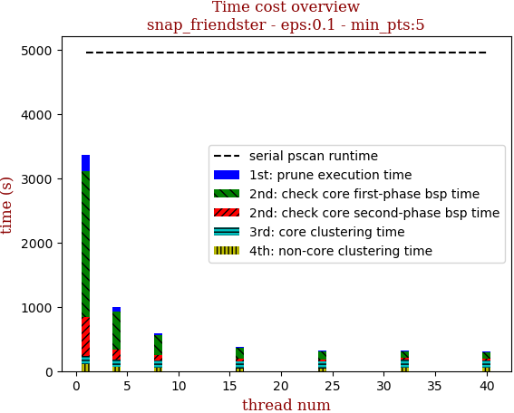 | 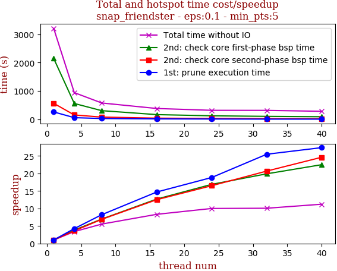

thread_num | prune | check-core 1st bsp | check-core 2nd bsp | cluster-core | cluster-non-core | total | total speedup
--- | --- | --- | --- | --- | --- | --- | ---
1 | 263.79s | 2147.725s | 567.32s | 112.917s | 110.229s | 3204.072s | 1.000
4 | 62.105s | 561.05s | 156.759s | 103.798s | 57.527s | 942.867s | 3.398
8 | 32.06s | 307.947s | 82.114s | 103.303s | 50.869s | 578.013s | 5.543
16 | 17.948s | 169.39s | 45.346s | 103.823s | 46.243s | 384.67s | 8.329
24 | 14.001s | 127.214s | 34.383s | 102.116s | 41.424s | 320.391s | 10.001
32 | 10.354s | 107.971s | 27.445s | 122.258s | 48.289s | 318.413s | 10.063
40 | 9.639s | 95.469s | 23.045s | 113.143s | 42.697s | 285.732s | 11.214

## eps:0.2

overview | speedup
--- | ---
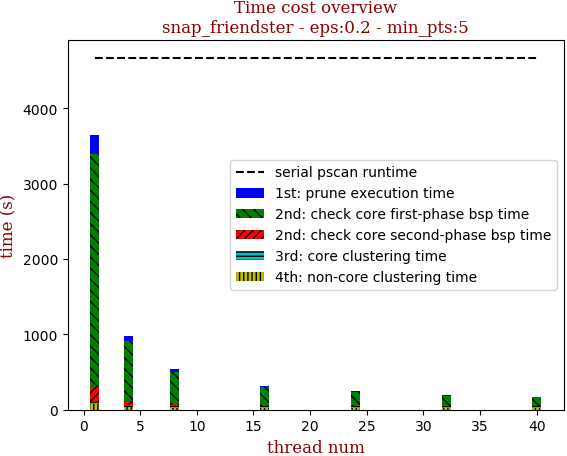 | 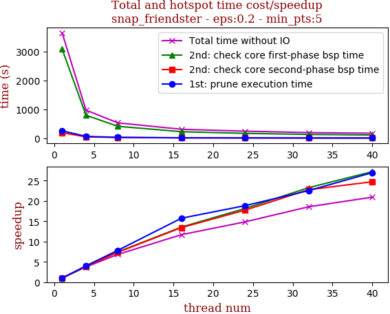

thread_num | prune | check-core 1st bsp | check-core 2nd bsp | cluster-core | cluster-non-core | total | total speedup
--- | --- | --- | --- | --- | --- | --- | ---
1 | 235.943s | 3089.476s | 192.965s | 31.372s | 72.994s | 3623.313s | 1.000
4 | 58.803s | 783.77s | 49.013s | 24.855s | 33.285s | 951.304s | 3.809
8 | 32.2s | 415.838s | 26.259s | 25.236s | 26.509s | 527.86s | 6.864
16 | 16.918s | 227.793s | 14.406s | 28.596s | 25.501s | 314.617s | 11.517
24 | 13.572s | 170.504s | 10.835s | 24.534s | 20.509s | 241.265s | 15.018
32 | 10.389s | 147.83s | 8.589s | 28.149s | 23.366s | 218.914s | 16.551
40 | 9.707s | 130.004s | 7.101s | 24.315s | 18.727s | 190.685s | 19.002

## eps:0.3

overview | speedup
--- | ---
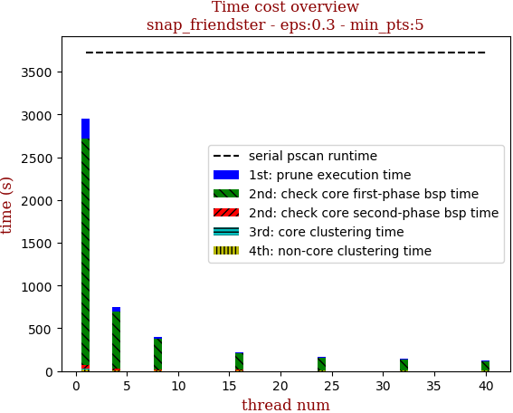 | 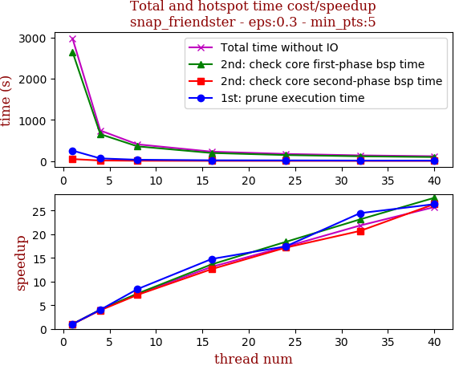

thread_num | prune | check-core 1st bsp | check-core 2nd bsp | cluster-core | cluster-non-core | total | total speedup
--- | --- | --- | --- | --- | --- | --- | ---
1 | 232.016s | 2649.507s | 46.003s | 4.615s | 21.103s | 2955.068s | 1.000
4 | 59.987s | 667.573s | 11.715s | 4.518s | 7.623s | 752.461s | 3.927
8 | 27.97s | 357.428s | 6.207s | 4.436s | 5.883s | 402.964s | 7.333
16 | 17.208s | 194.284s | 3.467s | 4.552s | 4.962s | 226.92s | 13.023
24 | 12.421s | 144.225s | 2.616s | 4.534s | 4.165s | 169.082s | 17.477
32 | 10.358s | 119.999s | 2.103s | 4.457s | 4.487s | 142.376s | 20.755
40 | 9.6s | 107.781s | 1.73s | 4.005s | 3.836s | 127.905s | 23.104

## eps:0.4

overview | speedup
--- | ---
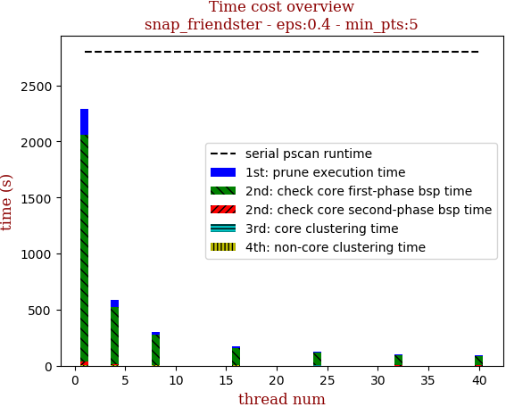 | 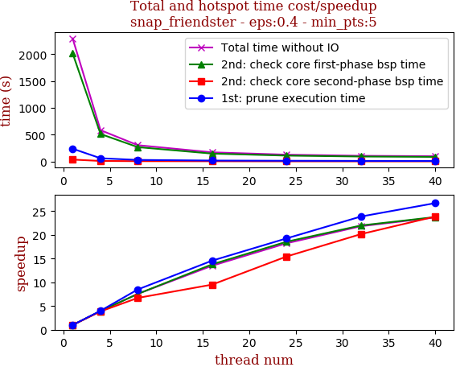

thread_num | prune | check-core 1st bsp | check-core 2nd bsp | cluster-core | cluster-non-core | total | total speedup
--- | --- | --- | --- | --- | --- | --- | ---
1 | 261.635s | 1883.496s | 36.543s | 1.012s | 3.155s | 2187.657s | 1.000
4 | 59.987s | 488.244s | 8.433s | 1.044s | 1.799s | 561.535s | 3.896
8 | 29.419s | 267.643s | 4.59s | 0.9s | 1.188s | 304.483s | 7.185
16 | 13.888s | 145.986s | 2.684s | 0.98s | 0.925s | 165.45s | 13.222
24 | 13.258s | 108.44s | 2.001s | 1.018s | 0.931s | 126.72s | 17.264
32 | 10.015s | 92.901s | 1.676s | 0.927s | 0.796s | 106.793s | 20.485
40 | 9.07s | 82.612s | 1.283s | 0.559s | 0.811s | 94.748s | 23.089

## eps:0.5

overview | speedup
--- | ---
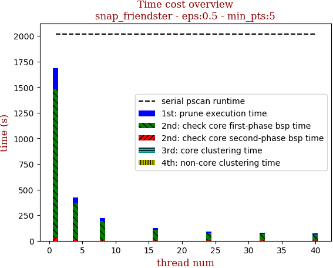 | 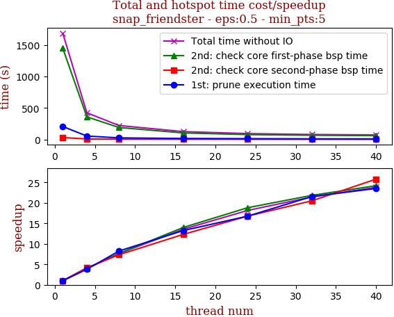

thread_num | prune | check-core 1st bsp | check-core 2nd bsp | cluster-core | cluster-non-core | total | total speedup
--- | --- | --- | --- | --- | --- | --- | ---
1 | 205.764s | 1449.601s | 30.17s | 0.46s | 0.606s | 1687.899s | 1.000
4 | 54.066s | 359.312s | 7.235s | 0.446s | 0.207s | 423.177s | 3.989
8 | 24.965s | 189.914s | 4.113s | 0.444s | 0.206s | 221.306s | 7.627
16 | 15.536s | 103.548s | 2.451s | 0.45s | 0.296s | 124.43s | 13.565
24 | 12.283s | 77.047s | 1.799s | 0.437s | 0.183s | 92.998s | 18.150
32 | 9.552s | 66.41s | 1.472s | 0.445s | 0.15s | 78.788s | 21.423
40 | 8.749s | 59.891s | 1.17s | 0.205s | 0.106s | 70.907s | 23.804

## eps:0.6

overview | speedup
--- | ---
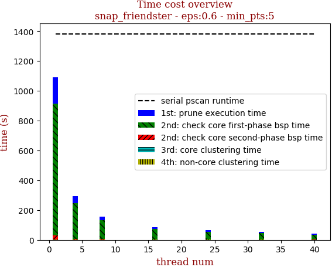 | 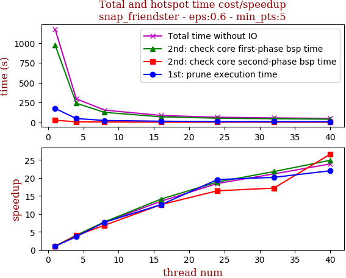

thread_num | prune | check-core 1st bsp | check-core 2nd bsp | cluster-core | cluster-non-core | total | total speedup
--- | --- | --- | --- | --- | --- | --- | ---
1 | 174.533s | 973.388s | 25.636s | 0.333s | 0.161s | 1175.315s | 1.000
4 | 47.808s | 240.325s | 6.493s | 0.328s | 0.072s | 296.293s | 3.967
8 | 22.752s | 125.53s | 3.758s | 0.334s | 0.054s | 153.755s | 7.644
16 | 13.928s | 69.027s | 2.04s | 0.339s | 0.041s | 87.013s | 13.507
24 | 8.932s | 51.602s | 1.561s | 0.33s | 0.044s | 63.708s | 18.448
32 | 8.66s | 44.745s | 1.494s | 0.141s | 0.051s | 55.658s | 21.117
40 | 7.938s | 39.081s | 0.963s | 0.146s | 0.065s | 49.203s | 23.887

## eps:0.7

overview | speedup
--- | ---
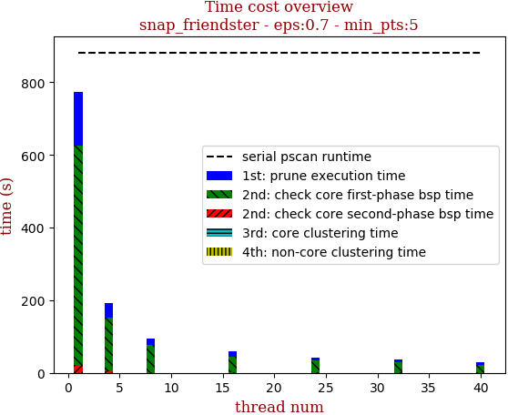 | 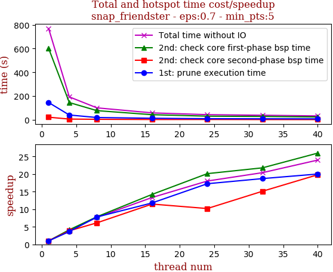

thread_num | prune | check-core 1st bsp | check-core 2nd bsp | cluster-core | cluster-non-core | total | total speedup
--- | --- | --- | --- | --- | --- | --- | ---
1 | 146.786s | 605.345s | 20.856s | 0.292s | 0.038s | 775.191s | 1.000
4 | 41.076s | 145.55s | 5.221s | 0.12s | 0.016s | 193.003s | 4.016
8 | 18.359s | 73.176s | 2.637s | 0.289s | 0.016s | 94.946s | 8.165
16 | 14.269s | 42.363s | 1.794s | 0.17s | 0.012s | 60.281s | 12.860
24 | 9.36s | 31.868s | 1.276s | 0.287s | 0.013s | 43.775s | 17.709
32 | 7.647s | 27.645s | 1.038s | 0.12s | 0.016s | 36.879s | 21.020
40 | 7.307s | 21.127s | 0.795s | 0.12s | 0.021s | 29.87s | 25.952

## eps:0.8

overview | speedup
--- | ---
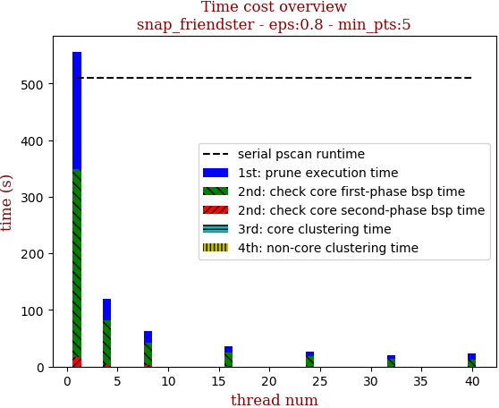 | 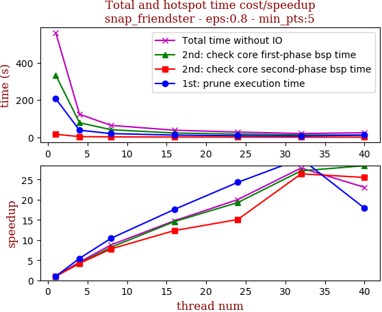

thread_num | prune | check-core 1st bsp | check-core 2nd bsp | cluster-core | cluster-non-core | total | total speedup
--- | --- | --- | --- | --- | --- | --- | ---
1 | 206.811s | 333.074s | 15.896s | 0.29s | 0.016s | 560.571s | 1.000
4 | 37.968s | 78.154s | 3.801s | 0.279s | 0.014s | 123.633s | 4.534
8 | 19.809s | 40.53s | 2.035s | 0.278s | 0.007s | 63.711s | 8.799
16 | 11.753s | 22.855s | 1.288s | 0.281s | 0.012s | 37.923s | 14.782
24 | 8.508s | 17.267s | 1.054s | 0.278s | 0.013s | 28.002s | 20.019
32 | 6.857s | 12.268s | 0.602s | 0.118s | 0.006s | 20.13s | 27.848
40 | 11.551s | 11.718s | 0.623s | 0.115s | 0.009s | 24.301s | 23.068

## eps:0.9

overview | speedup
--- | ---
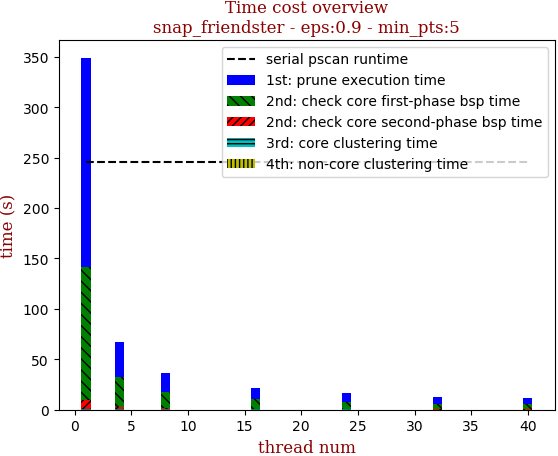 | 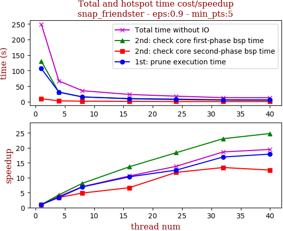

thread_num | prune | check-core 1st bsp | check-core 2nd bsp | cluster-core | cluster-non-core | total | total speedup
--- | --- | --- | --- | --- | --- | --- | ---
1 | 207.775s | 131.331s | 9.762s | 0.274s | 0.007s | 354.636s | 1.000
4 | 34.017s | 30.34s | 2.297s | 0.276s | 0.004s | 68.814s | 5.154
8 | 18.785s | 16.033s | 1.314s | 0.279s | 0.004s | 37.426s | 9.476
16 | 11.125s | 9.128s | 0.846s | 0.273s | 0.003s | 23.405s | 15.152
24 | 9.113s | 6.998s | 0.597s | 0.27s | 0.004s | 17.899s | 19.813
32 | 7.119s | 4.676s | 0.473s | 0.114s | 0.005s | 12.773s | 27.765
40 | 6.609s | 4.744s | 0.411s | 0.11s | 0.004s | 12.302s | 28.828

