## eps:0.1

overview | speedup
--- | ---
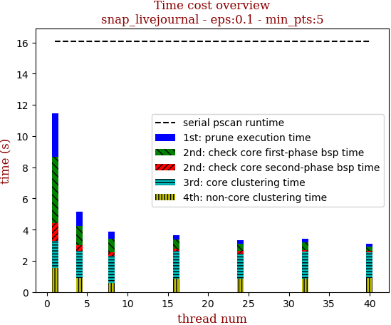 | 

thread_num | prune | check-core 1st bsp | check-core 2nd bsp | cluster-core | cluster-non-core | total | total speedup
--- | --- | --- | --- | --- | --- | --- | ---
1 | 2.808s | 4.239s | 1.152s | 1.747s | 1.535s | 11.516s | 1.000
4 | 0.917s | 1.235s | 0.364s | 1.733s | 0.911s | 5.195s | 2.217
8 | 0.492s | 0.87s | 0.227s | 1.715s | 0.59s | 3.928s | 2.932
16 | 0.299s | 0.572s | 0.146s | 1.776s | 0.873s | 3.7s | 3.112
24 | 0.233s | 0.454s | 0.163s | 1.624s | 0.833s | 3.341s | 3.447
32 | 0.207s | 0.502s | 0.091s | 1.744s | 0.866s | 3.444s | 3.344
40 | 0.181s | 0.292s | 0.098s | 1.63s | 0.914s | 3.149s | 3.657

## eps:0.2

overview | speedup
--- | ---
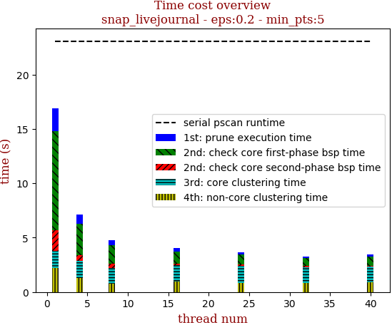 | 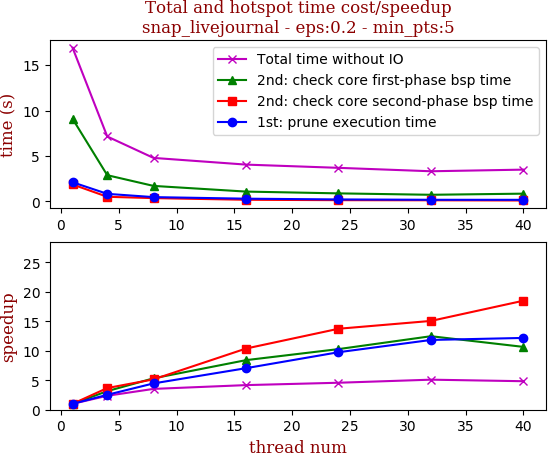

thread_num | prune | check-core 1st bsp | check-core 2nd bsp | cluster-core | cluster-non-core | total | total speedup
--- | --- | --- | --- | --- | --- | --- | ---
1 | 2.107s | 9.091s | 1.868s | 1.574s | 2.239s | 16.914s | 1.000
4 | 0.832s | 2.885s | 0.508s | 1.612s | 1.274s | 7.145s | 2.367
8 | 0.472s | 1.706s | 0.363s | 1.424s | 0.788s | 4.788s | 3.533
16 | 0.299s | 1.081s | 0.18s | 1.508s | 0.947s | 4.051s | 4.175
24 | 0.216s | 0.884s | 0.136s | 1.563s | 0.86s | 3.695s | 4.578
32 | 0.178s | 0.729s | 0.124s | 1.432s | 0.819s | 3.318s | 5.098
40 | 0.173s | 0.853s | 0.101s | 1.453s | 0.881s | 3.498s | 4.835

## eps:0.3

overview | speedup
--- | ---
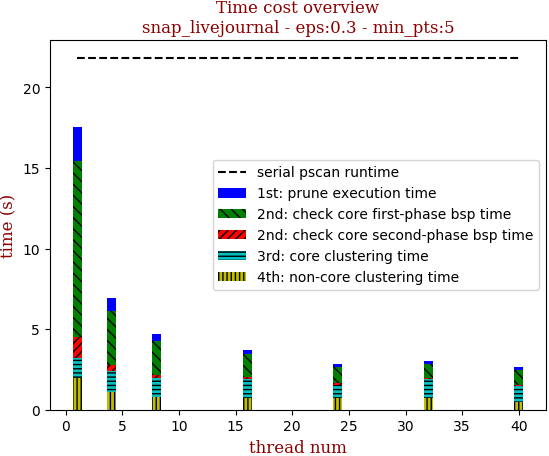 | 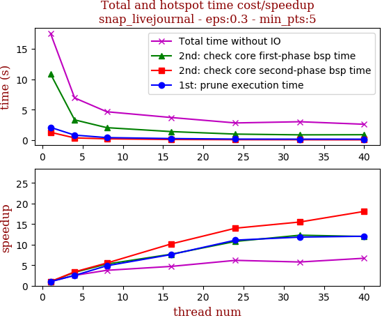

thread_num | prune | check-core 1st bsp | check-core 2nd bsp | cluster-core | cluster-non-core | total | total speedup
--- | --- | --- | --- | --- | --- | --- | ---
1 | 2.22s | 10.873s | 1.247s | 1.2s | 2.04s | 17.613s | 1.000
4 | 0.787s | 3.313s | 0.359s | 1.196s | 1.094s | 6.786s | 2.595
8 | 0.445s | 1.946s | 0.225s | 1.249s | 0.794s | 4.692s | 3.754
16 | 0.27s | 1.257s | 0.129s | 0.823s | 0.423s | 2.929s | 6.013
24 | 0.219s | 0.998s | 0.094s | 0.819s | 0.415s | 2.577s | 6.835
32 | 0.174s | 0.896s | 0.079s | 0.856s | 0.688s | 2.726s | 6.461
40 | 0.17s | 0.791s | 0.076s | 0.895s | 0.712s | 2.676s | 6.582

## eps:0.4

overview | speedup
--- | ---
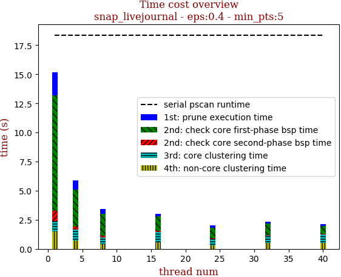 | 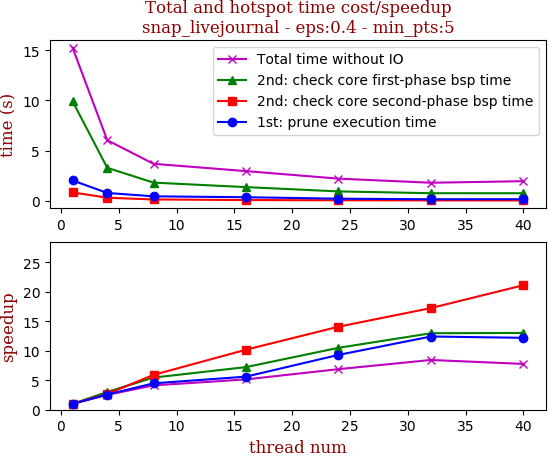

thread_num | prune | check-core 1st bsp | check-core 2nd bsp | cluster-core | cluster-non-core | total | total speedup
--- | --- | --- | --- | --- | --- | --- | ---
1 | 2.037s | 9.914s | 0.845s | 0.905s | 1.511s | 15.246s | 1.000
4 | 0.79s | 3.291s | 0.315s | 0.906s | 0.708s | 6.043s | 2.523
8 | 0.455s | 1.819s | 0.143s | 0.831s | 0.412s | 3.693s | 4.128
16 | 0.363s | 1.371s | 0.083s | 0.799s | 0.315s | 2.964s | 5.144
24 | 0.219s | 0.944s | 0.06s | 0.536s | 0.426s | 2.215s | 6.883
32 | 0.164s | 0.764s | 0.049s | 0.547s | 0.252s | 1.807s | 8.437
40 | 0.167s | 0.761s | 0.04s | 0.541s | 0.423s | 1.962s | 7.771

## eps:0.5

overview | speedup
--- | ---
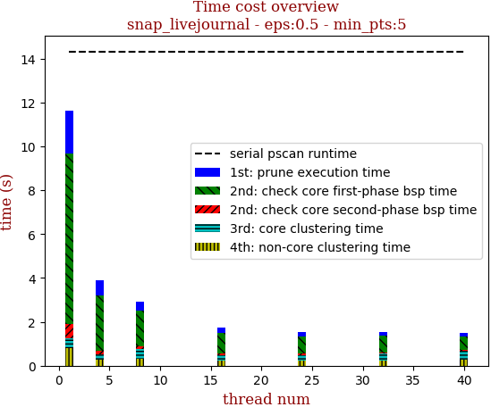 | 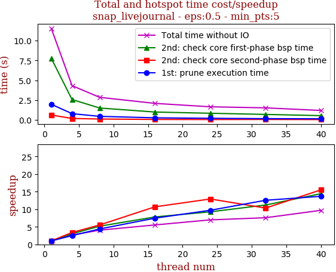

thread_num | prune | check-core 1st bsp | check-core 2nd bsp | cluster-core | cluster-non-core | total | total speedup
--- | --- | --- | --- | --- | --- | --- | ---
1 | 1.97s | 7.762s | 0.62s | 0.438s | 0.698s | 11.529s | 1.000
4 | 0.789s | 2.569s | 0.183s | 0.429s | 0.31s | 4.321s | 2.668
8 | 0.448s | 1.499s | 0.112s | 0.448s | 0.301s | 2.848s | 4.048
16 | 0.264s | 0.993s | 0.058s | 0.464s | 0.269s | 2.084s | 5.532
24 | 0.203s | 0.838s | 0.048s | 0.294s | 0.243s | 1.653s | 6.975
32 | 0.157s | 0.693s | 0.06s | 0.347s | 0.229s | 1.52s | 7.585
40 | 0.144s | 0.538s | 0.04s | 0.258s | 0.183s | 1.19s | 9.688

## eps:0.6

overview | speedup
--- | ---
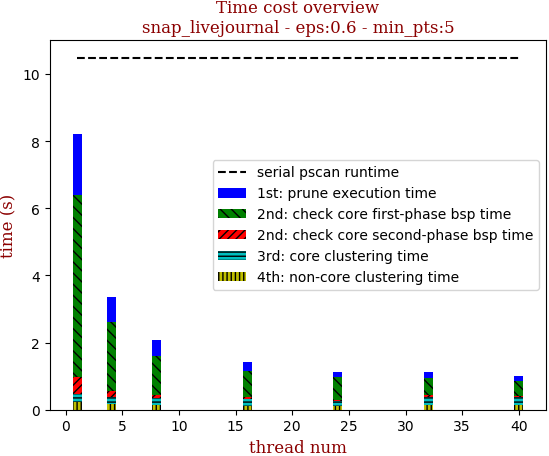 | 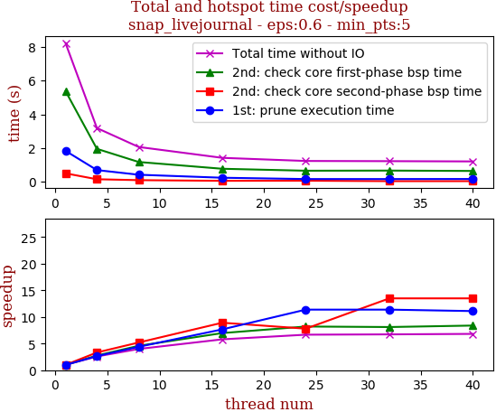

thread_num | prune | check-core 1st bsp | check-core 2nd bsp | cluster-core | cluster-non-core | total | total speedup
--- | --- | --- | --- | --- | --- | --- | ---
1 | 1.831s | 5.372s | 0.499s | 0.232s | 0.249s | 8.219s | 1.000
4 | 0.693s | 1.952s | 0.15s | 0.228s | 0.131s | 3.185s | 2.581
8 | 0.417s | 1.173s | 0.096s | 0.231s | 0.11s | 2.063s | 3.984
16 | 0.239s | 0.771s | 0.056s | 0.204s | 0.119s | 1.419s | 5.792
24 | 0.161s | 0.655s | 0.064s | 0.215s | 0.106s | 1.233s | 6.666
32 | 0.161s | 0.663s | 0.037s | 0.217s | 0.111s | 1.222s | 6.726
40 | 0.165s | 0.641s | 0.037s | 0.215s | 0.115s | 1.206s | 6.815

## eps:0.7

overview | speedup
--- | ---
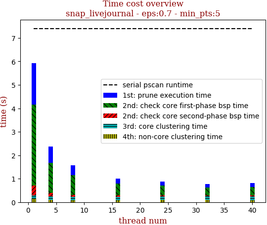 | 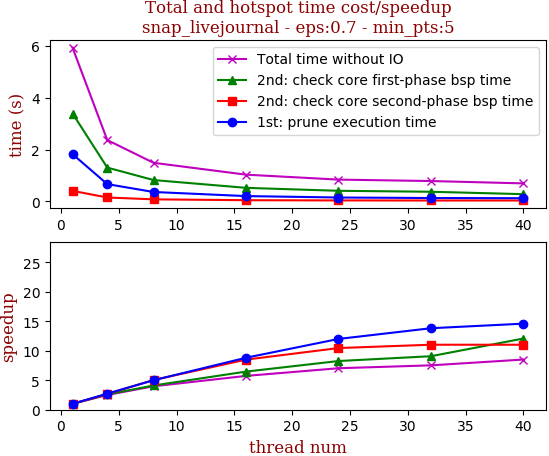

thread_num | prune | check-core 1st bsp | check-core 2nd bsp | cluster-core | cluster-non-core | total | total speedup
--- | --- | --- | --- | --- | --- | --- | ---
1 | 1.825s | 3.395s | 0.408s | 0.152s | 0.128s | 5.933s | 1.000
4 | 0.669s | 1.307s | 0.153s | 0.144s | 0.069s | 2.37s | 2.503
8 | 0.365s | 0.826s | 0.081s | 0.138s | 0.055s | 1.492s | 3.977
16 | 0.207s | 0.525s | 0.048s | 0.163s | 0.062s | 1.034s | 5.738
24 | 0.152s | 0.411s | 0.039s | 0.15s | 0.062s | 0.843s | 7.038
32 | 0.132s | 0.374s | 0.037s | 0.152s | 0.066s | 0.788s | 7.529
40 | 0.125s | 0.281s | 0.037s | 0.158s | 0.066s | 0.697s | 8.512

## eps:0.8

overview | speedup
--- | ---
 | 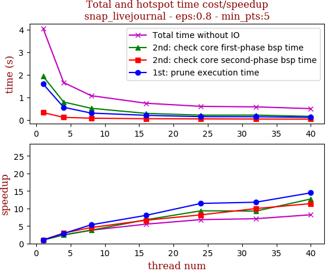

thread_num | prune | check-core 1st bsp | check-core 2nd bsp | cluster-core | cluster-non-core | total | total speedup
--- | --- | --- | --- | --- | --- | --- | ---
1 | 1.495s | 1.876s | 0.311s | 0.123s | 0.068s | 3.897s | 1.000
4 | 0.603s | 0.662s | 0.11s | 0.128s | 0.051s | 1.581s | 2.465
8 | 0.383s | 0.442s | 0.067s | 0.129s | 0.046s | 1.093s | 3.565
16 | 0.182s | 0.285s | 0.049s | 0.12s | 0.047s | 0.71s | 5.489
24 | 0.155s | 0.218s | 0.041s | 0.119s | 0.047s | 0.605s | 6.441
32 | 0.126s | 0.19s | 0.036s | 0.13s | 0.055s | 0.564s | 6.910
40 | 0.118s | 0.138s | 0.033s | 0.129s | 0.048s | 0.493s | 7.905

## eps:0.9

overview | speedup
--- | ---
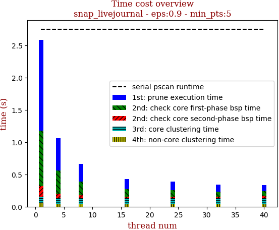 | 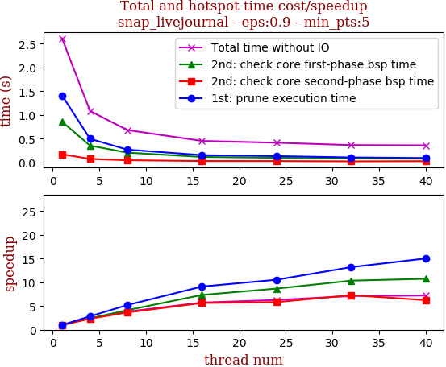

thread_num | prune | check-core 1st bsp | check-core 2nd bsp | cluster-core | cluster-non-core | total | total speedup
--- | --- | --- | --- | --- | --- | --- | ---
1 | 1.412s | 0.859s | 0.175s | 0.092s | 0.051s | 2.611s | 1.000
4 | 0.499s | 0.356s | 0.075s | 0.088s | 0.042s | 1.085s | 2.406
8 | 0.271s | 0.208s | 0.048s | 0.097s | 0.035s | 0.683s | 3.823
16 | 0.155s | 0.117s | 0.031s | 0.093s | 0.034s | 0.455s | 5.738
24 | 0.134s | 0.099s | 0.03s | 0.088s | 0.04s | 0.416s | 6.276
32 | 0.107s | 0.083s | 0.024s | 0.09s | 0.038s | 0.367s | 7.114
40 | 0.094s | 0.08s | 0.028s | 0.095s | 0.039s | 0.362s | 7.213

