## eps:0.1

overview | speedup
--- | ---
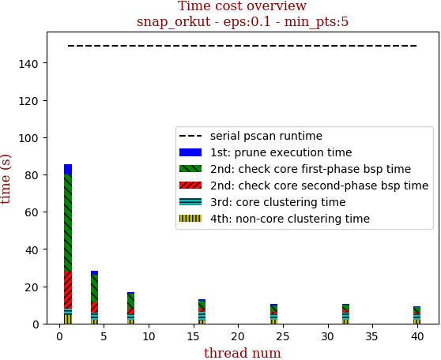 | 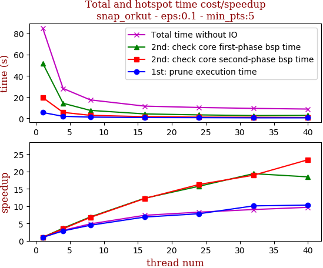

thread_num | prune | check-core 1st bsp | check-core 2nd bsp | cluster-core | cluster-non-core | total | total speedup
--- | --- | --- | --- | --- | --- | --- | ---
1 | 5.564s | 52.04s | 19.678s | 3.527s | 4.318s | 85.15s | 1.000
4 | 1.95s | 14.268s | 5.68s | 3.676s | 2.616s | 28.214s | 3.018
8 | 1.24s | 7.553s | 2.916s | 3.605s | 2.109s | 17.445s | 4.881
16 | 0.812s | 4.235s | 1.611s | 2.92s | 1.962s | 11.565s | 7.363
24 | 0.712s | 3.303s | 1.21s | 3.133s | 1.912s | 10.294s | 8.272
32 | 0.552s | 2.685s | 1.039s | 3.377s | 1.758s | 9.434s | 9.026
40 | 0.54s | 2.82s | 0.841s | 2.853s | 1.734s | 8.812s | 9.663

## eps:0.2

overview | speedup
--- | ---
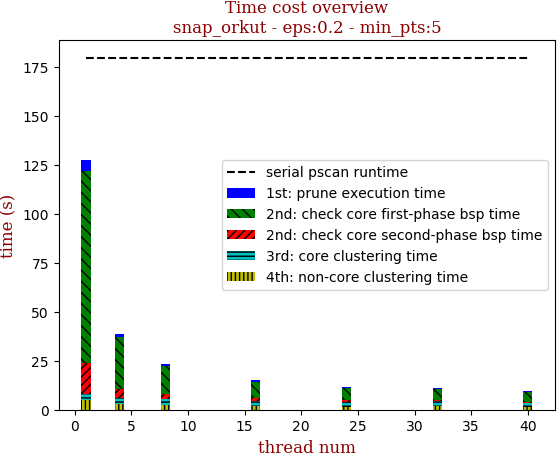 | 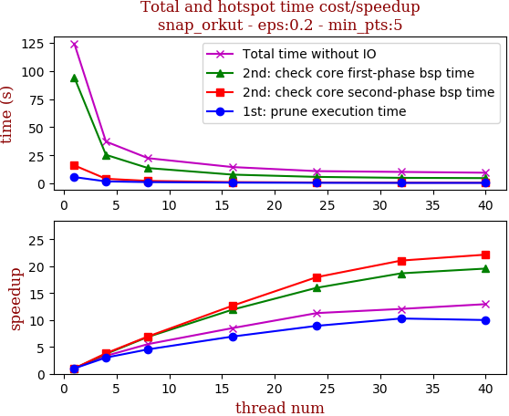

thread_num | prune | check-core 1st bsp | check-core 2nd bsp | cluster-core | cluster-non-core | total | total speedup
--- | --- | --- | --- | --- | --- | --- | ---
1 | 5.726s | 94.327s | 16.127s | 3.186s | 4.98s | 124.37s | 1.000
4 | 1.903s | 25.511s | 4.228s | 2.684s | 2.941s | 37.291s | 3.335
8 | 1.26s | 13.736s | 2.321s | 2.678s | 2.498s | 22.518s | 5.523
16 | 0.827s | 7.91s | 1.274s | 2.771s | 1.829s | 14.636s | 8.498
24 | 0.642s | 5.896s | 0.897s | 2.086s | 1.472s | 11.017s | 11.289
32 | 0.557s | 5.049s | 0.766s | 2.191s | 1.724s | 10.312s | 12.061
40 | 0.573s | 4.822s | 0.728s | 2.073s | 1.385s | 9.605s | 12.948

## eps:0.3

overview | speedup
--- | ---
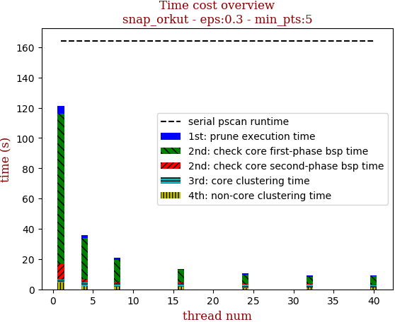 | 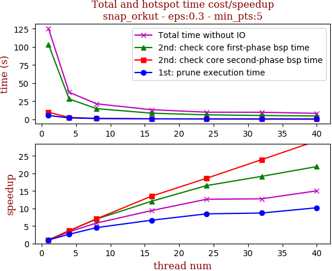

thread_num | prune | check-core 1st bsp | check-core 2nd bsp | cluster-core | cluster-non-core | total | total speedup
--- | --- | --- | --- | --- | --- | --- | ---
1 | 5.204s | 99.428s | 9.849s | 2.053s | 4.54s | 121.101s | 1.000
4 | 1.943s | 26.997s | 2.549s | 2.065s | 2.358s | 35.94s | 3.370
8 | 1.194s | 14.365s | 1.328s | 2.133s | 1.775s | 20.821s | 5.816
16 | 0.812s | 8.259s | 0.727s | 2.091s | 1.627s | 13.543s | 8.942
24 | 0.702s | 6.091s | 0.541s | 2.141s | 0.995s | 10.498s | 11.536
32 | 0.559s | 4.766s | 0.435s | 1.881s | 1.41s | 9.075s | 13.344
40 | 0.51s | 5.643s | 0.364s | 1.383s | 1.352s | 9.275s | 13.057

## eps:0.4

overview | speedup
--- | ---
 | 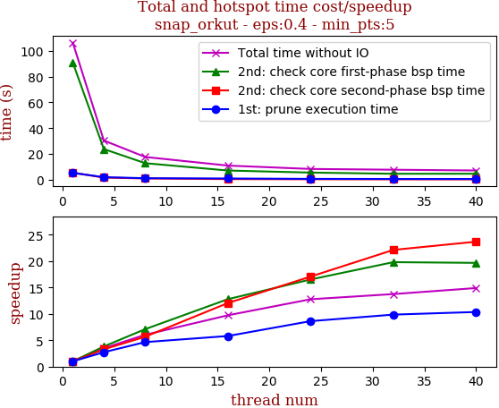

thread_num | prune | check-core 1st bsp | check-core 2nd bsp | cluster-core | cluster-non-core | total | total speedup
--- | --- | --- | --- | --- | --- | --- | ---
1 | 5.302s | 90.844s | 5.376s | 1.476s | 3.271s | 106.291s | 1.000
4 | 1.942s | 23.764s | 1.643s | 1.402s | 1.628s | 30.4s | 3.496
8 | 1.142s | 12.794s | 0.949s | 1.46s | 1.252s | 17.618s | 6.033
16 | 0.914s | 7.105s | 0.446s | 1.514s | 0.927s | 10.927s | 9.727
24 | 0.615s | 5.499s | 0.315s | 0.88s | 0.998s | 8.324s | 12.769
32 | 0.538s | 4.588s | 0.243s | 1.494s | 0.845s | 7.73s | 13.750
40 | 0.512s | 4.619s | 0.227s | 0.857s | 0.904s | 7.137s | 14.893

## eps:0.5

overview | speedup
--- | ---
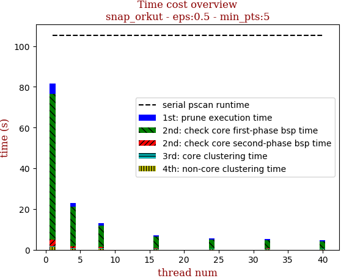 | 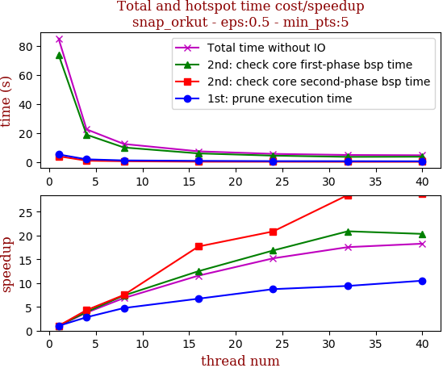

thread_num | prune | check-core 1st bsp | check-core 2nd bsp | cluster-core | cluster-non-core | total | total speedup
--- | --- | --- | --- | --- | --- | --- | ---
1 | 5.209s | 73.973s | 3.963s | 0.411s | 1.485s | 85.068s | 1.000
4 | 1.845s | 18.804s | 0.916s | 0.397s | 0.507s | 22.495s | 3.782
8 | 1.096s | 10.01s | 0.528s | 0.376s | 0.379s | 12.415s | 6.852
16 | 0.775s | 5.916s | 0.224s | 0.209s | 0.213s | 7.355s | 11.566
24 | 0.597s | 4.39s | 0.19s | 0.25s | 0.155s | 5.595s | 15.204
32 | 0.554s | 3.541s | 0.139s | 0.283s | 0.312s | 4.845s | 17.558
40 | 0.496s | 3.637s | 0.138s | 0.219s | 0.148s | 4.653s | 18.282

## eps:0.6

overview | speedup
--- | ---
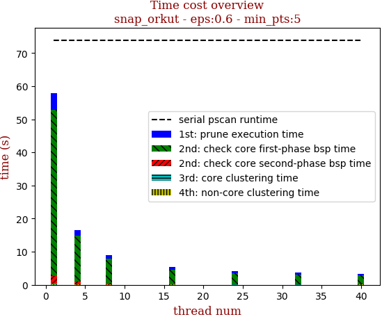 | 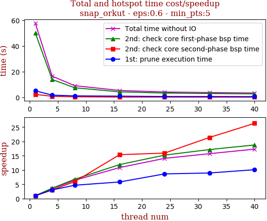

thread_num | prune | check-core 1st bsp | check-core 2nd bsp | cluster-core | cluster-non-core | total | total speedup
--- | --- | --- | --- | --- | --- | --- | ---
1 | 4.982s | 49.887s | 3.285s | 0.065s | 0.342s | 58.581s | 1.000
4 | 1.818s | 13.138s | 0.69s | 0.06s | 0.087s | 15.812s | 3.705
8 | 1.17s | 7.058s | 0.323s | 0.059s | 0.055s | 8.683s | 6.747
16 | 0.842s | 4.154s | 0.185s | 0.032s | 0.038s | 5.262s | 11.133
24 | 0.504s | 3.227s | 0.115s | 0.036s | 0.038s | 3.931s | 14.902
32 | 0.479s | 2.693s | 0.098s | 0.066s | 0.062s | 3.416s | 17.149
40 | 0.486s | 2.491s | 0.08s | 0.029s | 0.036s | 3.133s | 18.698

## eps:0.7

overview | speedup
--- | ---
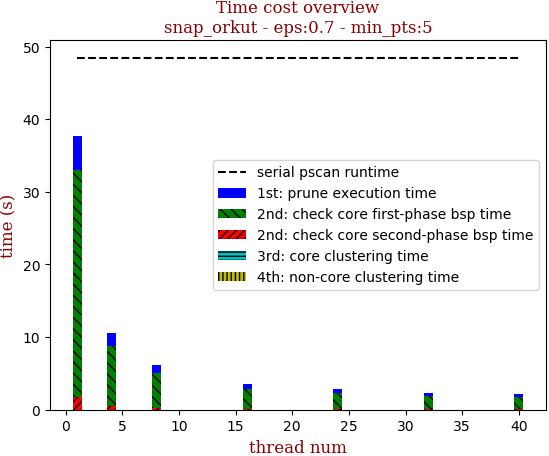 | 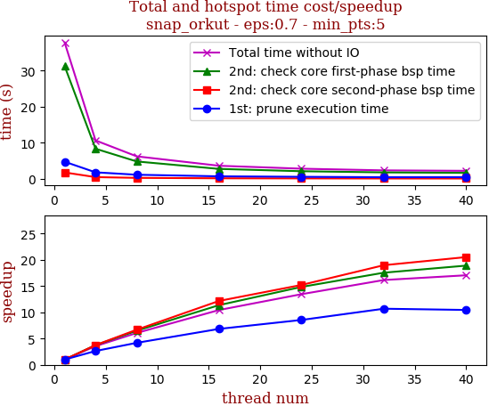

thread_num | prune | check-core 1st bsp | check-core 2nd bsp | cluster-core | cluster-non-core | total | total speedup
--- | --- | --- | --- | --- | --- | --- | ---
1 | 4.734s | 31.223s | 1.765s | 0.012s | 0.018s | 37.768s | 1.000
4 | 1.799s | 8.336s | 0.47s | 0.012s | 0.008s | 10.64s | 3.550
8 | 1.131s | 4.808s | 0.264s | 0.005s | 0.005s | 6.224s | 6.068
16 | 0.692s | 2.746s | 0.145s | 0.012s | 0.005s | 3.617s | 10.442
24 | 0.554s | 2.104s | 0.116s | 0.012s | 0.006s | 2.807s | 13.455
32 | 0.443s | 1.779s | 0.093s | 0.007s | 0.004s | 2.338s | 16.154
40 | 0.453s | 1.652s | 0.086s | 0.007s | 0.005s | 2.214s | 17.059

## eps:0.8

overview | speedup
--- | ---
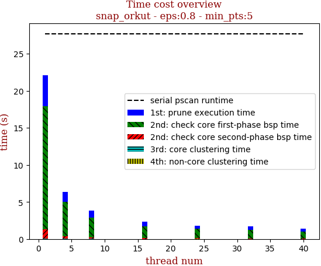 | 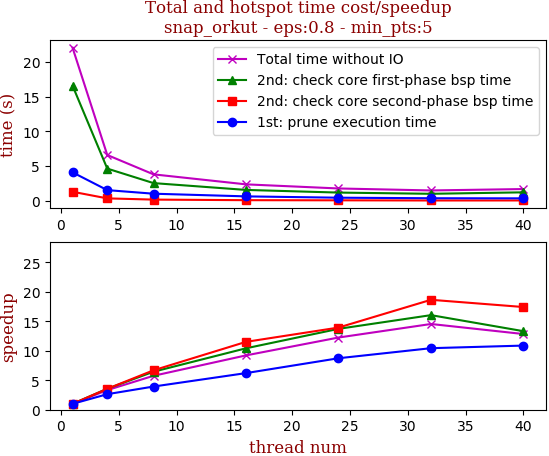

thread_num | prune | check-core 1st bsp | check-core 2nd bsp | cluster-core | cluster-non-core | total | total speedup
--- | --- | --- | --- | --- | --- | --- | ---
1 | 4.113s | 16.559s | 1.324s | 0.007s | 0.001s | 22.019s | 1.000
4 | 1.56s | 4.654s | 0.373s | 0.007s | 0.0s | 6.609s | 3.332
8 | 1.046s | 2.569s | 0.198s | 0.003s | 0.001s | 3.826s | 5.755
16 | 0.662s | 1.589s | 0.115s | 0.007s | 0.001s | 2.389s | 9.217
24 | 0.471s | 1.207s | 0.095s | 0.008s | 0.001s | 1.798s | 12.246
32 | 0.394s | 1.032s | 0.071s | 0.005s | 0.001s | 1.514s | 14.544
40 | 0.378s | 1.243s | 0.076s | 0.004s | 0.002s | 1.715s | 12.839

## eps:0.9

overview | speedup
--- | ---
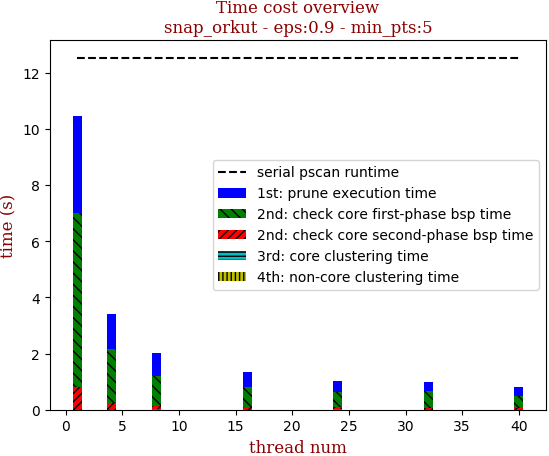 | 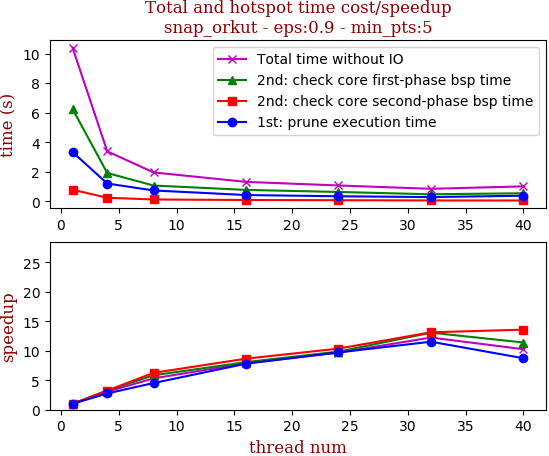

thread_num | prune | check-core 1st bsp | check-core 2nd bsp | cluster-core | cluster-non-core | total | total speedup
--- | --- | --- | --- | --- | --- | --- | ---
1 | 3.476s | 6.206s | 0.788s | 0.007s | 0.0s | 10.492s | 1.000
4 | 1.224s | 1.942s | 0.224s | 0.007s | 0.0s | 3.414s | 3.073
8 | 0.799s | 1.084s | 0.115s | 0.007s | 0.001s | 2.021s | 5.191
16 | 0.543s | 0.729s | 0.08s | 0.006s | 0.0s | 1.374s | 7.636
24 | 0.403s | 0.537s | 0.072s | 0.008s | 0.001s | 1.037s | 10.118
32 | 0.331s | 0.592s | 0.057s | 0.006s | 0.001s | 1.002s | 10.471
40 | 0.297s | 0.45s | 0.041s | 0.004s | 0.002s | 0.807s | 13.001

