## eps:0.1

overview | speedup
--- | ---
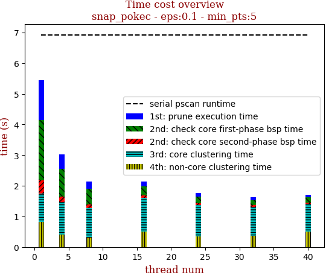 | 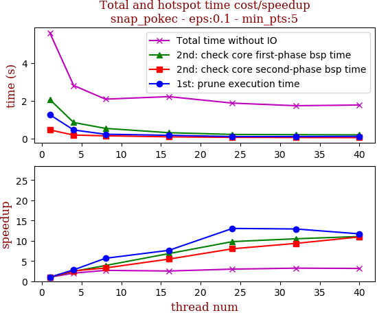

thread_num | prune | check-core 1st bsp | check-core 2nd bsp | cluster-core | cluster-non-core | total | total speedup
--- | --- | --- | --- | --- | --- | --- | ---
1 | 1.253s | 2.057s | 0.449s | 0.977s | 0.841s | 5.59s | 1.000
4 | 0.445s | 0.842s | 0.176s | 0.953s | 0.383s | 2.801s | 1.996
8 | 0.221s | 0.529s | 0.137s | 0.881s | 0.309s | 2.078s | 2.690
16 | 0.164s | 0.301s | 0.082s | 1.253s | 0.409s | 2.211s | 2.528
24 | 0.096s | 0.21s | 0.056s | 1.14s | 0.362s | 1.867s | 2.994
32 | 0.097s | 0.196s | 0.048s | 1.018s | 0.368s | 1.73s | 3.231
40 | 0.107s | 0.186s | 0.041s | 0.95s | 0.48s | 1.767s | 3.164

## eps:0.2

overview | speedup
--- | ---
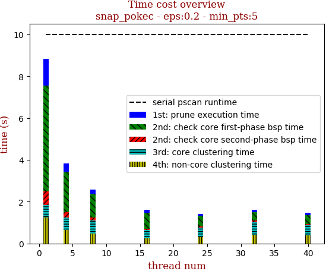 | 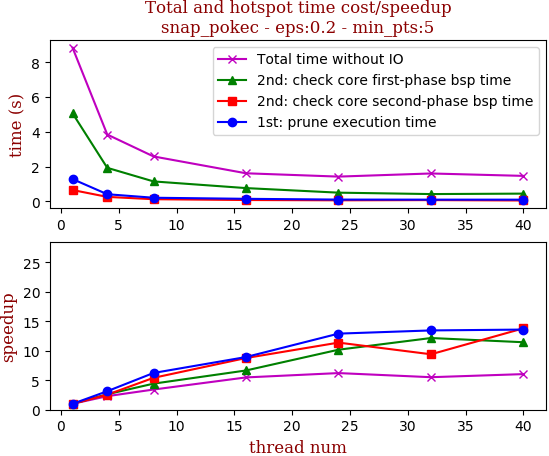

thread_num | prune | check-core 1st bsp | check-core 2nd bsp | cluster-core | cluster-non-core | total | total speedup
--- | --- | --- | --- | --- | --- | --- | ---
1 | 1.278s | 5.06s | 0.649s | 0.606s | 1.238s | 8.833s | 1.000
4 | 0.407s | 1.926s | 0.254s | 0.616s | 0.636s | 3.841s | 2.300
8 | 0.205s | 1.144s | 0.12s | 0.636s | 0.474s | 2.581s | 3.422
16 | 0.143s | 0.76s | 0.074s | 0.37s | 0.262s | 1.612s | 5.480
24 | 0.099s | 0.497s | 0.057s | 0.462s | 0.303s | 1.421s | 6.216
32 | 0.095s | 0.416s | 0.069s | 0.61s | 0.408s | 1.601s | 5.517
40 | 0.094s | 0.442s | 0.047s | 0.49s | 0.386s | 1.462s | 6.042

## eps:0.3

overview | speedup
--- | ---
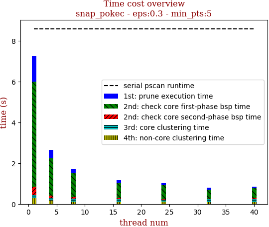 | 

thread_num | prune | check-core 1st bsp | check-core 2nd bsp | cluster-core | cluster-non-core | total | total speedup
--- | --- | --- | --- | --- | --- | --- | ---
1 | 1.274s | 5.208s | 0.455s | 0.138s | 0.311s | 7.389s | 1.000
4 | 0.417s | 1.882s | 0.124s | 0.137s | 0.163s | 2.725s | 2.712
8 | 0.219s | 1.139s | 0.068s | 0.138s | 0.14s | 1.708s | 4.326
16 | 0.148s | 0.736s | 0.058s | 0.134s | 0.114s | 1.193s | 6.194
24 | 0.108s | 0.603s | 0.048s | 0.142s | 0.126s | 1.029s | 7.181
32 | 0.101s | 0.439s | 0.044s | 0.139s | 0.097s | 0.823s | 8.978
40 | 0.1s | 0.452s | 0.038s | 0.144s | 0.109s | 0.846s | 8.734

## eps:0.4

overview | speedup
--- | ---
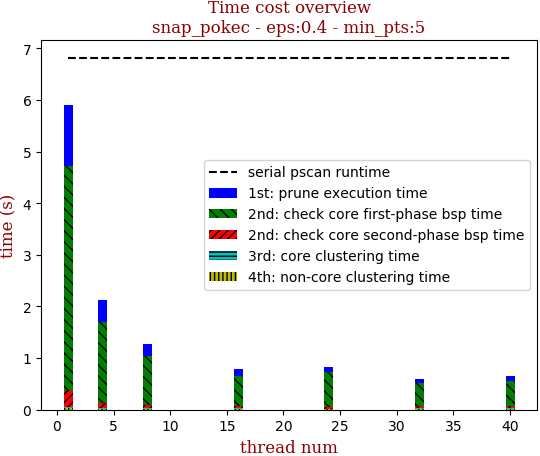 | 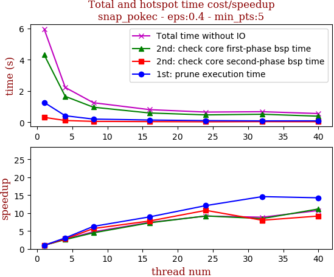

thread_num | prune | check-core 1st bsp | check-core 2nd bsp | cluster-core | cluster-non-core | total | total speedup
--- | --- | --- | --- | --- | --- | --- | ---
1 | 1.27s | 4.323s | 0.312s | 0.016s | 0.048s | 5.972s | 1.000
4 | 0.415s | 1.658s | 0.112s | 0.016s | 0.026s | 2.228s | 2.680
8 | 0.202s | 0.963s | 0.055s | 0.01s | 0.018s | 1.25s | 4.778
16 | 0.142s | 0.593s | 0.04s | 0.01s | 0.019s | 0.807s | 7.400
24 | 0.105s | 0.47s | 0.029s | 0.016s | 0.028s | 0.651s | 9.174
32 | 0.087s | 0.511s | 0.039s | 0.012s | 0.023s | 0.675s | 8.847
40 | 0.089s | 0.388s | 0.034s | 0.017s | 0.028s | 0.557s | 10.722

## eps:0.5

overview | speedup
--- | ---
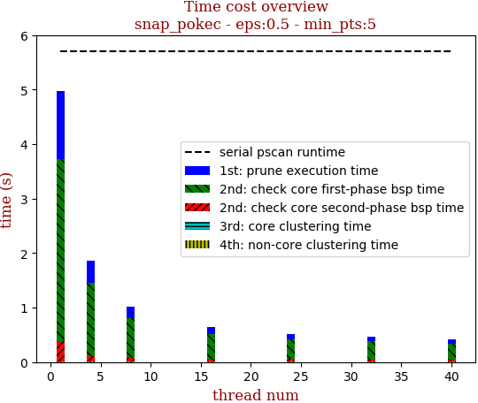 | 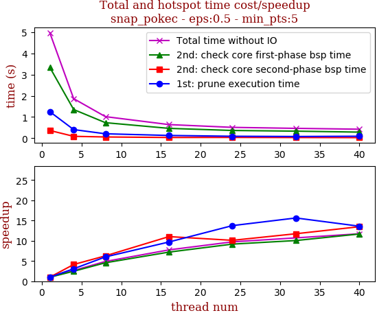

thread_num | prune | check-core 1st bsp | check-core 2nd bsp | cluster-core | cluster-non-core | total | total speedup
--- | --- | --- | --- | --- | --- | --- | ---
1 | 1.251s | 3.34s | 0.364s | 0.005s | 0.012s | 4.974s | 1.000
4 | 0.406s | 1.353s | 0.088s | 0.005s | 0.01s | 1.866s | 2.666
8 | 0.208s | 0.732s | 0.058s | 0.005s | 0.011s | 1.017s | 4.891
16 | 0.129s | 0.464s | 0.033s | 0.004s | 0.01s | 0.642s | 7.748
24 | 0.091s | 0.364s | 0.036s | 0.005s | 0.012s | 0.511s | 9.734
32 | 0.08s | 0.332s | 0.031s | 0.005s | 0.012s | 0.464s | 10.720
40 | 0.092s | 0.286s | 0.027s | 0.005s | 0.011s | 0.424s | 11.731

## eps:0.6

overview | speedup
--- | ---
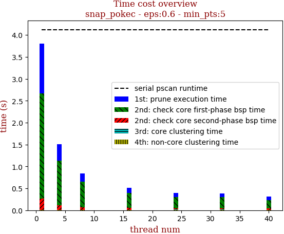 | 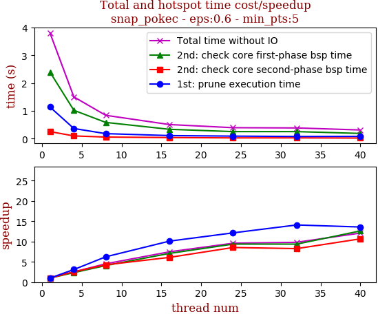

thread_num | prune | check-core 1st bsp | check-core 2nd bsp | cluster-core | cluster-non-core | total | total speedup
--- | --- | --- | --- | --- | --- | --- | ---
1 | 1.141s | 2.398s | 0.256s | 0.004s | 0.008s | 3.808s | 1.000
4 | 0.368s | 1.023s | 0.101s | 0.004s | 0.008s | 1.505s | 2.530
8 | 0.183s | 0.587s | 0.06s | 0.004s | 0.007s | 0.843s | 4.517
16 | 0.113s | 0.339s | 0.042s | 0.004s | 0.01s | 0.51s | 7.467
24 | 0.094s | 0.256s | 0.03s | 0.004s | 0.011s | 0.397s | 9.592
32 | 0.081s | 0.256s | 0.031s | 0.004s | 0.012s | 0.388s | 9.814
40 | 0.084s | 0.19s | 0.024s | 0.004s | 0.01s | 0.315s | 12.089

## eps:0.7

overview | speedup
--- | ---
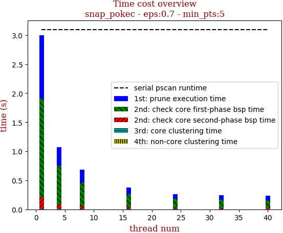 | 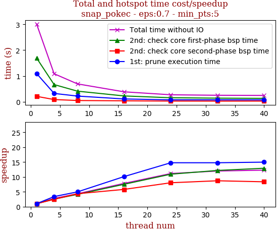

thread_num | prune | check-core 1st bsp | check-core 2nd bsp | cluster-core | cluster-non-core | total | total speedup
--- | --- | --- | --- | --- | --- | --- | ---
1 | 1.087s | 1.626s | 0.213s | 0.003s | 0.008s | 2.939s | 1.000
4 | 0.348s | 0.66s | 0.076s | 0.003s | 0.008s | 1.098s | 2.677
8 | 0.163s | 0.406s | 0.056s | 0.003s | 0.009s | 0.643s | 4.571
16 | 0.115s | 0.224s | 0.036s | 0.003s | 0.01s | 0.391s | 7.517
24 | 0.08s | 0.157s | 0.031s | 0.003s | 0.01s | 0.284s | 10.349
32 | 0.079s | 0.147s | 0.024s | 0.003s | 0.011s | 0.267s | 11.007
40 | 0.08s | 0.127s | 0.024s | 0.003s | 0.01s | 0.247s | 11.899

## eps:0.8

overview | speedup
--- | ---
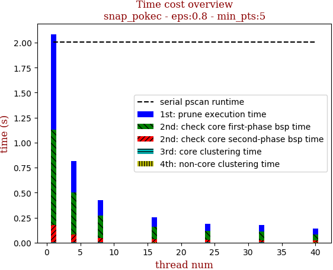 | 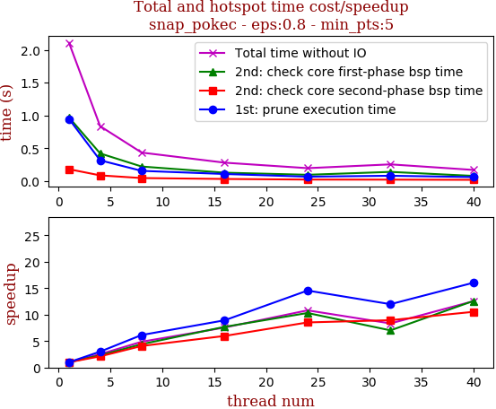

thread_num | prune | check-core 1st bsp | check-core 2nd bsp | cluster-core | cluster-non-core | total | total speedup
--- | --- | --- | --- | --- | --- | --- | ---
1 | 0.946s | 0.969s | 0.179s | 0.003s | 0.008s | 2.108s | 1.000
4 | 0.315s | 0.42s | 0.085s | 0.003s | 0.01s | 0.836s | 2.522
8 | 0.154s | 0.22s | 0.044s | 0.003s | 0.009s | 0.433s | 4.868
16 | 0.106s | 0.126s | 0.03s | 0.003s | 0.009s | 0.279s | 7.556
24 | 0.065s | 0.094s | 0.021s | 0.003s | 0.01s | 0.195s | 10.810
32 | 0.079s | 0.138s | 0.02s | 0.003s | 0.01s | 0.253s | 8.332
40 | 0.059s | 0.077s | 0.017s | 0.003s | 0.009s | 0.168s | 12.548

## eps:0.9

overview | speedup
--- | ---
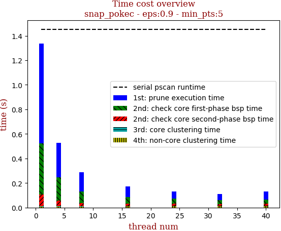 | 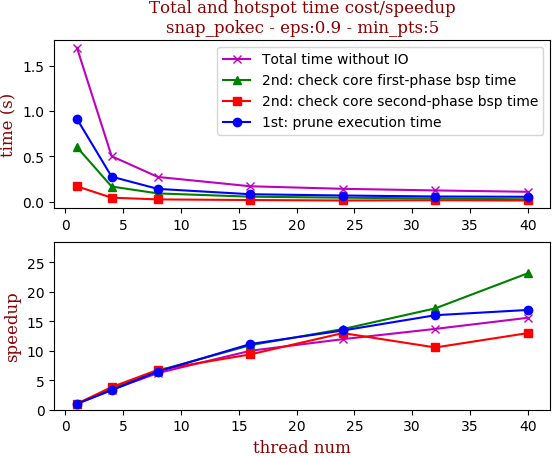

thread_num | prune | check-core 1st bsp | check-core 2nd bsp | cluster-core | cluster-non-core | total | total speedup
--- | --- | --- | --- | --- | --- | --- | ---
1 | 0.814s | 0.418s | 0.096s | 0.003s | 0.007s | 1.34s | 1.000
4 | 0.278s | 0.191s | 0.045s | 0.003s | 0.009s | 0.529s | 2.533
8 | 0.154s | 0.094s | 0.026s | 0.003s | 0.009s | 0.289s | 4.637
16 | 0.088s | 0.054s | 0.017s | 0.003s | 0.011s | 0.175s | 7.657
24 | 0.058s | 0.043s | 0.016s | 0.003s | 0.011s | 0.133s | 10.075
32 | 0.05s | 0.032s | 0.015s | 0.003s | 0.011s | 0.114s | 11.754
40 | 0.066s | 0.032s | 0.016s | 0.003s | 0.012s | 0.131s | 10.229

