## eps:0.1

overview | speedup
--- | ---
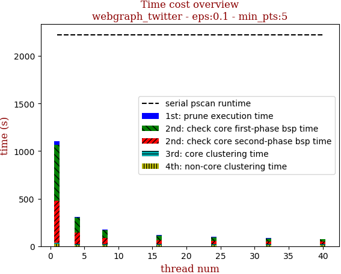 | 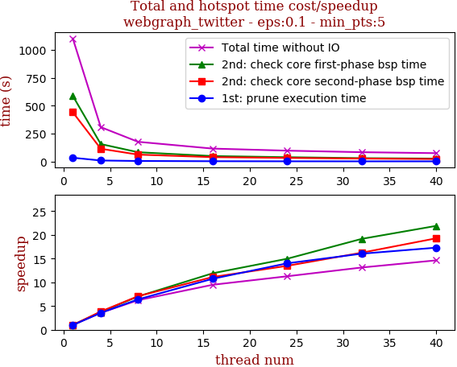

thread_num | prune | check-core 1st bsp | check-core 2nd bsp | cluster-core | cluster-non-core | total | total speedup
--- | --- | --- | --- | --- | --- | --- | ---
1 | 37.523s | 602.262s | 441.126s | 16.004s | 20.536s | 1117.453s | 1.000
4 | 9.38s | 156.206s | 116.067s | 15.817s | 11.924s | 309.396s | 3.612
8 | 5.011s | 83.894s | 62.507s | 15.577s | 9.675s | 176.667s | 6.325
16 | 3.509s | 45.657s | 33.45s | 18.921s | 9.119s | 110.659s | 10.098
24 | 3.159s | 39.565s | 32.914s | 16.735s | 9.954s | 102.33s | 10.920
32 | 2.998s | 33.074s | 29.216s | 15.189s | 9.066s | 89.546s | 12.479
40 | 3.081s | 29.456s | 22.938s | 15.113s | 7.789s | 78.38s | 14.257

## eps:0.2

overview | speedup
--- | ---
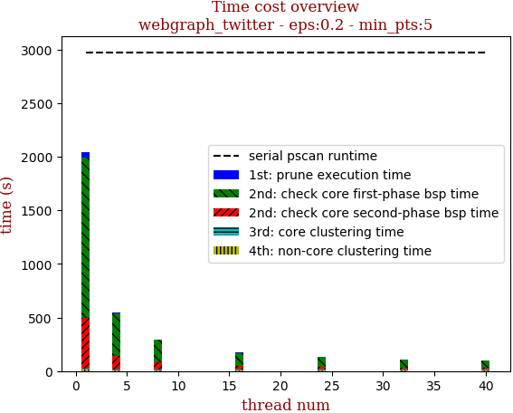 | 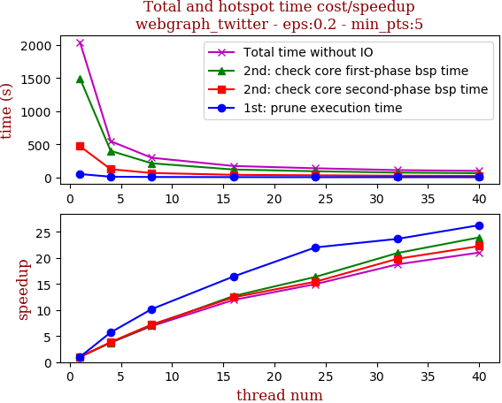

thread_num | prune | check-core 1st bsp | check-core 2nd bsp | cluster-core | cluster-non-core | total | total speedup
--- | --- | --- | --- | --- | --- | --- | ---
1 | 33.401s | 1531.42s | 468.905s | 8.074s | 16.762s | 2058.566s | 1.000
4 | 8.409s | 400.743s | 123.278s | 7.861s | 7.79s | 548.083s | 3.756
8 | 4.895s | 212.199s | 65.169s | 7.943s | 5.79s | 295.999s | 6.955
16 | 3.579s | 118.211s | 37.769s | 7.861s | 4.886s | 172.309s | 11.947
24 | 2.972s | 91.45s | 30.308s | 8.359s | 4.99s | 138.082s | 14.908
32 | 2.991s | 79.777s | 25.341s | 7.408s | 4.427s | 119.946s | 17.162
40 | 2.801s | 67.064s | 22.553s | 7.259s | 3.896s | 103.575s | 19.875

## eps:0.3

overview | speedup
--- | ---
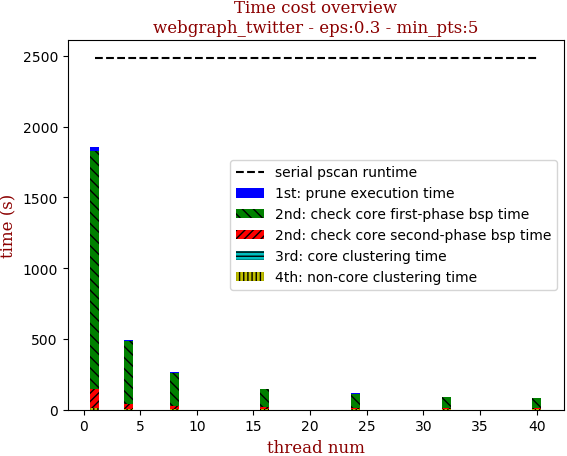 | 

thread_num | prune | check-core 1st bsp | check-core 2nd bsp | cluster-core | cluster-non-core | total | total speedup
--- | --- | --- | --- | --- | --- | --- | ---
1 | 30.287s | 1704.879s | 131.642s | 3.667s | 10.501s | 1880.979s | 1.000
4 | 7.793s | 445.478s | 34.636s | 3.686s | 4.458s | 496.053s | 3.792
8 | 4.547s | 235.346s | 18.617s | 3.776s | 3.231s | 265.519s | 7.084
16 | 3.225s | 130.71s | 10.065s | 3.747s | 2.683s | 150.433s | 12.504
24 | 3.178s | 94.427s | 7.723s | 3.031s | 2.369s | 110.729s | 16.987
32 | 2.56s | 83.451s | 6.363s | 3.706s | 2.33s | 98.412s | 19.113
40 | 2.348s | 73.34s | 6.088s | 3.027s | 3.083s | 87.889s | 21.402

## eps:0.4

overview | speedup
--- | ---
 | 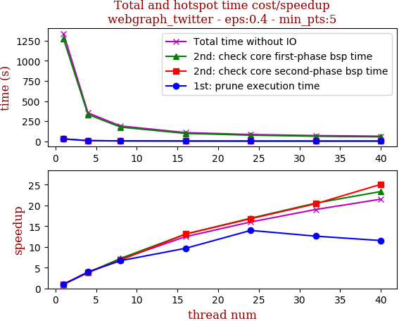

thread_num | prune | check-core 1st bsp | check-core 2nd bsp | cluster-core | cluster-non-core | total | total speedup
--- | --- | --- | --- | --- | --- | --- | ---
1 | 28.807s | 1271.994s | 29.204s | 3.034s | 5.557s | 1338.599s | 1.000
4 | 7.262s | 332.958s | 7.46s | 3.05s | 2.474s | 353.207s | 3.790
8 | 4.309s | 175.93s | 4.274s | 3.112s | 2.078s | 189.707s | 7.056
16 | 2.979s | 97.21s | 2.228s | 2.983s | 1.907s | 107.309s | 12.474
24 | 2.061s | 75.181s | 1.738s | 2.772s | 1.834s | 83.589s | 16.014
32 | 2.287s | 61.874s | 1.431s | 2.906s | 1.872s | 70.373s | 19.021
40 | 2.497s | 54.458s | 1.164s | 2.285s | 1.829s | 62.235s | 21.509

## eps:0.5

overview | speedup
--- | ---
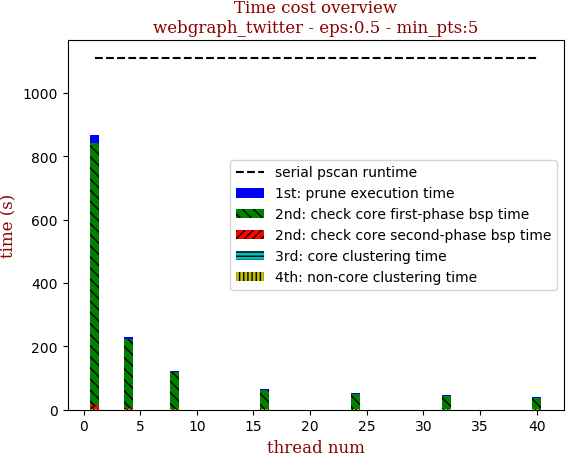 | 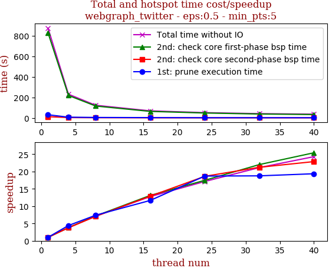

thread_num | prune | check-core 1st bsp | check-core 2nd bsp | cluster-core | cluster-non-core | total | total speedup
--- | --- | --- | --- | --- | --- | --- | ---
1 | 25.86s | 828.289s | 11.906s | 0.843s | 2.493s | 869.393s | 1.000
4 | 6.776s | 217.19s | 2.823s | 0.764s | 1.197s | 228.752s | 3.801
8 | 4.072s | 114.576s | 1.768s | 0.842s | 1.099s | 122.36s | 7.105
16 | 3.09s | 59.459s | 0.908s | 0.747s | 0.995s | 65.202s | 13.334
24 | 2.799s | 48.333s | 0.693s | 0.718s | 0.972s | 53.518s | 16.245
32 | 2.04s | 41.983s | 0.679s | 0.799s | 0.997s | 46.501s | 18.696
40 | 2.159s | 35.413s | 0.58s | 0.42s | 0.952s | 39.527s | 21.995

## eps:0.6

overview | speedup
--- | ---
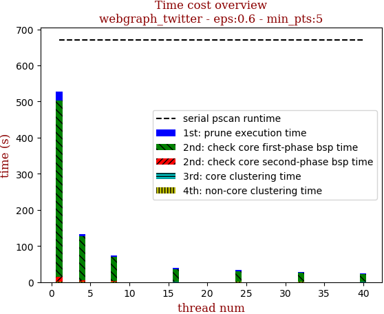 | 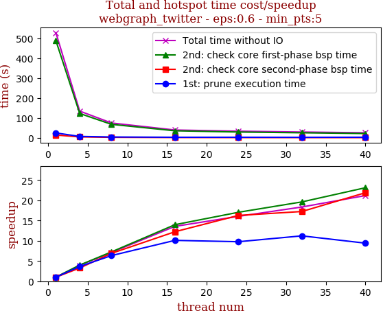

thread_num | prune | check-core 1st bsp | check-core 2nd bsp | cluster-core | cluster-non-core | total | total speedup
--- | --- | --- | --- | --- | --- | --- | ---
1 | 24.15s | 487.468s | 13.564s | 0.496s | 1.203s | 526.882s | 1.000
4 | 6.636s | 121.835s | 4.153s | 0.479s | 0.66s | 133.766s | 3.939
8 | 3.81s | 67.231s | 1.969s | 0.475s | 0.56s | 74.046s | 7.116
16 | 2.391s | 34.881s | 1.109s | 0.208s | 0.264s | 38.856s | 13.560
24 | 2.473s | 28.604s | 0.834s | 0.427s | 0.518s | 32.859s | 16.035
32 | 2.153s | 24.861s | 0.787s | 0.405s | 0.51s | 28.718s | 18.347
40 | 2.566s | 21.094s | 0.62s | 0.233s | 0.368s | 24.883s | 21.174

## eps:0.7

overview | speedup
--- | ---
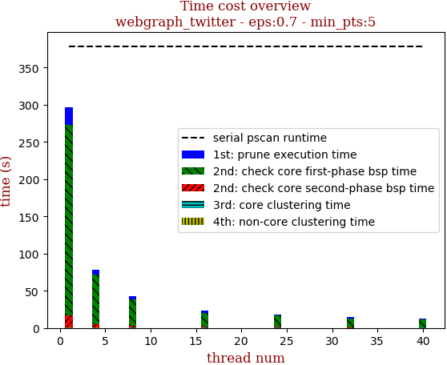 | 

thread_num | prune | check-core 1st bsp | check-core 2nd bsp | cluster-core | cluster-non-core | total | total speedup
--- | --- | --- | --- | --- | --- | --- | ---
1 | 22.677s | 257.218s | 15.905s | 0.351s | 0.728s | 296.882s | 1.000
4 | 6.021s | 67.606s | 4.335s | 0.143s | 0.235s | 78.342s | 3.790
8 | 3.435s | 35.686s | 2.324s | 0.371s | 0.399s | 42.219s | 7.032
16 | 3.201s | 20.76s | 1.366s | 0.364s | 0.411s | 26.105s | 11.373
24 | 2.804s | 13.764s | 0.965s | 0.144s | 0.186s | 17.865s | 16.618
32 | 1.901s | 12.799s | 0.896s | 0.341s | 0.416s | 16.356s | 18.151
40 | 2.34s | 10.898s | 0.777s | 0.153s | 0.208s | 14.379s | 20.647

## eps:0.8

overview | speedup
--- | ---
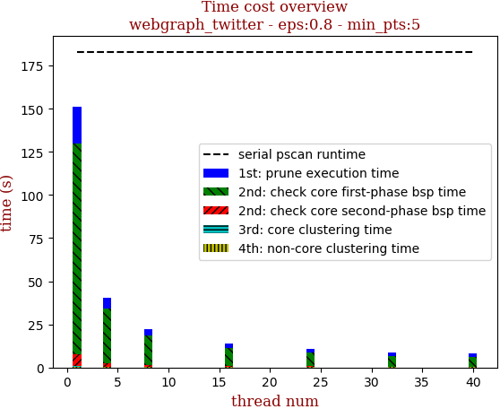 | 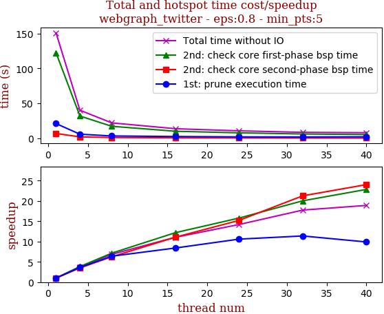

thread_num | prune | check-core 1st bsp | check-core 2nd bsp | cluster-core | cluster-non-core | total | total speedup
--- | --- | --- | --- | --- | --- | --- | ---
1 | 21.034s | 122.397s | 6.846s | 0.17s | 0.483s | 150.933s | 1.000
4 | 5.813s | 31.86s | 1.958s | 0.17s | 0.354s | 40.157s | 3.759
8 | 3.293s | 17.139s | 1.096s | 0.162s | 0.325s | 22.017s | 6.855
16 | 2.502s | 10.044s | 0.618s | 0.169s | 0.329s | 13.664s | 11.046
24 | 1.985s | 7.755s | 0.45s | 0.165s | 0.276s | 10.633s | 14.195
32 | 1.849s | 6.109s | 0.322s | 0.067s | 0.154s | 8.503s | 17.751
40 | 2.125s | 5.359s | 0.285s | 0.068s | 0.146s | 7.985s | 18.902

## eps:0.9

overview | speedup
--- | ---
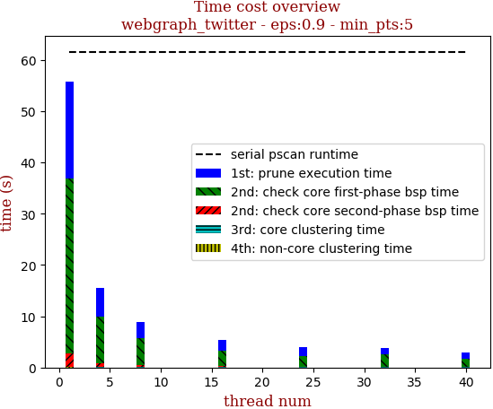 | 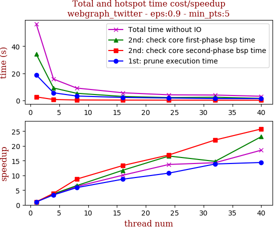

thread_num | prune | check-core 1st bsp | check-core 2nd bsp | cluster-core | cluster-non-core | total | total speedup
--- | --- | --- | --- | --- | --- | --- | ---
1 | 19.817s | 35.745s | 1.91s | 0.124s | 0.222s | 57.821s | 1.000
4 | 5.339s | 9.496s | 0.595s | 0.122s | 0.209s | 15.764s | 3.668
8 | 3.231s | 5.164s | 0.387s | 0.126s | 0.84s | 9.75s | 5.930
16 | 2.802s | 3.277s | 0.216s | 0.129s | 0.215s | 6.65s | 8.695
24 | 1.965s | 2.638s | 0.196s | 0.133s | 0.205s | 5.14s | 11.249
32 | 2.145s | 2.177s | 0.141s | 0.054s | 0.102s | 4.622s | 12.510
40 | 1.856s | 1.825s | 0.127s | 0.064s | 0.127s | 4.001s | 14.452

