## eps:0.1

overview | speedup
--- | ---
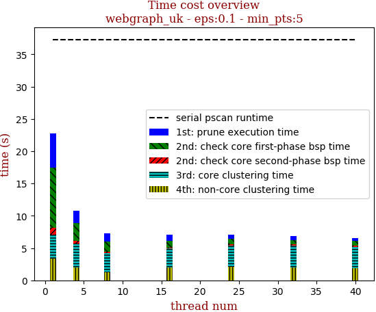 | 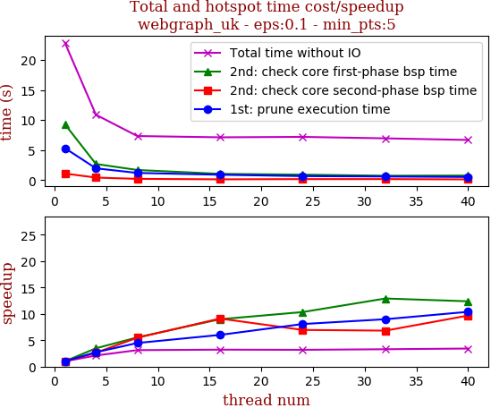

thread_num | prune | check-core 1st bsp | check-core 2nd bsp | cluster-core | cluster-non-core | total | total speedup
--- | --- | --- | --- | --- | --- | --- | ---
1 | 5.318s | 9.297s | 1.084s | 3.755s | 3.332s | 22.883s | 1.000
4 | 1.955s | 2.676s | 0.412s | 3.788s | 1.957s | 10.883s | 2.103
8 | 1.189s | 1.68s | 0.198s | 2.967s | 1.206s | 7.334s | 3.120
16 | 0.885s | 1.035s | 0.119s | 3.003s | 1.983s | 7.121s | 3.213
24 | 0.659s | 0.899s | 0.156s | 3.32s | 2.059s | 7.191s | 3.182
32 | 0.592s | 0.72s | 0.159s | 3.374s | 2.01s | 6.95s | 3.293
40 | 0.512s | 0.751s | 0.112s | 3.293s | 1.918s | 6.684s | 3.424

## eps:0.2

overview | speedup
--- | ---
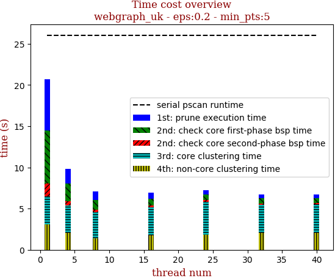 | 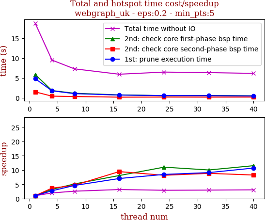

thread_num | prune | check-core 1st bsp | check-core 2nd bsp | cluster-core | cluster-non-core | total | total speedup
--- | --- | --- | --- | --- | --- | --- | ---
1 | 4.809s | 5.849s | 1.492s | 3.347s | 3.182s | 18.779s | 1.000
4 | 1.766s | 1.825s | 0.41s | 3.501s | 1.891s | 9.492s | 1.978
8 | 1.048s | 1.142s | 0.321s | 3.341s | 1.335s | 7.285s | 2.578
16 | 0.685s | 0.726s | 0.158s | 2.572s | 1.69s | 5.931s | 3.166
24 | 0.569s | 0.532s | 0.183s | 3.35s | 1.734s | 6.467s | 2.904
32 | 0.529s | 0.584s | 0.169s | 3.066s | 1.89s | 6.338s | 2.963
40 | 0.45s | 0.508s | 0.181s | 3.16s | 1.743s | 6.14s | 3.058

## eps:0.3

overview | speedup
--- | ---
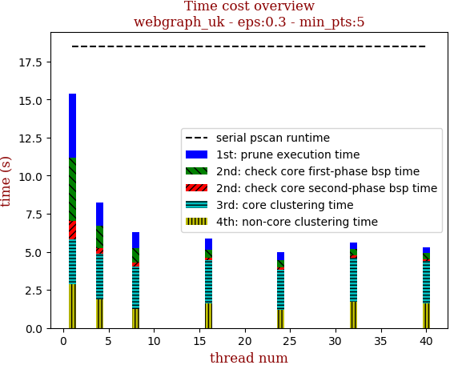 | 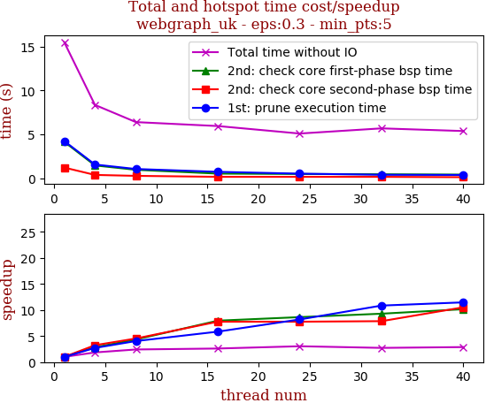

thread_num | prune | check-core 1st bsp | check-core 2nd bsp | cluster-core | cluster-non-core | total | total speedup
--- | --- | --- | --- | --- | --- | --- | ---
1 | 4.232s | 4.144s | 1.21s | 2.933s | 2.872s | 15.482s | 1.000
4 | 1.556s | 1.452s | 0.373s | 2.969s | 1.899s | 8.342s | 1.856
8 | 1.048s | 0.956s | 0.267s | 2.764s | 1.258s | 6.387s | 2.424
16 | 0.724s | 0.521s | 0.156s | 2.855s | 1.589s | 5.937s | 2.608
24 | 0.517s | 0.48s | 0.156s | 2.639s | 1.202s | 5.084s | 3.045
32 | 0.39s | 0.446s | 0.154s | 2.854s | 1.74s | 5.674s | 2.729
40 | 0.369s | 0.408s | 0.115s | 2.756s | 1.629s | 5.368s | 2.884

## eps:0.4

overview | speedup
--- | ---
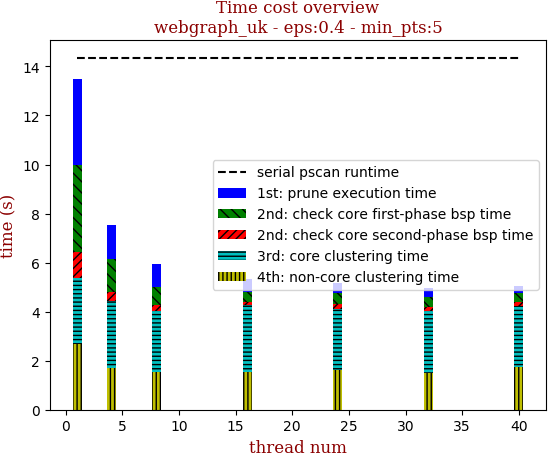 | 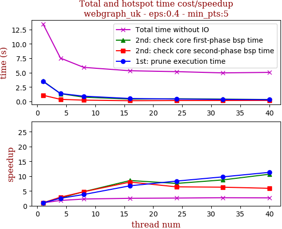

thread_num | prune | check-core 1st bsp | check-core 2nd bsp | cluster-core | cluster-non-core | total | total speedup
--- | --- | --- | --- | --- | --- | --- | ---
1 | 3.774s | 3.35s | 1.031s | 2.479s | 2.558s | 13.277s | 1.000
4 | 1.385s | 1.149s | 0.329s | 2.682s | 1.657s | 7.286s | 1.822
8 | 0.999s | 0.686s | 0.222s | 2.465s | 1.137s | 5.594s | 2.373
16 | 0.58s | 0.441s | 0.133s | 2.693s | 0.982s | 4.918s | 2.700
24 | 0.474s | 0.303s | 0.149s | 2.212s | 1.587s | 4.81s | 2.760
32 | 0.374s | 0.301s | 0.148s | 2.589s | 1.461s | 4.964s | 2.675
40 | 0.331s | 0.301s | 0.161s | 2.441s | 1.498s | 4.818s | 2.756

## eps:0.5

overview | speedup
--- | ---
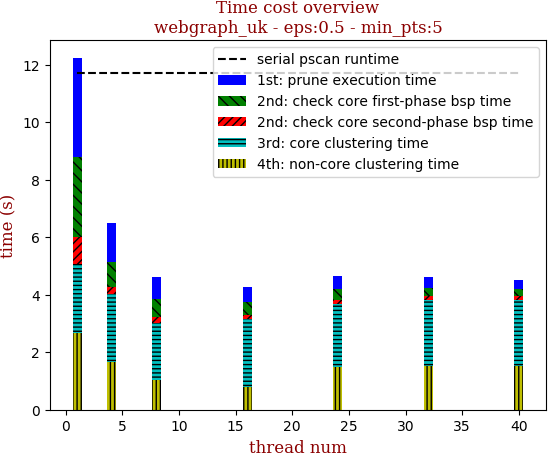 | 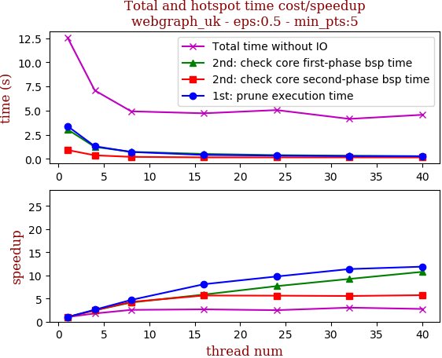

thread_num | prune | check-core 1st bsp | check-core 2nd bsp | cluster-core | cluster-non-core | total | total speedup
--- | --- | --- | --- | --- | --- | --- | ---
1 | 3.434s | 2.788s | 0.949s | 2.412s | 2.653s | 12.324s | 1.000
4 | 1.333s | 0.869s | 0.247s | 2.381s | 1.654s | 6.566s | 1.877
8 | 0.759s | 0.633s | 0.192s | 1.99s | 1.029s | 4.685s | 2.631
16 | 0.5s | 0.479s | 0.138s | 2.355s | 0.786s | 4.34s | 2.840
24 | 0.449s | 0.352s | 0.155s | 2.191s | 1.485s | 4.712s | 2.615
32 | 0.37s | 0.274s | 0.156s | 2.272s | 1.526s | 4.678s | 2.634
40 | 0.314s | 0.248s | 0.139s | 2.289s | 1.527s | 4.597s | 2.681

## eps:0.6

overview | speedup
--- | ---
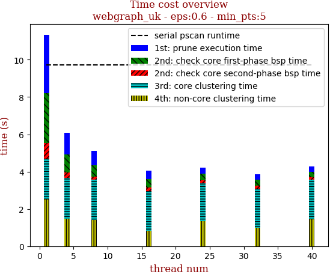 | 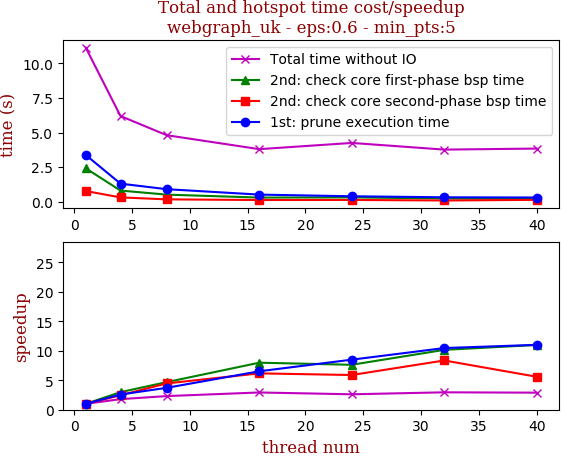

thread_num | prune | check-core 1st bsp | check-core 2nd bsp | cluster-core | cluster-non-core | total | total speedup
--- | --- | --- | --- | --- | --- | --- | ---
1 | 3.379s | 2.417s | 0.777s | 2.138s | 2.33s | 11.133s | 1.000
4 | 1.31s | 0.81s | 0.316s | 2.159s | 1.509s | 6.197s | 1.797
8 | 0.909s | 0.516s | 0.174s | 2.117s | 1.002s | 4.811s | 2.314
16 | 0.518s | 0.303s | 0.126s | 2.025s | 0.737s | 3.804s | 2.927
24 | 0.398s | 0.317s | 0.132s | 2.009s | 1.32s | 4.253s | 2.618
32 | 0.323s | 0.238s | 0.093s | 1.771s | 1.271s | 3.771s | 2.952
40 | 0.307s | 0.22s | 0.139s | 1.977s | 1.117s | 3.846s | 2.895

## eps:0.7

overview | speedup
--- | ---
 | 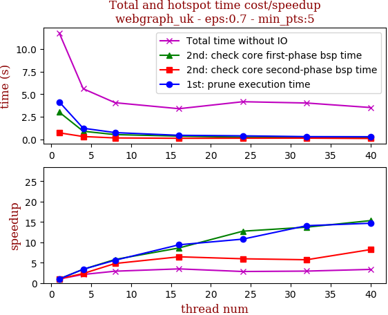

thread_num | prune | check-core 1st bsp | check-core 2nd bsp | cluster-core | cluster-non-core | total | total speedup
--- | --- | --- | --- | --- | --- | --- | ---
1 | 4.141s | 3.005s | 0.715s | 1.744s | 2.091s | 11.783s | 1.000
4 | 1.224s | 0.892s | 0.305s | 1.765s | 1.327s | 5.602s | 2.103
8 | 0.739s | 0.519s | 0.149s | 1.835s | 0.722s | 4.053s | 2.907
16 | 0.441s | 0.349s | 0.111s | 1.747s | 0.654s | 3.391s | 3.475
24 | 0.384s | 0.236s | 0.12s | 1.879s | 1.457s | 4.164s | 2.830
32 | 0.294s | 0.219s | 0.125s | 1.93s | 1.362s | 4.021s | 2.930
40 | 0.282s | 0.196s | 0.087s | 1.471s | 1.396s | 3.52s | 3.347

## eps:0.8

overview | speedup
--- | ---
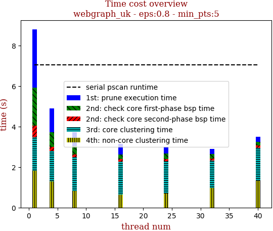 | 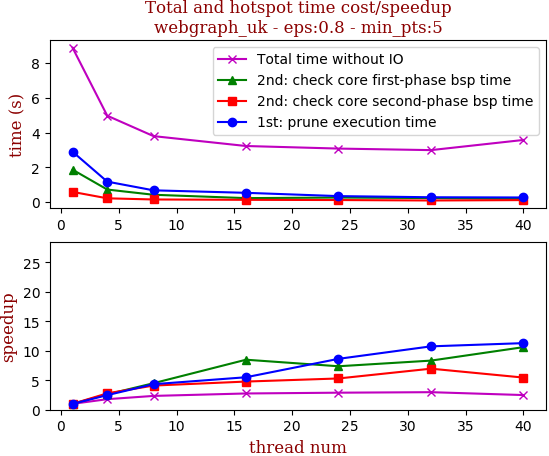

thread_num | prune | check-core 1st bsp | check-core 2nd bsp | cluster-core | cluster-non-core | total | total speedup
--- | --- | --- | --- | --- | --- | --- | ---
1 | 2.892s | 1.858s | 0.578s | 1.647s | 1.827s | 8.883s | 1.000
4 | 1.169s | 0.713s | 0.208s | 1.507s | 1.287s | 4.967s | 1.788
8 | 0.668s | 0.413s | 0.141s | 1.678s | 0.809s | 3.792s | 2.343
16 | 0.525s | 0.219s | 0.121s | 1.619s | 0.654s | 3.222s | 2.757
24 | 0.335s | 0.252s | 0.109s | 1.595s | 0.701s | 3.074s | 2.890
32 | 0.269s | 0.223s | 0.083s | 1.368s | 0.96s | 2.985s | 2.976
40 | 0.256s | 0.175s | 0.106s | 1.645s | 1.307s | 3.571s | 2.488

## eps:0.9

overview | speedup
--- | ---
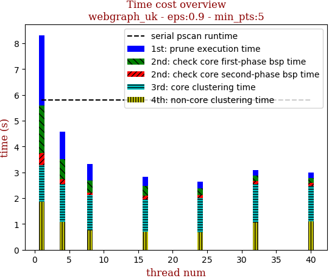 | 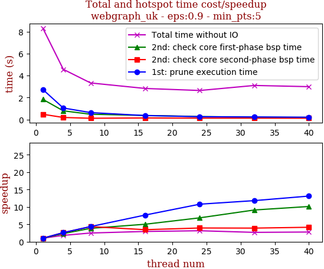

thread_num | prune | check-core 1st bsp | check-core 2nd bsp | cluster-core | cluster-non-core | total | total speedup
--- | --- | --- | --- | --- | --- | --- | ---
1 | 2.824s | 1.59s | 0.51s | 1.45s | 1.857s | 8.309s | 1.000
4 | 1.114s | 0.59s | 0.17s | 1.432s | 1.016s | 4.402s | 1.888
8 | 0.709s | 0.425s | 0.112s | 1.307s | 0.693s | 3.325s | 2.499
16 | 0.39s | 0.291s | 0.098s | 1.328s | 0.625s | 2.81s | 2.957
24 | 0.309s | 0.218s | 0.084s | 1.328s | 0.993s | 3.009s | 2.761
32 | 0.267s | 0.154s | 0.095s | 1.316s | 1.095s | 3.009s | 2.761
40 | 0.243s | 0.139s | 0.063s | 0.863s | 1.028s | 2.398s | 3.465

