## eps:0.1

overview | speedup
--- | ---
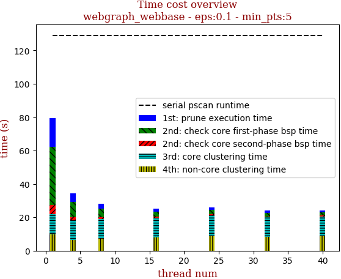 | 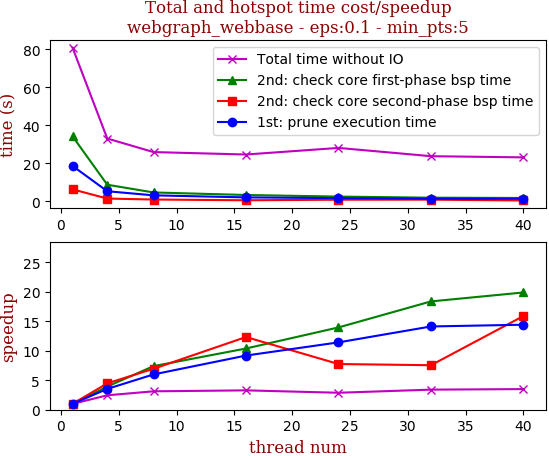

thread_num | prune | check-core 1st bsp | check-core 2nd bsp | cluster-core | cluster-non-core | total | total speedup
--- | --- | --- | --- | --- | --- | --- | ---
1 | 17.34s | 34.623s | 5.526s | 12.047s | 9.873s | 79.412s | 1.000
4 | 5.191s | 9.391s | 1.876s | 11.461s | 6.62s | 34.541s | 2.299
8 | 2.833s | 5.188s | 1.034s | 11.679s | 7.407s | 28.143s | 2.822
16 | 1.859s | 3.038s | 0.527s | 11.677s | 8.12s | 25.224s | 3.148
24 | 1.721s | 2.623s | 0.458s | 12.648s | 8.624s | 26.076s | 3.045
32 | 1.403s | 2.131s | 0.484s | 11.543s | 8.405s | 23.968s | 3.313
40 | 1.375s | 1.842s | 0.457s | 11.804s | 8.745s | 24.226s | 3.278

## eps:0.2

overview | speedup
--- | ---
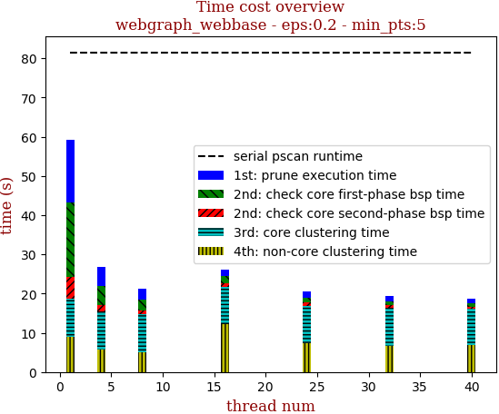 | 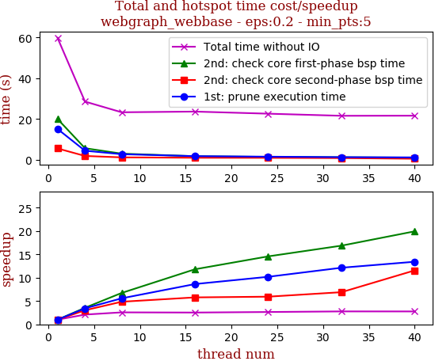

thread_num | prune | check-core 1st bsp | check-core 2nd bsp | cluster-core | cluster-non-core | total | total speedup
--- | --- | --- | --- | --- | --- | --- | ---
1 | 15.097s | 20.02s | 5.53s | 10.07s | 9.101s | 59.822s | 1.000
4 | 4.401s | 5.634s | 1.831s | 10.381s | 6.278s | 28.527s | 2.097
8 | 2.707s | 2.974s | 1.141s | 10.882s | 5.564s | 23.271s | 2.571
16 | 1.748s | 1.696s | 0.957s | 11.218s | 7.994s | 23.616s | 2.533
24 | 1.481s | 1.374s | 0.932s | 11.375s | 7.418s | 22.582s | 2.649
32 | 1.244s | 1.187s | 0.802s | 10.488s | 7.825s | 21.549s | 2.776
40 | 1.125s | 1.004s | 0.478s | 10.93s | 8.06s | 21.601s | 2.769

## eps:0.3

overview | speedup
--- | ---
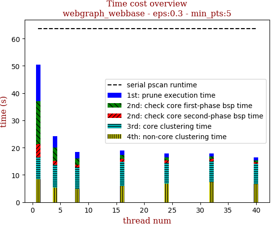 | 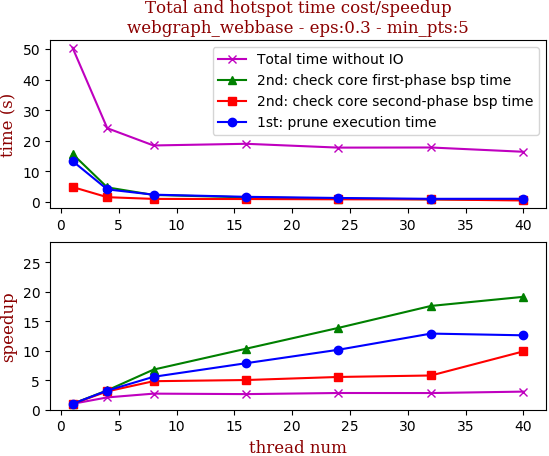

thread_num | prune | check-core 1st bsp | check-core 2nd bsp | cluster-core | cluster-non-core | total | total speedup
--- | --- | --- | --- | --- | --- | --- | ---
1 | 13.381s | 15.706s | 4.902s | 8.082s | 8.376s | 50.449s | 1.000
4 | 4.127s | 4.78s | 1.575s | 8.189s | 5.464s | 24.139s | 2.090
8 | 2.397s | 2.308s | 1.013s | 7.87s | 4.9s | 18.49s | 2.728
16 | 1.696s | 1.518s | 0.973s | 8.865s | 5.984s | 19.039s | 2.650
24 | 1.315s | 1.131s | 0.882s | 7.714s | 6.741s | 17.786s | 2.836
32 | 1.036s | 0.892s | 0.844s | 7.626s | 7.427s | 17.827s | 2.830
40 | 1.06s | 0.82s | 0.495s | 7.353s | 6.694s | 16.424s | 3.072

## eps:0.4

overview | speedup
--- | ---
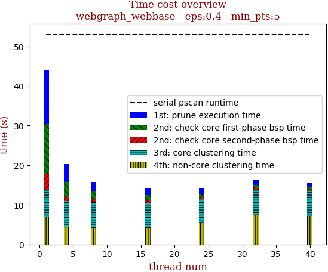 | 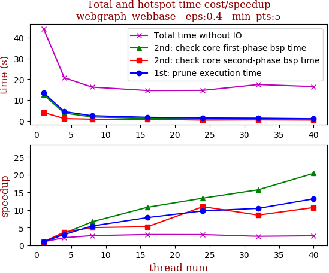

thread_num | prune | check-core 1st bsp | check-core 2nd bsp | cluster-core | cluster-non-core | total | total speedup
--- | --- | --- | --- | --- | --- | --- | ---
1 | 12.374s | 13.964s | 4.396s | 6.976s | 7.492s | 45.206s | 1.000
4 | 3.853s | 4.105s | 1.48s | 6.805s | 4.96s | 21.206s | 2.132
8 | 2.23s | 2.303s | 0.989s | 6.6s | 4.532s | 16.656s | 2.714
16 | 1.524s | 1.237s | 0.922s | 6.571s | 5.7s | 15.957s | 2.833
24 | 1.23s | 1.015s | 0.836s | 6.404s | 5.772s | 15.265s | 2.961
32 | 1.046s | 0.792s | 0.888s | 6.417s | 5.988s | 15.141s | 2.986
40 | 0.957s | 0.698s | 0.58s | 6.32s | 5.668s | 14.225s | 3.178

## eps:0.5

overview | speedup
--- | ---
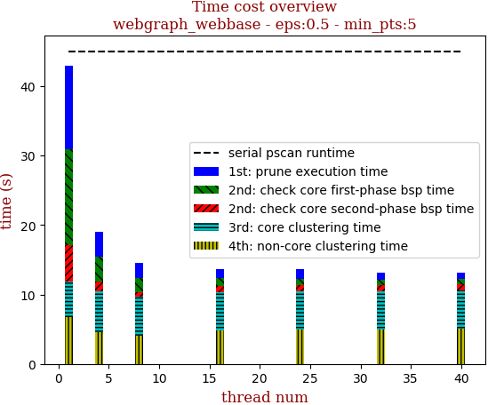 | 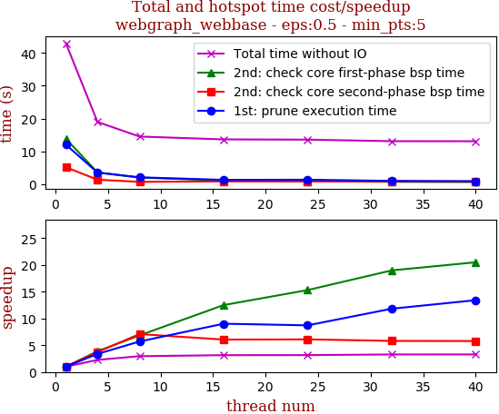

thread_num | prune | check-core 1st bsp | check-core 2nd bsp | cluster-core | cluster-non-core | total | total speedup
--- | --- | --- | --- | --- | --- | --- | ---
1 | 12.035s | 13.838s | 5.163s | 5.103s | 6.768s | 42.91s | 1.000
4 | 3.566s | 3.577s | 1.382s | 5.841s | 4.602s | 18.971s | 2.262
8 | 2.113s | 2.022s | 0.729s | 5.632s | 4.019s | 14.529s | 2.953
16 | 1.334s | 1.107s | 0.853s | 5.564s | 4.797s | 13.657s | 3.142
24 | 1.381s | 0.904s | 0.847s | 5.486s | 4.966s | 13.587s | 3.158
32 | 1.018s | 0.729s | 0.889s | 5.505s | 4.969s | 13.113s | 3.272
40 | 0.897s | 0.675s | 0.893s | 5.543s | 5.084s | 13.099s | 3.276

## eps:0.6

overview | speedup
--- | ---
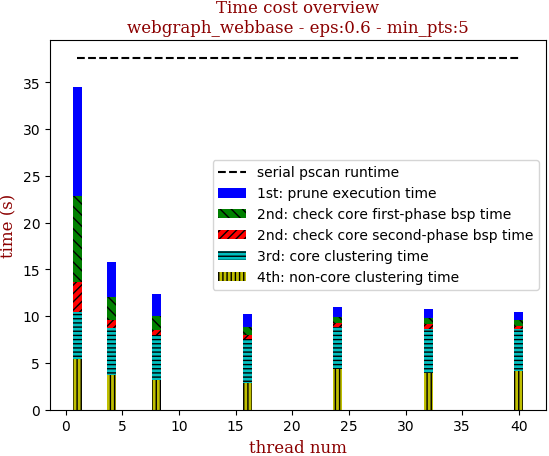 | 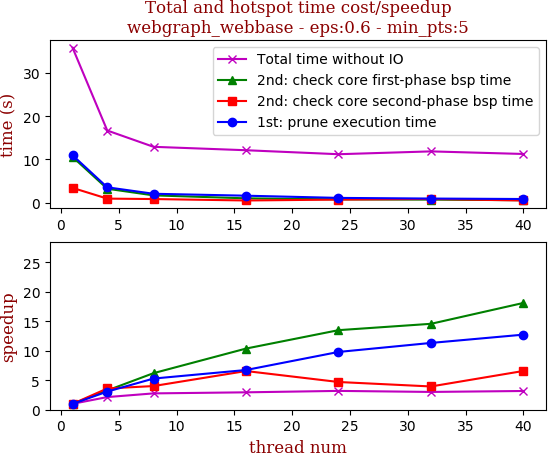

thread_num | prune | check-core 1st bsp | check-core 2nd bsp | cluster-core | cluster-non-core | total | total speedup
--- | --- | --- | --- | --- | --- | --- | ---
1 | 10.967s | 10.581s | 3.433s | 5.114s | 5.715s | 35.812s | 1.000
4 | 3.568s | 3.237s | 0.953s | 4.91s | 4.014s | 16.69s | 2.146
8 | 2.075s | 1.706s | 0.855s | 4.743s | 3.542s | 12.924s | 2.771
16 | 1.628s | 1.02s | 0.523s | 4.631s | 4.323s | 12.134s | 2.951
24 | 1.119s | 0.784s | 0.73s | 4.784s | 3.785s | 11.213s | 3.194
32 | 0.968s | 0.726s | 0.87s | 4.815s | 4.478s | 11.867s | 3.018
40 | 0.861s | 0.584s | 0.522s | 4.617s | 4.681s | 11.269s | 3.178

## eps:0.7

overview | speedup
--- | ---
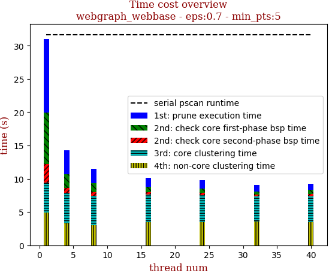 | 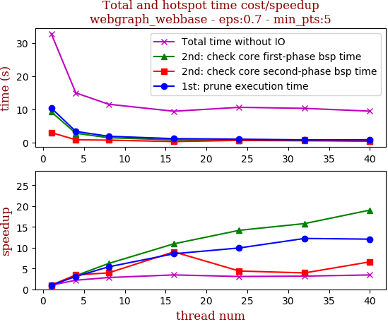

thread_num | prune | check-core 1st bsp | check-core 2nd bsp | cluster-core | cluster-non-core | total | total speedup
--- | --- | --- | --- | --- | --- | --- | ---
1 | 10.414s | 9.271s | 3.043s | 4.696s | 5.332s | 32.765s | 1.000
4 | 3.393s | 2.83s | 0.875s | 4.256s | 3.627s | 14.983s | 2.187
8 | 1.929s | 1.495s | 0.771s | 4.092s | 3.28s | 11.571s | 2.832
16 | 1.219s | 0.848s | 0.338s | 3.791s | 3.256s | 9.458s | 3.464
24 | 1.048s | 0.654s | 0.691s | 4.512s | 3.725s | 10.636s | 3.081
32 | 0.852s | 0.587s | 0.772s | 4.341s | 3.768s | 10.325s | 3.173
40 | 0.864s | 0.487s | 0.461s | 3.877s | 3.793s | 9.488s | 3.453

## eps:0.8

overview | speedup
--- | ---
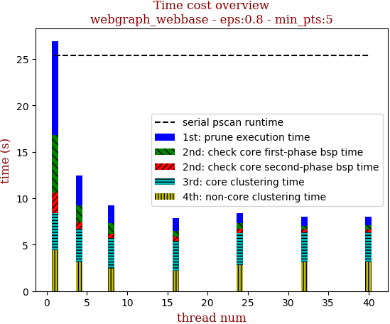 | 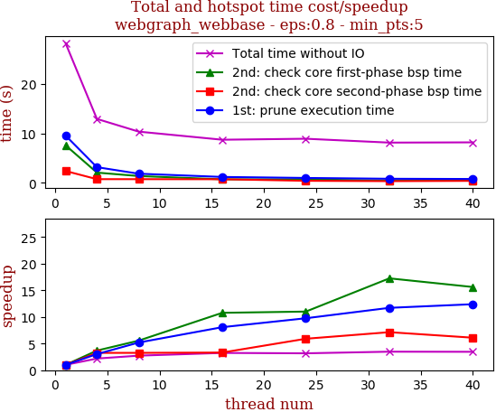

thread_num | prune | check-core 1st bsp | check-core 2nd bsp | cluster-core | cluster-non-core | total | total speedup
--- | --- | --- | --- | --- | --- | --- | ---
1 | 9.577s | 7.605s | 2.391s | 4.054s | 4.675s | 28.308s | 1.000
4 | 3.17s | 2.066s | 0.736s | 3.653s | 3.323s | 12.951s | 2.186
8 | 1.844s | 1.37s | 0.735s | 3.582s | 2.838s | 10.372s | 2.729
16 | 1.186s | 0.706s | 0.722s | 3.524s | 2.591s | 8.731s | 3.242
24 | 0.982s | 0.691s | 0.405s | 3.466s | 3.385s | 8.932s | 3.169
32 | 0.818s | 0.441s | 0.335s | 3.148s | 3.402s | 8.147s | 3.475
40 | 0.773s | 0.487s | 0.392s | 3.25s | 3.294s | 8.199s | 3.453

## eps:0.9

overview | speedup
--- | ---
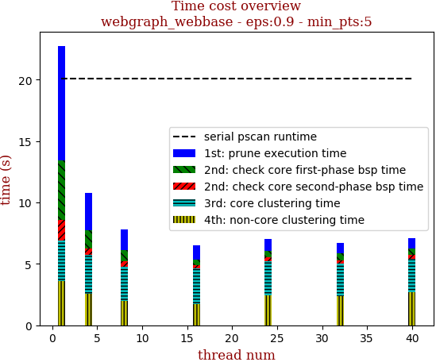 | 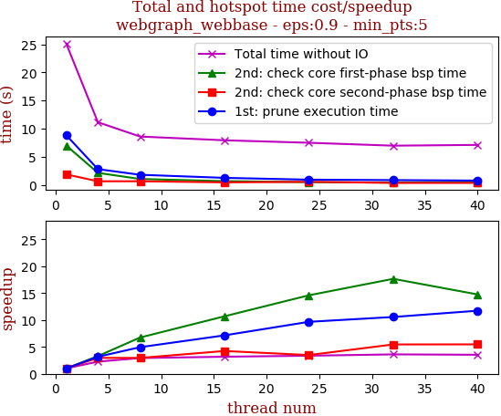

thread_num | prune | check-core 1st bsp | check-core 2nd bsp | cluster-core | cluster-non-core | total | total speedup
--- | --- | --- | --- | --- | --- | --- | ---
1 | 8.831s | 6.992s | 1.86s | 3.434s | 4.01s | 25.129s | 1.000
4 | 2.787s | 2.126s | 0.629s | 2.915s | 2.673s | 11.134s | 2.257
8 | 1.786s | 1.037s | 0.631s | 3.008s | 2.124s | 8.589s | 2.926
16 | 1.236s | 0.654s | 0.439s | 2.688s | 2.903s | 7.923s | 3.172
24 | 0.914s | 0.479s | 0.534s | 2.818s | 2.733s | 7.48s | 3.359
32 | 0.836s | 0.396s | 0.341s | 2.614s | 2.775s | 6.963s | 3.609
40 | 0.753s | 0.474s | 0.34s | 2.678s | 2.855s | 7.102s | 3.538

