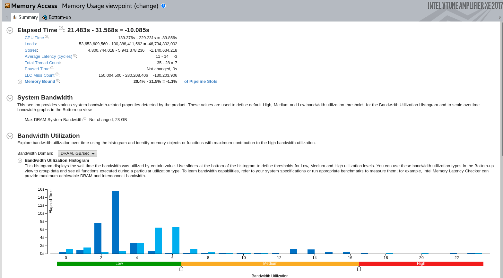

## Benefits from Better Set-Intersection and Less Eval Tech

comparison



### Less-Eval

currently

date | intersection | total comparison |
--- | --- | --- 
currently | 95,749,378 | 26,123,844,274
previously | 108,720,852 | 28,753,199,391

### Set-Intersection(More Important)

currently

```cpp
int Graph::IntersectNeighborSets(int u, int v, int min_cn_num) {
    int cn = 2; // count for self and v, count for self and u
    int du = degree[u] + 1, dv = degree[v] + 1; // count for self and v, count for self and u

    auto offset_nei_u_end = out_edge_start[u + 1];
    auto offset_nei_v_end = out_edge_start[v + 1];
    auto offset_nei_u = out_edge_start[u], offset_nei_v = out_edge_start[v];
    for (; offset_nei_u < offset_nei_u_end && offset_nei_v < offset_nei_v_end &&
           cn < min_cn_num;) {
        while (out_edges[offset_nei_u] < out_edges[offset_nei_v]) {
            --du;
            if (du < min_cn_num) { return NOT_DIRECT_REACHABLE; }
            ++offset_nei_u;
        }
        while (out_edges[offset_nei_u] > out_edges[offset_nei_v]) {
            --dv;
            if (dv < min_cn_num) { return NOT_DIRECT_REACHABLE; }
            ++offset_nei_v;
        }
        if (out_edges[offset_nei_u] == out_edges[offset_nei_v]) {
            ++cn;
            ++offset_nei_u;
            ++offset_nei_v;
        }
    }
    return cn >= min_cn_num ? DIRECT_REACHABLE : NOT_DIRECT_REACHABLE;
}
```

previously

```cpp
int Graph::IntersectNeighborSets(int u, int v, int min_cn_num) {
    int cn = 2; // count for self and v, count for self and u
    int du = degree[u] + 1, dv = degree[v] + 1; // count for self and v, count for self and u

    auto offset_nei_u_end = out_edge_start[u + 1];
    auto offset_nei_v_end = out_edge_start[v + 1];
    for (auto offset_nei_u = out_edge_start[u], offset_nei_v = out_edge_start[v];
         offset_nei_u < offset_nei_u_end && offset_nei_v < offset_nei_v_end &&
         cn < min_cn_num && du >= min_cn_num && dv >= min_cn_num;) {
        if (out_edges[offset_nei_u] < out_edges[offset_nei_v]) {
            --du;
            ++offset_nei_u;
        } else if (out_edges[offset_nei_u] > out_edges[offset_nei_v]) {
            --dv;
            ++offset_nei_v;
        } else {
            ++cn;
            ++offset_nei_u;
            ++offset_nei_v;
        }
    }
    return cn >= min_cn_num ? DIRECT_REACHABLE : NOT_DIRECT_REACHABLE;
}
```

