## Speedup Overview

computation and io portion

with 40 full logical threads | with best thread num
--- | ---
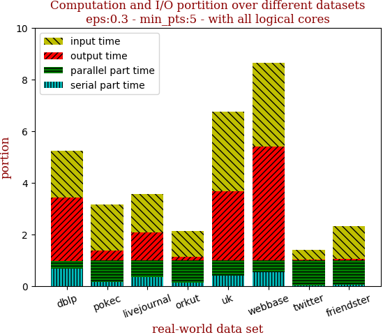 | 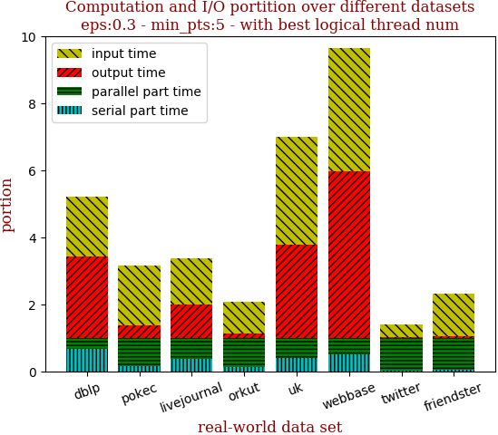

with 40 full logical threads | with best thread num
--- | ---
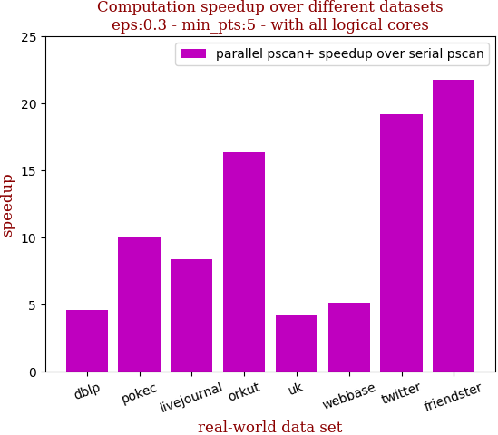 | 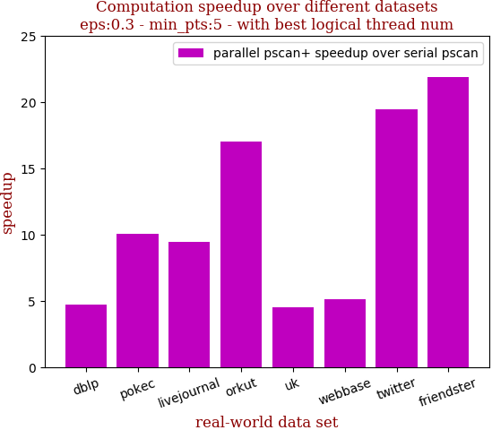

```zsh
best performance thread_num_lst: [40, 40, 32, 40, 32, 32, 40, 40]
```

dataset | edge num | pscan runtime | pscan+ 40 logical-core full speedup | pscan+ best thread_num speedup | thread_num choice
--- | --- | --- | --- | --- | ---
dblp | 2,099,732 | 0.555s | 4.587 | 4.587 | 32
pokec | 30,282,866 | 8.597s | 10.043 | 10.043 | 40
livejournal | 69,362,378 | 21.846s | 9.433 | 9.433 | 40
orkut | 234,370,166 | 164.248s | 16.992 | 16.992 | 40
uk | 301,136,554 | 18.498s | 4.487 | 4.301 | 32
webbase | 1,050,026,736 | 63.705s | 5.093 | 4.510 | 24
twitter | 1,369,000,750 | 2487.317s | 19.492 | 19.492 | 40
friendster | 3,612,134,270 | 3726.302s | 21.870 | 21.870 | 40

## Small: Dblp

name | n | m 
--- | --- | ---
dblp        | 425,957       | 2,099,732

overview | speedup
--- | ---
 | 

thread_num | prune | check-core 1st bsp | check-core 2nd bsp | cluster-core | cluster-non-core | total | total speedup
--- | --- | --- | --- | --- | --- | --- | ---
1 | 0.074s | 0.333s | 0.12s | 0.048s | 0.037s | 0.615s | 1.000
2 | 0.035s | 0.16s | 0.061s | 0.059s | 0.046s | 0.364s | 1.690
4 | 0.02s | 0.084s | 0.032s | 0.052s | 0.037s | 0.227s | 2.709
8 | 0.011s | 0.046s | 0.017s | 0.048s | 0.037s | 0.162s | 3.796
16 | 0.009s | 0.024s | 0.01s | 0.043s | 0.037s | 0.124s | 4.960
24 | 0.01s | 0.021s | 0.009s | 0.055s | 0.044s | 0.142s | 4.331
32 | 0.012s | 0.018s | 0.008s | 0.045s | 0.037s | 0.121s | 5.083
40 | 0.01s | 0.018s | 0.008s | 0.045s | 0.037s | 0.121s | 5.083

## Medium: Pokec

name | n | m 
--- | --- | ---
pokec       | 1,632,804     | 30,282,866

overview | speedup
--- | ---
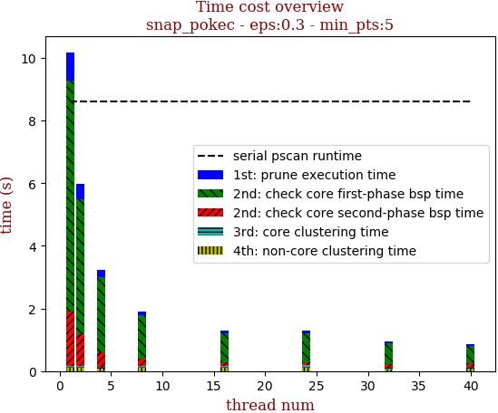 | 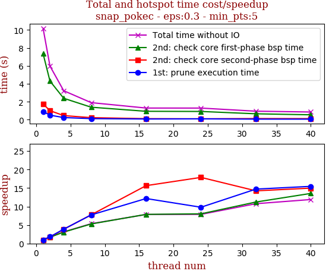

thread_num | prune | check-core 1st bsp | check-core 2nd bsp | cluster-core | cluster-non-core | total | total speedup
--- | --- | --- | --- | --- | --- | --- | ---
1 | 0.861s | 6.919s | 1.392s | 0.061s | 0.086s | 9.322s | 1.000
2 | 0.454s | 4.153s | 0.881s | 0.064s | 0.086s | 5.64s | 1.653
4 | 0.236s | 2.386s | 0.456s | 0.065s | 0.085s | 3.23s | 2.886
8 | 0.118s | 1.392s | 0.226s | 0.065s | 0.098s | 1.901s | 4.904
16 | 0.075s | 0.934s | 0.112s | 0.073s | 0.101s | 1.297s | 7.187
24 | 0.102s | 0.818s | 0.141s | 0.051s | 0.062s | 1.175s | 7.934
32 | 0.062s | 0.656s | 0.123s | 0.045s | 0.059s | 0.946s | 9.854
40 | 0.059s | 0.543s | 0.117s | 0.055s | 0.079s | 0.856s | 10.890

## Medium: LiveJournal

name | n | m 
--- | --- | ---
livejournal | 4,036,538     | 69,362,378

overview | speedup
--- | ---
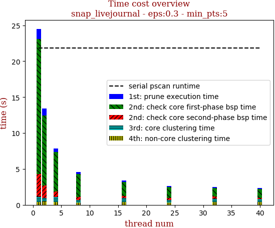 | 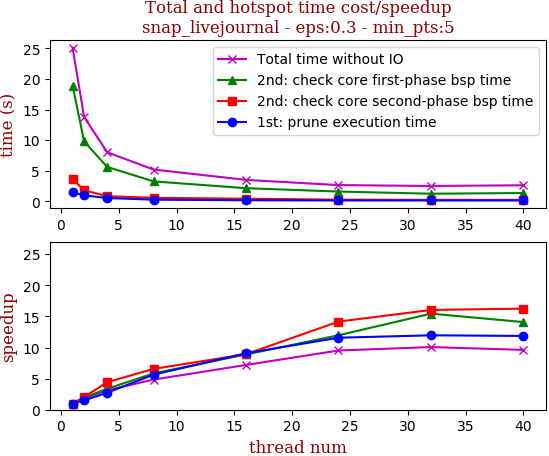


thread_num | prune | check-core 1st bsp | check-core 2nd bsp | cluster-core | cluster-non-core | total | total speedup
--- | --- | --- | --- | --- | --- | --- | ---
1 | 1.416s | 18.79s | 3.129s | 0.764s | 0.406s | 24.507s | 1.000
2 | 0.94s | 9.729s | 1.798s | 0.478s | 0.449s | 13.396s | 1.829
4 | 0.517s | 5.458s | 0.789s | 0.704s | 0.399s | 7.869s | 3.114
8 | 0.265s | 3.194s | 0.447s | 0.369s | 0.308s | 4.585s | 5.345
16 | 0.168s | 1.984s | 0.259s | 0.538s | 0.43s | 3.381s | 7.248
24 | 0.124s | 1.582s | 0.257s | 0.368s | 0.306s | 2.638s | 9.290
32 | 0.12s | 1.226s | 0.227s | 0.531s | 0.387s | 2.494s | 9.826
40 | 0.101s | 1.238s | 0.172s | 0.431s | 0.373s | 2.316s | 10.582

## Medium: Orkut

name | n | m 
--- | --- | ---
orkut       | 3,072,627     | 234,370,166

overview | speedup
--- | ---
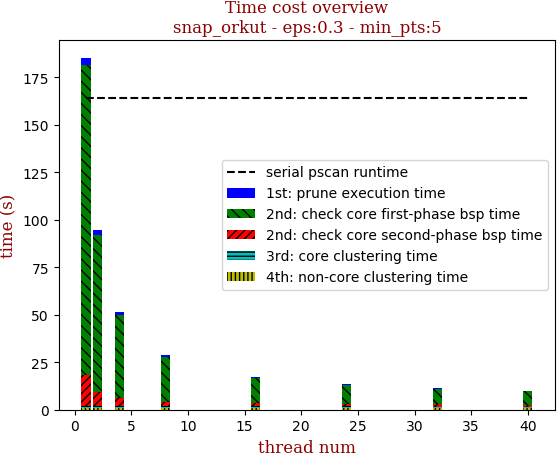 | 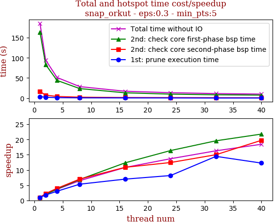

thread_num | prune | check-core 1st bsp | check-core 2nd bsp | cluster-core | cluster-non-core | total | total speedup
--- | --- | --- | --- | --- | --- | --- | ---
1 | 3.861s | 163.193s | 16.555s | 0.992s | 0.753s | 185.356s | 1.000
2 | 2.201s | 83.07s | 7.35s | 1.006s | 0.752s | 94.381s | 1.964
4 | 1.301s | 42.57s | 4.142s | 1.006s | 0.748s | 49.77s | 3.724
8 | 0.726s | 23.727s | 2.366s | 1.036s | 0.745s | 28.601s | 6.481
16 | 0.436s | 13.147s | 1.58s | 0.942s | 0.738s | 16.845s | 11.004
24 | 0.433s | 9.955s | 1.164s | 0.921s | 0.746s | 13.221s | 14.020
32 | 0.371s | 8.131s | 1.007s | 0.595s | 0.599s | 10.706s | 17.313
40 | 0.449s | 7.131s | 0.899s | 0.591s | 0.595s | 9.666s | 19.176

## Medium: Uk

name | n | m 
--- | --- | ---
uk          | 18,520,343    | 301,136,554

overview | speedup
--- | ---
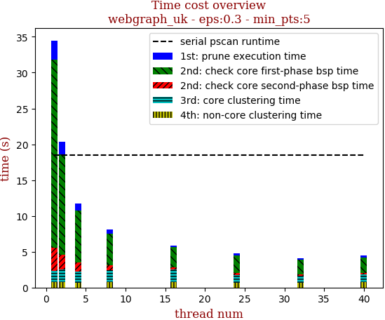 | 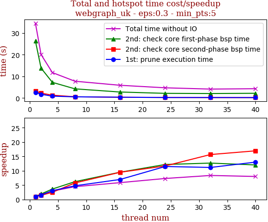

thread_num | prune | check-core 1st bsp | check-core 2nd bsp | cluster-core | cluster-non-core | total | total speedup
--- | --- | --- | --- | --- | --- | --- | ---
1 | 2.655s | 26.275s | 3.271s | 1.545s | 0.734s | 34.484s | 1.000
2 | 1.72s | 13.784s | 2.258s | 1.548s | 0.738s | 20.052s | 1.720
4 | 0.868s | 7.234s | 1.306s | 1.583s | 0.743s | 11.738s | 2.938
8 | 0.557s | 4.236s | 0.568s | 1.62s | 0.764s | 7.748s | 4.451
16 | 0.381s | 2.767s | 0.345s | 1.628s | 0.753s | 5.876s | 5.869
24 | 0.231s | 2.155s | 0.28s | 1.416s | 0.627s | 4.713s | 7.317
32 | 0.238s | 2.073s | 0.209s | 0.974s | 0.626s | 4.123s | 8.364
40 | 0.204s | 2.184s | 0.193s | 1.092s | 0.627s | 4.301s | 8.018

## Large: Webbase

name | n | m 
--- | --- | ---
webbase     | 118,142,143   | 1,050,026,736

overview | speedup
--- | ---
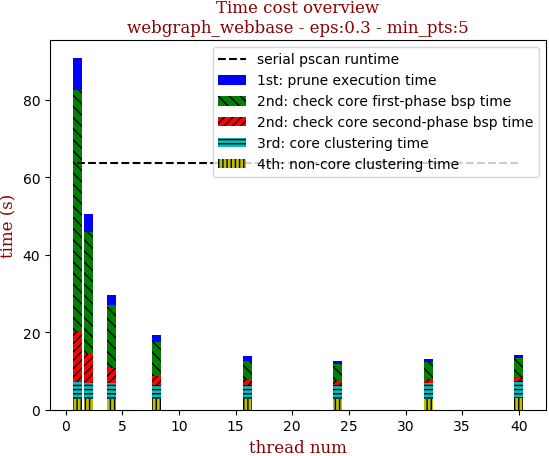 | 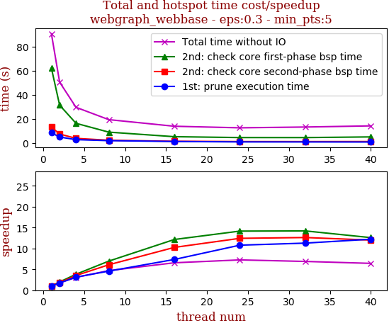

thread_num | prune | check-core 1st bsp | check-core 2nd bsp | cluster-core | cluster-non-core | total | total speedup
--- | --- | --- | --- | --- | --- | --- | ---
1 | 8.371s | 62.205s | 13.137s | 4.383s | 2.737s | 90.836s | 1.000
2 | 4.846s | 31.408s | 7.334s | 4.245s | 2.745s | 50.58s | 1.796
4 | 2.667s | 16.27s | 3.728s | 4.206s | 2.737s | 29.61s | 3.068
8 | 1.829s | 8.924s | 2.155s | 3.685s | 2.741s | 19.336s | 4.698
16 | 1.137s | 5.121s | 1.281s | 3.544s | 2.739s | 13.824s | 6.571
24 | 0.776s | 4.393s | 1.057s | 3.541s | 2.738s | 12.508s | 7.262
32 | 0.742s | 4.38s | 1.041s | 4.27s | 2.743s | 13.178s | 6.893
40 | 0.685s | 4.939s | 1.094s | 4.28s | 3.125s | 14.125s | 6.431

## Large: Twitter

name | n | m 
--- | --- | ---
twitter     | 41,652,230    | 1,369,000,750

overview | speedup
--- | ---
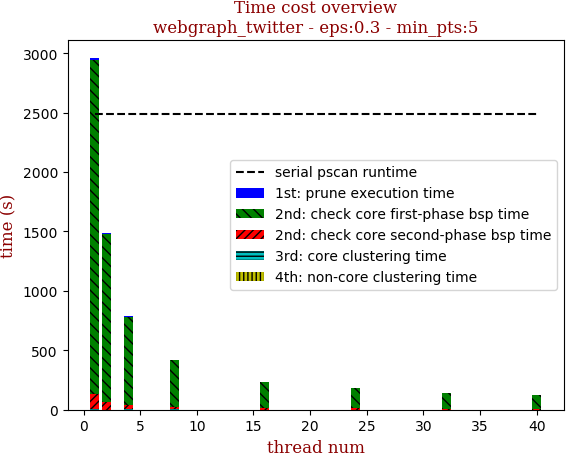 | 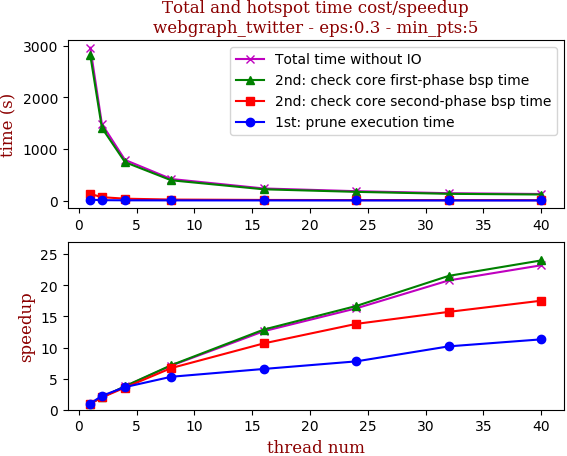

thread_num | prune | check-core 1st bsp | check-core 2nd bsp | cluster-core | cluster-non-core | total | total speedup
--- | --- | --- | --- | --- | --- | --- | ---
1 | 17.415s | 2813.298s | 129.6s | 0.945s | 1.1s | 2962.36s | 1.000
2 | 7.805s | 1409.66s | 65.557s | 0.442s | 0.973s | 1484.439s | 1.996
4 | 4.792s | 744.448s | 36.408s | 0.935s | 1.102s | 787.69s | 3.761
8 | 3.287s | 393.054s | 19.357s | 1.003s | 1.137s | 417.839s | 7.090
16 | 2.658s | 218.43s | 12.158s | 0.522s | 0.971s | 234.741s | 12.620
24 | 2.241s | 168.751s | 9.394s | 0.454s | 0.996s | 181.839s | 16.291
32 | 1.71s | 130.77s | 8.241s | 0.81s | 1.014s | 142.547s | 20.782
40 | 1.54s | 117.239s | 7.397s | 0.468s | 0.959s | 127.605s | 23.215

## Large: Fridenster

name | n | m 
--- | --- | ---
friendster  | 124,836,180   | 3,612,134,270

overview | speedup
--- | ---
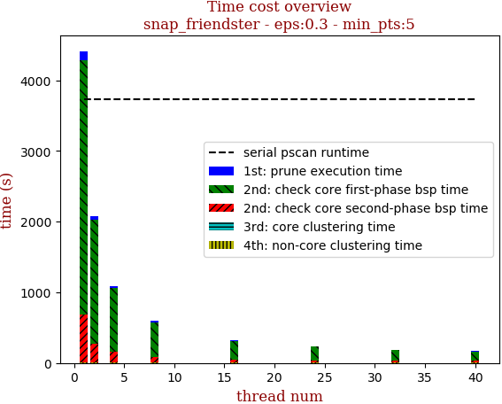 | 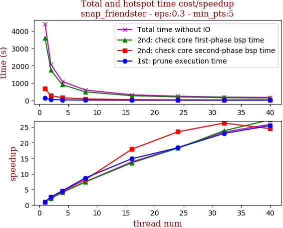

thread_num | prune | check-core 1st bsp | check-core 2nd bsp | cluster-core | cluster-non-core | total | total speedup
--- | --- | --- | --- | --- | --- | --- | ---
1 | 129.735s | 3601.164s | 676.276s | 2.005s | 3.623s | 4412.806s | 1.000
2 | 51.745s | 1744.762s | 269.821s | 2.457s | 4.156s | 2072.944s | 2.129
4 | 28.604s | 901.12s | 153.828s | 2.304s | 4.056s | 1089.915s | 4.049
8 | 14.952s | 488.046s | 83.168s | 2.476s | 4.598s | 593.242s | 7.438
16 | 8.752s | 266.732s | 37.824s | 2.045s | 4.386s | 319.74s | 13.801
24 | 7.065s | 197.572s | 28.773s | 1.887s | 4.472s | 239.771s | 18.404
32 | 5.652s | 151.077s | 25.713s | 1.84s | 4.169s | 188.454s | 23.416
40 | 5.09s | 131.622s | 27.593s | 1.867s | 4.207s | 170.383s | 25.899

## LFR: 10million-avgdeg15-maxdeg50

name | n | m
--- | --- | --- 
lfr-avg15-max50 | 10,000,001  | 152,826,874 

overview | speedup
--- | ---
 | 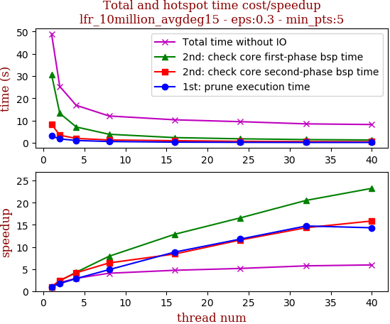

thread_num | prune | check-core 1st bsp | check-core 2nd bsp | cluster-core | cluster-non-core | total | total speedup
--- | --- | --- | --- | --- | --- | --- | ---
1 | 3.109s | 30.622s | 8.391s | 5.484s | 1.261s | 48.87s | 1.000
2 | 1.816s | 13.301s | 3.452s | 5.491s | 1.255s | 25.318s | 1.930
4 | 1.096s | 7.159s | 2.019s | 5.339s | 1.264s | 16.878s | 2.895
8 | 0.64s | 3.883s | 1.316s | 4.973s | 1.266s | 12.082s | 4.045
16 | 0.352s | 2.381s | 0.999s | 5.38s | 1.255s | 10.37s | 4.713
24 | 0.264s | 1.847s | 0.725s | 5.422s | 1.265s | 9.526s | 5.130
32 | 0.211s | 1.492s | 0.585s | 4.991s | 1.266s | 8.547s | 5.718
40 | 0.217s | 1.317s | 0.529s | 4.931s | 1.253s | 8.249s | 5.924